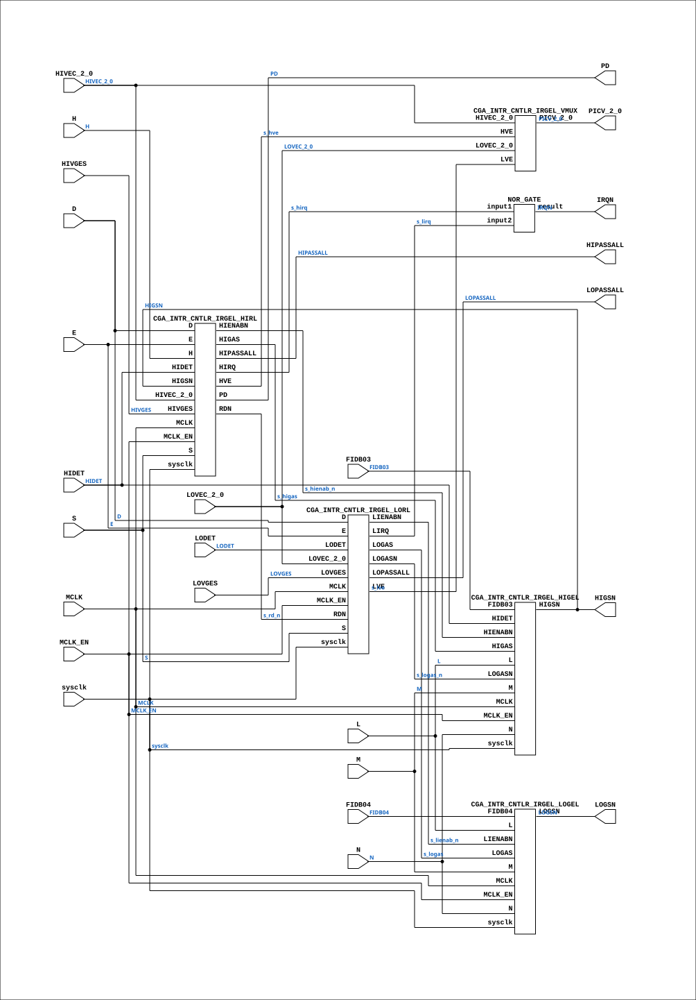

# CGA_INTR_CNTLR_IRGEL

Source: `Verilog/DELILAH-CPU/CGA_INTR/circuit/CGA_INTR_CNTLR_IRGEL.v`

<!-- Generated by Verilog/tests/module_doc.py from the //! comments in the source. Do not edit by hand - edit the RTL comments and regenerate. -->

<!-- HIERARCHY-NAV:BEGIN - written by Verilog/tests/gen_hierarchy.py, do not edit -->

**Where it sits** (Simulation): [ND120_TOP](../../../../doc/ND120_TOP.md) > [ND120_CORE](../../../../doc/ND120_CORE.md) > [ND3202D](../../../../CPU-BOARD-3202/circuit/doc/ND3202D.md) > [CPU_15](../../../../CPU-BOARD-3202/circuit/doc/CPU_15.md) > [CPU_PROC_32](../../../../CPU-BOARD-3202/circuit/doc/CPU_PROC_32.md) > [CPU_PROC_CGA_33](../../../../CPU-BOARD-3202/circuit/doc/CPU_PROC_CGA_33.md) > [CGA](../../../CGA/circuit/doc/CGA.md) > [CGA_INTR](CGA_INTR.md) > [CGA_INTR_CNTLR](CGA_INTR_CNTLR.md) > **CGA_INTR_CNTLR_IRGEL**
- instance path: `CORE.CPU_BOARD.CPU.PROC.CGA.DELILAH.INTR.CNTLR.IRGEL`

**Used in:** [CGA_INTR_CNTLR](CGA_INTR_CNTLR.md) (all tops)

**Contains:** [CGA_INTR_CNTLR_IRGEL_HIGEL](CGA_INTR_CNTLR_IRGEL_HIGEL.md), [CGA_INTR_CNTLR_IRGEL_HIRL](CGA_INTR_CNTLR_IRGEL_HIRL.md), [CGA_INTR_CNTLR_IRGEL_LOGEL](CGA_INTR_CNTLR_IRGEL_LOGEL.md), [CGA_INTR_CNTLR_IRGEL_LORL](CGA_INTR_CNTLR_IRGEL_LORL.md), [CGA_INTR_CNTLR_IRGEL_VMUX](CGA_INTR_CNTLR_IRGEL_VMUX.md), [NOR_GATE](../../../../Shared/logisim/doc/NOR_GATE.md)

[Module hierarchy](../../../../HIERARCHY.md) - [All modules](../../../../MODULES.md)

<!-- HIERARCHY-NAV:END -->


<!-- SCHEMATIC:BEGIN - written by Verilog/tests/gen_schematics.py, do not edit -->

## Schematic

Drawn from the Verilog: the yosys netlist of the Simulation (Verilator) build, instance `CORE.CPU_BOARD.CPU.PROC.CGA.DELILAH.INTR.CNTLR.IRGEL`. Sub-modules are boxes (click the picture to open it full size; there every sub-module box links to its page, and every wire shows its Verilog name).

[](CGA_INTR_CNTLR_IRGEL.svg)

<!-- SCHEMATIC:END -->

## Description

ND120 CGA (CPU Gate Array / DELILAH)
/CGA/INTR/CNTLR/IRGEL
IRGEL
Page 90
SHEET 1 of 1
Last reviewed: 10-NOV-2024
Ronny Hansen

## Ports

| Direction | Width | Name | Description |
|---|---|---|---|
| input | `1` | `sysclk` | FPGA system clock (P2: MCLK_EN capture) |
| input | `1` | `MCLK_EN` | MCLK clock-enable pulse (FPGA_FF_MODE, else 0) |
| input | `1` | `D` |  |
| input | `1` | `E` |  |
| input | `1` | `FIDB03` | FIDB (from CGA_INTR.FIDBO_15_0[3]) |
| input | `1` | `FIDB04` | FIDB (from CGA_INTR.FIDBO_15_0[4]) |
| input | `1` | `H` |  |
| input | `1` | `HIDET` |  |
| input | `1` | `HIVGES` |  |
| input | `1` | `L` |  |
| input | `1` | `LODET` |  |
| input | `1` | `LOVGES` |  |
| input | `1` | `M` |  |
| input | `1` | `MCLK` | Master Clock (from CGA_INTR.MCLK) |
| input | `1` | `N` |  |
| input | `1` | `S` |  |
| input | `[2:0]` | `HIVEC_2_0` |  |
| input | `[2:0]` | `LOVEC_2_0` |  |
| output | `1` | `HIGSN` | High Speed signal, active low (to CGA_INTR.HIGSN) |
| output | `1` | `HIPASSALL` |  |
| output | `1` | `IRQN` |  |
| output | `1` | `LOGSN` | Logical Segment Number, active low (to CGA_INTR.LOGSN) |
| output | `1` | `LOPASSALL` |  |
| output | `1` | `PD` | Power Down signal (to CGA_INTR.PD) |
| output | `[2:0]` | `PICV_2_0` | PIC Vector, 3-bit (to CGA_INTR.PICV_2_0) |

## Verilog source

[`Verilog/DELILAH-CPU/CGA_INTR/circuit/CGA_INTR_CNTLR_IRGEL.v`](https://github.com/RetroCoreLabs/nd-120/blob/main/Verilog/DELILAH-CPU/CGA_INTR/circuit/CGA_INTR_CNTLR_IRGEL.v) on GitHub.

<details markdown="1">
<summary>Show the Verilog of CGA_INTR_CNTLR_IRGEL (207 lines)</summary>

```verilog
/**************************************************************************
** ND120 CGA (CPU Gate Array / DELILAH)                                  **
** /CGA/INTR/CNTLR/IRGEL                                                 **
** IRGEL                                                                 **
**                                                                       **
** Page 90                                                               **
** SHEET 1 of 1                                                          **
**                                                                       **
** Last reviewed: 10-NOV-2024                                            **
** Ronny Hansen                                                          **
***************************************************************************/

module CGA_INTR_CNTLR_IRGEL (
    input       sysclk,   //! FPGA system clock (P2: MCLK_EN capture)
    input       MCLK_EN,  //! MCLK clock-enable pulse (FPGA_FF_MODE, else 0)

    input       D,
    input       E,
    input       FIDB03,   //! FIDB (from CGA_INTR.FIDBO_15_0[3])
    input       FIDB04,   //! FIDB (from CGA_INTR.FIDBO_15_0[4])
    input       H,
    input       HIDET,
    input       HIVGES,
    input       L,
    input       LODET,
    input       LOVGES,
    input       M,
    input       MCLK,     //! Master Clock (from CGA_INTR.MCLK)
    input       N,
    input       S,
    input [2:0] HIVEC_2_0,
    input [2:0] LOVEC_2_0,

    output       HIGSN,   //! High Speed signal, active low (to CGA_INTR.HIGSN)
    output       HIPASSALL,
    output       IRQN,
    output       LOGSN,   //! Logical Segment Number, active low (to CGA_INTR.LOGSN)
    output       LOPASSALL,
    output       PD,      //! Power Down signal (to CGA_INTR.PD)
    output [2:0] PICV_2_0  //! PIC Vector, 3-bit (to CGA_INTR.PICV_2_0)
);

  /*******************************************************************************
   ** The wires are defined here                                                 **
   *******************************************************************************/
  wire [2:0] s_lovec_2_0;
  wire [2:0] s_picv_2_0_out;
  wire [2:0] s_hivec_2_0;
  wire       s_d;
  wire       s_e;
  wire       s_fidb03;
  wire       s_fidb04;
  wire       s_h;
  wire       s_hidet;
  wire       s_hienab_n;
  wire       s_higas;
  wire       s_higs_n_out;
  wire       s_hipasall_out;
  wire       s_hirq;
  wire       s_hivges;
  wire       s_hve /* synthesis syn_keep=1 */;  // GAO probe net - see fpga/tang-nano-20k/GAO-HOWTO.md
  wire       s_irq_n_out;
  wire       s_l;
  wire       s_lienab_n;
  wire       s_lirq;
  wire       s_lodet;
  wire       s_logas_n;
  wire       s_logas;
  wire       s_logs_n_out;
  wire       s_lopassall_out;
  wire       s_lovges;
  wire       s_lve /* synthesis syn_keep=1 */;  // GAO probe net
  wire       s_m;
  wire       s_mclk;
  wire       s_n;
  wire       s_pd_out;
  wire       s_rd_n;
  wire       s_s;

  /*******************************************************************************
   ** The module functionality is described here                                 **
   *******************************************************************************/

  /*******************************************************************************
   ** Here all input connections are defined                                     **
   *******************************************************************************/
  assign s_lovec_2_0[2:0] = LOVEC_2_0;
  assign s_hivec_2_0[2:0] = HIVEC_2_0;
  assign s_d              = D;
  assign s_e              = E;
  assign s_fidb03         = FIDB03;
  assign s_fidb04         = FIDB04;
  assign s_h              = H;
  assign s_hidet          = HIDET;
  assign s_hivges         = HIVGES;
  assign s_l              = L;
  assign s_lodet          = LODET;
  assign s_lovges         = LOVGES;
  assign s_m              = M;
  assign s_mclk           = MCLK;
  assign s_n              = N;
  assign s_s              = S;

  /*******************************************************************************
   ** Here all output connections are defined                                    **
   *******************************************************************************/
  assign HIGSN            = s_higs_n_out;
  assign HIPASSALL        = s_hipasall_out;
  assign IRQN             = s_irq_n_out;
  assign LOGSN            = s_logs_n_out;
  assign LOPASSALL        = s_lopassall_out;
  assign PD               = s_pd_out;
  assign PICV_2_0         = s_picv_2_0_out[2:0];

  /*******************************************************************************
   ** Here all normal components are defined                                     **
   *******************************************************************************/
  NOR_GATE #(
      .BubblesMask(2'b00)
  ) GATES_1 (
      .input1(s_hirq),
      .input2(s_lirq),
      .result(s_irq_n_out)
  );


  /*******************************************************************************
   ** Here all sub-circuits are defined                                          **
   *******************************************************************************/

  CGA_INTR_CNTLR_IRGEL_HIGEL HIGEL (
      .sysclk(sysclk),
      .MCLK_EN(MCLK_EN),
      .FIDB03(s_fidb03),
      .HIDET(s_hidet),
      .HIENABN(s_hienab_n),
      .HIGAS(s_higas),
      .HIGSN(s_higs_n_out),
      .L(s_l),
      .LOGASN(s_logas_n),
      .M(s_m),
      .MCLK(s_mclk),
      .N(s_n)
  );

  CGA_INTR_CNTLR_IRGEL_VMUX VMUX (
      .HIVEC_2_0(s_hivec_2_0[2:0]),
      .HVE(s_hve),
      .LOVEC_2_0(s_lovec_2_0[2:0]),
      .LVE(s_lve),
      .PICV_2_0(s_picv_2_0_out[2:0])
  );

  CGA_INTR_CNTLR_IRGEL_LOGEL LOGEL (
      .sysclk(sysclk),
      .MCLK_EN(MCLK_EN),
      .FIDB04(s_fidb04),
      .L(s_l),
      .LIENABN(s_lienab_n),
      .LOGAS(s_logas),
      .LOGSN(s_logs_n_out),
      .M(s_m),
      .MCLK(s_mclk),
      .N(s_n)
  );

  CGA_INTR_CNTLR_IRGEL_HIRL HIRL (
      .sysclk(sysclk),
      .MCLK_EN(MCLK_EN),
      .D(s_d),
      .E(s_e),
      .H(s_h),
      .HIDET(s_hidet),
      .HIENABN(s_hienab_n),
      .HIGAS(s_higas),
      .HIGSN(s_higs_n_out),
      .HIPASSALL(s_hipasall_out),
      .HIRQ(s_hirq),
      .HIVEC_2_0(s_hivec_2_0[2:0]),
      .HIVGES(s_hivges),
      .HVE(s_hve),
      .MCLK(s_mclk),
      .PD(s_pd_out),
      .RDN(s_rd_n),
      .S(s_s)
  );

  CGA_INTR_CNTLR_IRGEL_LORL LORL (
      .sysclk(sysclk),
      .MCLK_EN(MCLK_EN),
      .D(s_d),
      .E(s_e),
      .LIENABN(s_lienab_n),
      .LIRQ(s_lirq),
      .LODET(s_lodet),
      .LOGAS(s_logas),
      .LOGASN(s_logas_n),
      .LOPASSALL(s_lopassall_out),
      .LOVEC_2_0(s_lovec_2_0[2:0]),
      .LOVGES(s_lovges),
      .LVE(s_lve),
      .MCLK(s_mclk),
      .RDN(s_rd_n),
      .S(s_s)
  );

endmodule
```

</details>
