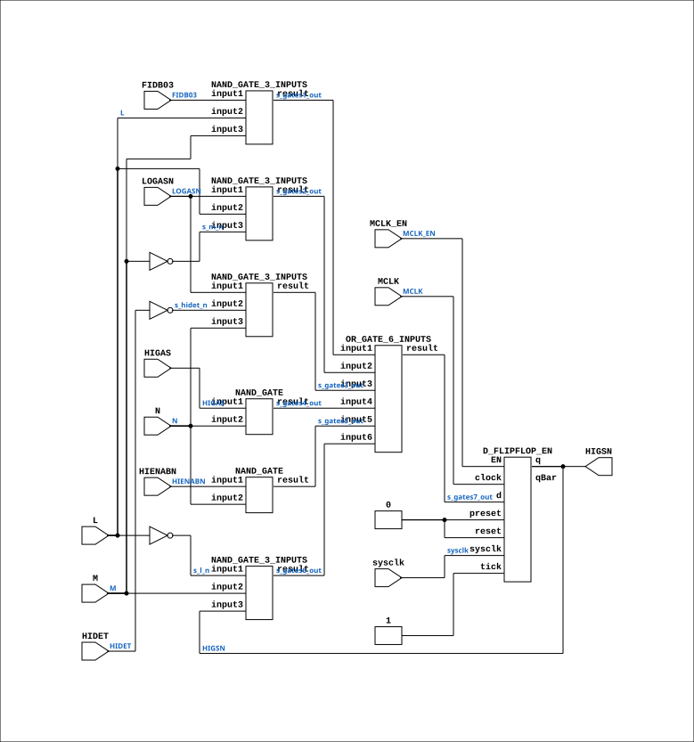

# CGA_INTR_CNTLR_IRGEL_HIGEL

Source: `Verilog/DELILAH-CPU/CGA_INTR/circuit/CGA_INTR_CNTLR_IRGEL_HIGEL.v`

<!-- Generated by Verilog/tests/module_doc.py from the //! comments in the source. Do not edit by hand - edit the RTL comments and regenerate. -->

<!-- HIERARCHY-NAV:BEGIN - written by Verilog/tests/gen_hierarchy.py, do not edit -->

**Where it sits** (Simulation): [ND120_TOP](../../../../doc/ND120_TOP.md) > [ND120_CORE](../../../../doc/ND120_CORE.md) > [ND3202D](../../../../CPU-BOARD-3202/circuit/doc/ND3202D.md) > [CPU_15](../../../../CPU-BOARD-3202/circuit/doc/CPU_15.md) > [CPU_PROC_32](../../../../CPU-BOARD-3202/circuit/doc/CPU_PROC_32.md) > [CPU_PROC_CGA_33](../../../../CPU-BOARD-3202/circuit/doc/CPU_PROC_CGA_33.md) > [CGA](../../../CGA/circuit/doc/CGA.md) > [CGA_INTR](CGA_INTR.md) > [CGA_INTR_CNTLR](CGA_INTR_CNTLR.md) > [CGA_INTR_CNTLR_IRGEL](CGA_INTR_CNTLR_IRGEL.md) > **CGA_INTR_CNTLR_IRGEL_HIGEL**
- instance path: `CORE.CPU_BOARD.CPU.PROC.CGA.DELILAH.INTR.CNTLR.IRGEL.HIGEL`

**Used in:** [CGA_INTR_CNTLR_IRGEL](CGA_INTR_CNTLR_IRGEL.md) (all tops)

**Contains:** [D_FLIPFLOP_EN](../../../../Shared/ndlib/doc/D_FLIPFLOP_EN.md), [NAND_GATE](../../../../Shared/logisim/doc/NAND_GATE.md) x2, [NAND_GATE_3_INPUTS](../../../../Shared/logisim/doc/NAND_GATE_3_INPUTS.md) x4, [OR_GATE_6_INPUTS](../../../../Shared/logisim/doc/OR_GATE_6_INPUTS.md)

[Module hierarchy](../../../../HIERARCHY.md) - [All modules](../../../../MODULES.md)

<!-- HIERARCHY-NAV:END -->


<!-- SCHEMATIC:BEGIN - written by Verilog/tests/gen_schematics.py, do not edit -->

## Schematic

Drawn from the Verilog: the yosys netlist of the Simulation (Verilator) build, instance `CORE.CPU_BOARD.CPU.PROC.CGA.DELILAH.INTR.CNTLR.IRGEL.HIGEL`. Sub-modules are boxes (click the picture to open it full size; there every sub-module box links to its page, and every wire shows its Verilog name).

[](CGA_INTR_CNTLR_IRGEL_HIGEL.svg)

<!-- SCHEMATIC:END -->

## Description

ND120 CGA (CPU Gate Array / DELILAH)
/CGA/INTR/CNTLR/IRGEL/HIGEL
HIGEL
Page 93
SHEET 1 of 1
Last reviewed: 10-NOV-2024
Ronny Hansen

## Ports

| Direction | Width | Name | Description |
|---|---|---|---|
| input | `1` | `sysclk` | FPGA system clock (P2: MCLK_EN capture) |
| input | `1` | `MCLK_EN` | MCLK clock-enable pulse (FPGA_FF_MODE, else 0) |
| input | `1` | `FIDB03` | FIDB (from CGA_INTR.FIDBO_15_0[3]) |
| input | `1` | `HIDET` |  |
| input | `1` | `HIENABN` |  |
| input | `1` | `HIGAS` |  |
| input | `1` | `L` |  |
| input | `1` | `LOGASN` |  |
| input | `1` | `M` |  |
| input | `1` | `MCLK` | Master Clock (from CGA_INTR.MCLK) |
| input | `1` | `N` |  |
| output | `1` | `HIGSN` | High Speed signal, active low (to CGA_INTR.HIGSN) |

## Verilog source

[`Verilog/DELILAH-CPU/CGA_INTR/circuit/CGA_INTR_CNTLR_IRGEL_HIGEL.v`](https://github.com/RetroCoreLabs/nd-120/blob/main/Verilog/DELILAH-CPU/CGA_INTR/circuit/CGA_INTR_CNTLR_IRGEL_HIGEL.v) on GitHub.

<details markdown="1">
<summary>Show the Verilog of CGA_INTR_CNTLR_IRGEL_HIGEL (173 lines)</summary>

```verilog
/**************************************************************************
** ND120 CGA (CPU Gate Array / DELILAH)                                  **
** /CGA/INTR/CNTLR/IRGEL/HIGEL                                           **
** HIGEL                                                                 **
**                                                                       **
** Page 93                                                               **
** SHEET 1 of 1                                                          **
**                                                                       **
** Last reviewed: 10-NOV-2024                                            **
** Ronny Hansen                                                          **
***************************************************************************/

module CGA_INTR_CNTLR_IRGEL_HIGEL (
    input sysclk,   //! FPGA system clock (P2: MCLK_EN capture)
    input MCLK_EN,  //! MCLK clock-enable pulse (FPGA_FF_MODE, else 0)

    input FIDB03,   //! FIDB (from CGA_INTR.FIDBO_15_0[3])
    input HIDET,
    input HIENABN,
    input HIGAS,
    input L,
    input LOGASN,
    input M,
    input MCLK,     //! Master Clock (from CGA_INTR.MCLK)
    input N,

    output HIGSN    //! High Speed signal, active low (to CGA_INTR.HIGSN)
);

  /*******************************************************************************
   ** The wires are defined here                                                 **
   *******************************************************************************/
  wire s_ff_q_out;
  wire s_fidbo3;
  wire s_gates1_out;
  wire s_gates2_out;
  wire s_gates3_out;
  wire s_gates4_out;
  wire s_gates5_out;
  wire s_gates6_out;
  wire s_gates7_out;
  wire s_hidet_n;
  wire s_hidet;
  wire s_hienab_n;
  wire s_higas;
  wire s_l_n;
  wire s_l;
  wire s_logas_n;
  wire s_m_n;
  wire s_m;
  wire s_mclk;
  wire s_n;

  /*******************************************************************************
   ** Here all input connections are defined                                     **
   *******************************************************************************/
  assign s_fidbo3 = FIDB03;
  assign s_hidet = HIDET;
  assign s_hienab_n = HIENABN;
  assign s_higas = HIGAS;
  assign s_l = L;
  assign s_logas_n = LOGASN;
  assign s_m = M;
  assign s_mclk = MCLK;
  assign s_n = N;

  // P2 (docs/plan-fix-unconstrained-clocks.md): in FF mode the MCLK-
  // clocked registers capture on posedge sysclk gated by MCLK_EN
  // (aligned to the MCLK rise) instead of clocking on the routed net.
`ifdef FPGA_FF_MODE
  localparam MCLK_CE = 1;
`else
  localparam MCLK_CE = 0;
`endif

  /*******************************************************************************
   ** Here all output connections are defined                                    **
   *******************************************************************************/
  assign HIGSN = s_ff_q_out;

  /*******************************************************************************
   ** Here all in-lined components are defined                                   **
   *******************************************************************************/

  // NOT Gate
  assign s_hidet_n = ~s_hidet;
  assign s_l_n = ~s_l;
  assign s_m_n = ~s_m;

  /*******************************************************************************
   ** Here all normal components are defined                                     **
   *******************************************************************************/
  NAND_GATE_3_INPUTS #(
      .BubblesMask(3'b000)
  ) GATES_1 (
      .input1(s_fidbo3),
      .input2(s_l),
      .input3(s_m),
      .result(s_gates1_out)
  );

  NAND_GATE_3_INPUTS #(
      .BubblesMask(3'b000)
  ) GATES_2 (
      .input1(s_logas_n),
      .input2(s_l),
      .input3(s_m_n),
      .result(s_gates2_out)
  );

  NAND_GATE_3_INPUTS #(
      .BubblesMask(3'b000)
  ) GATES_3 (
      .input1(s_logas_n),
      .input2(s_hidet_n),
      .input3(s_n),
      .result(s_gates3_out)
  );

  NAND_GATE #(
      .BubblesMask(2'b00)
  ) GATES_4 (
      .input1(s_higas),
      .input2(s_n),
      .result(s_gates4_out)
  );

  NAND_GATE #(
      .BubblesMask(2'b00)
  ) GATES_5 (
      .input1(s_hienab_n),
      .input2(s_n),
      .result(s_gates5_out)
  );

  NAND_GATE_3_INPUTS #(
      .BubblesMask(3'b000)
  ) GATES_6 (
      .input1(s_l_n),
      .input2(s_m),
      .input3(s_ff_q_out),
      .result(s_gates6_out)
  );

  OR_GATE_6_INPUTS #(
      .BubblesMask({2'b11, 4'hF})
  ) GATES_7 (
      .input1(s_gates1_out),
      .input2(s_gates2_out),
      .input3(s_gates3_out),
      .input4(s_gates4_out),
      .input5(s_gates5_out),
      .input6(s_gates6_out),
      .result(s_gates7_out)
  );

  // MCLK domain (CGA_INTR.MCLK, rising edge)
  D_FLIPFLOP_EN #(
      .USE_ENABLE(MCLK_CE)
  ) MEMORY_8 (
      .sysclk(sysclk),
      .EN(MCLK_EN),
      .clock(s_mclk),
      .d(s_gates7_out),
      .preset(1'b0),
      .q(s_ff_q_out),
      .qBar(),
      .reset(1'b0),
      .tick(1'b1)
  );


endmodule
```

</details>
