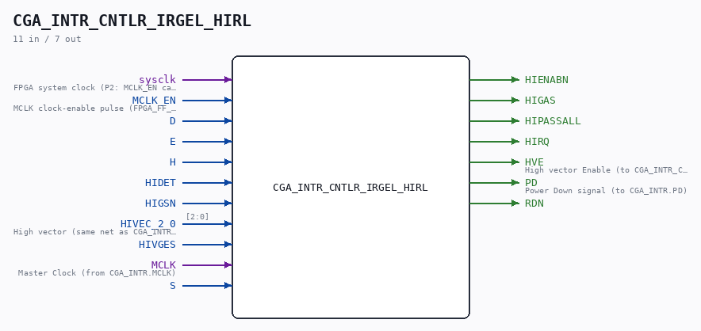
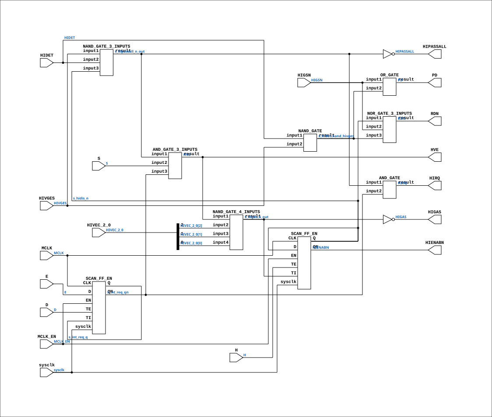

# CGA_INTR_CNTLR_IRGEL_HIRL

Source: `Verilog/DELILAH-CPU/CGA_INTR/circuit/CGA_INTR_CNTLR_IRGEL_HIRL.v`

<!-- Generated by Verilog/tests/module_doc.py from the //! comments in the source. Do not edit by hand - edit the RTL comments and regenerate. -->

<!-- HIERARCHY-NAV:BEGIN - written by Verilog/tests/gen_hierarchy.py, do not edit -->

**Where it sits** (Simulation): [ND120_TOP](../../../../doc/ND120_TOP.md) > [ND120_CORE](../../../../doc/ND120_CORE.md) > [ND3202D](../../../../CPU-BOARD-3202/circuit/doc/ND3202D.md) > [CPU_15](../../../../CPU-BOARD-3202/circuit/doc/CPU_15.md) > [CPU_PROC_32](../../../../CPU-BOARD-3202/circuit/doc/CPU_PROC_32.md) > [CPU_PROC_CGA_33](../../../../CPU-BOARD-3202/circuit/doc/CPU_PROC_CGA_33.md) > [CGA](../../../CGA/circuit/doc/CGA.md) > [CGA_INTR](CGA_INTR.md) > [CGA_INTR_CNTLR](CGA_INTR_CNTLR.md) > [CGA_INTR_CNTLR_IRGEL](CGA_INTR_CNTLR_IRGEL.md) > **CGA_INTR_CNTLR_IRGEL_HIRL**
- instance path: `CORE.CPU_BOARD.CPU.PROC.CGA.DELILAH.INTR.CNTLR.IRGEL.HIRL`

**Used in:** [CGA_INTR_CNTLR_IRGEL](CGA_INTR_CNTLR_IRGEL.md) (all tops)

**Contains:** [AND_GATE](../../../../Shared/logisim/doc/AND_GATE.md), [AND_GATE_3_INPUTS](../../../../Shared/logisim/doc/AND_GATE_3_INPUTS.md), [NAND_GATE](../../../../Shared/logisim/doc/NAND_GATE.md), [NAND_GATE_3_INPUTS](../../../../Shared/logisim/doc/NAND_GATE_3_INPUTS.md), [NAND_GATE_4_INPUTS](../../../../Shared/logisim/doc/NAND_GATE_4_INPUTS.md), [NOR_GATE_3_INPUTS](../../../../Shared/logisim/doc/NOR_GATE_3_INPUTS.md), [OR_GATE](../../../../Shared/logisim/doc/OR_GATE.md), [SCAN_FF_EN](../../../../Shared/ndlib/doc/SCAN_FF_EN.md) x2

[Module hierarchy](../../../../HIERARCHY.md) - [All modules](../../../../MODULES.md)

<!-- HIERARCHY-NAV:END -->



<!-- SCHEMATIC:BEGIN - written by Verilog/tests/gen_schematics.py, do not edit -->

## Schematic

Drawn from the Verilog: the yosys netlist of the Simulation (Verilator) build, instance `CORE.CPU_BOARD.CPU.PROC.CGA.DELILAH.INTR.CNTLR.IRGEL.HIRL`. Sub-modules are boxes (click the picture to open it full size; there every sub-module box links to its page, and every wire shows its Verilog name).

[](CGA_INTR_CNTLR_IRGEL_HIRL.svg)

<!-- SCHEMATIC:END -->

## Description

ND120 CGA (CPU Gate Array / DELILAH)
/CGA/INTR/CNTLR/IRGEL/HIRL
HIRL
Page 91
SHEET 1 of 1
Last reviewed: 10-NOV-2024
Ronny Hansen

## Ports

| Direction | Width | Name | Description |
|---|---|---|---|
| input | `1` | `sysclk` | FPGA system clock (P2: MCLK_EN capture) |
| input | `1` | `MCLK_EN` | MCLK clock-enable pulse (FPGA_FF_MODE, else 0) |
| input | `1` | `D` |  |
| input | `1` | `E` |  |
| input | `1` | `H` |  |
| input | `1` | `HIDET` |  |
| input | `1` | `HIGSN` |  |
| input | `[2:0]` | `HIVEC_2_0` | High vector (same net as CGA_INTR_CNTLR_IRGEL_VMUX.HIVEC_2_0) |
| input | `1` | `HIVGES` |  |
| input | `1` | `MCLK` | Master Clock (from CGA_INTR.MCLK) |
| input | `1` | `S` |  |
| output | `1` | `HIENABN` |  |
| output | `1` | `HIGAS` |  |
| output | `1` | `HIPASSALL` |  |
| output | `1` | `HIRQ` |  |
| output | `1` | `HVE` | High vector Enable (to CGA_INTR_CNTLR_IRGEL_VMUX.HVE) |
| output | `1` | `PD` | Power Down signal (to CGA_INTR.PD) |
| output | `1` | `RDN` |  |

## Verilog source

[`Verilog/DELILAH-CPU/CGA_INTR/circuit/CGA_INTR_CNTLR_IRGEL_HIRL.v`](https://github.com/RetroCoreLabs/nd-120/blob/main/Verilog/DELILAH-CPU/CGA_INTR/circuit/CGA_INTR_CNTLR_IRGEL_HIRL.v) on GitHub.

<details markdown="1">
<summary>Show the Verilog of CGA_INTR_CNTLR_IRGEL_HIRL (206 lines)</summary>

```verilog
/**************************************************************************
** ND120 CGA (CPU Gate Array / DELILAH)                                  **
** /CGA/INTR/CNTLR/IRGEL/HIRL                                            **
** HIRL                                                                  **
**                                                                       **
** Page 91                                                               **
** SHEET 1 of 1                                                          **
**                                                                       **
** Last reviewed: 10-NOV-2024                                            **
** Ronny Hansen                                                          **
***************************************************************************/


module CGA_INTR_CNTLR_IRGEL_HIRL (
    input       sysclk,   //! FPGA system clock (P2: MCLK_EN capture)
    input       MCLK_EN,  //! MCLK clock-enable pulse (FPGA_FF_MODE, else 0)

    input       D,
    input       E,
    input       H,
    input       HIDET,
    input       HIGSN,
    input [2:0] HIVEC_2_0,  //! High vector (same net as CGA_INTR_CNTLR_IRGEL_VMUX.HIVEC_2_0)
    input       HIVGES,
    input       MCLK,     //! Master Clock (from CGA_INTR.MCLK)
    input       S,

    output HIENABN,
    output HIGAS,
    output HIPASSALL,
    output HIRQ,
    output HVE,           //! High vector Enable (to CGA_INTR_CNTLR_IRGEL_VMUX.HVE)
    output PD,            //! Power Down signal (to CGA_INTR.PD)
    output RDN
);

  /*******************************************************************************
   ** The wires are defined here                                                 **
   *******************************************************************************/
  wire [2:0] s_hivec_2_0;
  wire       s_d;
  wire       s_e;
  wire       s_h;
  wire       s_hidet_nand_hivges;
  wire       s_hidet;
  wire       s_hidis_n /* synthesis syn_keep=1 */;  // GAO probe net - see fpga/tang-nano-20k/GAO-HOWTO.md
  wire       s_hienab_n_out;
  wire       s_higas_n_out;
  wire       s_higas_out;
  wire       s_higs_n;
  wire       s_hipassall_n_out;
  wire       s_hipassall_out;
  wire       s_hirq_out;
  wire       s_hivges;
  wire       s_hve_out;
  wire       s_int_req_q /* synthesis syn_keep=1 */;   // GAO probe net - see fpga/tang-nano-20k/GAO-HOWTO.md
  wire       s_int_req_qn /* synthesis syn_keep=1 */;  // GAO probe net
  wire       s_mclk;
  wire       s_pd_out;
  wire       s_rd_n;
  wire       s_s;

  /*******************************************************************************
   ** The module functionality is described here                                 **
   *******************************************************************************/

  /*******************************************************************************
   ** Here all input connections are defined                                     **
   *******************************************************************************/
  assign s_hivec_2_0[2:0] = HIVEC_2_0;
  assign s_d              = D;
  assign s_hivges         = HIVGES;
  assign s_s              = S;
  assign s_hidet          = HIDET;
  assign s_h              = H;
  assign s_e              = E;
  assign s_mclk           = MCLK;
  assign s_higs_n         = HIGSN;

  // P2 (docs/plan-fix-unconstrained-clocks.md): in FF mode the MCLK-
  // clocked registers capture on posedge sysclk gated by MCLK_EN
  // (aligned to the MCLK rise) instead of clocking on the routed net.
`ifdef FPGA_FF_MODE
  localparam MCLK_CE = 1;
`else
  localparam MCLK_CE = 0;
`endif

  /*******************************************************************************
   ** Here all output connections are defined                                    **
   *******************************************************************************/
  assign HIENABN          = s_hienab_n_out;
  assign HIGAS            = s_higas_out;
  assign HIPASSALL        = s_hipassall_out;
  assign HIRQ             = s_hirq_out;
  assign HVE              = s_hve_out;
  assign PD               = s_pd_out;
  assign RDN              = s_rd_n;

  /*******************************************************************************
   ** Here all in-lined components are defined                                   **
   *******************************************************************************/

  // NOT Gate
  assign s_higas_out      = ~s_higas_n_out;

  // NOT Gate
  assign s_hipassall_out  = ~s_hipassall_n_out;

  /*******************************************************************************
   ** Here all normal components are defined                                     **
   *******************************************************************************/
  NAND_GATE_4_INPUTS #(
      .BubblesMask(4'h0)
  ) GATES_1 (
      .input1(s_hve_out),
      .input2(s_hivec_2_0[2]),
      .input3(s_hivec_2_0[1]),
      .input4(s_hivec_2_0[0]),
      .result(s_higas_n_out)
  );

  NAND_GATE #(
      .BubblesMask(2'b00)
  ) GATES_2 (
      .input1(s_hidet),
      .input2(s_hivges),
      .result(s_hidet_nand_hivges)
  );

  NAND_GATE_3_INPUTS #(
      .BubblesMask(3'b000)
  ) GATES_3 (
      .input1(s_hivges),
      .input2(s_hidet),
      .input3(s_hidis_n),
      .result(s_hipassall_n_out)
  );

  OR_GATE #(
      .BubblesMask(2'b11)
  ) GATES_4 (
      .input1(s_higs_n),
      .input2(s_hidet_nand_hivges),
      .result(s_pd_out)
  );

  NOR_GATE_3_INPUTS #(
      .BubblesMask(3'b111)
  ) GATES_5 (
      .input1(s_hidis_n),
      .input2(s_higs_n),
      .input3(s_hidet_nand_hivges),
      .result(s_rd_n)
  );

  AND_GATE #(
      .BubblesMask(2'b11)
  ) GATES_6 (
      .input1(s_hipassall_n_out),
      .input2(s_int_req_qn),
      .result(s_hirq_out)
  );

  // Vector-claim must be gated by the interrupt-request-enable FF (Am2914
  // ground truth: a claim after DISIN must not fire even with requests
  // pending and the mask open - the post-MCL mask is all-enabled by design).
  AND_GATE_3_INPUTS #(
      .BubblesMask(3'b111)
  ) GATES_7 (
      .input1(s_hipassall_n_out),
      .input2(s_s),
      .input3(s_int_req_qn),
      .result(s_hve_out)
  );


  /*******************************************************************************
   ** Here all sub-circuits are defined                                          **
   *******************************************************************************/

  // MCLK domain (CGA_INTR.MCLK, rising edge)
  SCAN_FF_EN #(.USE_ENABLE(MCLK_CE)) STATUS_OVERFLOW_FF (
      .sysclk(sysclk),
      .EN(MCLK_EN),
      .CLK(s_mclk),
      .D  (s_hidis_n),
      .Q  (s_hidis_n),
      .QN (s_hienab_n_out),
      .TE (s_h),
      .TI (s_higas_n_out)
  );

  // MCLK domain (CGA_INTR.MCLK, rising edge)
  SCAN_FF_EN #(.USE_ENABLE(MCLK_CE)) INT_REQ_ENABLE_FF (
      .sysclk(sysclk),
      .EN(MCLK_EN),
      .CLK(s_mclk),
      .D  (s_e),
      .Q  (s_int_req_q),
      .QN (s_int_req_qn),
      .TE (s_d),
      .TI (s_int_req_q)
  );

endmodule
```

</details>
