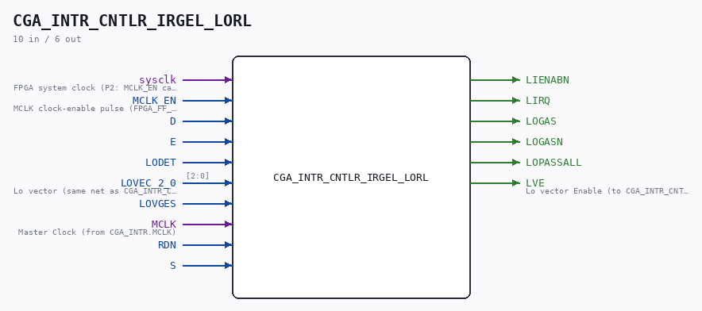

# CGA_INTR_CNTLR_IRGEL_LORL

Source: `Verilog/DELILAH-CPU/CGA_INTR/circuit/CGA_INTR_CNTLR_IRGEL_LORL.v`

<!-- Generated by Verilog/tests/module_doc.py from the //! comments in the source. Do not edit by hand - edit the RTL comments and regenerate. -->

<!-- HIERARCHY-NAV:BEGIN - written by Verilog/tests/gen_hierarchy.py, do not edit -->

**Where it sits** (Simulation): [ND120_TOP](../../../../doc/ND120_TOP.md) > [ND120_CORE](../../../../doc/ND120_CORE.md) > [ND3202D](../../../../CPU-BOARD-3202/circuit/doc/ND3202D.md) > [CPU_15](../../../../CPU-BOARD-3202/circuit/doc/CPU_15.md) > [CPU_PROC_32](../../../../CPU-BOARD-3202/circuit/doc/CPU_PROC_32.md) > [CPU_PROC_CGA_33](../../../../CPU-BOARD-3202/circuit/doc/CPU_PROC_CGA_33.md) > [CGA](../../../CGA/circuit/doc/CGA.md) > [CGA_INTR](CGA_INTR.md) > [CGA_INTR_CNTLR](CGA_INTR_CNTLR.md) > [CGA_INTR_CNTLR_IRGEL](CGA_INTR_CNTLR_IRGEL.md) > **CGA_INTR_CNTLR_IRGEL_LORL**
- instance path: `CORE.CPU_BOARD.CPU.PROC.CGA.DELILAH.INTR.CNTLR.IRGEL.LORL`

**Used in:** [CGA_INTR_CNTLR_IRGEL](CGA_INTR_CNTLR_IRGEL.md) (all tops)

**Contains:** [AND_GATE](../../../../Shared/logisim/doc/AND_GATE.md), [AND_GATE_3_INPUTS](../../../../Shared/logisim/doc/AND_GATE_3_INPUTS.md), [NAND_GATE_3_INPUTS](../../../../Shared/logisim/doc/NAND_GATE_3_INPUTS.md), [NAND_GATE_4_INPUTS](../../../../Shared/logisim/doc/NAND_GATE_4_INPUTS.md), [SCAN_FF_EN](../../../../Shared/ndlib/doc/SCAN_FF_EN.md)

[Module hierarchy](../../../../HIERARCHY.md) - [All modules](../../../../MODULES.md)

<!-- HIERARCHY-NAV:END -->

## Description

ND120 CGA (CPU Gate Array / DELILAH)
/CGA/INTR/CNTLR/IRGEL/LORL
LO RL
Page 92
SHEET 1 of 1
Last reviewed: 10-NOV-2024
Ronny Hansen

## Ports

| Direction | Width | Name | Description |
|---|---|---|---|
| input | `1` | `sysclk` | FPGA system clock (P2: MCLK_EN capture) |
| input | `1` | `MCLK_EN` | MCLK clock-enable pulse (FPGA_FF_MODE, else 0) |
| input | `1` | `D` |  |
| input | `1` | `E` |  |
| input | `1` | `LODET` |  |
| input | `[2:0]` | `LOVEC_2_0` |  |
| input | `1` | `LOVGES` |  |
| input | `1` | `MCLK` |  |
| input | `1` | `RDN` |  |
| input | `1` | `S` |  |
| output | `1` | `LIENABN` |  |
| output | `1` | `LIRQ` |  |
| output | `1` | `LOGAS` |  |
| output | `1` | `LOGASN` |  |
| output | `1` | `LOPASSALL` |  |
| output | `1` | `LVE` |  |
