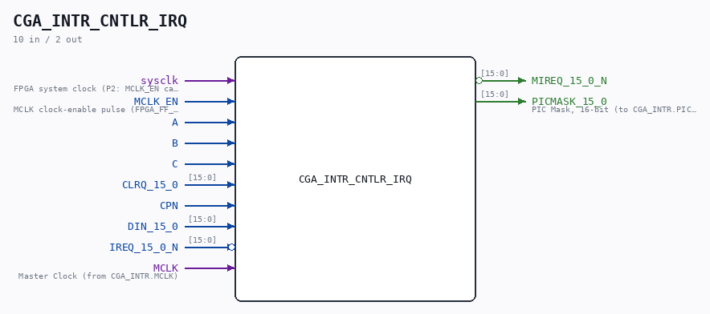
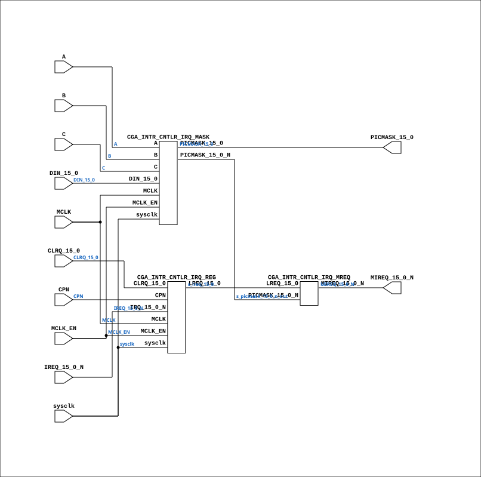

# CGA_INTR_CNTLR_IRQ

Source: `Verilog/DELILAH-CPU/CGA_INTR/circuit/CGA_INTR_CNTLR_IRQ.v`

<!-- Generated by Verilog/tests/module_doc.py from the //! comments in the source. Do not edit by hand - edit the RTL comments and regenerate. -->

<!-- HIERARCHY-NAV:BEGIN - written by Verilog/tests/gen_hierarchy.py, do not edit -->

**Where it sits** (Simulation): [ND120_TOP](../../../../doc/ND120_TOP.md) > [ND120_CORE](../../../../doc/ND120_CORE.md) > [ND3202D](../../../../CPU-BOARD-3202/circuit/doc/ND3202D.md) > [CPU_15](../../../../CPU-BOARD-3202/circuit/doc/CPU_15.md) > [CPU_PROC_32](../../../../CPU-BOARD-3202/circuit/doc/CPU_PROC_32.md) > [CPU_PROC_CGA_33](../../../../CPU-BOARD-3202/circuit/doc/CPU_PROC_CGA_33.md) > [CGA](../../../CGA/circuit/doc/CGA.md) > [CGA_INTR](CGA_INTR.md) > [CGA_INTR_CNTLR](CGA_INTR_CNTLR.md) > **CGA_INTR_CNTLR_IRQ**
- instance path: `CORE.CPU_BOARD.CPU.PROC.CGA.DELILAH.INTR.CNTLR.IRQ`

**Used in:** [CGA_INTR_CNTLR](CGA_INTR_CNTLR.md) (all tops)

**Contains:** [CGA_INTR_CNTLR_IRQ_MASK](CGA_INTR_CNTLR_IRQ_MASK.md), [CGA_INTR_CNTLR_IRQ_MREQ](CGA_INTR_CNTLR_IRQ_MREQ.md), [CGA_INTR_CNTLR_IRQ_REG](CGA_INTR_CNTLR_IRQ_REG.md)

[Module hierarchy](../../../../HIERARCHY.md) - [All modules](../../../../MODULES.md)

<!-- HIERARCHY-NAV:END -->



<!-- SCHEMATIC:BEGIN - written by Verilog/tests/gen_schematics.py, do not edit -->

## Schematic

Drawn from the Verilog: the yosys netlist of the Simulation (Verilator) build, instance `CORE.CPU_BOARD.CPU.PROC.CGA.DELILAH.INTR.CNTLR.IRQ`. Sub-modules are boxes (click the picture to open it full size; there every sub-module box links to its page, and every wire shows its Verilog name).

[](CGA_INTR_CNTLR_IRQ.svg)

<!-- SCHEMATIC:END -->

## Description

ND120 CGA (CPU Gate Array / DELILAH)
/CGA/INTR/CNTLR/IRQ
IRQ
Interrupt latches
Mask register
Page 79
SHEET 1 of 1
Last reviewed: 23-MAR-2025
Ronny Hansen

## Ports

| Direction | Width | Name | Description |
|---|---|---|---|
| input | `1` | `sysclk` | FPGA system clock (P2: MCLK_EN capture) |
| input | `1` | `MCLK_EN` | MCLK clock-enable pulse (FPGA_FF_MODE, else 0) |
| input | `1` | `A` |  |
| input | `1` | `B` |  |
| input | `1` | `C` |  |
| input | `[15:0]` | `CLRQ_15_0` |  |
| input | `1` | `CPN` |  |
| input | `[15:0]` | `DIN_15_0` |  |
| input | `[15:0]` | `IREQ_15_0_N` *(active low)* |  |
| input | `1` | `MCLK` | Master Clock (from CGA_INTR.MCLK) |
| output | `[15:0]` | `MIREQ_15_0_N` *(active low)* |  |
| output | `[15:0]` | `PICMASK_15_0` | PIC Mask, 16-bit (to CGA_INTR.PICMASK_15_0) |

## Verilog source

[`Verilog/DELILAH-CPU/CGA_INTR/circuit/CGA_INTR_CNTLR_IRQ.v`](https://github.com/RetroCoreLabs/nd-120/blob/main/Verilog/DELILAH-CPU/CGA_INTR/circuit/CGA_INTR_CNTLR_IRQ.v) on GitHub.

<details markdown="1">
<summary>Show the Verilog of CGA_INTR_CNTLR_IRQ (99 lines)</summary>

```verilog
/**************************************************************************
** ND120 CGA (CPU Gate Array / DELILAH)                                  **
** /CGA/INTR/CNTLR/IRQ                                                   **
** IRQ                                                                   **
**                                                                       **
** Interrupt latches                                                     **
** Mask register                                                         **
**                                                                       **
** Page 79                                                               **
** SHEET 1 of 1                                                          **
**                                                                       **
** Last reviewed: 23-MAR-2025                                            **
** Ronny Hansen                                                          **
***************************************************************************/

module CGA_INTR_CNTLR_IRQ (
    input        sysclk,   //! FPGA system clock (P2: MCLK_EN capture)
    input        MCLK_EN,  //! MCLK clock-enable pulse (FPGA_FF_MODE, else 0)

    input        A,
    input        B,
    input        C,
    input [15:0] CLRQ_15_0,
    input        CPN,
    input [15:0] DIN_15_0,
    input [15:0] IREQ_15_0_N,
    input        MCLK,     //! Master Clock (from CGA_INTR.MCLK)

    output [15:0] MIREQ_15_0_N,
    output [15:0] PICMASK_15_0  //! PIC Mask, 16-bit (to CGA_INTR.PICMASK_15_0)
);

  /*******************************************************************************
   ** The wires are defined here                                                 **
   *******************************************************************************/
  wire [15:0] s_clrq_15_0;
  wire [15:0] s_din_15_0;
  wire [15:0] s_ireq_15_0_n;
  wire [15:0] s_lreq_15_0 /* synthesis syn_keep=1 */;  // GAO probe net - see fpga/tang-nano-20k/GAO-HOWTO.md
  wire [15:0] s_mireq_15_0_n_out;
  wire [15:0] s_picmask_15_0_n_out /* synthesis syn_keep=1 */;  // GAO probe net
  wire [15:0] s_picmask_15_0_out;
  wire        a_b;
  wire        s_a;
  wire        s_c;
  wire        s_cp_n;
  wire        s_mclk;

  /*******************************************************************************
   ** Here all input connections are defined                                     **
   *******************************************************************************/
  assign a_b                 = B;
  assign s_a                 = A;
  assign s_c                 = C;
  assign s_clrq_15_0[15:0]   = CLRQ_15_0;
  assign s_cp_n              = CPN;
  assign s_din_15_0[15:0]    = DIN_15_0;
  assign s_ireq_15_0_n[15:0] = IREQ_15_0_N;
  assign s_mclk              = MCLK;

  /*******************************************************************************
   ** Here all output connections are defined                                    **
   *******************************************************************************/
  assign MIREQ_15_0_N        = s_mireq_15_0_n_out[15:0];
  assign PICMASK_15_0        = s_picmask_15_0_out[15:0];

  /*******************************************************************************
   ** Here all sub-circuits are defined                                          **
   *******************************************************************************/

  CGA_INTR_CNTLR_IRQ_REG IRQ_REG (
      .sysclk(sysclk),
      .MCLK_EN(MCLK_EN),
      .CLRQ_15_0(s_clrq_15_0[15:0]),
      .CPN(s_cp_n),
      .IRQ_15_0_N(s_ireq_15_0_n[15:0]),
      .LREQ_15_0(s_lreq_15_0[15:0]),
      .MCLK(s_mclk)
  );

  CGA_INTR_CNTLR_IRQ_MASK IRQ_MASK (
      .sysclk(sysclk),
      .MCLK_EN(MCLK_EN),
      .A(s_a),
      .B(a_b),
      .C(s_c),
      .DIN_15_0(s_din_15_0[15:0]),
      .MCLK(s_mclk),
      .PICMASK_15_0(s_picmask_15_0_out[15:0]),
      .PICMASK_15_0_N(s_picmask_15_0_n_out[15:0])
  );

  CGA_INTR_CNTLR_IRQ_MREQ IRQ_MREQ (
      .LREQ_15_0(s_lreq_15_0[15:0]),
      .MIREQ_15_0_N(s_mireq_15_0_n_out[15:0]),
      .PICMASK_15_0_N(s_picmask_15_0_n_out[15:0])
  );

endmodule
```

</details>
