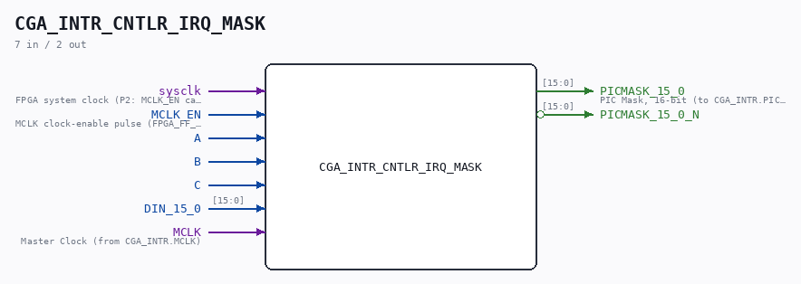
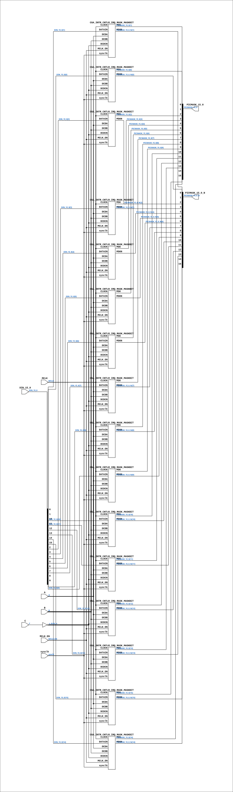

# CGA_INTR_CNTLR_IRQ_MASK

Source: `Verilog/DELILAH-CPU/CGA_INTR/circuit/CGA_INTR_CNTLR_IRQ_MASK.v`

<!-- Generated by Verilog/tests/module_doc.py from the //! comments in the source. Do not edit by hand - edit the RTL comments and regenerate. -->

<!-- HIERARCHY-NAV:BEGIN - written by Verilog/tests/gen_hierarchy.py, do not edit -->

**Where it sits** (Simulation): [ND120_TOP](../../../../doc/ND120_TOP.md) > [ND120_CORE](../../../../doc/ND120_CORE.md) > [ND3202D](../../../../CPU-BOARD-3202/circuit/doc/ND3202D.md) > [CPU_15](../../../../CPU-BOARD-3202/circuit/doc/CPU_15.md) > [CPU_PROC_32](../../../../CPU-BOARD-3202/circuit/doc/CPU_PROC_32.md) > [CPU_PROC_CGA_33](../../../../CPU-BOARD-3202/circuit/doc/CPU_PROC_CGA_33.md) > [CGA](../../../CGA/circuit/doc/CGA.md) > [CGA_INTR](CGA_INTR.md) > [CGA_INTR_CNTLR](CGA_INTR_CNTLR.md) > [CGA_INTR_CNTLR_IRQ](CGA_INTR_CNTLR_IRQ.md) > **CGA_INTR_CNTLR_IRQ_MASK**
- instance path: `CORE.CPU_BOARD.CPU.PROC.CGA.DELILAH.INTR.CNTLR.IRQ.IRQ_MASK`

**Used in:** [CGA_INTR_CNTLR_IRQ](CGA_INTR_CNTLR_IRQ.md) (all tops)

**Contains:** [CGA_INTR_CNTLR_IRQ_MASK_MASKBIT](CGA_INTR_CNTLR_IRQ_MASK_MASKBIT.md) x16

[Module hierarchy](../../../../HIERARCHY.md) - [All modules](../../../../MODULES.md)

<!-- HIERARCHY-NAV:END -->



<!-- SCHEMATIC:BEGIN - written by Verilog/tests/gen_schematics.py, do not edit -->

## Schematic

Drawn from the Verilog: the yosys netlist of the Simulation (Verilator) build, instance `CORE.CPU_BOARD.CPU.PROC.CGA.DELILAH.INTR.CNTLR.IRQ.IRQ_MASK`. Sub-modules are boxes (click the picture to open it full size; there every sub-module box links to its page, and every wire shows its Verilog name).

[](CGA_INTR_CNTLR_IRQ_MASK.svg)

<!-- SCHEMATIC:END -->

## Description

ND120 CGA (CPU Gate Array / DELILAH)
/CGA/INTR/CNTLR/IRQ/MASK
IRQ MASK
Page 80
SHEET 1 of 1
Last reviewed: 10-NOV-2024
Ronny Hansen

## Ports

| Direction | Width | Name | Description |
|---|---|---|---|
| input | `1` | `sysclk` | FPGA system clock (P2: MCLK_EN capture) |
| input | `1` | `MCLK_EN` | MCLK clock-enable pulse (FPGA_FF_MODE, else 0) |
| input | `1` | `A` |  |
| input | `1` | `B` |  |
| input | `1` | `C` |  |
| input | `[15:0]` | `DIN_15_0` |  |
| input | `1` | `MCLK` | Master Clock (from CGA_INTR.MCLK) |
| output | `[15:0]` | `PICMASK_15_0` | PIC Mask, 16-bit (to CGA_INTR.PICMASK_15_0) |
| output | `[15:0]` | `PICMASK_15_0_N` *(active low)* |  |

## Verilog source

[`Verilog/DELILAH-CPU/CGA_INTR/circuit/CGA_INTR_CNTLR_IRQ_MASK.v`](https://github.com/RetroCoreLabs/nd-120/blob/main/Verilog/DELILAH-CPU/CGA_INTR/circuit/CGA_INTR_CNTLR_IRQ_MASK.v) on GitHub.

<details markdown="1">
<summary>Show the Verilog of CGA_INTR_CNTLR_IRQ_MASK (258 lines)</summary>

```verilog
/**************************************************************************
** ND120 CGA (CPU Gate Array / DELILAH)                                  **
** /CGA/INTR/CNTLR/IRQ/MASK                                              **
** IRQ MASK                                                              **
**                                                                       **
** Page 80                                                               **
** SHEET 1 of 1                                                          **
**                                                                       **
** Last reviewed: 10-NOV-2024                                            **
** Ronny Hansen                                                          **
***************************************************************************/

module CGA_INTR_CNTLR_IRQ_MASK (
    input        sysclk,   //! FPGA system clock (P2: MCLK_EN capture)
    input        MCLK_EN,  //! MCLK clock-enable pulse (FPGA_FF_MODE, else 0)

    input        A,
    input        B,
    input        C,
    input [15:0] DIN_15_0,
    input        MCLK,     //! Master Clock (from CGA_INTR.MCLK)

    output [15:0] PICMASK_15_0,  //! PIC Mask, 16-bit (to CGA_INTR.PICMASK_15_0)
    output [15:0] PICMASK_15_0_N
);

  /*******************************************************************************
   ** The wires are defined here                                                 **
   *******************************************************************************/
  wire [15:0] s_picmask_15_0_out;
  wire [15:0] s_din_15_0;
  wire [15:0] s_picmask_15_0_n_out;
  wire        s_a;
  wire        s_b;
  wire        s_c;
  wire        s_dcdc_n;
  wire        s_mclk;

  /*******************************************************************************
   ** Here all input connections are defined                                     **
   *******************************************************************************/
  assign s_din_15_0[15:0] = DIN_15_0;
  assign s_a              = A;
  assign s_c              = C;
  assign s_b              = B;
  assign s_mclk           = MCLK;

  /*******************************************************************************
   ** Here all output connections are defined                                    **
   *******************************************************************************/
  assign PICMASK_15_0     = s_picmask_15_0_out[15:0];
  assign PICMASK_15_0_N   = s_picmask_15_0_n_out[15:0];

  /*******************************************************************************
   ** Here all in-lined components are defined                                   **
   *******************************************************************************/

  // NOT Gate
  assign s_dcdc_n         = ~s_c;

  /*******************************************************************************
   ** Here all sub-circuits are defined                                          **
   *******************************************************************************/
  CGA_INTR_CNTLR_IRQ_MASK_MASKBIT MASKBIT15 (
      .sysclk(sysclk),
      .MCLK_EN(MCLK_EN),
      .CLOCK(s_mclk),
      .DATAIN(s_din_15_0[15]),
      .DCDA(s_a),
      .DCDB(s_b),
      .DCDCN(s_dcdc_n),
      .MSK(s_picmask_15_0_out[15]),
      .MSKN(s_picmask_15_0_n_out[15])
  );

  CGA_INTR_CNTLR_IRQ_MASK_MASKBIT MASKBIT14 (
      .sysclk(sysclk),
      .MCLK_EN(MCLK_EN),
      .CLOCK(s_mclk),
      .DATAIN(s_din_15_0[14]),
      .DCDA(s_a),
      .DCDB(s_b),
      .DCDCN(s_dcdc_n),
      .MSK(s_picmask_15_0_out[14]),
      .MSKN(s_picmask_15_0_n_out[14])
  );

  CGA_INTR_CNTLR_IRQ_MASK_MASKBIT MASKBIT13 (
      .sysclk(sysclk),
      .MCLK_EN(MCLK_EN),
      .CLOCK(s_mclk),
      .DATAIN(s_din_15_0[13]),
      .DCDA(s_a),
      .DCDB(s_b),
      .DCDCN(s_dcdc_n),
      .MSK(s_picmask_15_0_out[13]),
      .MSKN(s_picmask_15_0_n_out[13])
  );

  CGA_INTR_CNTLR_IRQ_MASK_MASKBIT MASKBIT12 (
      .sysclk(sysclk),
      .MCLK_EN(MCLK_EN),
      .CLOCK(s_mclk),
      .DATAIN(s_din_15_0[12]),
      .DCDA(s_a),
      .DCDB(s_b),
      .DCDCN(s_dcdc_n),
      .MSK(s_picmask_15_0_out[12]),
      .MSKN(s_picmask_15_0_n_out[12])
  );

  CGA_INTR_CNTLR_IRQ_MASK_MASKBIT MASKBIT11 (
      .sysclk(sysclk),
      .MCLK_EN(MCLK_EN),
      .CLOCK(s_mclk),
      .DATAIN(s_din_15_0[11]),
      .DCDA(s_a),
      .DCDB(s_b),
      .DCDCN(s_dcdc_n),
      .MSK(s_picmask_15_0_out[11]),
      .MSKN(s_picmask_15_0_n_out[11])
  );

  CGA_INTR_CNTLR_IRQ_MASK_MASKBIT MASKBIT10 (
      .sysclk(sysclk),
      .MCLK_EN(MCLK_EN),
      .CLOCK(s_mclk),
      .DATAIN(s_din_15_0[10]),
      .DCDA(s_a),
      .DCDB(s_b),
      .DCDCN(s_dcdc_n),
      .MSK(s_picmask_15_0_out[10]),
      .MSKN(s_picmask_15_0_n_out[10])
  );

  CGA_INTR_CNTLR_IRQ_MASK_MASKBIT MASKBIT9 (
      .sysclk(sysclk),
      .MCLK_EN(MCLK_EN),
      .CLOCK(s_mclk),
      .DATAIN(s_din_15_0[9]),
      .DCDA(s_a),
      .DCDB(s_b),
      .DCDCN(s_dcdc_n),
      .MSK(s_picmask_15_0_out[9]),
      .MSKN(s_picmask_15_0_n_out[9])
  );

  CGA_INTR_CNTLR_IRQ_MASK_MASKBIT MASKBIT8 (
      .sysclk(sysclk),
      .MCLK_EN(MCLK_EN),
      .CLOCK(s_mclk),
      .DATAIN(s_din_15_0[8]),
      .DCDA(s_a),
      .DCDB(s_b),
      .DCDCN(s_dcdc_n),
      .MSK(s_picmask_15_0_out[8]),
      .MSKN(s_picmask_15_0_n_out[8])
  );

  CGA_INTR_CNTLR_IRQ_MASK_MASKBIT MASKBIT7 (
      .sysclk(sysclk),
      .MCLK_EN(MCLK_EN),
      .CLOCK(s_mclk),
      .DATAIN(s_din_15_0[7]),
      .DCDA(s_a),
      .DCDB(s_b),
      .DCDCN(s_dcdc_n),
      .MSK(s_picmask_15_0_out[7]),
      .MSKN(s_picmask_15_0_n_out[7])
  );

  CGA_INTR_CNTLR_IRQ_MASK_MASKBIT MASKBIT6 (
      .sysclk(sysclk),
      .MCLK_EN(MCLK_EN),
      .CLOCK(s_mclk),
      .DATAIN(s_din_15_0[6]),
      .DCDA(s_a),
      .DCDB(s_b),
      .DCDCN(s_dcdc_n),
      .MSK(s_picmask_15_0_out[6]),
      .MSKN(s_picmask_15_0_n_out[6])
  );

  CGA_INTR_CNTLR_IRQ_MASK_MASKBIT MASKBIT5 (
      .sysclk(sysclk),
      .MCLK_EN(MCLK_EN),
      .CLOCK(s_mclk),
      .DATAIN(s_din_15_0[5]),
      .DCDA(s_a),
      .DCDB(s_b),
      .DCDCN(s_dcdc_n),
      .MSK(s_picmask_15_0_out[5]),
      .MSKN(s_picmask_15_0_n_out[5])
  );

  CGA_INTR_CNTLR_IRQ_MASK_MASKBIT MASKBIT4 (
      .sysclk(sysclk),
      .MCLK_EN(MCLK_EN),
      .CLOCK(s_mclk),
      .DATAIN(s_din_15_0[4]),
      .DCDA(s_a),
      .DCDB(s_b),
      .DCDCN(s_dcdc_n),
      .MSK(s_picmask_15_0_out[4]),
      .MSKN(s_picmask_15_0_n_out[4])
  );

  CGA_INTR_CNTLR_IRQ_MASK_MASKBIT MASKBIT3 (
      .sysclk(sysclk),
      .MCLK_EN(MCLK_EN),
      .CLOCK(s_mclk),
      .DATAIN(s_din_15_0[3]),
      .DCDA(s_a),
      .DCDB(s_b),
      .DCDCN(s_dcdc_n),
      .MSK(s_picmask_15_0_out[3]),
      .MSKN(s_picmask_15_0_n_out[3])
  );

  CGA_INTR_CNTLR_IRQ_MASK_MASKBIT MASKBIT2 (
      .sysclk(sysclk),
      .MCLK_EN(MCLK_EN),
      .CLOCK(s_mclk),
      .DATAIN(s_din_15_0[2]),
      .DCDA(s_a),
      .DCDB(s_b),
      .DCDCN(s_dcdc_n),
      .MSK(s_picmask_15_0_out[2]),
      .MSKN(s_picmask_15_0_n_out[2])
  );

  CGA_INTR_CNTLR_IRQ_MASK_MASKBIT MASKBIT1 (
      .sysclk(sysclk),
      .MCLK_EN(MCLK_EN),
      .CLOCK(s_mclk),
      .DATAIN(s_din_15_0[1]),
      .DCDA(s_a),
      .DCDB(s_b),
      .DCDCN(s_dcdc_n),
      .MSK(s_picmask_15_0_out[1]),
      .MSKN(s_picmask_15_0_n_out[1])
  );

  CGA_INTR_CNTLR_IRQ_MASK_MASKBIT MASKBIT0 (
      .sysclk(sysclk),
      .MCLK_EN(MCLK_EN),
      .CLOCK(s_mclk),
      .DATAIN(s_din_15_0[0]),
      .DCDA(s_a),
      .DCDB(s_b),
      .DCDCN(s_dcdc_n),
      .MSK(s_picmask_15_0_out[0]),
      .MSKN(s_picmask_15_0_n_out[0])
  );


endmodule
```

</details>
