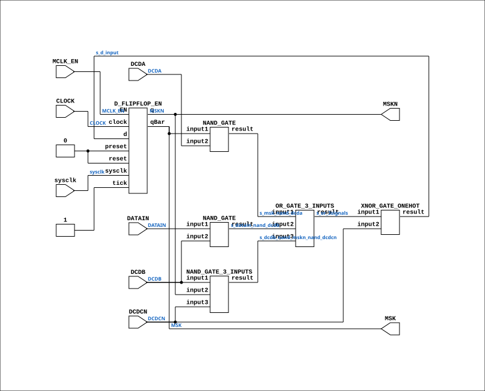

# CGA_INTR_CNTLR_IRQ_MASK_MASKBIT

Source: `Verilog/DELILAH-CPU/CGA_INTR/circuit/CGA_INTR_CNTLR_IRQ_MASK_MASKBIT.v`

<!-- Generated by Verilog/tests/module_doc.py from the //! comments in the source. Do not edit by hand - edit the RTL comments and regenerate. -->

<!-- HIERARCHY-NAV:BEGIN - written by Verilog/tests/gen_hierarchy.py, do not edit -->

**Where it sits** (Simulation): [ND120_TOP](../../../../doc/ND120_TOP.md) > [ND120_CORE](../../../../doc/ND120_CORE.md) > [ND3202D](../../../../CPU-BOARD-3202/circuit/doc/ND3202D.md) > [CPU_15](../../../../CPU-BOARD-3202/circuit/doc/CPU_15.md) > [CPU_PROC_32](../../../../CPU-BOARD-3202/circuit/doc/CPU_PROC_32.md) > [CPU_PROC_CGA_33](../../../../CPU-BOARD-3202/circuit/doc/CPU_PROC_CGA_33.md) > [CGA](../../../CGA/circuit/doc/CGA.md) > [CGA_INTR](CGA_INTR.md) > [CGA_INTR_CNTLR](CGA_INTR_CNTLR.md) > [CGA_INTR_CNTLR_IRQ](CGA_INTR_CNTLR_IRQ.md) > [CGA_INTR_CNTLR_IRQ_MASK](CGA_INTR_CNTLR_IRQ_MASK.md) > **CGA_INTR_CNTLR_IRQ_MASK_MASKBIT**
- instance path: `CORE.CPU_BOARD.CPU.PROC.CGA.DELILAH.INTR.CNTLR.IRQ.IRQ_MASK.MASKBIT15`

**Used in:** [CGA_INTR_CNTLR_IRQ_MASK](CGA_INTR_CNTLR_IRQ_MASK.md) (all tops)

**Contains:** [D_FLIPFLOP_EN](../../../../Shared/ndlib/doc/D_FLIPFLOP_EN.md), [NAND_GATE](../../../../Shared/logisim/doc/NAND_GATE.md) x2, [NAND_GATE_3_INPUTS](../../../../Shared/logisim/doc/NAND_GATE_3_INPUTS.md), [OR_GATE_3_INPUTS](../../../../Shared/logisim/doc/OR_GATE_3_INPUTS.md), [XNOR_GATE_ONEHOT](../../../../Shared/logisim/doc/XNOR_GATE_ONEHOT.md)

[Module hierarchy](../../../../HIERARCHY.md) - [All modules](../../../../MODULES.md)

<!-- HIERARCHY-NAV:END -->


<!-- SCHEMATIC:BEGIN - written by Verilog/tests/gen_schematics.py, do not edit -->

## Schematic

Drawn from the Verilog: the yosys netlist of the Simulation (Verilator) build, instance `CORE.CPU_BOARD.CPU.PROC.CGA.DELILAH.INTR.CNTLR.IRQ.IRQ_MASK.MASKBIT15`. Sub-modules are boxes (click the picture to open it full size; there every sub-module box links to its page, and every wire shows its Verilog name).

[](CGA_INTR_CNTLR_IRQ_MASK_MASKBIT.svg)

<!-- SCHEMATIC:END -->

## Description

ND120 CGA (CPU Gate Array / DELILAH)
/CGA/INTR/CNTLR/IRQ/MASK/MASKBIT
IRQ MASK BIT
Page 80
SHEET 1 of 1
Last reviewed: 10-NOV-2024
Ronny Hansen

## Ports

| Direction | Width | Name | Description |
|---|---|---|---|
| input | `1` | `sysclk` | FPGA system clock (P2: MCLK_EN capture) |
| input | `1` | `MCLK_EN` | MCLK clock-enable pulse (FPGA_FF_MODE, else 0) |
| input | `1` | `CLOCK` | Master Clock (from CGA_INTR.MCLK) |
| input | `1` | `DATAIN` |  |
| input | `1` | `DCDA` |  |
| input | `1` | `DCDB` |  |
| input | `1` | `DCDCN` |  |
| output | `1` | `MSK` |  |
| output | `1` | `MSKN` |  |

## Verilog source

[`Verilog/DELILAH-CPU/CGA_INTR/circuit/CGA_INTR_CNTLR_IRQ_MASK_MASKBIT.v`](https://github.com/RetroCoreLabs/nd-120/blob/main/Verilog/DELILAH-CPU/CGA_INTR/circuit/CGA_INTR_CNTLR_IRQ_MASK_MASKBIT.v) on GitHub.

<details markdown="1">
<summary>Show the Verilog of CGA_INTR_CNTLR_IRQ_MASK_MASKBIT (132 lines)</summary>

```verilog
/**************************************************************************
** ND120 CGA (CPU Gate Array / DELILAH)                                  **
** /CGA/INTR/CNTLR/IRQ/MASK/MASKBIT                                      **
** IRQ MASK BIT                                                          **
**                                                                       **
** Page 80                                                               **
** SHEET 1 of 1                                                          **
**                                                                       **
** Last reviewed: 10-NOV-2024                                            **
** Ronny Hansen                                                          **
***************************************************************************/

module CGA_INTR_CNTLR_IRQ_MASK_MASKBIT (
    input sysclk,   //! FPGA system clock (P2: MCLK_EN capture)
    input MCLK_EN,  //! MCLK clock-enable pulse (FPGA_FF_MODE, else 0)

    input CLOCK,    //! Master Clock (from CGA_INTR.MCLK)
    input DATAIN,
    input DCDA,
    input DCDB,
    input DCDCN,

    output MSK,
    output MSKN
);

  /*******************************************************************************
   ** The wires are defined here                                                 **
   *******************************************************************************/
  wire s_dcdc_n;
  wire s_msk_n_out;
  wire s_datain;
  wire s_datain_nand_dcdb;
  wire s_or_3signals;
  wire s_msk_nand_dcda;
  wire s_clock;
  wire s_dcdb_nand_mskn_nand_dcdcn;
  wire s_msk_out;
  wire s_dcdb;
  wire s_d_input;
  wire s_dcda;

  /*******************************************************************************
   ** The module functionality is described here                                 **
   *******************************************************************************/

  /*******************************************************************************
   ** Here all input connections are defined                                     **
   *******************************************************************************/
  assign s_dcdc_n = DCDCN;
  assign s_datain = DATAIN;
  assign s_clock = CLOCK;
  assign s_dcdb = DCDB;
  assign s_dcda = DCDA;

  // P2 (docs/plan-fix-unconstrained-clocks.md): in FF mode the MCLK-
  // clocked registers capture on posedge sysclk gated by MCLK_EN
  // (aligned to the MCLK rise) instead of clocking on the routed net.
`ifdef FPGA_FF_MODE
  localparam MCLK_CE = 1;
`else
  localparam MCLK_CE = 0;
`endif

  /*******************************************************************************
   ** Here all output connections are defined                                    **
   *******************************************************************************/
  assign MSK = s_msk_out;
  assign MSKN = s_msk_n_out;

  /*******************************************************************************
   ** Here all normal components are defined                                     **
   *******************************************************************************/
  NAND_GATE #(
      .BubblesMask(2'b00)
  ) GATES_1 (
      .input1(s_msk_out),
      .input2(s_dcda),
      .result(s_msk_nand_dcda)
  );

  NAND_GATE #(
      .BubblesMask(2'b00)
  ) GATES_2 (
      .input1(s_datain),
      .input2(s_dcdb),
      .result(s_datain_nand_dcdb)
  );

  NAND_GATE_3_INPUTS #(
      .BubblesMask(3'b000)
  ) GATES_3 (
      .input1(s_dcdb),
      .input2(s_msk_n_out),
      .input3(s_dcdc_n),
      .result(s_dcdb_nand_mskn_nand_dcdcn)
  );

  OR_GATE_3_INPUTS #(
      .BubblesMask(3'b111)
  ) GATES_4 (
      .input1(s_msk_nand_dcda),
      .input2(s_datain_nand_dcdb),
      .input3(s_dcdb_nand_mskn_nand_dcdcn),
      .result(s_or_3signals)
  );

  XNOR_GATE_ONEHOT #(
      .BubblesMask(2'b00)
  ) GATES_5 (
      .input1(s_or_3signals),
      .input2(s_dcdc_n),
      .result(s_d_input)
  );

  // CLOCK resolves to MCLK (CGA_INTR.MCLK, rising edge) - MCLK domain
  D_FLIPFLOP_EN #(
      .USE_ENABLE(MCLK_CE)
  ) MEMORY_6 (
      .sysclk(sysclk),
      .EN(MCLK_EN),
      .clock(s_clock),
      .d(s_d_input),
      .preset(1'b0),
      .q(s_msk_n_out),
      .qBar(s_msk_out),
      .reset(1'b0),
      .tick(1'b1)
  );


endmodule
```

</details>
