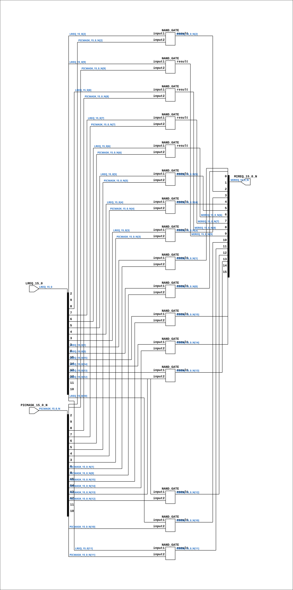

# CGA_INTR_CNTLR_IRQ_MREQ

Source: `Verilog/DELILAH-CPU/CGA_INTR/circuit/CGA_INTR_CNTLR_IRQ_MREQ.v`

<!-- Generated by Verilog/tests/module_doc.py from the //! comments in the source. Do not edit by hand - edit the RTL comments and regenerate. -->

<!-- HIERARCHY-NAV:BEGIN - written by Verilog/tests/gen_hierarchy.py, do not edit -->

**Where it sits** (Simulation): [ND120_TOP](../../../../doc/ND120_TOP.md) > [ND120_CORE](../../../../doc/ND120_CORE.md) > [ND3202D](../../../../CPU-BOARD-3202/circuit/doc/ND3202D.md) > [CPU_15](../../../../CPU-BOARD-3202/circuit/doc/CPU_15.md) > [CPU_PROC_32](../../../../CPU-BOARD-3202/circuit/doc/CPU_PROC_32.md) > [CPU_PROC_CGA_33](../../../../CPU-BOARD-3202/circuit/doc/CPU_PROC_CGA_33.md) > [CGA](../../../CGA/circuit/doc/CGA.md) > [CGA_INTR](CGA_INTR.md) > [CGA_INTR_CNTLR](CGA_INTR_CNTLR.md) > [CGA_INTR_CNTLR_IRQ](CGA_INTR_CNTLR_IRQ.md) > **CGA_INTR_CNTLR_IRQ_MREQ**
- instance path: `CORE.CPU_BOARD.CPU.PROC.CGA.DELILAH.INTR.CNTLR.IRQ.IRQ_MREQ`

**Used in:** [CGA_INTR_CNTLR_IRQ](CGA_INTR_CNTLR_IRQ.md) (all tops)

**Contains:** [NAND_GATE](../../../../Shared/logisim/doc/NAND_GATE.md) x16

[Module hierarchy](../../../../HIERARCHY.md) - [All modules](../../../../MODULES.md)

<!-- HIERARCHY-NAV:END -->


<!-- SCHEMATIC:BEGIN - written by Verilog/tests/gen_schematics.py, do not edit -->

## Schematic

Drawn from the Verilog: the yosys netlist of the Simulation (Verilator) build, instance `CORE.CPU_BOARD.CPU.PROC.CGA.DELILAH.INTR.CNTLR.IRQ.IRQ_MREQ`. Sub-modules are boxes (click the picture to open it full size; there every sub-module box links to its page, and every wire shows its Verilog name).

[](CGA_INTR_CNTLR_IRQ_MREQ.svg)

<!-- SCHEMATIC:END -->

## Description

ND120 CGA (CPU Gate Array / DELILAH)
/CGA/INTR/CNTLR/IRQ/MREQ
MREQ
Page 81
SHEET 1 of 1
Last reviewed: 10-NOV-2024
Ronny Hansen

## Ports

| Direction | Width | Name | Description |
|---|---|---|---|
| input | `[15:0]` | `LREQ_15_0` |  |
| input | `[15:0]` | `PICMASK_15_0_N` *(active low)* |  |
| output | `[15:0]` | `MIREQ_15_0_N` *(active low)* |  |

## Verilog source

[`Verilog/DELILAH-CPU/CGA_INTR/circuit/CGA_INTR_CNTLR_IRQ_MREQ.v`](https://github.com/RetroCoreLabs/nd-120/blob/main/Verilog/DELILAH-CPU/CGA_INTR/circuit/CGA_INTR_CNTLR_IRQ_MREQ.v) on GitHub.

<details markdown="1">
<summary>Show the Verilog of CGA_INTR_CNTLR_IRQ_MREQ (173 lines)</summary>

```verilog

/**************************************************************************
** ND120 CGA (CPU Gate Array / DELILAH)                                  **
** /CGA/INTR/CNTLR/IRQ/MREQ                                              **
** MREQ                                                                  **
**                                                                       **
** Page 81                                                               **
** SHEET 1 of 1                                                          **
**                                                                       **
** Last reviewed: 10-NOV-2024                                            **
** Ronny Hansen                                                          **
**************************************************************************/

module CGA_INTR_CNTLR_IRQ_MREQ (
    input [15:0] LREQ_15_0,
    input [15:0] PICMASK_15_0_N,

    output [15:0] MIREQ_15_0_N
);

  /*******************************************************************************
   ** The wires are defined here                                                 **
   *******************************************************************************/
  wire [15:0] s_picmask_15_0_n;
  wire [15:0] s_lreq_15_0;
  wire [15:0] s_mireq_15_0_n_out;

  /*******************************************************************************
   ** Here all input connections are defined                                     **
   *******************************************************************************/
  assign s_picmask_15_0_n[15:0] = PICMASK_15_0_N;
  assign s_lreq_15_0[15:0] = LREQ_15_0;

  /*******************************************************************************
   ** Here all output connections are defined                                    **
   *******************************************************************************/
  assign MIREQ_15_0_N = s_mireq_15_0_n_out[15:0];

  /*******************************************************************************
   ** Here all normal components are defined                                     **
   *******************************************************************************/

  NAND_GATE #(
      .BubblesMask(2'b00)
  ) GATES_4 (
      .input1(s_lreq_15_0[15]),
      .input2(s_picmask_15_0_n[15]),
      .result(s_mireq_15_0_n_out[15])
  );

  NAND_GATE #(
      .BubblesMask(2'b00)
  ) GATES_5 (
      .input1(s_lreq_15_0[14]),
      .input2(s_picmask_15_0_n[14]),
      .result(s_mireq_15_0_n_out[14])
  );

  NAND_GATE #(
      .BubblesMask(2'b00)
  ) GATES_6 (
      .input1(s_lreq_15_0[13]),
      .input2(s_picmask_15_0_n[13]),
      .result(s_mireq_15_0_n_out[13])
  );

  NAND_GATE #(
      .BubblesMask(2'b00)
  ) GATES_7 (
      .input1(s_lreq_15_0[12]),
      .input2(s_picmask_15_0_n[12]),
      .result(s_mireq_15_0_n_out[12])
  );

  NAND_GATE #(
      .BubblesMask(2'b00)
  ) GATES_8 (
      .input1(s_lreq_15_0[11]),
      .input2(s_picmask_15_0_n[11]),
      .result(s_mireq_15_0_n_out[11])
  );

  NAND_GATE #(
      .BubblesMask(2'b00)
  ) GATES_9 (
      .input1(s_lreq_15_0[10]),
      .input2(s_picmask_15_0_n[10]),
      .result(s_mireq_15_0_n_out[10])
  );

  NAND_GATE #(
      .BubblesMask(2'b00)
  ) GATES_10 (
      .input1(s_lreq_15_0[9]),
      .input2(s_picmask_15_0_n[9]),
      .result(s_mireq_15_0_n_out[9])
  );

  NAND_GATE #(
      .BubblesMask(2'b00)
  ) GATES_11 (
      .input1(s_lreq_15_0[8]),
      .input2(s_picmask_15_0_n[8]),
      .result(s_mireq_15_0_n_out[8])
  );

  NAND_GATE #(
      .BubblesMask(2'b00)
  ) GATES_12 (
      .input1(s_lreq_15_0[7]),
      .input2(s_picmask_15_0_n[7]),
      .result(s_mireq_15_0_n_out[7])
  );

  NAND_GATE #(
      .BubblesMask(2'b00)
  ) GATES_13 (
      .input1(s_lreq_15_0[6]),
      .input2(s_picmask_15_0_n[6]),
      .result(s_mireq_15_0_n_out[6])
  );

  NAND_GATE #(
      .BubblesMask(2'b00)
  ) GATES_14 (
      .input1(s_lreq_15_0[5]),
      .input2(s_picmask_15_0_n[5]),
      .result(s_mireq_15_0_n_out[5])
  );

  NAND_GATE #(
      .BubblesMask(2'b00)
  ) GATES_15 (
      .input1(s_lreq_15_0[4]),
      .input2(s_picmask_15_0_n[4]),
      .result(s_mireq_15_0_n_out[4])
  );

  NAND_GATE #(
      .BubblesMask(2'b00)
  ) GATES_16 (
      .input1(s_lreq_15_0[3]),
      .input2(s_picmask_15_0_n[3]),
      .result(s_mireq_15_0_n_out[3])
  );

  NAND_GATE #(
      .BubblesMask(2'b00)
  ) GATES_1 (
      .input1(s_lreq_15_0[2]),
      .input2(s_picmask_15_0_n[2]),
      .result(s_mireq_15_0_n_out[2])
  );

  NAND_GATE #(
      .BubblesMask(2'b00)
  ) GATES_2 (
      .input1(s_lreq_15_0[1]),
      .input2(s_picmask_15_0_n[1]),
      .result(s_mireq_15_0_n_out[1])
  );

  NAND_GATE #(
      .BubblesMask(2'b00)
  ) GATES_3 (
      .input1(s_lreq_15_0[0]),
      .input2(s_picmask_15_0_n[0]),
      .result(s_mireq_15_0_n_out[0])
  );


endmodule
```

</details>
