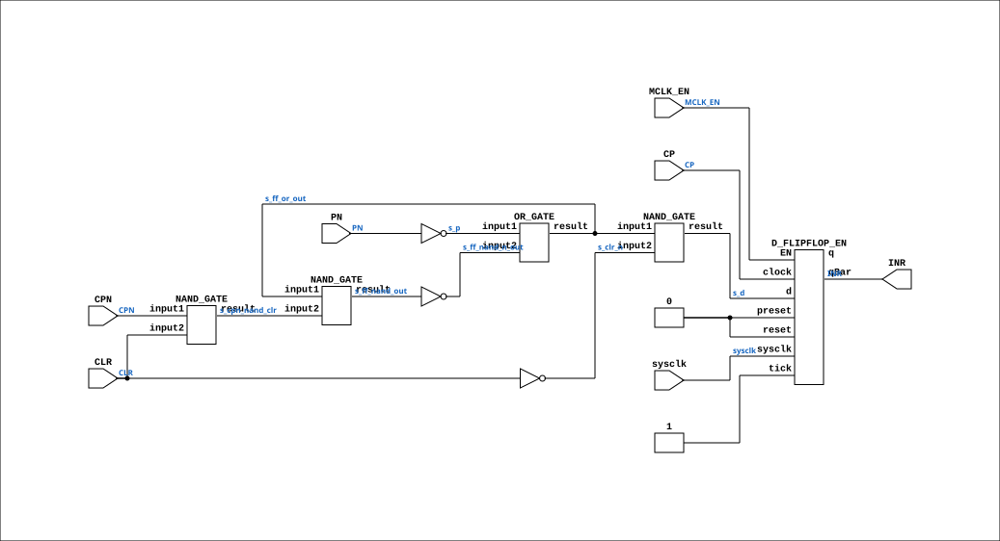

# CGA_INTR_CNTLR_IRQ_REG_RQBIT

Source: `Verilog/DELILAH-CPU/CGA_INTR/circuit/CGA_INTR_CNTLR_IRQ_REG_RQBIT.v`

<!-- Generated by Verilog/tests/module_doc.py from the //! comments in the source. Do not edit by hand - edit the RTL comments and regenerate. -->

<!-- HIERARCHY-NAV:BEGIN - written by Verilog/tests/gen_hierarchy.py, do not edit -->

**Hierarchy:** not instantiated by any of the 9 build tops (elaborated by yosys).

[Module hierarchy](../../../../HIERARCHY.md) - [All modules](../../../../MODULES.md)

<!-- HIERARCHY-NAV:END -->


<!-- SCHEMATIC:BEGIN - written by Verilog/tests/gen_schematics.py, do not edit -->

## Schematic

Drawn from the Verilog: no build top uses this module, so it was elaborated from its own file with no defines and default parameters. Sub-modules are boxes (click the picture to open it full size; there every sub-module box links to its page, and every wire shows its Verilog name).

[](CGA_INTR_CNTLR_IRQ_REG_RQBIT.svg)

<!-- SCHEMATIC:END -->

## Description

ND120 CGA (CPU Gate Array / DELILAH)
/CGA/INTR/CNTLR/IRQ/REG/RQBIT
INTERRUPT CONTROLLER REGISTER Q BIT
Page 78
SHEET 1 of 1
Last reviewed: 10-NOV-2024
Ronny Hansen

## Ports

| Direction | Width | Name | Description |
|---|---|---|---|
| input | `1` | `sysclk` | FPGA system clock (P2: MCLK_EN capture) |
| input | `1` | `MCLK_EN` | MCLK clock-enable pulse (FPGA_FF_MODE, else 0) |
| input | `1` | `CLR` |  |
| input | `1` | `CP` |  |
| input | `1` | `CPN` |  |
| input | `1` | `PN` |  |
| output | `1` | `INR` |  |

## Verilog source

[`Verilog/DELILAH-CPU/CGA_INTR/circuit/CGA_INTR_CNTLR_IRQ_REG_RQBIT.v`](https://github.com/RetroCoreLabs/nd-120/blob/main/Verilog/DELILAH-CPU/CGA_INTR/circuit/CGA_INTR_CNTLR_IRQ_REG_RQBIT.v) on GitHub.

<details markdown="1">
<summary>Show the Verilog of CGA_INTR_CNTLR_IRQ_REG_RQBIT (132 lines)</summary>

```verilog
/**************************************************************************
** ND120 CGA (CPU Gate Array / DELILAH)                                  **
** /CGA/INTR/CNTLR/IRQ/REG/RQBIT                                         **
** INTERRUPT CONTROLLER REGISTER Q BIT                                   **
**                                                                       **
** Page 78                                                               **
** SHEET 1 of 1                                                          **
**                                                                       **
** Last reviewed: 10-NOV-2024                                            **
** Ronny Hansen                                                          **
***************************************************************************/

module CGA_INTR_CNTLR_IRQ_REG_RQBIT (
    input sysclk,   //! FPGA system clock (P2: MCLK_EN capture)
    input MCLK_EN,  //! MCLK clock-enable pulse (FPGA_FF_MODE, else 0)

    input CLR,
    input CP,
    input CPN,
    input PN,

    output INR
);

  /*******************************************************************************
   ** The wires are defined here                                                 **
   *******************************************************************************/
  wire s_clr_n;
  wire s_clr;
  wire s_cp_n;
  wire s_cp;
  wire s_cpn_nand_clr;
  wire s_d;
  wire s_ff_nand_n_out;
  wire s_ff_nand_out;
  wire s_ff_or_out;
  wire s_inr_out;
  wire s_p_n;
  wire s_p;

  /*******************************************************************************
   ** The module functionality is described here                                 **
   *******************************************************************************/

  /*******************************************************************************
   ** Here all input connections are defined                                     **
   *******************************************************************************/
  assign s_clr = CLR;
  assign s_cp = CP;

  // P2 (docs/plan-fix-unconstrained-clocks.md): in FF mode the MCLK-
  // clocked registers capture on posedge sysclk gated by MCLK_EN
  // (aligned to the MCLK rise) instead of clocking on the routed net.
`ifdef FPGA_FF_MODE
  localparam MCLK_CE = 1;
`else
  localparam MCLK_CE = 0;
`endif

  assign s_p_n = PN;
  assign s_cp_n = CPN;

  /*******************************************************************************
   ** Here all output connections are defined                                    **
   *******************************************************************************/
  assign INR = s_inr_out;

  /*******************************************************************************
   ** Here all in-lined components are defined                                   **
   *******************************************************************************/

  // NOT Gate
  assign s_clr_n = ~s_clr;

  // NOT Gate
  assign s_p = ~s_p_n;

  // NOT Gate
  assign s_ff_nand_n_out = ~s_ff_nand_out;

  /*******************************************************************************
   ** Here all normal components are defined                                     **
   *******************************************************************************/
  OR_GATE #(
      .BubblesMask(2'b00)
  ) GATES_1 (
      .input1(s_p),
      .input2(s_ff_nand_n_out),
      .result(s_ff_or_out)
  );

  NAND_GATE #(
      .BubblesMask(2'b00)
  ) GATES_2 (
      .input1(s_ff_or_out),
      .input2(s_cpn_nand_clr),
      .result(s_ff_nand_out)
  );

  NAND_GATE #(
      .BubblesMask(2'b00)
  ) GATES_3 (
      .input1(s_ff_or_out),
      .input2(s_clr_n),
      .result(s_d)
  );

  NAND_GATE #(
      .BubblesMask(2'b00)
  ) GATES_4 (
      .input1(s_cp_n),
      .input2(s_clr),
      .result(s_cpn_nand_clr)
  );

  // CP resolves to MCLK (CGA_INTR.MCLK, rising edge) - MCLK domain
  D_FLIPFLOP_EN #(
      .USE_ENABLE(MCLK_CE)
  ) MEMORY_5 (
      .sysclk(sysclk),
      .EN(MCLK_EN),
      .clock(s_cp),
      .d(s_d),
      .preset(1'b0),
      .q(),
      .qBar(s_inr_out),
      .reset(1'b0),
      .tick(1'b1)
  );


endmodule
```

</details>
