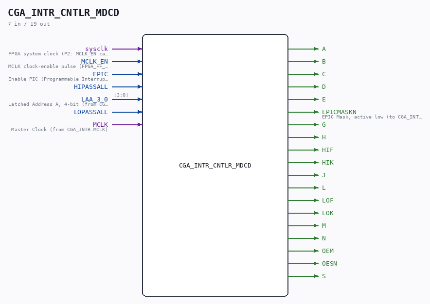
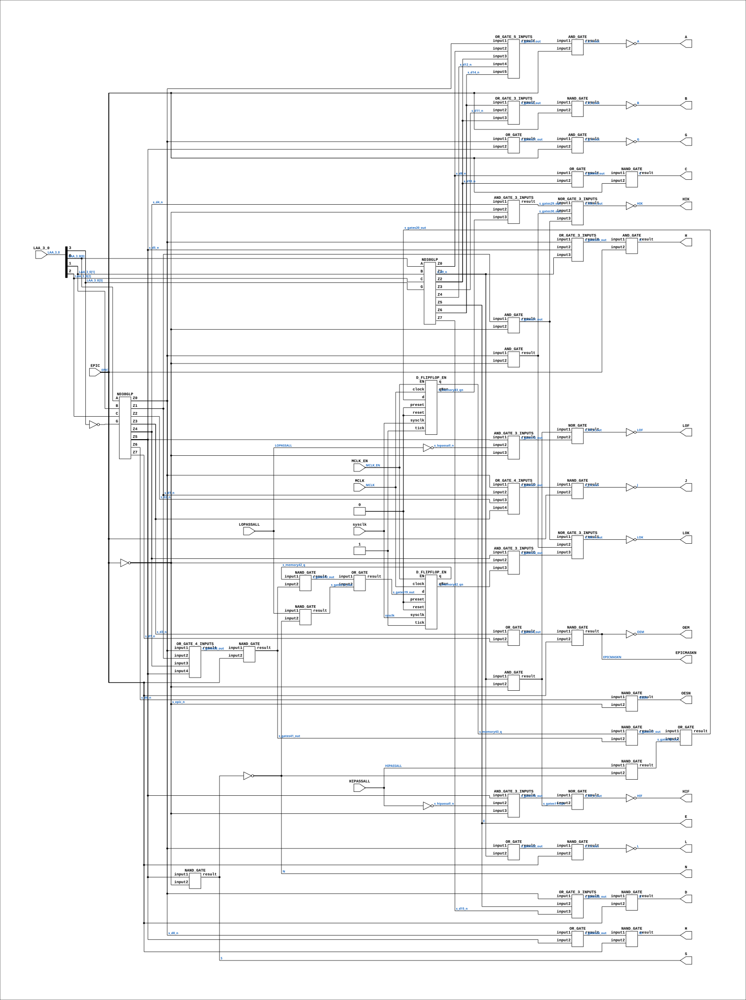

# CGA_INTR_CNTLR_MDCD

Source: `Verilog/DELILAH-CPU/CGA_INTR/circuit/CGA_INTR_CNTLR_MDCD.v`

<!-- Generated by Verilog/tests/module_doc.py from the //! comments in the source. Do not edit by hand - edit the RTL comments and regenerate. -->

<!-- HIERARCHY-NAV:BEGIN - written by Verilog/tests/gen_hierarchy.py, do not edit -->

**Where it sits** (Simulation): [ND120_TOP](../../../../doc/ND120_TOP.md) > [ND120_CORE](../../../../doc/ND120_CORE.md) > [ND3202D](../../../../CPU-BOARD-3202/circuit/doc/ND3202D.md) > [CPU_15](../../../../CPU-BOARD-3202/circuit/doc/CPU_15.md) > [CPU_PROC_32](../../../../CPU-BOARD-3202/circuit/doc/CPU_PROC_32.md) > [CPU_PROC_CGA_33](../../../../CPU-BOARD-3202/circuit/doc/CPU_PROC_CGA_33.md) > [CGA](../../../CGA/circuit/doc/CGA.md) > [CGA_INTR](CGA_INTR.md) > [CGA_INTR_CNTLR](CGA_INTR_CNTLR.md) > **CGA_INTR_CNTLR_MDCD**
- instance path: `CORE.CPU_BOARD.CPU.PROC.CGA.DELILAH.INTR.CNTLR.MDCD`

**Used in:** [CGA_INTR_CNTLR](CGA_INTR_CNTLR.md) (all tops)

**Contains:** [AND_GATE](../../../../Shared/logisim/doc/AND_GATE.md) x6, [AND_GATE_3_INPUTS](../../../../Shared/logisim/doc/AND_GATE_3_INPUTS.md) x4, [D_FLIPFLOP_EN](../../../../Shared/ndlib/doc/D_FLIPFLOP_EN.md) x2, [NAND_GATE](../../../../Shared/logisim/doc/NAND_GATE.md) x14, [ND38GLP](../../../../Shared/ndlib/doc/ND38GLP.md) x2, [NOR_GATE](../../../../Shared/logisim/doc/NOR_GATE.md) x2, [NOR_GATE_3_INPUTS](../../../../Shared/logisim/doc/NOR_GATE_3_INPUTS.md) x2, [OR_GATE](../../../../Shared/logisim/doc/OR_GATE.md) x7, [OR_GATE_3_INPUTS](../../../../Shared/logisim/doc/OR_GATE_3_INPUTS.md) x3, [OR_GATE_4_INPUTS](../../../../Shared/logisim/doc/OR_GATE_4_INPUTS.md) x2, [OR_GATE_5_INPUTS](../../../../Shared/logisim/doc/OR_GATE_5_INPUTS.md)

[Module hierarchy](../../../../HIERARCHY.md) - [All modules](../../../../MODULES.md)

<!-- HIERARCHY-NAV:END -->



<!-- SCHEMATIC:BEGIN - written by Verilog/tests/gen_schematics.py, do not edit -->

## Schematic

Drawn from the Verilog: the yosys netlist of the Simulation (Verilator) build, instance `CORE.CPU_BOARD.CPU.PROC.CGA.DELILAH.INTR.CNTLR.MDCD`. Sub-modules are boxes (click the picture to open it full size; there every sub-module box links to its page, and every wire shows its Verilog name).

[](CGA_INTR_CNTLR_MDCD.svg)

<!-- SCHEMATIC:END -->

## Description

ND120 CGA (CPU Gate Array / DELILAH)
/CGA/INTR/CNTLR/MDCD
MDCD
Page n
SHEET 1 of n
Last reviewed: 10-NOV-2024
Ronny Hansen

## Ports

| Direction | Width | Name | Description |
|---|---|---|---|
| input | `1` | `sysclk` | FPGA system clock (P2: MCLK_EN capture) |
| input | `1` | `MCLK_EN` | MCLK clock-enable pulse (FPGA_FF_MODE, else 0) |
| input | `1` | `EPIC` | Enable PIC (Programmable Interrupt Controller) signal (from CGA_INTR.EPIC) |
| input | `1` | `HIPASSALL` |  |
| input | `[3:0]` | `LAA_3_0` | Latched Address A, 4-bit (from CGA_INTR.LAA_3_0) |
| input | `1` | `LOPASSALL` |  |
| input | `1` | `MCLK` | Master Clock (from CGA_INTR.MCLK) |
| output | `1` | `A` |  |
| output | `1` | `B` |  |
| output | `1` | `C` |  |
| output | `1` | `D` |  |
| output | `1` | `E` |  |
| output | `1` | `EPICMASKN` | EPIC Mask, active low (to CGA_INTR.EPICMASKN) |
| output | `1` | `G` |  |
| output | `1` | `H` |  |
| output | `1` | `HIF` |  |
| output | `1` | `HIK` |  |
| output | `1` | `J` |  |
| output | `1` | `L` |  |
| output | `1` | `LOF` |  |
| output | `1` | `LOK` |  |
| output | `1` | `M` |  |
| output | `1` | `N` |  |
| output | `1` | `OEM` |  |
| output | `1` | `OESN` |  |
| output | `1` | `S` |  |

## Verilog source

[`Verilog/DELILAH-CPU/CGA_INTR/circuit/CGA_INTR_CNTLR_MDCD.v`](https://github.com/RetroCoreLabs/nd-120/blob/main/Verilog/DELILAH-CPU/CGA_INTR/circuit/CGA_INTR_CNTLR_MDCD.v) on GitHub.

<details markdown="1">
<summary>Show the Verilog of CGA_INTR_CNTLR_MDCD (609 lines)</summary>

```verilog
/**************************************************************************
** ND120 CGA (CPU Gate Array / DELILAH)                                  **
** /CGA/INTR/CNTLR/MDCD                                                  **
** MDCD                                                                  **
**                                                                       **
** Page n                                                                **
** SHEET 1 of n                                                          **
**                                                                       **
** Last reviewed: 10-NOV-2024                                            **
** Ronny Hansen                                                          **
***************************************************************************/

module CGA_INTR_CNTLR_MDCD (
    input       sysclk,   //! FPGA system clock (P2: MCLK_EN capture)
    input       MCLK_EN,  //! MCLK clock-enable pulse (FPGA_FF_MODE, else 0)

    input       EPIC,     //! Enable PIC (Programmable Interrupt Controller) signal (from CGA_INTR.EPIC)
    input       HIPASSALL,
    input [3:0] LAA_3_0,  //! Latched Address A, 4-bit (from CGA_INTR.LAA_3_0)
    input       LOPASSALL,
    input       MCLK,     //! Master Clock (from CGA_INTR.MCLK)

    output A,
    output B,
    output C,
    output D,
    output E,
    output EPICMASKN,     //! EPIC Mask, active low (to CGA_INTR.EPICMASKN)
    output G,
    output H,
    output HIF,
    output HIK,
    output J,
    output L,
    output LOF,
    output LOK,
    output M,
    output N,
    output OEM,
    output OESN,
    output S
);

  /*******************************************************************************
   ** The wires are defined here                                                 **
   *******************************************************************************/
  wire [3:0] s_laa_3_0;
  wire       s_a_n_out;
  wire       s_a_out;
  wire       s_b_n_out;
  wire       s_b_out;
  wire       s_c_out;
  wire       s_d_out;
  wire       s_d0_n;
  wire       s_d1_n;
  wire       s_d10_n;
  wire       s_d11_n;
  wire       s_d12_n;
  wire       s_d13_n;
  wire       s_d14_n;
  wire       s_d15_n;
  wire       s_d2_n;
  wire       s_d3_n;
  wire       s_d4_n;
  wire       s_d5_n;
  wire       s_d6_n;
  wire       s_d7_n;
  wire       s_d8_n;
  wire       s_d9_n;
  wire       s_e_out;
  wire       s_epic_n;
  wire       s_epic;
  wire       s_epicmask_n_out;
  wire       s_g_n_out;
  wire       s_g_out;
  wire       s_gates1_out;
  wire       s_gates10_out;
  wire       s_gates11_out;
  wire       s_gates12_out;
  wire       s_gates13_out;
  wire       s_gates14_out;
  wire       s_gates17_out;
  wire       s_gates18_out;
  wire       s_gates19_out;
  wire       s_gates2_out;
  wire       s_gates20_out;
  wire       s_gates21_out;
  wire       s_gates22_out;
  wire       s_gates23_out;
  wire       s_gates27_out;
  wire       s_gates29_out;
  wire       s_gates3_out;
  wire       s_gates30_out;
  wire       s_gates31_out;
  wire       s_gates32_out;
  wire       s_gates35_out;
  wire       s_gates38_out;
  wire       s_gates39_out;
  wire       s_gates4_out;
  wire       s_gates41_out;
  wire       s_h_out;
  wire       s_hif_n_out;
  wire       s_hif_out;
  wire       s_hik_n_out;
  wire       s_hik_out;
  wire       s_hipassall_n;
  wire       s_hipassall;
  wire       s_j_n_out;
  wire       s_j_out;
  wire       s_l_n_out;
  wire       s_l_out;
  wire       s_lof_n_out;
  wire       s_lof_out;
  wire       s_lok_n_out;
  wire       s_lok_out;
  wire       s_lopassall_n;
  wire       s_lopassall;
  wire       s_m_out;
  wire       s_mclk;
  wire       s_memory42_q;
  wire       s_memory42_qn;
  wire       s_memory43_q;
  wire       s_memory43_qn;
  wire       s_n_out;
  wire       s_oem_out;
  wire       s_oes_n_out;
  wire       s_s_out;

  /*******************************************************************************
   ** Here all input connections are defined                                     **
   *******************************************************************************/
  assign s_laa_3_0[3:0] = LAA_3_0;

  assign s_epic         = EPIC;
  assign s_hipassall    = HIPASSALL;
  assign s_lopassall    = LOPASSALL;
  assign s_mclk         = MCLK;

  // P2 (docs/plan-fix-unconstrained-clocks.md): in FF mode the MCLK-
  // clocked registers capture on posedge sysclk gated by MCLK_EN
  // (aligned to the MCLK rise) instead of clocking on the routed net.
`ifdef FPGA_FF_MODE
  localparam MCLK_CE = 1;
`else
  localparam MCLK_CE = 0;
`endif

  /*******************************************************************************
   ** Here all output connections are defined                                    **
   *******************************************************************************/
  assign A              = s_a_out;
  assign B              = s_b_out;
  assign C              = s_c_out;
  assign D              = s_d_out;
  assign E              = s_e_out;
  assign EPICMASKN      = s_epicmask_n_out;
  assign G              = s_g_out;
  assign H              = s_h_out;
  assign HIF            = s_hif_out;
  assign HIK            = s_hik_out;
  assign J              = s_j_out;
  assign L              = s_l_out;
  assign LOF            = s_lof_out;
  assign LOK            = s_lok_out;
  assign M              = s_m_out;
  assign N              = s_n_out;
  assign OEM            = s_oem_out;
  assign OESN           = s_oes_n_out;
  assign S              = s_s_out;

  /*******************************************************************************
   ** Here all in-lined components are defined                                   **
   *******************************************************************************/

  // NOT Gate
  assign s_a_out        = ~s_a_n_out;
  assign s_b_out        = ~s_b_n_out;
  assign s_e_out        = s_d13_n;
  assign s_epic_n       = ~s_epic;
  assign s_g_out        = ~s_g_n_out;
  assign s_hif_out      = ~s_hif_n_out;
  assign s_hik_out      = ~s_hik_n_out;
  assign s_hipassall_n  = ~s_hipassall;
  assign s_j_out        = ~s_j_n_out;
  assign s_l_out        = ~s_l_n_out;
  assign s_lof_out      = ~s_lof_n_out;
  assign s_lok_out      = ~s_lok_n_out;
  assign s_lopassall_n  = ~s_lopassall;
  assign s_n_out        = ~s_s_out;
  assign s_oem_out      = ~s_epicmask_n_out;


  /*******************************************************************************
   ** Here all normal components are defined                                     **
   *******************************************************************************/
  OR_GATE_5_INPUTS #(
      .BubblesMask({1'b1, 4'hF})
  ) GATES_1 (
      .input1(s_d0_n),
      .input2(s_d8_n),
      .input3(s_d10_n),
      .input4(s_d12_n),
      .input5(s_d14_n),
      .result(s_gates1_out)
  );

  OR_GATE_3_INPUTS #(
      .BubblesMask(3'b111)
  ) GATES_2 (
      .input1(s_d14_n),
      .input2(s_d11_n),
      .input3(s_d10_n),
      .result(s_gates2_out)
  );

  OR_GATE #(
      .BubblesMask(2'b11)
  ) GATES_3 (
      .input1(s_d8_n),
      .input2(s_d10_n),
      .result(s_gates3_out)
  );

  OR_GATE #(
      .BubblesMask(2'b11)
  ) GATES_4 (
      .input1(s_d3_n),
      .input2(s_d7_n),
      .result(s_gates4_out)
  );

  AND_GATE #(
      .BubblesMask(2'b00)
  ) GATES_5 (
      .input1(s_gates1_out),
      .input2(s_epic),
      .result(s_a_n_out)
  );

  NAND_GATE #(
      .BubblesMask(2'b00)
  ) GATES_6 (
      .input1(s_gates3_out),
      .input2(s_epic),
      .result(s_c_out)
  );

  NAND_GATE #(
      .BubblesMask(2'b00)
  ) GATES_7 (
      .input1(s_gates4_out),
      .input2(s_epic),
      .result(s_epicmask_n_out)
  );

  NAND_GATE #(
      .BubblesMask(2'b00)
  ) GATES_8 (
      .input1(s_gates2_out),
      .input2(s_epic),
      .result(s_b_n_out)
  );

  NAND_GATE #(
      .BubblesMask(2'b11)
  ) GATES_9 (
      .input1(s_d6_n),
      .input2(s_epic_n),
      .result(s_oes_n_out)
  );

  AND_GATE_3_INPUTS #(
      .BubblesMask(3'b111)
  ) GATES_10 (
      .input1(s_d5_n),
      .input2(s_hipassall_n),
      .input3(s_epic_n),
      .result(s_gates10_out)
  );

  AND_GATE #(
      .BubblesMask(2'b11)
  ) GATES_11 (
      .input1(s_d9_n),
      .input2(s_epic_n),
      .result(s_gates11_out)
  );

  AND_GATE_3_INPUTS #(
      .BubblesMask(3'b111)
  ) GATES_12 (
      .input1(s_d5_n),
      .input2(s_lopassall_n),
      .input3(s_epic_n),
      .result(s_gates12_out)
  );

  NAND_GATE #(
      .BubblesMask(2'b00)
  ) GATES_13 (
      .input1(s_memory42_q),
      .input2(s_gates41_out),
      .result(s_gates13_out)
  );

  NAND_GATE #(
      .BubblesMask(2'b00)
  ) GATES_14 (
      .input1(s_lopassall),
      .input2(s_n_out),
      .result(s_gates14_out)
  );

  NOR_GATE #(
      .BubblesMask(2'b00)
  ) GATES_15 (
      .input1(s_gates10_out),
      .input2(s_gates11_out),
      .result(s_hif_n_out)
  );

  NOR_GATE #(
      .BubblesMask(2'b00)
  ) GATES_16 (
      .input1(s_gates11_out),
      .input2(s_gates12_out),
      .result(s_lof_n_out)
  );

  NAND_GATE #(
      .BubblesMask(2'b00)
  ) GATES_17 (
      .input1(s_memory43_q),
      .input2(s_gates41_out),
      .result(s_gates17_out)
  );

  NAND_GATE #(
      .BubblesMask(2'b00)
  ) GATES_18 (
      .input1(s_hipassall),
      .input2(s_n_out),
      .result(s_gates18_out)
  );

  OR_GATE #(
      .BubblesMask(2'b11)
  ) GATES_19 (
      .input1(s_gates13_out),
      .input2(s_gates14_out),
      .result(s_gates19_out)
  );

  OR_GATE #(
      .BubblesMask(2'b11)
  ) GATES_20 (
      .input1(s_gates17_out),
      .input2(s_gates18_out),
      .result(s_gates20_out)
  );

  OR_GATE #(
      .BubblesMask(2'b11)
  ) GATES_21 (
      .input1(s_d0_n),
      .input2(s_d5_n),
      .result(s_gates21_out)
  );

  OR_GATE #(
      .BubblesMask(2'b11)
  ) GATES_22 (
      .input1(s_d0_n),
      .input2(s_d9_n),
      .result(s_gates22_out)
  );

  OR_GATE #(
      .BubblesMask(2'b11)
  ) GATES_23 (
      .input1(s_d0_n),
      .input2(s_d5_n),
      .result(s_gates23_out)
  );

  AND_GATE #(
      .BubblesMask(2'b00)
  ) GATES_24 (
      .input1(s_gates21_out),
      .input2(s_epic),
      .result(s_g_n_out)
  );

  NAND_GATE #(
      .BubblesMask(2'b00)
  ) GATES_25 (
      .input1(s_gates22_out),
      .input2(s_epic),
      .result(s_l_n_out)
  );

  NAND_GATE #(
      .BubblesMask(2'b00)
  ) GATES_26 (
      .input1(s_gates23_out),
      .input2(s_epic),
      .result(s_m_out)
  );

  OR_GATE_4_INPUTS #(
      .BubblesMask(4'hF)
  ) GATES_27 (
      .input1(s_d0_n),
      .input2(s_d1_n),
      .input3(s_d2_n),
      .input4(s_d3_n),
      .result(s_gates27_out)
  );

  NAND_GATE #(
      .BubblesMask(2'b00)
  ) GATES_28 (
      .input1(s_gates27_out),
      .input2(s_epic),
      .result(s_j_n_out)
  );

  AND_GATE_3_INPUTS #(
      .BubblesMask(3'b111)
  ) GATES_29 (
      .input1(s_d4_n),
      .input2(s_epic_n),
      .input3(s_memory43_qn),
      .result(s_gates29_out)
  );

  AND_GATE #(
      .BubblesMask(2'b11)
  ) GATES_30 (
      .input1(s_d0_n),
      .input2(s_epic_n),
      .result(s_gates30_out)
  );

  AND_GATE #(
      .BubblesMask(2'b11)
  ) GATES_31 (
      .input1(s_d1_n),
      .input2(s_epic_n),
      .result(s_gates31_out)
  );

  AND_GATE_3_INPUTS #(
      .BubblesMask(3'b111)
  ) GATES_32 (
      .input1(s_d4_n),
      .input2(s_epic_n),
      .input3(s_memory42_qn),
      .result(s_gates32_out)
  );

  NOR_GATE_3_INPUTS #(
      .BubblesMask(3'b000)
  ) GATES_33 (
      .input1(s_gates29_out),
      .input2(s_gates30_out),
      .input3(s_gates31_out),
      .result(s_hik_n_out)
  );

  NOR_GATE_3_INPUTS #(
      .BubblesMask(3'b000)
  ) GATES_34 (
      .input1(s_gates31_out),
      .input2(s_gates30_out),
      .input3(s_gates32_out),
      .result(s_lok_n_out)
  );

  OR_GATE_3_INPUTS #(
      .BubblesMask(3'b111)
  ) GATES_35 (
      .input1(s_d0_n),
      .input2(s_d13_n),
      .input3(s_d15_n),
      .result(s_gates35_out)
  );

  NAND_GATE #(
      .BubblesMask(2'b00)
  ) GATES_36 (
      .input1(s_gates35_out),
      .input2(s_epic),
      .result(s_d_out)
  );

  NAND_GATE #(
      .BubblesMask(2'b11)
  ) GATES_37 (
      .input1(s_d5_n),
      .input2(s_epic_n),
      .result(s_s_out)
  );

  OR_GATE_4_INPUTS #(
      .BubblesMask(4'hF)
  ) GATES_38 (
      .input1(s_d0_n),
      .input2(s_d1_n),
      .input3(s_d4_n),
      .input4(s_d5_n),
      .result(s_gates38_out)
  );

  OR_GATE_3_INPUTS #(
      .BubblesMask(3'b111)
  ) GATES_39 (
      .input1(s_d0_n),
      .input2(s_d5_n),
      .input3(s_d9_n),
      .result(s_gates39_out)
  );

  AND_GATE #(
      .BubblesMask(2'b00)
  ) GATES_40 (
      .input1(s_gates39_out),
      .input2(s_epic),
      .result(s_h_out)
  );

  NAND_GATE #(
      .BubblesMask(2'b00)
  ) GATES_41 (
      .input1(s_gates38_out),
      .input2(s_epic),
      .result(s_gates41_out)
  );

  // MCLK domain (CGA_INTR.MCLK, rising edge)
  D_FLIPFLOP_EN #(
      .USE_ENABLE(MCLK_CE)
  ) MEMORY_42 (
      .sysclk(sysclk),
      .EN(MCLK_EN),
      .clock(s_mclk),
      .d(s_gates19_out),
      .preset(1'b0),
      .q(s_memory42_q),
      .qBar(s_memory42_qn),
      .reset(1'b0),
      .tick(1'b1)
  );

  // MCLK domain (CGA_INTR.MCLK, rising edge)
  D_FLIPFLOP_EN #(
      .USE_ENABLE(MCLK_CE)
  ) MEMORY_43 (
      .sysclk(sysclk),
      .EN(MCLK_EN),
      .clock(s_mclk),
      .d(s_gates20_out),
      .preset(1'b0),
      .q(s_memory43_q),
      .qBar(s_memory43_qn),
      .reset(1'b0),
      .tick(1'b1)
  );


  /*******************************************************************************
   ** Here all sub-circuits are defined                                          **
   *******************************************************************************/

  ND38GLP GLP_LO (
      .A(s_laa_3_0[0]),
      .B(s_laa_3_0[1]),
      .C(s_laa_3_0[2]),

      .G(~s_laa_3_0[3]),

      .Z0(s_d0_n),
      .Z1(s_d1_n),
      .Z2(s_d2_n),
      .Z3(s_d3_n),
      .Z4(s_d4_n),
      .Z5(s_d5_n),
      .Z6(s_d6_n),
      .Z7(s_d7_n)
  );

  ND38GLP GLP_HI (
      .A(s_laa_3_0[0]),
      .B(s_laa_3_0[1]),
      .C(s_laa_3_0[2]),

      .G(s_laa_3_0[3]),

      .Z0(s_d8_n),
      .Z1(s_d9_n),
      .Z2(s_d10_n),
      .Z3(s_d11_n),
      .Z4(s_d12_n),
      .Z5(s_d13_n),
      .Z6(s_d14_n),
      .Z7(s_d15_n)
  );

endmodule
```

</details>
