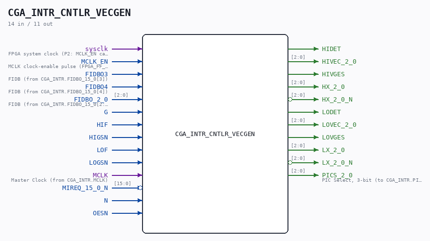
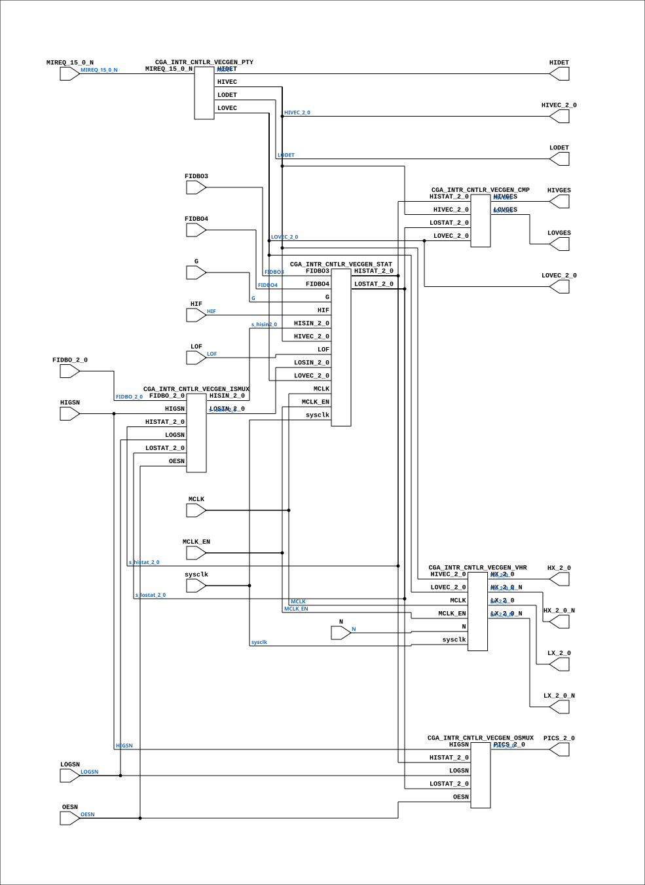

# CGA_INTR_CNTLR_VECGEN

Source: `Verilog/DELILAH-CPU/CGA_INTR/circuit/CGA_INTR_CNTLR_VECGEN.v`

<!-- Generated by Verilog/tests/module_doc.py from the //! comments in the source. Do not edit by hand - edit the RTL comments and regenerate. -->

<!-- HIERARCHY-NAV:BEGIN - written by Verilog/tests/gen_hierarchy.py, do not edit -->

**Where it sits** (Simulation): [ND120_TOP](../../../../doc/ND120_TOP.md) > [ND120_CORE](../../../../doc/ND120_CORE.md) > [ND3202D](../../../../CPU-BOARD-3202/circuit/doc/ND3202D.md) > [CPU_15](../../../../CPU-BOARD-3202/circuit/doc/CPU_15.md) > [CPU_PROC_32](../../../../CPU-BOARD-3202/circuit/doc/CPU_PROC_32.md) > [CPU_PROC_CGA_33](../../../../CPU-BOARD-3202/circuit/doc/CPU_PROC_CGA_33.md) > [CGA](../../../CGA/circuit/doc/CGA.md) > [CGA_INTR](CGA_INTR.md) > [CGA_INTR_CNTLR](CGA_INTR_CNTLR.md) > **CGA_INTR_CNTLR_VECGEN**
- instance path: `CORE.CPU_BOARD.CPU.PROC.CGA.DELILAH.INTR.CNTLR.VECGEN`

**Used in:** [CGA_INTR_CNTLR](CGA_INTR_CNTLR.md) (all tops)

**Contains:** [CGA_INTR_CNTLR_VECGEN_CMP](CGA_INTR_CNTLR_VECGEN_CMP.md), [CGA_INTR_CNTLR_VECGEN_ISMUX](CGA_INTR_CNTLR_VECGEN_ISMUX.md), [CGA_INTR_CNTLR_VECGEN_OSMUX](CGA_INTR_CNTLR_VECGEN_OSMUX.md), [CGA_INTR_CNTLR_VECGEN_PTY](CGA_INTR_CNTLR_VECGEN_PTY.md), [CGA_INTR_CNTLR_VECGEN_STAT](CGA_INTR_CNTLR_VECGEN_STAT.md), [CGA_INTR_CNTLR_VECGEN_VHR](CGA_INTR_CNTLR_VECGEN_VHR.md)

[Module hierarchy](../../../../HIERARCHY.md) - [All modules](../../../../MODULES.md)

<!-- HIERARCHY-NAV:END -->



<!-- SCHEMATIC:BEGIN - written by Verilog/tests/gen_schematics.py, do not edit -->

## Schematic

Drawn from the Verilog: the yosys netlist of the Simulation (Verilator) build, instance `CORE.CPU_BOARD.CPU.PROC.CGA.DELILAH.INTR.CNTLR.VECGEN`. Sub-modules are boxes (click the picture to open it full size; there every sub-module box links to its page, and every wire shows its Verilog name).

[](CGA_INTR_CNTLR_VECGEN.svg)

<!-- SCHEMATIC:END -->

## Description

ND120 CGA (CPU Gate Array / DELILAH)
/CGA/INTR/CNTLR/VECGEN
Vector Generator
Page 83
SHEET 1 of 1
Last reviewed: 10-NOV-2024
Ronny Hansen

## Ports

| Direction | Width | Name | Description |
|---|---|---|---|
| input | `1` | `sysclk` | FPGA system clock (P2: MCLK_EN capture) |
| input | `1` | `MCLK_EN` | MCLK clock-enable pulse (FPGA_FF_MODE, else 0) |
| input | `1` | `FIDBO3` | FIDB (from CGA_INTR.FIDBO_15_0[3]) |
| input | `1` | `FIDBO4` | FIDB (from CGA_INTR.FIDBO_15_0[4]) |
| input | `[2:0]` | `FIDBO_2_0` | FIDB (from CGA_INTR.FIDBO_15_0[2:0]) |
| input | `1` | `G` |  |
| input | `1` | `HIF` |  |
| input | `1` | `HIGSN` |  |
| input | `1` | `LOF` |  |
| input | `1` | `LOGSN` |  |
| input | `1` | `MCLK` | Master Clock (from CGA_INTR.MCLK) |
| input | `[15:0]` | `MIREQ_15_0_N` *(active low)* |  |
| input | `1` | `N` |  |
| input | `1` | `OESN` |  |
| output | `1` | `HIDET` |  |
| output | `[2:0]` | `HIVEC_2_0` |  |
| output | `1` | `HIVGES` |  |
| output | `[2:0]` | `HX_2_0` |  |
| output | `[2:0]` | `HX_2_0_N` *(active low)* |  |
| output | `1` | `LODET` |  |
| output | `[2:0]` | `LOVEC_2_0` |  |
| output | `1` | `LOVGES` |  |
| output | `[2:0]` | `LX_2_0` |  |
| output | `[2:0]` | `LX_2_0_N` *(active low)* |  |
| output | `[2:0]` | `PICS_2_0` | PIC Select, 3-bit (to CGA_INTR.PICS_2_0) |

## Verilog source

[`Verilog/DELILAH-CPU/CGA_INTR/circuit/CGA_INTR_CNTLR_VECGEN.v`](https://github.com/RetroCoreLabs/nd-120/blob/main/Verilog/DELILAH-CPU/CGA_INTR/circuit/CGA_INTR_CNTLR_VECGEN.v) on GitHub.

<details markdown="1">
<summary>Show the Verilog of CGA_INTR_CNTLR_VECGEN (180 lines)</summary>

```verilog
/**************************************************************************
** ND120 CGA (CPU Gate Array / DELILAH)                                  **
** /CGA/INTR/CNTLR/VECGEN                                                **
** Vector Generator                                                      **
**                                                                       **
** Page 83                                                               **
** SHEET 1 of 1                                                          **
**                                                                       **
** Last reviewed: 10-NOV-2024                                            **
** Ronny Hansen                                                          **
***************************************************************************/

module CGA_INTR_CNTLR_VECGEN (
    input        sysclk,   //! FPGA system clock (P2: MCLK_EN capture)
    input        MCLK_EN,  //! MCLK clock-enable pulse (FPGA_FF_MODE, else 0)

    input        FIDBO3,   //! FIDB (from CGA_INTR.FIDBO_15_0[3])
    input        FIDBO4,   //! FIDB (from CGA_INTR.FIDBO_15_0[4])
    input [ 2:0] FIDBO_2_0,  //! FIDB (from CGA_INTR.FIDBO_15_0[2:0])
    input        G,
    input        HIF,
    input        HIGSN,
    input        LOF,
    input        LOGSN,
    input        MCLK,     //! Master Clock (from CGA_INTR.MCLK)
    input [15:0] MIREQ_15_0_N,
    input        N,
    input        OESN,

    output       HIDET,
    output [2:0] HIVEC_2_0,
    output       HIVGES,
    output [2:0] HX_2_0,
    output [2:0] HX_2_0_N,
    output       LODET,
    output [2:0] LOVEC_2_0,
    output       LOVGES,
    output [2:0] LX_2_0,
    output [2:0] LX_2_0_N,
    output [2:0] PICS_2_0  //! PIC Select, 3-bit (to CGA_INTR.PICS_2_0)
);

  /*******************************************************************************
   ** The wires are defined here                                                 **
   *******************************************************************************/
  wire [ 2:0] s_fidbo_2_0;
  wire [ 2:0] s_hisin2_0;
  wire [ 2:0] s_histat_2_0;
  wire [ 2:0] s_hivec_2_0_out;
  wire [ 2:0] s_hx_2_0_n_out;
  wire [ 2:0] s_hx_2_0_out;
  wire [ 2:0] s_losin_2_0;
  wire [ 2:0] s_lostat_2_0;
  wire [ 2:0] s_lovec_2_0_out;
  wire [ 2:0] s_lx_2_0_n_out;
  wire [ 2:0] s_lx_2_0_out;
  wire [ 2:0] s_pics_2_0_out;
  wire [15:0] s_mireq_15_0_n;
  wire        s_fidbo3;
  wire        s_fidbo4;
  wire        s_g;
  wire        s_hidet_out;
  wire        s_hif;
  wire        s_higs_n;
  wire        s_hivges_n_out;
  wire        s_lodet_out;
  wire        s_lof;
  wire        s_logs_n;
  wire        s_lovges_out;
  wire        s_mclk;
  wire        s_n;
  wire        s_oes_n;

  /*******************************************************************************
   ** The module functionality is described here                                 **
   *******************************************************************************/

  /*******************************************************************************
   ** Here all input connections are defined                                     **
   *******************************************************************************/
  assign s_fidbo_2_0[2:0]     = FIDBO_2_0;
  assign s_mireq_15_0_n[15:0] = MIREQ_15_0_N;
  assign s_fidbo3             = FIDBO3;
  assign s_fidbo4             = FIDBO4;
  assign s_g                  = G;
  assign s_hif                = HIF;
  assign s_higs_n             = HIGSN;
  assign s_lof                = LOF;
  assign s_logs_n             = LOGSN;
  assign s_mclk               = MCLK;
  assign s_n                  = N;
  assign s_oes_n              = OESN;

  /*******************************************************************************
   ** Here all output connections are defined                                    **
   *******************************************************************************/
  assign HIDET                = s_hidet_out;
  assign HIVEC_2_0            = s_hivec_2_0_out[2:0];
  assign HIVGES               = s_hivges_n_out;
  assign HX_2_0               = s_hx_2_0_out[2:0];
  assign HX_2_0_N             = s_hx_2_0_n_out[2:0];
  assign LODET                = s_lodet_out;
  assign LOVEC_2_0            = s_lovec_2_0_out[2:0];
  assign LOVGES               = s_lovges_out;
  assign LX_2_0               = s_lx_2_0_out[2:0];
  assign LX_2_0_N             = s_lx_2_0_n_out[2:0];
  assign PICS_2_0             = s_pics_2_0_out[2:0];

  /*******************************************************************************
   ** Here all sub-circuits are defined                                          **
   *******************************************************************************/

  CGA_INTR_CNTLR_VECGEN_VHR VHR (
      .sysclk(sysclk),
      .MCLK_EN(MCLK_EN),
      .HIVEC_2_0(s_hivec_2_0_out[2:0]),
      .HX_2_0(s_hx_2_0_out[2:0]),
      .HX_2_0_N(s_hx_2_0_n_out[2:0]),
      .LOVEC_2_0(s_lovec_2_0_out[2:0]),
      .LX_2_0(s_lx_2_0_out[2:0]),
      .LX_2_0_N(s_lx_2_0_n_out[2:0]),
      .MCLK(s_mclk),
      .N(s_n)
  );

  CGA_INTR_CNTLR_VECGEN_ISMUX ISMUX (
      .FIDBO_2_0(s_fidbo_2_0[2:0]),
      .HIGSN(s_higs_n),
      .HISIN_2_0(s_hisin2_0[2:0]),
      .HISTAT_2_0(s_histat_2_0[2:0]),
      .LOGSN(s_logs_n),
      .LOSIN_2_0(s_losin_2_0[2:0]),
      .LOSTAT_2_0(s_lostat_2_0[2:0]),
      .OESN(s_oes_n)
  );

  CGA_INTR_CNTLR_VECGEN_CMP CMP (
      .HISTAT_2_0(s_histat_2_0[2:0]),
      .HIVEC_2_0(s_hivec_2_0_out[2:0]),
      .HIVGES(s_hivges_n_out),
      .LOSTAT_2_0(s_lostat_2_0[2:0]),
      .LOVEC_2_0(s_lovec_2_0_out[2:0]),
      .LOVGES(s_lovges_out)
  );

  CGA_INTR_CNTLR_VECGEN_STAT STAT (
      .sysclk(sysclk),
      .MCLK_EN(MCLK_EN),
      .FIDBO3(s_fidbo3),
      .FIDBO4(s_fidbo4),
      .G(s_g),
      .HIF(s_hif),
      .HISIN_2_0(s_hisin2_0[2:0]),
      .HISTAT_2_0(s_histat_2_0[2:0]),
      .HIVEC_2_0(s_hivec_2_0_out[2:0]),
      .LOF(s_lof),
      .LOSIN_2_0(s_losin_2_0[2:0]),
      .LOSTAT_2_0(s_lostat_2_0[2:0]),
      .LOVEC_2_0(s_lovec_2_0_out[2:0]),
      .MCLK(s_mclk)
  );

  CGA_INTR_CNTLR_VECGEN_OSMUX OSMUX (
      .HIGSN(s_higs_n),
      .HISTAT_2_0(s_histat_2_0[2:0]),
      .LOGSN(s_logs_n),
      .LOSTAT_2_0(s_lostat_2_0[2:0]),
      .OESN(s_oes_n),
      .PICS_2_0(s_pics_2_0_out[2:0])
  );

  CGA_INTR_CNTLR_VECGEN_PTY PTY (
      .HIDET(s_hidet_out),
      .HIVEC(s_hivec_2_0_out[2:0]),
      .LODET(s_lodet_out),
      .LOVEC(s_lovec_2_0_out[2:0]),
      .MIREQ_15_0_N(s_mireq_15_0_n[15:0])
  );

endmodule
```

</details>
