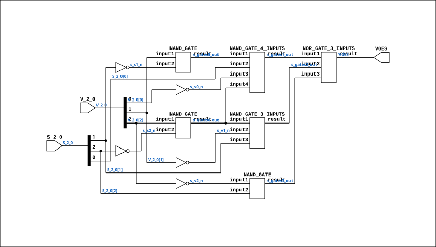

# CGA_INTR_CNTLR_VECGEN_CMP_MAGCMP

Source: `Verilog/DELILAH-CPU/CGA_INTR/circuit/CGA_INTR_CNTLR_VECGEN_CMP_MAGCMP.v`

<!-- Generated by Verilog/tests/module_doc.py from the //! comments in the source. Do not edit by hand - edit the RTL comments and regenerate. -->

<!-- HIERARCHY-NAV:BEGIN - written by Verilog/tests/gen_hierarchy.py, do not edit -->

**Where it sits** (Simulation): [ND120_TOP](../../../../doc/ND120_TOP.md) > [ND120_CORE](../../../../doc/ND120_CORE.md) > [ND3202D](../../../../CPU-BOARD-3202/circuit/doc/ND3202D.md) > [CPU_15](../../../../CPU-BOARD-3202/circuit/doc/CPU_15.md) > [CPU_PROC_32](../../../../CPU-BOARD-3202/circuit/doc/CPU_PROC_32.md) > [CPU_PROC_CGA_33](../../../../CPU-BOARD-3202/circuit/doc/CPU_PROC_CGA_33.md) > [CGA](../../../CGA/circuit/doc/CGA.md) > [CGA_INTR](CGA_INTR.md) > [CGA_INTR_CNTLR](CGA_INTR_CNTLR.md) > [CGA_INTR_CNTLR_VECGEN](CGA_INTR_CNTLR_VECGEN.md) > [CGA_INTR_CNTLR_VECGEN_CMP](CGA_INTR_CNTLR_VECGEN_CMP.md) > **CGA_INTR_CNTLR_VECGEN_CMP_MAGCMP**
- instance path: `CORE.CPU_BOARD.CPU.PROC.CGA.DELILAH.INTR.CNTLR.VECGEN.CMP.HICMP`

**Used in:** [CGA_INTR_CNTLR_VECGEN_CMP](CGA_INTR_CNTLR_VECGEN_CMP.md) (all tops)

**Contains:** [NAND_GATE](../../../../Shared/logisim/doc/NAND_GATE.md) x3, [NAND_GATE_3_INPUTS](../../../../Shared/logisim/doc/NAND_GATE_3_INPUTS.md), [NAND_GATE_4_INPUTS](../../../../Shared/logisim/doc/NAND_GATE_4_INPUTS.md), [NOR_GATE_3_INPUTS](../../../../Shared/logisim/doc/NOR_GATE_3_INPUTS.md)

[Module hierarchy](../../../../HIERARCHY.md) - [All modules](../../../../MODULES.md)

<!-- HIERARCHY-NAV:END -->


<!-- SCHEMATIC:BEGIN - written by Verilog/tests/gen_schematics.py, do not edit -->

## Schematic

Drawn from the Verilog: the yosys netlist of the Simulation (Verilator) build, instance `CORE.CPU_BOARD.CPU.PROC.CGA.DELILAH.INTR.CNTLR.VECGEN.CMP.HICMP`. Sub-modules are boxes (click the picture to open it full size; there every sub-module box links to its page, and every wire shows its Verilog name).

[](CGA_INTR_CNTLR_VECGEN_CMP_MAGCMP.svg)

<!-- SCHEMATIC:END -->

## Description

ND120 CGA (CPU Gate Array / DELILAH)
/CGA/INTR/CNTLR/VECGEN/CMP/MAGCMP
MAGCMP
Page 88
SHEET 1 of 1
Last reviewed: 10-NOV-2024
Ronny Hansen

## Ports

| Direction | Width | Name | Description |
|---|---|---|---|
| input | `[2:0]` | `S_2_0` |  |
| output | `1` | `VGES` |  |
| input | `[2:0]` | `V_2_0` |  |

## Verilog source

[`Verilog/DELILAH-CPU/CGA_INTR/circuit/CGA_INTR_CNTLR_VECGEN_CMP_MAGCMP.v`](https://github.com/RetroCoreLabs/nd-120/blob/main/Verilog/DELILAH-CPU/CGA_INTR/circuit/CGA_INTR_CNTLR_VECGEN_CMP_MAGCMP.v) on GitHub.

<details markdown="1">
<summary>Show the Verilog of CGA_INTR_CNTLR_VECGEN_CMP_MAGCMP (110 lines)</summary>

```verilog
/**************************************************************************
** ND120 CGA (CPU Gate Array / DELILAH)                                  **
** /CGA/INTR/CNTLR/VECGEN/CMP/MAGCMP                                     **
** MAGCMP                                                                **
**                                                                       **
** Page 88                                                               **
** SHEET 1 of 1                                                          **
**                                                                       **
** Last reviewed: 10-NOV-2024                                            **
** Ronny Hansen                                                          **
***************************************************************************/

module CGA_INTR_CNTLR_VECGEN_CMP_MAGCMP( S_2_0,
                                         VGES,
                                         V_2_0 );

   /*******************************************************************************
   ** The inputs are defined here                                                **
   *******************************************************************************/
   input [2:0] S_2_0;
   input [2:0] V_2_0;

   /*******************************************************************************
   ** The outputs are defined here                                               **
   *******************************************************************************/
   output VGES;

   /*******************************************************************************
   ** The wires are defined here                                                 **
   *******************************************************************************/
   wire [2:0] s_s_2_0;
   wire [2:0] s_v_2_0;
   wire       s_gates1_out;
   wire       s_gates2_out;
   wire       s_gates3_out;
   wire       s_gates5_out;
   wire       s_gates6_out;
   wire       s_s1_n;
   wire       s_s2_n;
   wire       s_v0_n;
   wire       s_v1_n;
   wire       s_v2_n;
   wire       s_vges_out;

   /*******************************************************************************
   ** The module functionality is described here                                 **
   *******************************************************************************/

   /*******************************************************************************
   ** Here all input connections are defined                                     **
   *******************************************************************************/
   assign s_s_2_0[2:0] = S_2_0;
   assign s_v_2_0[2:0] = V_2_0;

   /*******************************************************************************
   ** Here all output connections are defined                                    **
   *******************************************************************************/
   assign VGES = s_vges_out;

   /*******************************************************************************
   ** Here all in-lined components are defined                                   **
   *******************************************************************************/

   // NOT Gate
   assign s_v0_n = ~s_v_2_0[0];
   assign s_v1_n = ~s_v_2_0[1];
   assign s_v2_n = ~s_v_2_0[2];

   assign s_s1_n = ~s_s_2_0[1];
   assign s_s2_n = ~s_s_2_0[2];

   /*******************************************************************************
   ** Here all normal components are defined                                     **
   *******************************************************************************/
   NAND_GATE_4_INPUTS #(.BubblesMask(4'h0))
      GATES_1 (.input1(s_gates5_out),
               .input2(s_s_2_0[0]),
               .input3(s_v0_n),
               .input4(s_gates6_out),
               .result(s_gates1_out));

   NAND_GATE_3_INPUTS #(.BubblesMask(3'b000))
      GATES_2 (.input1(s_gates6_out),
               .input2(s_v1_n),
               .input3(s_s_2_0[1]),
               .result(s_gates2_out));

   NAND_GATE #(.BubblesMask(2'b00))
      GATES_3 (.input1(s_v2_n),
               .input2(s_s_2_0[2]),
               .result(s_gates3_out));

   NOR_GATE_3_INPUTS #(.BubblesMask(3'b111))
      GATES_4 (.input1(s_gates1_out),
               .input2(s_gates2_out),
               .input3(s_gates3_out),
               .result(s_vges_out));

   NAND_GATE #(.BubblesMask(2'b00))
      GATES_5 (.input1(s_v_2_0[1]),
               .input2(s_s1_n),
               .result(s_gates5_out));

   NAND_GATE #(.BubblesMask(2'b00))
      GATES_6 (.input1(s_v_2_0[2]),
               .input2(s_s2_n),
               .result(s_gates6_out));


endmodule
```

</details>
