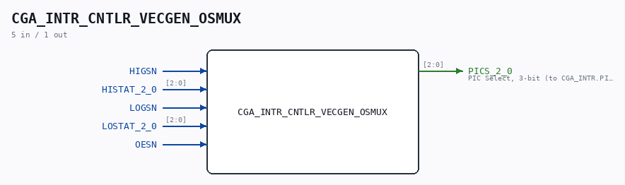
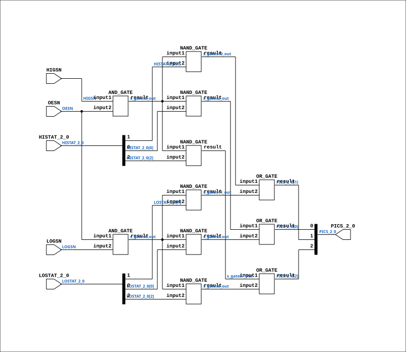

# CGA_INTR_CNTLR_VECGEN_OSMUX

Source: `Verilog/DELILAH-CPU/CGA_INTR/circuit/CGA_INTR_CNTLR_VECGEN_OSMUX.v`

<!-- Generated by Verilog/tests/module_doc.py from the //! comments in the source. Do not edit by hand - edit the RTL comments and regenerate. -->

<!-- HIERARCHY-NAV:BEGIN - written by Verilog/tests/gen_hierarchy.py, do not edit -->

**Where it sits** (Simulation): [ND120_TOP](../../../../doc/ND120_TOP.md) > [ND120_CORE](../../../../doc/ND120_CORE.md) > [ND3202D](../../../../CPU-BOARD-3202/circuit/doc/ND3202D.md) > [CPU_15](../../../../CPU-BOARD-3202/circuit/doc/CPU_15.md) > [CPU_PROC_32](../../../../CPU-BOARD-3202/circuit/doc/CPU_PROC_32.md) > [CPU_PROC_CGA_33](../../../../CPU-BOARD-3202/circuit/doc/CPU_PROC_CGA_33.md) > [CGA](../../../CGA/circuit/doc/CGA.md) > [CGA_INTR](CGA_INTR.md) > [CGA_INTR_CNTLR](CGA_INTR_CNTLR.md) > [CGA_INTR_CNTLR_VECGEN](CGA_INTR_CNTLR_VECGEN.md) > **CGA_INTR_CNTLR_VECGEN_OSMUX**
- instance path: `CORE.CPU_BOARD.CPU.PROC.CGA.DELILAH.INTR.CNTLR.VECGEN.OSMUX`

**Used in:** [CGA_INTR_CNTLR_VECGEN](CGA_INTR_CNTLR_VECGEN.md) (all tops)

**Contains:** [AND_GATE](../../../../Shared/logisim/doc/AND_GATE.md) x2, [NAND_GATE](../../../../Shared/logisim/doc/NAND_GATE.md) x6, [OR_GATE](../../../../Shared/logisim/doc/OR_GATE.md) x3

[Module hierarchy](../../../../HIERARCHY.md) - [All modules](../../../../MODULES.md)

<!-- HIERARCHY-NAV:END -->



<!-- SCHEMATIC:BEGIN - written by Verilog/tests/gen_schematics.py, do not edit -->

## Schematic

Drawn from the Verilog: the yosys netlist of the Simulation (Verilator) build, instance `CORE.CPU_BOARD.CPU.PROC.CGA.DELILAH.INTR.CNTLR.VECGEN.OSMUX`. Sub-modules are boxes (click the picture to open it full size; there every sub-module box links to its page, and every wire shows its Verilog name).

[](CGA_INTR_CNTLR_VECGEN_OSMUX.svg)

<!-- SCHEMATIC:END -->

## Description

ND120 CGA (CPU Gate Array / DELILAH)
/CGA/INTR/CNTLR/VECGEN/osmux
osmux
Page 89
SHEET 1 of 1
Last reviewed: 10-NOV-2024
Ronny Hansen

## Ports

| Direction | Width | Name | Description |
|---|---|---|---|
| input | `1` | `HIGSN` |  |
| input | `[2:0]` | `HISTAT_2_0` |  |
| input | `1` | `LOGSN` |  |
| input | `[2:0]` | `LOSTAT_2_0` |  |
| input | `1` | `OESN` |  |
| output | `[2:0]` | `PICS_2_0` | PIC Select, 3-bit (to CGA_INTR.PICS_2_0) |

## Verilog source

[`Verilog/DELILAH-CPU/CGA_INTR/circuit/CGA_INTR_CNTLR_VECGEN_OSMUX.v`](https://github.com/RetroCoreLabs/nd-120/blob/main/Verilog/DELILAH-CPU/CGA_INTR/circuit/CGA_INTR_CNTLR_VECGEN_OSMUX.v) on GitHub.

<details markdown="1">
<summary>Show the Verilog of CGA_INTR_CNTLR_VECGEN_OSMUX (148 lines)</summary>

```verilog
/**************************************************************************
** ND120 CGA (CPU Gate Array / DELILAH)                                  **
** /CGA/INTR/CNTLR/VECGEN/osmux                                          **
** osmux                                                                 **
**                                                                       **
** Page 89                                                               **
** SHEET 1 of 1                                                          **
**                                                                       **
** Last reviewed: 10-NOV-2024                                            **
** Ronny Hansen                                                          **
***************************************************************************/

module CGA_INTR_CNTLR_VECGEN_OSMUX (
    input       HIGSN,
    input [2:0] HISTAT_2_0,
    input       LOGSN,
    input [2:0] LOSTAT_2_0,
    input       OESN,

    output [2:0] PICS_2_0  //! PIC Select, 3-bit (to CGA_INTR.PICS_2_0)
);

  /*******************************************************************************
   ** The wires are defined here                                                 **
   *******************************************************************************/
  wire [2:0] s_histat_2_0;
  wire [2:0] s_lostat_2_0;
  wire [2:0] s_pics_2_0_out;
  wire       s_gates10_out;
  wire       s_gates11_out;
  wire       s_gates2_out;
  wire       s_gates3_out;
  wire       s_gates5_out;
  wire       s_gates6_out;
  wire       s_gates7_out;
  wire       s_gates8_out;
  wire       s_higs_n;
  wire       s_logs_n;
  wire       s_oes_n;


  /*******************************************************************************
   ** Here all input connections are defined                                     **
   *******************************************************************************/
  assign s_histat_2_0[2:0] = HISTAT_2_0;
  assign s_lostat_2_0[2:0] = LOSTAT_2_0;
  assign s_higs_n          = HIGSN;
  assign s_logs_n          = LOGSN;
  assign s_oes_n           = OESN;

  /*******************************************************************************
   ** Here all output connections are defined                                    **
   *******************************************************************************/
  assign PICS_2_0          = s_pics_2_0_out[2:0];

  /*******************************************************************************
   ** Here all normal components are defined                                     **
   *******************************************************************************/
  OR_GATE #(
      .BubblesMask(2'b11)
  ) GATES_1 (
      .input1(s_gates10_out),
      .input2(s_gates11_out),
      .result(s_pics_2_0_out[1])
  );

  NAND_GATE #(
      .BubblesMask(2'b00)
  ) GATES_2 (
      .input1(s_gates5_out),
      .input2(s_histat_2_0[0]),
      .result(s_gates2_out)
  );

  NAND_GATE #(
      .BubblesMask(2'b00)
  ) GATES_3 (
      .input1(s_gates6_out),
      .input2(s_lostat_2_0[0]),
      .result(s_gates3_out)
  );

  OR_GATE #(
      .BubblesMask(2'b11)
  ) GATES_4 (
      .input1(s_gates2_out),
      .input2(s_gates3_out),
      .result(s_pics_2_0_out[0])
  );

  AND_GATE #(
      .BubblesMask(2'b11)
  ) GATES_5 (
      .input1(s_higs_n),
      .input2(s_oes_n),
      .result(s_gates5_out)
  );

  AND_GATE #(
      .BubblesMask(2'b11)
  ) GATES_6 (
      .input1(s_oes_n),
      .input2(s_logs_n),
      .result(s_gates6_out)
  );

  NAND_GATE #(
      .BubblesMask(2'b00)
  ) GATES_7 (
      .input1(s_gates5_out),
      .input2(s_histat_2_0[2]),
      .result(s_gates7_out)
  );

  NAND_GATE #(
      .BubblesMask(2'b00)
  ) GATES_8 (
      .input1(s_gates6_out),
      .input2(s_lostat_2_0[2]),
      .result(s_gates8_out)
  );

  OR_GATE #(
      .BubblesMask(2'b11)
  ) GATES_9 (
      .input1(s_gates7_out),
      .input2(s_gates8_out),
      .result(s_pics_2_0_out[2])
  );

  NAND_GATE #(
      .BubblesMask(2'b00)
  ) GATES_10 (
      .input1(s_gates5_out),
      .input2(s_histat_2_0[1]),
      .result(s_gates10_out)
  );

  NAND_GATE #(
      .BubblesMask(2'b00)
  ) GATES_11 (
      .input1(s_gates6_out),
      .input2(s_lostat_2_0[1]),
      .result(s_gates11_out)
  );


endmodule
```

</details>
