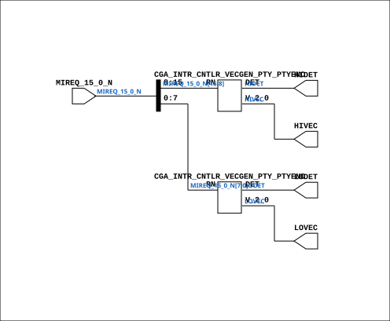

# CGA_INTR_CNTLR_VECGEN_PTY

Source: `Verilog/DELILAH-CPU/CGA_INTR/circuit/CGA_INTR_CNTLR_VECGEN_PTY.v`

<!-- Generated by Verilog/tests/module_doc.py from the //! comments in the source. Do not edit by hand - edit the RTL comments and regenerate. -->

<!-- HIERARCHY-NAV:BEGIN - written by Verilog/tests/gen_hierarchy.py, do not edit -->

**Where it sits** (Simulation): [ND120_TOP](../../../../doc/ND120_TOP.md) > [ND120_CORE](../../../../doc/ND120_CORE.md) > [ND3202D](../../../../CPU-BOARD-3202/circuit/doc/ND3202D.md) > [CPU_15](../../../../CPU-BOARD-3202/circuit/doc/CPU_15.md) > [CPU_PROC_32](../../../../CPU-BOARD-3202/circuit/doc/CPU_PROC_32.md) > [CPU_PROC_CGA_33](../../../../CPU-BOARD-3202/circuit/doc/CPU_PROC_CGA_33.md) > [CGA](../../../CGA/circuit/doc/CGA.md) > [CGA_INTR](CGA_INTR.md) > [CGA_INTR_CNTLR](CGA_INTR_CNTLR.md) > [CGA_INTR_CNTLR_VECGEN](CGA_INTR_CNTLR_VECGEN.md) > **CGA_INTR_CNTLR_VECGEN_PTY**
- instance path: `CORE.CPU_BOARD.CPU.PROC.CGA.DELILAH.INTR.CNTLR.VECGEN.PTY`

**Used in:** [CGA_INTR_CNTLR_VECGEN](CGA_INTR_CNTLR_VECGEN.md) (all tops)

**Contains:** [CGA_INTR_CNTLR_VECGEN_PTY_PTYENC](CGA_INTR_CNTLR_VECGEN_PTY_PTYENC.md) x2

[Module hierarchy](../../../../HIERARCHY.md) - [All modules](../../../../MODULES.md)

<!-- HIERARCHY-NAV:END -->


<!-- SCHEMATIC:BEGIN - written by Verilog/tests/gen_schematics.py, do not edit -->

## Schematic

Drawn from the Verilog: the yosys netlist of the Simulation (Verilator) build, instance `CORE.CPU_BOARD.CPU.PROC.CGA.DELILAH.INTR.CNTLR.VECGEN.PTY`. Sub-modules are boxes (click the picture to open it full size; there every sub-module box links to its page, and every wire shows its Verilog name).

[](CGA_INTR_CNTLR_VECGEN_PTY.svg)

<!-- SCHEMATIC:END -->

## Description

ND120 CGA (CPU Gate Array / DELILAH)
/CGA/INTR/CNTLR/VECGEN/PTY
VECTOR GENERATOR
Page 83
SHEET 1 of 1
Last reviewed: 10-NOV-2024
Ronny Hansen

## Ports

| Direction | Width | Name | Description |
|---|---|---|---|
| input | `[15:0]` | `MIREQ_15_0_N` *(active low)* |  |
| output | `1` | `HIDET` |  |
| output | `[2:0]` | `HIVEC` |  |
| output | `1` | `LODET` |  |
| output | `[2:0]` | `LOVEC` |  |

## Verilog source

[`Verilog/DELILAH-CPU/CGA_INTR/circuit/CGA_INTR_CNTLR_VECGEN_PTY.v`](https://github.com/RetroCoreLabs/nd-120/blob/main/Verilog/DELILAH-CPU/CGA_INTR/circuit/CGA_INTR_CNTLR_VECGEN_PTY.v) on GitHub.

<details markdown="1">
<summary>Show the Verilog of CGA_INTR_CNTLR_VECGEN_PTY (64 lines)</summary>

```verilog
/**************************************************************************
** ND120 CGA (CPU Gate Array / DELILAH)                                  **
** /CGA/INTR/CNTLR/VECGEN/PTY                                            **
** VECTOR GENERATOR                                                      **
**                                                                       **
** Page 83                                                               **
** SHEET 1 of 1                                                          **
**                                                                       **
** Last reviewed: 10-NOV-2024                                            **
** Ronny Hansen                                                          **
***************************************************************************/

module CGA_INTR_CNTLR_VECGEN_PTY (
    input [15:0] MIREQ_15_0_N,

    output       HIDET,
    output [2:0] HIVEC,
    output       LODET,
    output [2:0] LOVEC
);

  /*******************************************************************************
   ** The wires are defined here                                                 **
   *******************************************************************************/
  wire [15:0] s_mireq_15_0_n;
  wire [ 2:0] s_hivec_out;
  wire [ 2:0] s_lovec_out;
  wire        s_hidet_out;
  wire        s_lodet_out;

  /*******************************************************************************
   ** The module functionality is described here                                 **
   *******************************************************************************/

  /*******************************************************************************
   ** Here all input connections are defined                                     **
   *******************************************************************************/
  assign s_mireq_15_0_n[15:0] = MIREQ_15_0_N;

  /*******************************************************************************
   ** Here all output connections are defined                                    **
   *******************************************************************************/
  assign HIDET = s_hidet_out;
  assign HIVEC = s_hivec_out[2:0];
  assign LODET = s_lodet_out;
  assign LOVEC = s_lovec_out[2:0];

  /*******************************************************************************
   ** Here all sub-circuits are defined                                          **
   *******************************************************************************/

  CGA_INTR_CNTLR_VECGEN_PTY_PTYENC PTYENC_HI (
      .DET(s_hidet_out),
      .RN(s_mireq_15_0_n[15:8]),
      .V_2_0(s_hivec_out[2:0])
  );

  CGA_INTR_CNTLR_VECGEN_PTY_PTYENC PTYENC_LO (
      .DET(s_lodet_out),
      .RN(s_mireq_15_0_n[7:0]),
      .V_2_0(s_lovec_out[2:0])
  );

endmodule
```

</details>
