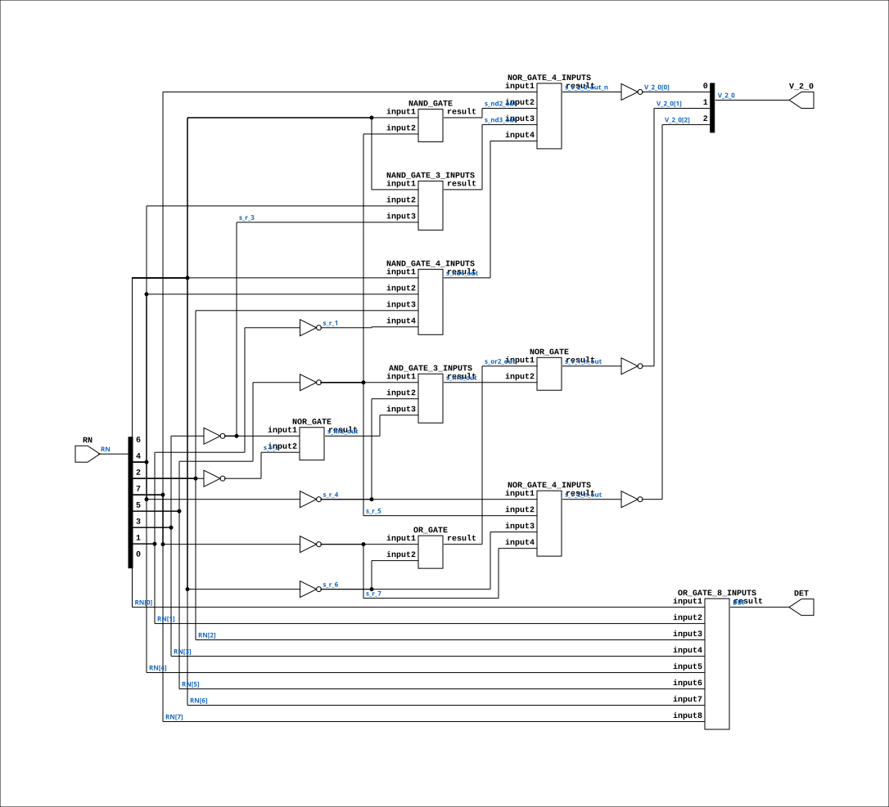

# CGA_INTR_CNTLR_VECGEN_PTY_PTYENC

Source: `Verilog/DELILAH-CPU/CGA_INTR/circuit/CGA_INTR_CNTLR_VECGEN_PTY_PTYENC.v`

<!-- Generated by Verilog/tests/module_doc.py from the //! comments in the source. Do not edit by hand - edit the RTL comments and regenerate. -->

<!-- HIERARCHY-NAV:BEGIN - written by Verilog/tests/gen_hierarchy.py, do not edit -->

**Where it sits** (Simulation): [ND120_TOP](../../../../doc/ND120_TOP.md) > [ND120_CORE](../../../../doc/ND120_CORE.md) > [ND3202D](../../../../CPU-BOARD-3202/circuit/doc/ND3202D.md) > [CPU_15](../../../../CPU-BOARD-3202/circuit/doc/CPU_15.md) > [CPU_PROC_32](../../../../CPU-BOARD-3202/circuit/doc/CPU_PROC_32.md) > [CPU_PROC_CGA_33](../../../../CPU-BOARD-3202/circuit/doc/CPU_PROC_CGA_33.md) > [CGA](../../../CGA/circuit/doc/CGA.md) > [CGA_INTR](CGA_INTR.md) > [CGA_INTR_CNTLR](CGA_INTR_CNTLR.md) > [CGA_INTR_CNTLR_VECGEN](CGA_INTR_CNTLR_VECGEN.md) > [CGA_INTR_CNTLR_VECGEN_PTY](CGA_INTR_CNTLR_VECGEN_PTY.md) > **CGA_INTR_CNTLR_VECGEN_PTY_PTYENC**
- instance path: `CORE.CPU_BOARD.CPU.PROC.CGA.DELILAH.INTR.CNTLR.VECGEN.PTY.PTYENC_HI`

**Used in:** [CGA_INTR_CNTLR_VECGEN_PTY](CGA_INTR_CNTLR_VECGEN_PTY.md) (all tops)

**Contains:** [AND_GATE_3_INPUTS](../../../../Shared/logisim/doc/AND_GATE_3_INPUTS.md), [NAND_GATE](../../../../Shared/logisim/doc/NAND_GATE.md), [NAND_GATE_3_INPUTS](../../../../Shared/logisim/doc/NAND_GATE_3_INPUTS.md), [NAND_GATE_4_INPUTS](../../../../Shared/logisim/doc/NAND_GATE_4_INPUTS.md), [NOR_GATE](../../../../Shared/logisim/doc/NOR_GATE.md) x2, [NOR_GATE_4_INPUTS](../../../../Shared/logisim/doc/NOR_GATE_4_INPUTS.md) x2, [OR_GATE](../../../../Shared/logisim/doc/OR_GATE.md), [OR_GATE_8_INPUTS](../../../../Shared/logisim/doc/OR_GATE_8_INPUTS.md)

[Module hierarchy](../../../../HIERARCHY.md) - [All modules](../../../../MODULES.md)

<!-- HIERARCHY-NAV:END -->


<!-- SCHEMATIC:BEGIN - written by Verilog/tests/gen_schematics.py, do not edit -->

## Schematic

Drawn from the Verilog: the yosys netlist of the Simulation (Verilator) build, instance `CORE.CPU_BOARD.CPU.PROC.CGA.DELILAH.INTR.CNTLR.VECGEN.PTY.PTYENC_HI`. Sub-modules are boxes (click the picture to open it full size; there every sub-module box links to its page, and every wire shows its Verilog name).

[](CGA_INTR_CNTLR_VECGEN_PTY_PTYENC.svg)

<!-- SCHEMATIC:END -->

## Description

ND120 CGA (CPU Gate Array / DELILAH)
/CGA/INTR/CNTLR/VECGEN/PTY/PTYENC
PRIORITY ENCODER
Page 83
SHEET 1 of 1
Last reviewed: 10-NOV-2024
Ronny Hansen

## Ports

| Direction | Width | Name | Description |
|---|---|---|---|
| input | `[7:0]` | `RN` |  |
| output | `1` | `DET` |  |
| output | `[2:0]` | `V_2_0` |  |

## Verilog source

[`Verilog/DELILAH-CPU/CGA_INTR/circuit/CGA_INTR_CNTLR_VECGEN_PTY_PTYENC.v`](https://github.com/RetroCoreLabs/nd-120/blob/main/Verilog/DELILAH-CPU/CGA_INTR/circuit/CGA_INTR_CNTLR_VECGEN_PTY_PTYENC.v) on GitHub.

<details markdown="1">
<summary>Show the Verilog of CGA_INTR_CNTLR_VECGEN_PTY_PTYENC (141 lines)</summary>

```verilog
/**************************************************************************
** ND120 CGA (CPU Gate Array / DELILAH)                                  **
** /CGA/INTR/CNTLR/VECGEN/PTY/PTYENC                                     **
** PRIORITY ENCODER                                                      **
**                                                                       **
** Page 83                                                               **
** SHEET 1 of 1                                                          **
**                                                                       **
** Last reviewed: 10-NOV-2024                                            **
** Ronny Hansen                                                          **
***************************************************************************/

module CGA_INTR_CNTLR_VECGEN_PTY_PTYENC(
   input [7:0] RN,

   output       DET,
   output [2:0] V_2_0
);

   /*******************************************************************************
   ** The wires are defined here                                                 **
   *******************************************************************************/
   wire [2:0] s_v_2_0_out;
   wire [7:0] s_r_n;
   wire       s_det_out;
   wire       s_nd2_out;
   wire       s_nd3_out;
   wire       s_nd4_out;
   wire       s_nr2_out;
   wire       s_nr3_out;
   wire       s_or2_out;
   wire       s_r_1;
   wire       s_r_2;
   wire       s_r_3;
   wire       s_r_4;
   wire       s_r_5;
   wire       s_r_6;
   wire       s_r_7;
   wire       s_v_1_n_out;
   wire       s_v_2_0_out_n;
   wire       s_v_2_n_out;

   /*******************************************************************************
   ** Here all input connections are defined                                     **
   *******************************************************************************/
   assign s_r_n[7:0] = RN;

   /*******************************************************************************
   ** Here all output connections are defined                                    **
   *******************************************************************************/
   assign DET   = s_det_out;
   assign V_2_0 = s_v_2_0_out[2:0];

   /*******************************************************************************
   ** Here all in-lined components are defined                                   **
   *******************************************************************************/

   // NOT Gate: V0
   assign s_v_2_0_out[0] = ~s_v_2_0_out_n;

   // NOT Gate
   assign s_r_6 = ~s_r_n[6];
   assign s_r_4 = ~s_r_n[4];
   assign s_r_2 = ~s_r_n[2];
   assign s_r_7 = ~s_r_n[7];
   assign s_r_5 = ~s_r_n[5];
   assign s_r_3 = ~s_r_n[3];
   assign s_r_1 = ~s_r_n[1];

   assign s_v_2_0_out[2] = ~s_v_2_n_out;
   assign s_v_2_0_out[1] = ~s_v_1_n_out;

   /*******************************************************************************
   ** Here all normal components are defined                                     **
   *******************************************************************************/
   NOR_GATE #(.BubblesMask(2'b00))
      NR2 (.input1(s_r_3),
           .input2(s_r_2),
           .result(s_nr2_out));

   NOR_GATE_4_INPUTS #(.BubblesMask(4'hF))
      NRx (.input1(s_r_n[7]),
           .input2(s_nd2_out),
           .input3(s_nd3_out),
           .input4(s_nd4_out),
           .result(s_v_2_0_out_n));

   NAND_GATE #(.BubblesMask(2'b00))
      ND2 (.input1(s_r_n[6]),
           .input2(s_r_5),
           .result(s_nd2_out));

   NAND_GATE_3_INPUTS #(.BubblesMask(3'b000))
      ND3 (.input1(s_r_n[6]),
           .input2(s_r_n[4]),
           .input3(s_r_3),
           .result(s_nd3_out));

   NAND_GATE_4_INPUTS #(.BubblesMask(4'h0))
      ND4 (.input1(s_r_n[6]),
           .input2(s_r_n[4]),
           .input3(s_r_n[2]),
           .input4(s_r_1),
           .result(s_nd4_out));

   OR_GATE_8_INPUTS #(.BubblesMask(8'hFF))
      ND8P (.input1(s_r_n[0]),
            .input2(s_r_n[1]),
            .input3(s_r_n[2]),
            .input4(s_r_n[3]),
            .input5(s_r_n[4]),
            .input6(s_r_n[5]),
            .input7(s_r_n[6]),
            .input8(s_r_n[7]),
            .result(s_det_out));

   NOR_GATE_4_INPUTS #(.BubblesMask(4'h0))
      NR4 (.input1(s_r_4),
           .input2(s_r_5),
           .input3(s_r_6),
           .input4(s_r_7),
           .result(s_v_2_n_out));

   OR_GATE #(.BubblesMask(2'b00))
      OR2 (.input1(s_r_7),
           .input2(s_r_6),
           .result(s_or2_out));

   NOR_GATE #(.BubblesMask(2'b00))
      O1 (.input1(s_or2_out),
          .input2(s_nr3_out),
          .result(s_v_1_n_out));

   AND_GATE_3_INPUTS #(.BubblesMask(3'b111))
      NR3 (.input1(s_r_5),
           .input2(s_r_4),
           .input3(s_nr2_out),
           .result(s_nr3_out));


endmodule
```

</details>
