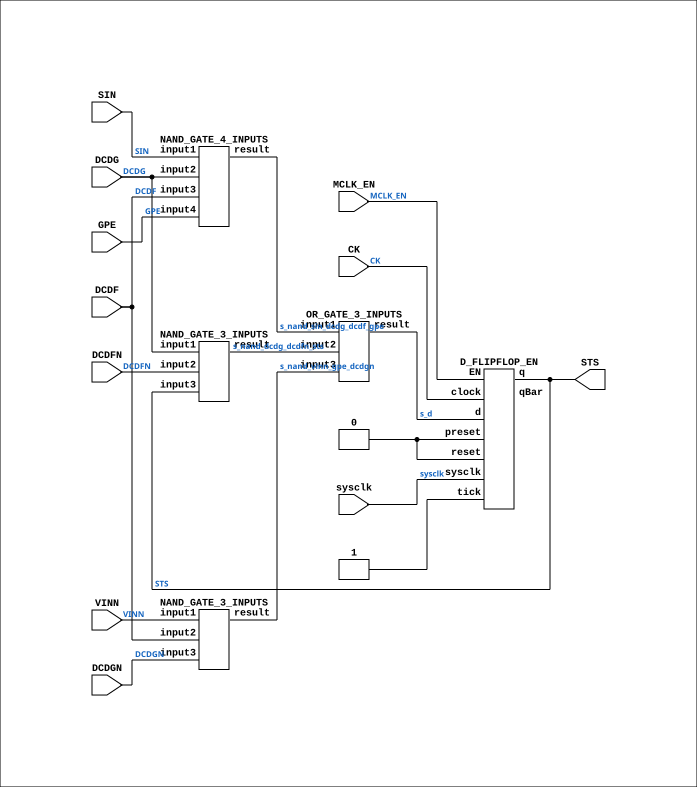

# CGA_INTR_CNTLR_VECGEN_STAT_SBIT

Source: `Verilog/DELILAH-CPU/CGA_INTR/circuit/CGA_INTR_CNTLR_VECGEN_STAT_SBIT.v`

<!-- Generated by Verilog/tests/module_doc.py from the //! comments in the source. Do not edit by hand - edit the RTL comments and regenerate. -->

<!-- HIERARCHY-NAV:BEGIN - written by Verilog/tests/gen_hierarchy.py, do not edit -->

**Where it sits** (Simulation): [ND120_TOP](../../../../doc/ND120_TOP.md) > [ND120_CORE](../../../../doc/ND120_CORE.md) > [ND3202D](../../../../CPU-BOARD-3202/circuit/doc/ND3202D.md) > [CPU_15](../../../../CPU-BOARD-3202/circuit/doc/CPU_15.md) > [CPU_PROC_32](../../../../CPU-BOARD-3202/circuit/doc/CPU_PROC_32.md) > [CPU_PROC_CGA_33](../../../../CPU-BOARD-3202/circuit/doc/CPU_PROC_CGA_33.md) > [CGA](../../../CGA/circuit/doc/CGA.md) > [CGA_INTR](CGA_INTR.md) > [CGA_INTR_CNTLR](CGA_INTR_CNTLR.md) > [CGA_INTR_CNTLR_VECGEN](CGA_INTR_CNTLR_VECGEN.md) > [CGA_INTR_CNTLR_VECGEN_STAT](CGA_INTR_CNTLR_VECGEN_STAT.md) > **CGA_INTR_CNTLR_VECGEN_STAT_SBIT**
- instance path: `CORE.CPU_BOARD.CPU.PROC.CGA.DELILAH.INTR.CNTLR.VECGEN.STAT.SBIT1_LO`

**Used in:** [CGA_INTR_CNTLR_VECGEN_STAT](CGA_INTR_CNTLR_VECGEN_STAT.md) (all tops)

**Contains:** [D_FLIPFLOP_EN](../../../../Shared/ndlib/doc/D_FLIPFLOP_EN.md), [NAND_GATE_3_INPUTS](../../../../Shared/logisim/doc/NAND_GATE_3_INPUTS.md) x2, [NAND_GATE_4_INPUTS](../../../../Shared/logisim/doc/NAND_GATE_4_INPUTS.md), [OR_GATE_3_INPUTS](../../../../Shared/logisim/doc/OR_GATE_3_INPUTS.md)

[Module hierarchy](../../../../HIERARCHY.md) - [All modules](../../../../MODULES.md)

<!-- HIERARCHY-NAV:END -->


<!-- SCHEMATIC:BEGIN - written by Verilog/tests/gen_schematics.py, do not edit -->

## Schematic

Drawn from the Verilog: the yosys netlist of the Simulation (Verilator) build, instance `CORE.CPU_BOARD.CPU.PROC.CGA.DELILAH.INTR.CNTLR.VECGEN.STAT.SBIT1_LO`. Sub-modules are boxes (click the picture to open it full size; there every sub-module box links to its page, and every wire shows its Verilog name).

[](CGA_INTR_CNTLR_VECGEN_STAT_SBIT.svg)

<!-- SCHEMATIC:END -->

## Description

ND120 CGA (CPU Gate Array / DELILAH)
/CGA/INTR/CNTLR/VECGEN/STAT/SBIT
S BIT
Page 87
SHEET 1 of 1
Last reviewed: 10-NOV-2024
Ronny Hansen

## Ports

| Direction | Width | Name | Description |
|---|---|---|---|
| input | `1` | `sysclk` | FPGA system clock (P2: MCLK_EN capture) |
| input | `1` | `MCLK_EN` | MCLK clock-enable pulse (FPGA_FF_MODE, else 0) |
| input | `1` | `CK` | Master Clock (from CGA_INTR.MCLK) |
| input | `1` | `DCDF` |  |
| input | `1` | `DCDFN` |  |
| input | `1` | `DCDG` |  |
| input | `1` | `DCDGN` |  |
| input | `1` | `GPE` |  |
| input | `1` | `SIN` |  |
| input | `1` | `VINN` |  |
| output | `1` | `STS` |  |

## Verilog source

[`Verilog/DELILAH-CPU/CGA_INTR/circuit/CGA_INTR_CNTLR_VECGEN_STAT_SBIT.v`](https://github.com/RetroCoreLabs/nd-120/blob/main/Verilog/DELILAH-CPU/CGA_INTR/circuit/CGA_INTR_CNTLR_VECGEN_STAT_SBIT.v) on GitHub.

<details markdown="1">
<summary>Show the Verilog of CGA_INTR_CNTLR_VECGEN_STAT_SBIT (163 lines)</summary>

```verilog
/**************************************************************************
** ND120 CGA (CPU Gate Array / DELILAH)                                  **
** /CGA/INTR/CNTLR/VECGEN/STAT/SBIT                                      **
** S BIT                                                                 **
**                                                                       **
** Page 87                                                               **
** SHEET 1 of 1                                                          **
**                                                                       **
** Last reviewed: 10-NOV-2024                                            **
** Ronny Hansen                                                          **
***************************************************************************/

module CGA_INTR_CNTLR_VECGEN_STAT_SBIT (
    input sysclk,   //! FPGA system clock (P2: MCLK_EN capture)
    input MCLK_EN,  //! MCLK clock-enable pulse (FPGA_FF_MODE, else 0)

    input CK,       //! Master Clock (from CGA_INTR.MCLK)
    input DCDF,
    input DCDFN,
    input DCDG,
    input DCDGN,
    input GPE,
    input SIN,
    input VINN,

    output STS
);

  /*******************************************************************************
   ** The wires are defined here                                                 **
   *******************************************************************************/
  wire s_nand_sin_dcdg_dcdf_gpe;
  wire s_nand_vinn_gpe_dcdgn;
  wire s_vin_n;
  wire s_dcdg_n;
  wire s_nand_dcdg_dcdfn_sts;
  wire s_gpe;
  wire s_sts_out;
  wire s_dcdf_n;
  wire s_dcdg;
  wire s_ck;
  wire s_d;
  wire s_si_n;
  wire s_dcdf;

  /*******************************************************************************
   ** The module functionality is described here                                 **
   *******************************************************************************/

  /*******************************************************************************
   ** Here all input connections are defined                                     **
   *******************************************************************************/
  assign s_ck = CK;
  assign s_dcdf = DCDF;
  assign s_dcdf_n = DCDFN;
  assign s_dcdg = DCDG;
  assign s_dcdg_n = DCDGN;
  assign s_gpe = GPE;
  assign s_si_n = SIN;
  assign s_vin_n = VINN;

  // P2 (docs/plan-fix-unconstrained-clocks.md): in FF mode the MCLK-
  // clocked registers capture on posedge sysclk gated by MCLK_EN
  // (aligned to the MCLK rise) instead of clocking on the routed net.
`ifdef FPGA_FF_MODE
  localparam MCLK_CE = 1;
`else
  localparam MCLK_CE = 0;
`endif

  /*******************************************************************************
   ** Here all output connections are defined                                    **
   *******************************************************************************/
  assign STS = s_sts_out;

  /*******************************************************************************
   ** Here all normal components are defined                                     **
   *******************************************************************************/
  // S-bus load NAND (LDSTAT path). Confirmed against schematic p.87 at
  // 900dpi: NAND(SIN, DCDG, DCDF, GPE) exactly as transcribed.
  NAND_GATE_4_INPUTS #(
      .BubblesMask(4'h0)
  ) GATES_1 (
      .input1(s_si_n),
      .input2(s_dcdg),
      .input3(s_dcdf),
      .input4(s_gpe),
      .result(s_nand_sin_dcdg_dcdf_gpe)
  );

  NAND_GATE_3_INPUTS #(
      .BubblesMask(3'b000)
  ) GATES_2 (
      .input1(s_dcdg),
      .input2(s_dcdf_n),
      .input3(s_sts_out),
      .result(s_nand_dcdg_dcdfn_sts)
  );

  // Vector-load NAND. Schematic p.87 (SBIT detail box, read at 600dpi and
  // confirmed by Ronny 13-JUL-2026) shows VINN & DCDF & DCDGN - the middle
  // input is DCDF, not GPE. That is the Am2914 "READ VECTOR also loads
  // vector+1 into the Status Register" path, i.e. the fence that stops the
  // interrupt just taken from being re-dispatched (RUN level-14 livelock,
  // docs/RUN-level14-livelock-analysis.md).
  //
  // DEFAULT (Am2914-correct). Validated 14-JUL-2026 in FF mode:
  //   - CPU self-test 0 STERR visits (clean)
  //   - RUN no longer livelocks (level-14 re-dispatch 14487 -> 1); it now
  //     reaches CLOCK STARTED / DUMMY OUTPUT (the remaining IIC=11 there is
  //     the separate internal-IIC/MOR decode, not this fence)
  //   - ground-truth confirmed vs the C# DELILAH-L PIC trace
  //     ($ND_REPOS/ND110Compile/traces/PIC-TRACE-RUN-ND120.md):
  //     READ VECTOR loads vector+1 on the WINNING chip only, and the per-group
  //     DCDF (HIF/LOF) strobe qualifies the load - exactly this wiring.
  // Define ND120_INTR_STATUS_FENCE_OFF to restore the historical dead-fence
  // (fence-inert) behaviour.
`ifndef ND120_INTR_STATUS_FENCE_OFF
  NAND_GATE_3_INPUTS #(
      .BubblesMask(3'b000)
  ) GATES_3 (
      .input1(s_vin_n),
      .input2(s_dcdf),
      .input3(s_dcdg_n),
      .result(s_nand_vinn_gpe_dcdgn)
  );
`else
  NAND_GATE_3_INPUTS #(
      .BubblesMask(3'b000)
  ) GATES_3 (
      .input1(s_vin_n),
      .input2(s_gpe),
      .input3(s_dcdg_n),
      .result(s_nand_vinn_gpe_dcdgn)
  );
`endif

  OR_GATE_3_INPUTS #(
      .BubblesMask(3'b111)
  ) GATES_4 (
      .input1(s_nand_sin_dcdg_dcdf_gpe),
      .input2(s_nand_dcdg_dcdfn_sts),
      .input3(s_nand_vinn_gpe_dcdgn),
      .result(s_d)
  );

  // CK resolves to MCLK (CGA_INTR.MCLK, rising edge) - MCLK domain
  D_FLIPFLOP_EN #(
      .USE_ENABLE(MCLK_CE)
  ) MEMORY_5 (
      .sysclk(sysclk),
      .EN(MCLK_EN),
      .clock(s_ck),
      .d(s_d),
      .preset(1'b0),
      .q(s_sts_out),
      .qBar(),
      .reset(1'b0),
      .tick(1'b1)
  );


endmodule
```

</details>
