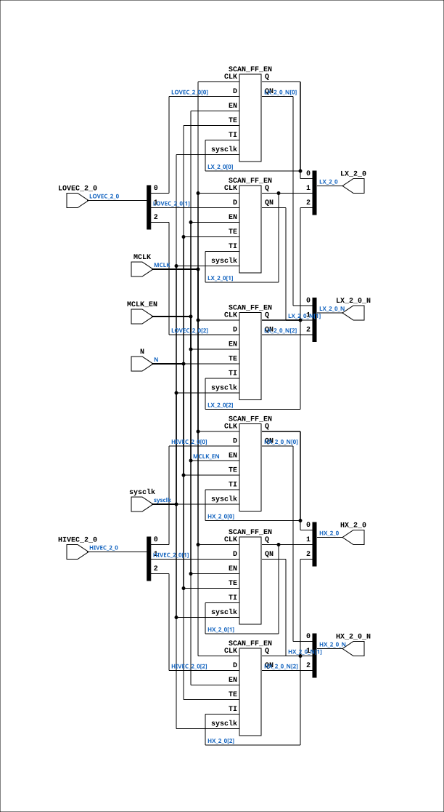

# CGA_INTR_CNTLR_VECGEN_VHR

Source: `Verilog/DELILAH-CPU/CGA_INTR/circuit/CGA_INTR_CNTLR_VECGEN_VHR.v`

<!-- Generated by Verilog/tests/module_doc.py from the //! comments in the source. Do not edit by hand - edit the RTL comments and regenerate. -->

<!-- HIERARCHY-NAV:BEGIN - written by Verilog/tests/gen_hierarchy.py, do not edit -->

**Where it sits** (Simulation): [ND120_TOP](../../../../doc/ND120_TOP.md) > [ND120_CORE](../../../../doc/ND120_CORE.md) > [ND3202D](../../../../CPU-BOARD-3202/circuit/doc/ND3202D.md) > [CPU_15](../../../../CPU-BOARD-3202/circuit/doc/CPU_15.md) > [CPU_PROC_32](../../../../CPU-BOARD-3202/circuit/doc/CPU_PROC_32.md) > [CPU_PROC_CGA_33](../../../../CPU-BOARD-3202/circuit/doc/CPU_PROC_CGA_33.md) > [CGA](../../../CGA/circuit/doc/CGA.md) > [CGA_INTR](CGA_INTR.md) > [CGA_INTR_CNTLR](CGA_INTR_CNTLR.md) > [CGA_INTR_CNTLR_VECGEN](CGA_INTR_CNTLR_VECGEN.md) > **CGA_INTR_CNTLR_VECGEN_VHR**
- instance path: `CORE.CPU_BOARD.CPU.PROC.CGA.DELILAH.INTR.CNTLR.VECGEN.VHR`

**Used in:** [CGA_INTR_CNTLR_VECGEN](CGA_INTR_CNTLR_VECGEN.md) (all tops)

**Contains:** [SCAN_FF_EN](../../../../Shared/ndlib/doc/SCAN_FF_EN.md) x6

[Module hierarchy](../../../../HIERARCHY.md) - [All modules](../../../../MODULES.md)

<!-- HIERARCHY-NAV:END -->


<!-- SCHEMATIC:BEGIN - written by Verilog/tests/gen_schematics.py, do not edit -->

## Schematic

Drawn from the Verilog: the yosys netlist of the Simulation (Verilator) build, instance `CORE.CPU_BOARD.CPU.PROC.CGA.DELILAH.INTR.CNTLR.VECGEN.VHR`. Sub-modules are boxes (click the picture to open it full size; there every sub-module box links to its page, and every wire shows its Verilog name).

[](CGA_INTR_CNTLR_VECGEN_VHR.svg)

<!-- SCHEMATIC:END -->

## Description

ND120 CGA (CPU Gate Array / DELILAH)
/CGA/INTR/CNTLR/VECGEN/VHR
VHR
Page 86
SHEET 1 of 1
Last reviewed: 10-NOV-2024
Ronny Hansen

## Ports

| Direction | Width | Name | Description |
|---|---|---|---|
| input | `1` | `sysclk` | FPGA system clock (P2: MCLK_EN capture) |
| input | `1` | `MCLK_EN` | MCLK clock-enable pulse (FPGA_FF_MODE, else 0) |
| input | `[2:0]` | `HIVEC_2_0` |  |
| input | `[2:0]` | `LOVEC_2_0` |  |
| input | `1` | `MCLK` | Master Clock (from CGA_INTR.MCLK) |
| input | `1` | `N` |  |
| output | `[2:0]` | `HX_2_0` |  |
| output | `[2:0]` | `HX_2_0_N` *(active low)* |  |
| output | `[2:0]` | `LX_2_0` |  |
| output | `[2:0]` | `LX_2_0_N` *(active low)* |  |

## Verilog source

[`Verilog/DELILAH-CPU/CGA_INTR/circuit/CGA_INTR_CNTLR_VECGEN_VHR.v`](https://github.com/RetroCoreLabs/nd-120/blob/main/Verilog/DELILAH-CPU/CGA_INTR/circuit/CGA_INTR_CNTLR_VECGEN_VHR.v) on GitHub.

<details markdown="1">
<summary>Show the Verilog of CGA_INTR_CNTLR_VECGEN_VHR (145 lines)</summary>

```verilog
/**************************************************************************
** ND120 CGA (CPU Gate Array / DELILAH)                                  **
** /CGA/INTR/CNTLR/VECGEN/VHR                                            **
** VHR                                                                   **
**                                                                       **
** Page 86                                                               **
** SHEET 1 of 1                                                          **
**                                                                       **
** Last reviewed: 10-NOV-2024                                            **
** Ronny Hansen                                                          **
***************************************************************************/

module CGA_INTR_CNTLR_VECGEN_VHR (
    input       sysclk,   //! FPGA system clock (P2: MCLK_EN capture)
    input       MCLK_EN,  //! MCLK clock-enable pulse (FPGA_FF_MODE, else 0)

    input [2:0] HIVEC_2_0,
    input [2:0] LOVEC_2_0,
    input       MCLK,     //! Master Clock (from CGA_INTR.MCLK)
    input       N,

    output [2:0] HX_2_0,
    output [2:0] HX_2_0_N,
    output [2:0] LX_2_0,
    output [2:0] LX_2_0_N
);

  /*******************************************************************************
   ** The wires are defined here                                                 **
   *******************************************************************************/
  wire [2:0] s_hivec_2_0;
  wire [2:0] s_hx_2_0_n_out;
  wire [2:0] s_hx_2_0_out;
  wire [2:0] s_lovec_2_0;
  wire [2:0] s_lx_2_0_n_out;
  wire [2:0] s_lx_2_0_out;
  wire       s_mclk;
  wire       s_n;

  /*******************************************************************************
   ** The module functionality is described here                                 **
   *******************************************************************************/

  /*******************************************************************************
   ** Here all input connections are defined                                     **
   *******************************************************************************/
  assign s_lovec_2_0[2:0] = LOVEC_2_0;
  assign s_hivec_2_0[2:0] = HIVEC_2_0;
  assign s_n              = N;
  assign s_mclk           = MCLK;

  // P2 (docs/plan-fix-unconstrained-clocks.md): in FF mode the MCLK-
  // clocked registers capture on posedge sysclk gated by MCLK_EN
  // (aligned to the MCLK rise) instead of clocking on the routed net.
`ifdef FPGA_FF_MODE
  localparam MCLK_CE = 1;
`else
  localparam MCLK_CE = 0;
`endif

  /*******************************************************************************
   ** Here all output connections are defined                                    **
   *******************************************************************************/
  assign HX_2_0           = s_hx_2_0_out[2:0];
  assign HX_2_0_N         = s_hx_2_0_n_out[2:0];
  assign LX_2_0           = s_lx_2_0_out[2:0];
  assign LX_2_0_N         = s_lx_2_0_n_out[2:0];

  /*******************************************************************************
   ** Here all sub-circuits are defined                                          **
   *******************************************************************************/

  // MCLK domain (CGA_INTR.MCLK, rising edge)
  SCAN_FF_EN #(.USE_ENABLE(MCLK_CE)) HX1 (
      .sysclk(sysclk),
      .EN(MCLK_EN),
      .CLK(s_mclk),
      .D  (s_hivec_2_0[1]),
      .Q  (s_hx_2_0_out[1]),
      .QN (s_hx_2_0_n_out[1]),
      .TE (s_n),
      .TI (s_hx_2_0_out[1])
  );

  // MCLK domain (CGA_INTR.MCLK, rising edge)
  SCAN_FF_EN #(.USE_ENABLE(MCLK_CE)) HX2 (
      .sysclk(sysclk),
      .EN(MCLK_EN),
      .CLK(s_mclk),
      .D  (s_hivec_2_0[2]),
      .Q  (s_hx_2_0_out[2]),
      .QN (s_hx_2_0_n_out[2]),
      .TE (s_n),
      .TI (s_hx_2_0_out[2])
  );

  // MCLK domain (CGA_INTR.MCLK, rising edge)
  SCAN_FF_EN #(.USE_ENABLE(MCLK_CE)) LX1 (
      .sysclk(sysclk),
      .EN(MCLK_EN),
      .CLK(s_mclk),
      .D  (s_lovec_2_0[1]),
      .Q  (s_lx_2_0_out[1]),
      .QN (s_lx_2_0_n_out[1]),
      .TE (s_n),
      .TI (s_lx_2_0_out[1])
  );

  // MCLK domain (CGA_INTR.MCLK, rising edge)
  SCAN_FF_EN #(.USE_ENABLE(MCLK_CE)) HX0 (
      .sysclk(sysclk),
      .EN(MCLK_EN),
      .CLK(s_mclk),
      .D  (s_hivec_2_0[0]),
      .Q  (s_hx_2_0_out[0]),
      .QN (s_hx_2_0_n_out[0]),
      .TE (s_n),
      .TI (s_hx_2_0_out[0])
  );

  // MCLK domain (CGA_INTR.MCLK, rising edge)
  SCAN_FF_EN #(.USE_ENABLE(MCLK_CE)) LX2 (
      .sysclk(sysclk),
      .EN(MCLK_EN),
      .CLK(s_mclk),
      .D  (s_lovec_2_0[2]),
      .Q  (s_lx_2_0_out[2]),
      .QN (s_lx_2_0_n_out[2]),
      .TE (s_n),
      .TI (s_lx_2_0_out[2])
  );

  // MCLK domain (CGA_INTR.MCLK, rising edge)
  SCAN_FF_EN #(.USE_ENABLE(MCLK_CE)) LX0 (
      .sysclk(sysclk),
      .EN(MCLK_EN),
      .CLK(s_mclk),
      .D  (s_lovec_2_0[0]),
      .Q  (s_lx_2_0_out[0]),
      .QN (s_lx_2_0_n_out[0]),
      .TE (s_n),
      .TI (s_lx_2_0_out[0])
  );

endmodule
```

</details>
