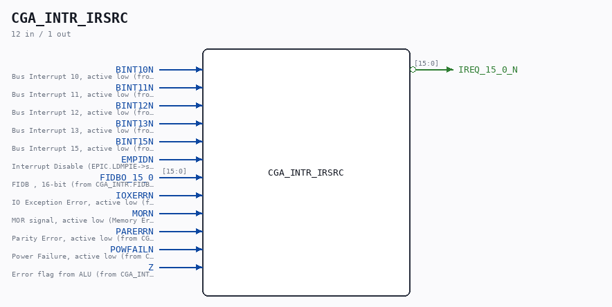

# CGA_INTR_IRSRC

Source: `Verilog/DELILAH-CPU/CGA_INTR/circuit/CGA_INTR_IRSRC.v`

<!-- Generated by Verilog/tests/module_doc.py from the //! comments in the source. Do not edit by hand - edit the RTL comments and regenerate. -->

<!-- HIERARCHY-NAV:BEGIN - written by Verilog/tests/gen_hierarchy.py, do not edit -->

**Where it sits** (Simulation): [ND120_TOP](../../../../doc/ND120_TOP.md) > [ND120_CORE](../../../../doc/ND120_CORE.md) > [ND3202D](../../../../CPU-BOARD-3202/circuit/doc/ND3202D.md) > [CPU_15](../../../../CPU-BOARD-3202/circuit/doc/CPU_15.md) > [CPU_PROC_32](../../../../CPU-BOARD-3202/circuit/doc/CPU_PROC_32.md) > [CPU_PROC_CGA_33](../../../../CPU-BOARD-3202/circuit/doc/CPU_PROC_CGA_33.md) > [CGA](../../../CGA/circuit/doc/CGA.md) > [CGA_INTR](CGA_INTR.md) > **CGA_INTR_IRSRC**
- instance path: `CORE.CPU_BOARD.CPU.PROC.CGA.DELILAH.INTR.IRSRC`

**Used in:** [CGA_INTR](CGA_INTR.md) (all tops)

**Contains:** [NAND_GATE](../../../../Shared/logisim/doc/NAND_GATE.md) x16, [NOR_GATE](../../../../Shared/logisim/doc/NOR_GATE.md) x10

[Module hierarchy](../../../../HIERARCHY.md) - [All modules](../../../../MODULES.md)

<!-- HIERARCHY-NAV:END -->

## Description

ND120 CGA (CPU Gate Array / DELILAH)
/CGA/INTR/IRSRC
Interrupt Source
Page 76
SHEET 1 of 1
Last reviewed: 10-NOV-2024
Ronny Hansen

## Ports

| Direction | Width | Name | Description |
|---|---|---|---|
| input | `1` | `BINT10N` |  |
| input | `1` | `BINT11N` |  |
| input | `1` | `BINT12N` |  |
| input | `1` | `BINT13N` |  |
| input | `1` | `BINT15N` |  |
| input | `1` | `EMPIDN` |  |
| input | `[15:0]` | `FIDBO_15_0` |  |
| input | `1` | `IOXERRN` |  |
| input | `1` | `MORN` |  |
| input | `1` | `PARERRN` |  |
| input | `1` | `POWFAILN` |  |
| input | `1` | `Z` |  |
| output | `[15:0]` | `IREQ_15_0_N` *(active low)* |  |
