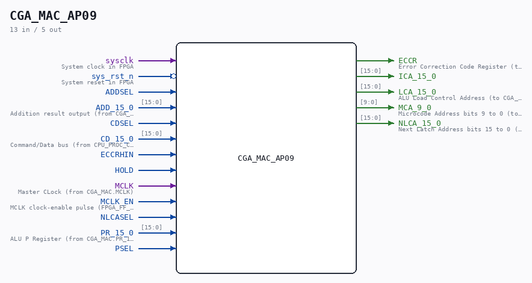

# CGA_MAC_AP09

Source: `Verilog/DELILAH-CPU/CGA_MAC/circuit/CGA_MAC_AP09.v`

> Generated by `Verilog/tests/module_doc.py` from the `//!`
> comments in the source. Do not edit by hand - edit the RTL comments and regenerate.

<!-- HIERARCHY-NAV:BEGIN - written by Verilog/tests/gen_hierarchy.py, do not edit -->

**Where it sits** (Simulation): [ND120_TOP](../../../../doc/ND120_TOP.md) > [ND120_CORE](../../../../doc/ND120_CORE.md) > [ND3202D](../../../../CPU-BOARD-3202/circuit/doc/ND3202D.md) > [CPU_15](../../../../CPU-BOARD-3202/circuit/doc/CPU_15.md) > [CPU_PROC_32](../../../../CPU-BOARD-3202/circuit/doc/CPU_PROC_32.md) > [CPU_PROC_CGA_33](../../../../CPU-BOARD-3202/circuit/doc/CPU_PROC_CGA_33.md) > [CGA](../../../CGA/circuit/doc/CGA.md) > [CGA_MAC](CGA_MAC.md) > **CGA_MAC_AP09**
- instance path: `CORE.CPU_BOARD.CPU.PROC.CGA.DELILAH.MAC.MAC_AP09`

**Used in:** [CGA_MAC](CGA_MAC.md) (all tops)

**Contains:** [A02](../../../../Shared/ndlib/doc/A02.md) x32, [CGA_MAC_APOS_CALCA](CGA_MAC_APOS_CALCA.md), [CGA_MAC_APOS_INC](CGA_MAC_APOS_INC.md), [NAND_GATE](../../../../Shared/logisim/doc/NAND_GATE.md) x16, [OR_GATE_3_INPUTS](../../../../Shared/logisim/doc/OR_GATE_3_INPUTS.md) x16

[Module hierarchy](../../../../HIERARCHY.md) - [All modules](../../../../MODULES.md)

<!-- HIERARCHY-NAV:END -->

## Description

ND120 CGA (CPU Gate Array / DELILAH)
/CGA/MAC/AP09
AP09
Page 31
SHEET 1 of 1
Last reviewed: 14-DEC-2024
Ronny Hansen

## Ports

| Direction | Width | Name | Description |
|---|---|---|---|
| input | `1` | `sysclk` | System clock in FPGA |
| input | `1` | `sys_rst_n` *(active low)* | System reset in FPGA |
| input | `1` | `ADDSEL` |  |
| input | `[15:0]` | `ADD_15_0` |  |
| input | `1` | `CDSEL` |  |
| input | `[15:0]` | `CD_15_0` |  |
| input | `1` | `ECCRHIN` |  |
| input | `1` | `HOLD` |  |
| input | `1` | `MCLK` |  |
| input | `1` | `MCLK_EN` | MCLK clock-enable pulse (FPGA_FF_MODE, else 0) |
| input | `1` | `NLCASEL` |  |
| input | `[15:0]` | `PR_15_0` |  |
| input | `1` | `PSEL` |  |
| output | `1` | `ECCR` |  |
| output | `[15:0]` | `ICA_15_0` |  |
| output | `[15:0]` | `LCA_15_0` |  |
| output | `[9:0]` | `MCA_9_0` |  |
| output | `[15:0]` | `NLCA_15_0` |  |
