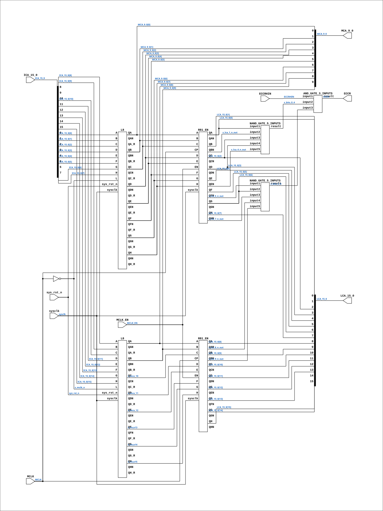

# CGA_MAC_APOS_CALCA

Source: `Verilog/DELILAH-CPU/CGA_MAC/circuit/CGA_MAC_APOS_CALCA.v`

<!-- Generated by Verilog/tests/module_doc.py from the //! comments in the source. Do not edit by hand - edit the RTL comments and regenerate. -->

<!-- HIERARCHY-NAV:BEGIN - written by Verilog/tests/gen_hierarchy.py, do not edit -->

**Where it sits** (Simulation): [ND120_TOP](../../../../doc/ND120_TOP.md) > [ND120_CORE](../../../../doc/ND120_CORE.md) > [ND3202D](../../../../CPU-BOARD-3202/circuit/doc/ND3202D.md) > [CPU_15](../../../../CPU-BOARD-3202/circuit/doc/CPU_15.md) > [CPU_PROC_32](../../../../CPU-BOARD-3202/circuit/doc/CPU_PROC_32.md) > [CPU_PROC_CGA_33](../../../../CPU-BOARD-3202/circuit/doc/CPU_PROC_CGA_33.md) > [CGA](../../../CGA/circuit/doc/CGA.md) > [CGA_MAC](CGA_MAC.md) > [CGA_MAC_AP09](CGA_MAC_AP09.md) > **CGA_MAC_APOS_CALCA**
- instance path: `CORE.CPU_BOARD.CPU.PROC.CGA.DELILAH.MAC.MAC_AP09.CALCA`

**Used in:** [CGA_MAC_AP09](CGA_MAC_AP09.md) (all tops)

**Contains:** [AND_GATE_3_INPUTS](../../../../Shared/logisim/doc/AND_GATE_3_INPUTS.md), [L8](../../../../Shared/ndlib/doc/L8.md) x2, [NAND_GATE_5_INPUTS](../../../../Shared/logisim/doc/NAND_GATE_5_INPUTS.md) x2, [R81_EN](../../../../Shared/ndlib/doc/R81_EN.md) x2

[Module hierarchy](../../../../HIERARCHY.md) - [All modules](../../../../MODULES.md)

<!-- HIERARCHY-NAV:END -->


<!-- SCHEMATIC:BEGIN - written by Verilog/tests/gen_schematics.py, do not edit -->

## Schematic

Drawn from the Verilog: the yosys netlist of the Simulation (Verilator) build, instance `CORE.CPU_BOARD.CPU.PROC.CGA.DELILAH.MAC.MAC_AP09.CALCA`. Sub-modules are boxes (click the picture to open it full size; there every sub-module box links to its page, and every wire shows its Verilog name).

[](CGA_MAC_APOS_CALCA.svg)

<!-- SCHEMATIC:END -->

## Description

ND120 CGA (CPU Gate Array / DELILAH)
/CGA/MAC/APOS/CALCA
CALCA
This module decodes the ECCR IOX register and generates
the local address (LCA) and memory address (MCA)
LCA source is ICA and is latched when MCLK is low
MCA source is ICA, and is latched on posedge on MCLK
Page 32
SHEET 1 of 1
Last reviewed: 9-FEB-2025
Ronny Hansen

## Ports

| Direction | Width | Name | Description |
|---|---|---|---|
| input | `1` | `sysclk` | System clock in FPGA |
| input | `1` | `sys_rst_n` *(active low)* | System reset in FPGA |
| input | `1` | `MCLK_EN` | MCLK clock-enable pulse (FPGA_FF_MODE, else 0) |
| input | `1` | `ECCRHIN` | ECCR HI (ECCR Hi bits valid) |
| input | `[15:0]` | `ICA_15_0` | CPU Address Input (16 bits) |
| input | `1` | `MCLK` | Memory Clock |
| output | `1` | `ECCR` | DECODE "TRR ECCR" = IOX 100115 |
| output | `[15:0]` | `LCA_15_0` | Local Address Output (16 bits) |
| output | `[9:0]` | `MCA_9_0` | Memory Address Output (10 bits) |

## Verilog source

[`Verilog/DELILAH-CPU/CGA_MAC/circuit/CGA_MAC_APOS_CALCA.v`](https://github.com/RetroCoreLabs/nd-120/blob/main/Verilog/DELILAH-CPU/CGA_MAC/circuit/CGA_MAC_APOS_CALCA.v) on GitHub.

<details markdown="1">
<summary>Show the Verilog of CGA_MAC_APOS_CALCA (303 lines)</summary>

```verilog
/**************************************************************************
** ND120 CGA (CPU Gate Array / DELILAH)                                  **
** /CGA/MAC/APOS/CALCA                                                   **
** CALCA                                                                 **
**                                                                       **
** This module decodes the ECCR IOX register and generates               **
** the local address (LCA) and memory address (MCA)                      **
**                                                                       **
** LCA source is ICA and is latched when MCLK is low                     **
** MCA source is ICA, and is latched on posedge on MCLK                  **
**                                                                       **
** Page 32                                                               **
** SHEET 1 of 1                                                          **
**                                                                       **
** Last reviewed: 9-FEB-2025                                             **
** Ronny Hansen                                                          **
***************************************************************************/

// 

module CGA_MAC_APOS_CALCA (
     // System input signals
    input sysclk,    // System clock in FPGA
    input sys_rst_n, // System reset in FPGA

    // Input signals
    input        MCLK_EN,   //! MCLK clock-enable pulse (FPGA_FF_MODE, else 0)
    input        ECCRHIN,   //! ECCR HI (ECCR Hi bits valid)
    input [15:0] ICA_15_0,  //! CPU Address Input (16 bits)
    input        MCLK,      //! Memory Clock

    // Output signals
    output        ECCR,      //! DECODE "TRR ECCR" = IOX 100115
    output [15:0] LCA_15_0,  //! Local Address Output (16 bits)
    output [ 9:0] MCA_9_0    //! Memory Address Output (10 bits)
);

  /*******************************************************************************
   ** The wires are defined here                                                 **
   *******************************************************************************/
  wire [ 9:0] s_mca_9_0_out;
  wire [15:0] s_lca_15_0_out;
  wire [15:0] s_ica_15_0;
  wire        s_eccr_out;
  wire        s_eccrhi_n;
  wire        s_bits_0_4;
  wire        s_bits_5_9;
  wire        s_mca_10;
  wire        s_mca_11;
  wire        s_mca_12;
  wire        s_mca13;
  wire        s_mca14;
  wire        s_mca15;
  wire        s_mclk_n;
  wire        s_mclk;

  wire        s_lca_1_n_out;
  wire        s_lca_4_n_out;
  wire        s_lca_5_n_out;
  wire        s_lca_7_n_out;
  wire        s_lca_8_n_out;
  wire        s_lca_9_n_out;

  /*******************************************************************************
   ** Here all input connections are defined                                     **
   *******************************************************************************/
  assign s_ica_15_0[15:0] = ICA_15_0;
  assign s_mclk           = MCLK;
  assign s_eccrhi_n       = ECCRHIN;

  // P2 (docs/plan-fix-unconstrained-clocks.md): in FF mode the MCLK-
  // clocked registers capture on posedge sysclk gated by MCLK_EN
  // (aligned to the MCLK rise) instead of clocking on the routed net.
  // The L8 latches (transparent while MCLK is low) are untouched.
`ifdef FPGA_FF_MODE
  localparam MCLK_CE = 1;
`else
  localparam MCLK_CE = 0;
`endif

  /*******************************************************************************
   ** Here all output connections are defined                                    **
   *******************************************************************************/
  assign ECCR             = s_eccr_out;
  assign LCA_15_0         = s_lca_15_0_out[15:0];
  assign MCA_9_0          = s_mca_9_0_out[9:0];

  /*******************************************************************************
   ** Here all in-lined components are defined                                   **
   *******************************************************************************/

  // NOT Gate
  assign s_mclk_n         = ~s_mclk;

  /*******************************************************************************
   ** Here all normal components are defined                                     **
   *******************************************************************************/

  // Decode "TRR ECCR" = IOX 100115
  // 1000_0000_0100_1101

  NAND_GATE_5_INPUTS #(
      .BubblesMask({1'b0, 4'h0})
  ) GATES_1 (
      .input1(s_lca_15_0_out[0]),
      .input2(s_lca_1_n_out),
      .input3(s_lca_15_0_out[2]),
      .input4(s_lca_15_0_out[3]),
      .input5(s_lca_4_n_out),
      .result(s_bits_0_4)
  );

  NAND_GATE_5_INPUTS #(
      .BubblesMask({1'b0, 4'h0})
  ) GATES_2 (
      .input1(s_lca_5_n_out),
      .input2(s_lca_15_0_out[6]),
      .input3(s_lca_7_n_out),
      .input4(s_lca_8_n_out),
      .input5(s_lca_9_n_out),
      .result(s_bits_5_9)
  );

  // s_eccrhi_n is generated in CGA_MAC_LA1025
  // It checks bits 15-10 of the IOX address = 1000_00
  // Later: Refactor this decoding to be done here (?)

  AND_GATE_3_INPUTS #(
      .BubblesMask(3'b111)
  ) GATES_3 (
      .input1(s_eccrhi_n),
      .input2(s_bits_0_4),
      .input3(s_bits_5_9),
      .result(s_eccr_out)
  );


  R81_EN #(.USE_ENABLE(MCLK_CE)) R_LO (
      .sysclk(sysclk),
      .EN(MCLK_EN),
      .CP(s_mclk),
      .A (s_mca_9_0_out[0]),
      .B (s_mca_9_0_out[1]),
      .C (s_mca_9_0_out[2]),
      .D (s_mca_9_0_out[3]),
      .E (s_mca_9_0_out[4]),
      .F (s_mca_9_0_out[5]),
      .G (s_mca_9_0_out[6]),
      .H (s_mca_9_0_out[7]),

      .QA (s_lca_15_0_out[0]),
      .QAN(),

      .QB (s_lca_15_0_out[1]),
      .QBN(s_lca_1_n_out),

      .QC (s_lca_15_0_out[2]),
      .QCN(),

      .QD (s_lca_15_0_out[3]),
      .QDN(),

      .QE (s_lca_15_0_out[4]),
      .QEN(s_lca_4_n_out),

      .QF (s_lca_15_0_out[5]),
      .QFN(s_lca_5_n_out),

      .QG (s_lca_15_0_out[6]),
      .QGN(),

      .QH (s_lca_15_0_out[7]),
      .QHN(s_lca_7_n_out)
  );

  R81_EN #(.USE_ENABLE(MCLK_CE)) R_HI (
      .sysclk(sysclk),
      .EN(MCLK_EN),
      .CP(s_mclk),
      .A (s_mca_9_0_out[8]),
      .B (s_mca_9_0_out[9]),
      .C (s_mca_10),
      .D (s_mca_11),
      .E (s_mca_12),
      .F (s_mca13),
      .G (s_mca14),
      .H (s_mca15),

      .QA (s_lca_15_0_out[8]),
      .QAN(s_lca_8_n_out),

      .QB (s_lca_15_0_out[9]),
      .QBN(s_lca_9_n_out),

      .QC (s_lca_15_0_out[10]),
      .QCN(),

      .QD (s_lca_15_0_out[11]),
      .QDN(),

      .QE (s_lca_15_0_out[12]),
      .QEN(),

      .QF (s_lca_15_0_out[13]),
      .QFN(),

      .QG (s_lca_15_0_out[14]),
      .QGN(),

      .QH (s_lca_15_0_out[15]),
      .QHN()
  );

  L8 L_LO 
  (
    // Input signals
    .sysclk(sysclk),                          // System clock in FPGA
    .sys_rst_n(sys_rst_n),                    // System reset in FPGA

    .L(s_mclk_n),

    .A(s_ica_15_0[0]),
    .B(s_ica_15_0[1]),
    .C(s_ica_15_0[2]),
    .D(s_ica_15_0[3]),
    .E(s_ica_15_0[4]),
    .F(s_ica_15_0[5]),
    .G(s_ica_15_0[6]),
    .H(s_ica_15_0[7]),

    .QA (s_mca_9_0_out[0]),
    .QAN(),
    .QB (s_mca_9_0_out[1]),
    .QBN(),
    .QC (s_mca_9_0_out[2]),
    .QCN(),
    .QD (s_mca_9_0_out[3]),
    .QDN(),
    .QE (s_mca_9_0_out[4]),
    .QEN(),
    .QF (s_mca_9_0_out[5]),
    .QFN(),
    .QG (s_mca_9_0_out[6]),
    .QGN(),
    .QH (s_mca_9_0_out[7]),
    .QHN(),
    // registered-value taps: deliberately unconnected here -
    // the transparent output is the wanted one (see L8/L4 header).
    .QA_R(),
    .QB_R(),
    .QC_R(),
    .QD_R(),
    .QE_R(),
    .QF_R(),
    .QG_R(),
    .QH_R()
);

  L8 L_HI (
    // Input signals
    .sysclk(sysclk),                          // System clock in FPGA
    .sys_rst_n(sys_rst_n),                    // System reset in FPGA

    .L(s_mclk_n),

    .A(s_ica_15_0[8]),
    .B(s_ica_15_0[9]),
    .C(s_ica_15_0[10]),
    .D(s_ica_15_0[11]),
    .E(s_ica_15_0[12]),
    .F(s_ica_15_0[13]),
    .G(s_ica_15_0[14]),
    .H(s_ica_15_0[15]),

    .QA (s_mca_9_0_out[8]),
    .QAN(),
    .QB (s_mca_9_0_out[9]),
    .QBN(),
    .QC (s_mca_10),
    .QCN(),
    .QD (s_mca_11),
    .QDN(),
    .QE (s_mca_12),
    .QEN(),
    .QF (s_mca13),
    .QFN(),
    .QG (s_mca14),
    .QGN(),
    .QH (s_mca15),
    .QHN(),
    // registered-value taps: deliberately unconnected here -
    // the transparent output is the wanted one (see L8/L4 header).
    .QA_R(),
    .QB_R(),
    .QC_R(),
    .QD_R(),
    .QE_R(),
    .QF_R(),
    .QG_R(),
    .QH_R()
  );

endmodule
```

</details>
