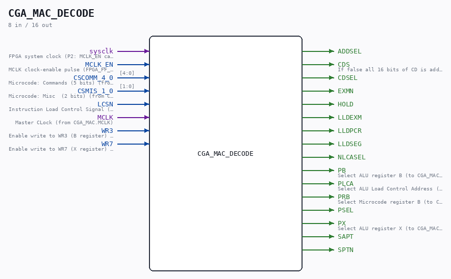

# CGA_MAC_DECODE

Source: `Verilog/DELILAH-CPU/CGA_MAC/circuit/CGA_MAC_DECODE.v`

<!-- Generated by Verilog/tests/module_doc.py from the //! comments in the source. Do not edit by hand - edit the RTL comments and regenerate. -->

<!-- HIERARCHY-NAV:BEGIN - written by Verilog/tests/gen_hierarchy.py, do not edit -->

**Where it sits** (Simulation): [ND120_TOP](../../../../doc/ND120_TOP.md) > [ND120_CORE](../../../../doc/ND120_CORE.md) > [ND3202D](../../../../CPU-BOARD-3202/circuit/doc/ND3202D.md) > [CPU_15](../../../../CPU-BOARD-3202/circuit/doc/CPU_15.md) > [CPU_PROC_32](../../../../CPU-BOARD-3202/circuit/doc/CPU_PROC_32.md) > [CPU_PROC_CGA_33](../../../../CPU-BOARD-3202/circuit/doc/CPU_PROC_CGA_33.md) > [CGA](../../../CGA/circuit/doc/CGA.md) > [CGA_MAC](CGA_MAC.md) > **CGA_MAC_DECODE**
- instance path: `CORE.CPU_BOARD.CPU.PROC.CGA.DELILAH.MAC.MAC_DECODE`

**Used in:** [CGA_MAC](CGA_MAC.md) (all tops)

**Contains:** [NAND_GATE](../../../../Shared/logisim/doc/NAND_GATE.md) x10, [NAND_GATE_3_INPUTS](../../../../Shared/logisim/doc/NAND_GATE_3_INPUTS.md) x18, [NAND_GATE_4_INPUTS](../../../../Shared/logisim/doc/NAND_GATE_4_INPUTS.md) x11, [NAND_GATE_5_INPUTS](../../../../Shared/logisim/doc/NAND_GATE_5_INPUTS.md) x5, [NAND_GATE_6_INPUTS](../../../../Shared/logisim/doc/NAND_GATE_6_INPUTS.md) x6, [NAND_GATE_7_INPUTS](../../../../Shared/logisim/doc/NAND_GATE_7_INPUTS.md), [NAND_GATE_8_INPUTS](../../../../Shared/logisim/doc/NAND_GATE_8_INPUTS.md) x5, [NOR_GATE](../../../../Shared/logisim/doc/NOR_GATE.md) x2, [NOR_GATE_4_INPUTS](../../../../Shared/logisim/doc/NOR_GATE_4_INPUTS.md) x2, [R41P_EN](../../../../Shared/ndlib/doc/R41P_EN.md)

[Module hierarchy](../../../../HIERARCHY.md) - [All modules](../../../../MODULES.md)

<!-- HIERARCHY-NAV:END -->

## Description

ND120 CGA (CPU Gate Array / DELILAH)
/CGA/MAC/DECODE
INCREMENT
Page 25-28
SHEET 1-4
Last reviewed: 10-NOV-2024
Ronny Hansen

## Ports

| Direction | Width | Name | Description |
|---|---|---|---|
| input | `1` | `sysclk` | FPGA system clock (P2: MCLK_EN capture) |
| input | `1` | `MCLK_EN` | MCLK clock-enable pulse (FPGA_FF_MODE, else 0) |
| input | `[4:0]` | `CSCOMM_4_0` |  |
| input | `[1:0]` | `CSMIS_1_0` |  |
| input | `1` | `LCSN` |  |
| input | `1` | `MCLK` |  |
| input | `1` | `WR3` |  |
| input | `1` | `WR7` |  |
| output | `1` | `ADDSEL` |  |
| output | `1` | `CDS` |  |
| output | `1` | `CDSEL` |  |
| output | `1` | `EXMN` |  |
| output | `1` | `HOLD` |  |
| output | `1` | `LLDEXM` |  |
| output | `1` | `LLDPCR` |  |
| output | `1` | `LLDSEG` |  |
| output | `1` | `NLCASEL` |  |
| output | `1` | `PB` |  |
| output | `1` | `PLCA` |  |
| output | `1` | `PRB` |  |
| output | `1` | `PSEL` |  |
| output | `1` | `PX` |  |
| output | `1` | `SAPT` |  |
| output | `1` | `SPTN` |  |
