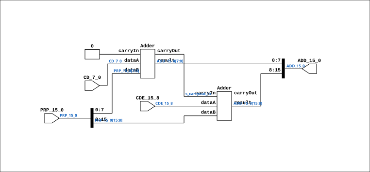

# CGA_MAC_FASTADD

Source: `Verilog/DELILAH-CPU/CGA_MAC/circuit/CGA_MAC_FASTADD.v`

<!-- Generated by Verilog/tests/module_doc.py from the //! comments in the source. Do not edit by hand - edit the RTL comments and regenerate. -->

<!-- HIERARCHY-NAV:BEGIN - written by Verilog/tests/gen_hierarchy.py, do not edit -->

**Where it sits** (Simulation): [ND120_TOP](../../../../doc/ND120_TOP.md) > [ND120_CORE](../../../../doc/ND120_CORE.md) > [ND3202D](../../../../CPU-BOARD-3202/circuit/doc/ND3202D.md) > [CPU_15](../../../../CPU-BOARD-3202/circuit/doc/CPU_15.md) > [CPU_PROC_32](../../../../CPU-BOARD-3202/circuit/doc/CPU_PROC_32.md) > [CPU_PROC_CGA_33](../../../../CPU-BOARD-3202/circuit/doc/CPU_PROC_CGA_33.md) > [CGA](../../../CGA/circuit/doc/CGA.md) > [CGA_MAC](CGA_MAC.md) > [CGA_MAC_ADD](CGA_MAC_ADD.md) > **CGA_MAC_FASTADD**
- instance path: `CORE.CPU_BOARD.CPU.PROC.CGA.DELILAH.MAC.MAC_ADD.FASTADD`

**Used in:** [CGA_MAC_ADD](CGA_MAC_ADD.md) (all tops)

**Contains:** [Adder](../../../../Shared/logisim/doc/Adder.md) x2

[Module hierarchy](../../../../HIERARCHY.md) - [All modules](../../../../MODULES.md)

<!-- HIERARCHY-NAV:END -->


<!-- SCHEMATIC:BEGIN - written by Verilog/tests/gen_schematics.py, do not edit -->

## Schematic

Drawn from the Verilog: the yosys netlist of the Simulation (Verilator) build, instance `CORE.CPU_BOARD.CPU.PROC.CGA.DELILAH.MAC.MAC_ADD.FASTADD`. Sub-modules are boxes (click the picture to open it full size; there every sub-module box links to its page, and every wire shows its Verilog name).

[](CGA_MAC_FASTADD.svg)

<!-- SCHEMATIC:END -->

## Description

ND120 CGA (CPU Gate Array / DELILAH)
/CGA/MAC/ADD/FASTADD
ADD
Page 30
SHEET 1 of 1
Last reviewed: 10-NOV-2024
Ronny Hansen

## Ports

| Direction | Width | Name | Description |
|---|---|---|---|
| input | `[7:0]` | `CDE_15_8` |  |
| input | `[7:0]` | `CD_7_0` | CPU data (Added to the selected register) (from CGA_MAC_ADD.CD_15_0[7:0]) |
| input | `[15:0]` | `PRP_15_0` |  |
| output | `[15:0]` | `ADD_15_0` | Addition result output (to CGA_MAC_ADD.ADD_15_0) |

## Verilog source

[`Verilog/DELILAH-CPU/CGA_MAC/circuit/CGA_MAC_FASTADD.v`](https://github.com/RetroCoreLabs/nd-120/blob/main/Verilog/DELILAH-CPU/CGA_MAC/circuit/CGA_MAC_FASTADD.v) on GitHub.

<details markdown="1">
<summary>Show the Verilog of CGA_MAC_FASTADD (69 lines)</summary>

```verilog
/**************************************************************************
** ND120 CGA (CPU Gate Array / DELILAH)                                  **
** /CGA/MAC/ADD/FASTADD                                                  **
** ADD                                                                   **
**                                                                       **
** Page 30                                                               **
** SHEET 1 of 1                                                          **
**                                                                       **
** Last reviewed: 10-NOV-2024                                            **
** Ronny Hansen                                                          **
***************************************************************************/

module CGA_MAC_FASTADD (
    input [ 7:0] CDE_15_8,
    input [ 7:0] CD_7_0,  //! CPU data (Added to the selected register) (from CGA_MAC_ADD.CD_15_0[7:0])
    input [15:0] PRP_15_0,

    output [15:0] ADD_15_0  //! Addition result output (to CGA_MAC_ADD.ADD_15_0)
);

  /*******************************************************************************
   ** The wires are defined here                                                 **
   *******************************************************************************/
  wire [7:0] s_cd_7_0;
  wire [7:0] s_cde_15_8;
  wire [15:0] s_add_15_0_out;
  wire [15:0] s_prp_15_0;

  wire s_carryout_lo; // Carry from the low-8 bits adder to the high-8 bits addder

  /*******************************************************************************
   ** Here all input connections are defined                                     **
   *******************************************************************************/
  assign s_cd_7_0[7:0]    = CD_7_0;
  assign s_cde_15_8[7:0]  = CDE_15_8;
  assign s_prp_15_0[15:0] = PRP_15_0;

  /*******************************************************************************
   ** Here all output connections are defined                                    **
   *******************************************************************************/
  assign ADD_15_0         = s_add_15_0_out[15:0];

  /*******************************************************************************
   ** Here all normal components are defined                                     **
   *******************************************************************************/
  Adder #(
      .extendedBits(9),
      .nrOfBits(8)
  ) ARITH_1 (
      .carryIn(1'b0),
      .carryOut(s_carryout_lo),
      .dataA(s_cd_7_0[7:0]),
      .dataB(s_prp_15_0[7:0]),
      .result(s_add_15_0_out[7:0])
  );

  Adder #(
      .extendedBits(9),
      .nrOfBits(8)
  ) ARITH_2 (
      .carryIn(s_carryout_lo),
      .carryOut(),
      .dataA(s_cde_15_8[7:0]),
      .dataB(s_prp_15_0[15:8]),
      .result(s_add_15_0_out[15:8])
  );


endmodule
```

</details>
