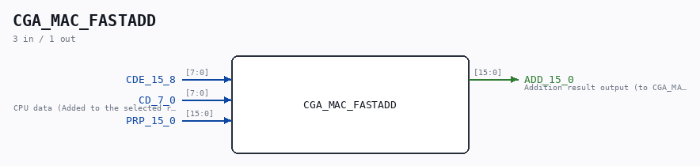

# CGA_MAC_FASTADD

Source: `Verilog/DELILAH-CPU/CGA_MAC/circuit/CGA_MAC_FASTADD.v`

> Generated by `Verilog/tests/module_doc.py` from the `//!`
> comments in the source. Do not edit by hand - edit the RTL comments and regenerate.

<!-- HIERARCHY-NAV:BEGIN - written by Verilog/tests/gen_hierarchy.py, do not edit -->

**Where it sits** (Simulation): [ND120_TOP](../../../../doc/ND120_TOP.md) > [ND120_CORE](../../../../doc/ND120_CORE.md) > [ND3202D](../../../../CPU-BOARD-3202/circuit/doc/ND3202D.md) > [CPU_15](../../../../CPU-BOARD-3202/circuit/doc/CPU_15.md) > [CPU_PROC_32](../../../../CPU-BOARD-3202/circuit/doc/CPU_PROC_32.md) > [CPU_PROC_CGA_33](../../../../CPU-BOARD-3202/circuit/doc/CPU_PROC_CGA_33.md) > [CGA](../../../CGA/circuit/doc/CGA.md) > [CGA_MAC](CGA_MAC.md) > [CGA_MAC_ADD](CGA_MAC_ADD.md) > **CGA_MAC_FASTADD**
- instance path: `CORE.CPU_BOARD.CPU.PROC.CGA.DELILAH.MAC.MAC_ADD.FASTADD`

**Used in:** [CGA_MAC_ADD](CGA_MAC_ADD.md) (all tops)

**Contains:** [Adder](../../../../Shared/logisim/doc/Adder.md) x2

[Module hierarchy](../../../../HIERARCHY.md) - [All modules](../../../../MODULES.md)

<!-- HIERARCHY-NAV:END -->

## Description

ND120 CGA (CPU Gate Array / DELILAH)
/CGA/MAC/ADD/FASTADD
ADD
Page 30
SHEET 1 of 1
Last reviewed: 10-NOV-2024
Ronny Hansen

## Ports

| Direction | Width | Name | Description |
|---|---|---|---|
| input | `[7:0]` | `CDE_15_8` |  |
| input | `[7:0]` | `CD_7_0` |  |
| input | `[15:0]` | `PRP_15_0` |  |
| output | `[15:0]` | `ADD_15_0` |  |
