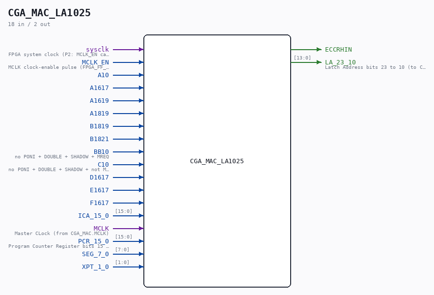

# CGA_MAC_LA1025

Source: `Verilog/DELILAH-CPU/CGA_MAC/circuit/CGA_MAC_LA1025.v`

<!-- Generated by Verilog/tests/module_doc.py from the //! comments in the source. Do not edit by hand - edit the RTL comments and regenerate. -->

<!-- HIERARCHY-NAV:BEGIN - written by Verilog/tests/gen_hierarchy.py, do not edit -->

**Where it sits** (Simulation): [ND120_TOP](../../../../doc/ND120_TOP.md) > [ND120_CORE](../../../../doc/ND120_CORE.md) > [ND3202D](../../../../CPU-BOARD-3202/circuit/doc/ND3202D.md) > [CPU_15](../../../../CPU-BOARD-3202/circuit/doc/CPU_15.md) > [CPU_PROC_32](../../../../CPU-BOARD-3202/circuit/doc/CPU_PROC_32.md) > [CPU_PROC_CGA_33](../../../../CPU-BOARD-3202/circuit/doc/CPU_PROC_CGA_33.md) > [CGA](../../../CGA/circuit/doc/CGA.md) > [CGA_MAC](CGA_MAC.md) > **CGA_MAC_LA1025**
- instance path: `CORE.CPU_BOARD.CPU.PROC.CGA.DELILAH.MAC.MAC_LA1025`

**Used in:** [CGA_MAC](CGA_MAC.md) (all tops)

**Contains:** [A02](../../../../Shared/ndlib/doc/A02.md) x16, [NAND_GATE](../../../../Shared/logisim/doc/NAND_GATE.md) x12, [NAND_GATE_6_INPUTS](../../../../Shared/logisim/doc/NAND_GATE_6_INPUTS.md), [OR_GATE](../../../../Shared/logisim/doc/OR_GATE.md) x8, [OR_GATE_4_INPUTS](../../../../Shared/logisim/doc/OR_GATE_4_INPUTS.md) x2, [R81_EN](../../../../Shared/ndlib/doc/R81_EN.md) x2

[Module hierarchy](../../../../HIERARCHY.md) - [All modules](../../../../MODULES.md)

<!-- HIERARCHY-NAV:END -->

## Description

ND120 CGA (CPU Gate Array / DELILAH)
/CGA/MAC/LA1025
ADD
Page 40
SHEET 1 of 1
Last reviewed: 02-FEB-2025
Ronny Hansen
02-FEB-2025 - Refactored and removed input bus PCR_15_0_N.
(Use bus PCR_15_0 only)

## Ports

| Direction | Width | Name | Description |
|---|---|---|---|
| input | `1` | `sysclk` | FPGA system clock (P2: MCLK_EN capture) |
| input | `1` | `MCLK_EN` | MCLK clock-enable pulse (FPGA_FF_MODE, else 0) |
| input | `1` | `A10` |  |
| input | `1` | `A1617` |  |
| input | `1` | `A1619` |  |
| input | `1` | `A1819` |  |
| input | `1` | `B1819` |  |
| input | `1` | `B1821` |  |
| input | `1` | `BB10` | no PONI + DOUBLE + SHADOW + MREQ |
| input | `1` | `C10` | no PONI + DOUBLE + SHADOW + not MREQ |
| input | `1` | `D1617` |  |
| input | `1` | `E1617` |  |
| input | `1` | `F1617` |  |
| input | `[15:0]` | `ICA_15_0` |  |
| input | `1` | `MCLK` |  |
| input | `[15:0]` | `PCR_15_0` |  |
| input | `[7:0]` | `SEG_7_0` |  |
| input | `[1:0]` | `XPT_1_0` |  |
| output | `1` | `ECCRHIN` |  |
| output | `[13:0]` | `LA_23_10` |  |
