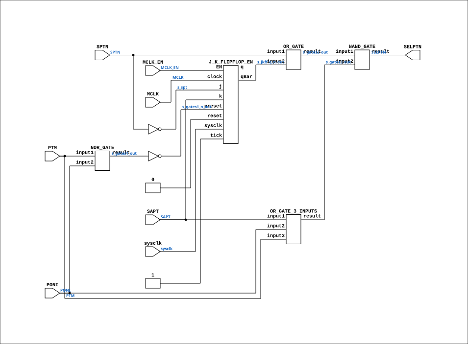

# CGA_MAC_PTSEL

Source: `Verilog/DELILAH-CPU/CGA_MAC/circuit/CGA_MAC_PTSEL.v`

<!-- Generated by Verilog/tests/module_doc.py from the //! comments in the source. Do not edit by hand - edit the RTL comments and regenerate. -->

<!-- HIERARCHY-NAV:BEGIN - written by Verilog/tests/gen_hierarchy.py, do not edit -->

**Where it sits** (Simulation): [ND120_TOP](../../../../doc/ND120_TOP.md) > [ND120_CORE](../../../../doc/ND120_CORE.md) > [ND3202D](../../../../CPU-BOARD-3202/circuit/doc/ND3202D.md) > [CPU_15](../../../../CPU-BOARD-3202/circuit/doc/CPU_15.md) > [CPU_PROC_32](../../../../CPU-BOARD-3202/circuit/doc/CPU_PROC_32.md) > [CPU_PROC_CGA_33](../../../../CPU-BOARD-3202/circuit/doc/CPU_PROC_CGA_33.md) > [CGA](../../../CGA/circuit/doc/CGA.md) > [CGA_MAC](CGA_MAC.md) > **CGA_MAC_PTSEL**
- instance path: `CORE.CPU_BOARD.CPU.PROC.CGA.DELILAH.MAC.MAC_PTSEL`

**Used in:** [CGA_MAC](CGA_MAC.md) (all tops)

**Contains:** [J_K_FLIPFLOP_EN](../../../../Shared/ndlib/doc/J_K_FLIPFLOP_EN.md), [NAND_GATE](../../../../Shared/logisim/doc/NAND_GATE.md), [NOR_GATE](../../../../Shared/logisim/doc/NOR_GATE.md), [OR_GATE](../../../../Shared/logisim/doc/OR_GATE.md), [OR_GATE_3_INPUTS](../../../../Shared/logisim/doc/OR_GATE_3_INPUTS.md)

[Module hierarchy](../../../../HIERARCHY.md) - [All modules](../../../../MODULES.md)

<!-- HIERARCHY-NAV:END -->


<!-- SCHEMATIC:BEGIN - written by Verilog/tests/gen_schematics.py, do not edit -->

## Schematic

Drawn from the Verilog: the yosys netlist of the Simulation (Verilator) build, instance `CORE.CPU_BOARD.CPU.PROC.CGA.DELILAH.MAC.MAC_PTSEL`. Sub-modules are boxes (click the picture to open it full size; there every sub-module box links to its page, and every wire shows its Verilog name).

[](CGA_MAC_PTSEL.svg)

<!-- SCHEMATIC:END -->

## Description

ND120 CGA (CPU Gate Array / DELILAH)
/CGA/MAC/PTSEL
PTSEL
Page 34
SHEET 1 of 1
Last reviewed: 10-NOV-2024
Ronny Hansen

## Ports

| Direction | Width | Name | Description |
|---|---|---|---|
| input | `1` | `sysclk` | FPGA system clock (P2: MCLK_EN capture) |
| input | `1` | `MCLK_EN` | MCLK clock-enable pulse (FPGA_FF_MODE, else 0) |
| input | `1` | `MCLK` | Master CLock (from CGA_MAC.MCLK) |
| input | `1` | `PONI` | Memory Protection ON, PONI=1 |
| input | `1` | `PTM` |  |
| input | `1` | `SAPT` |  |
| input | `1` | `SPTN` |  |
| output | `1` | `SELPTN` |  |

## Verilog source

[`Verilog/DELILAH-CPU/CGA_MAC/circuit/CGA_MAC_PTSEL.v`](https://github.com/RetroCoreLabs/nd-120/blob/main/Verilog/DELILAH-CPU/CGA_MAC/circuit/CGA_MAC_PTSEL.v) on GitHub.

<details markdown="1">
<summary>Show the Verilog of CGA_MAC_PTSEL (131 lines)</summary>

```verilog
/**************************************************************************
** ND120 CGA (CPU Gate Array / DELILAH)                                  **
 ** /CGA/MAC/PTSEL                                                       **
** PTSEL                                                                 **
**                                                                       **
** Page 34                                                               **
** SHEET 1 of 1                                                          **
**                                                                       **
** Last reviewed: 10-NOV-2024                                            **
** Ronny Hansen                                                          **
***************************************************************************/

module CGA_MAC_PTSEL (
    input sysclk,   //! FPGA system clock (P2: MCLK_EN capture)
    input MCLK_EN,  //! MCLK clock-enable pulse (FPGA_FF_MODE, else 0)

    input MCLK,     //! Master CLock (from CGA_MAC.MCLK)
    input PONI, //! Memory Protection ON, PONI=1
    input PTM,
    input SAPT,
    input SPTN,

    output SELPTN
);

  /*******************************************************************************
   ** The wires are defined here                                                 **
   *******************************************************************************/
  wire s_sapt;
  wire s_gates2_out;
  wire s_mclk;
  wire s_gates1_n_out;
  wire s_spt;
  wire s_gates3_out;
  wire s_gates4_out;
  wire s_ptm;
  wire s_poni;
  wire s_gates1_out;
  wire s_jkff_q_n_out;
  wire s_spt_n;
  wire s_gnd;

  /*******************************************************************************
   ** Here all input connections are defined                                     **
   *******************************************************************************/
  assign s_sapt = SAPT;
  assign s_mclk = MCLK;
  assign s_ptm = PTM;
  assign s_poni = PONI;
  assign s_spt_n = SPTN;

  // P2 (docs/plan-fix-unconstrained-clocks.md): in FF mode the MCLK-
  // clocked flip-flop captures on posedge sysclk gated by MCLK_EN
  // (aligned to the MCLK rise) instead of clocking on the routed net.
`ifdef FPGA_FF_MODE
  localparam MCLK_CE = 1;
`else
  localparam MCLK_CE = 0;
`endif

  /*******************************************************************************
   ** Here all output connections are defined                                    **
   *******************************************************************************/
  assign SELPTN = s_gates4_out;

  /*******************************************************************************
   ** Here all in-lined components are defined                                   **
   *******************************************************************************/

  // Ground
  assign s_gnd = 1'b0;

  // NOT Gate
  assign s_spt = ~s_spt_n;
  assign s_gates1_n_out = ~s_gates1_out;

  /*******************************************************************************
   ** Here all normal components are defined                                     **
   *******************************************************************************/
  NOR_GATE #(
      .BubblesMask(2'b11)
  ) GATES_1 (
      .input1(s_ptm),
      .input2(s_poni),
      .result(s_gates1_out)
  );

  OR_GATE #(
      .BubblesMask(2'b11)
  ) GATES_2 (
      .input1(s_spt_n),
      .input2(s_jkff_q_n_out),
      .result(s_gates2_out)
  );

  OR_GATE_3_INPUTS #(
      .BubblesMask(3'b111)
  ) GATES_3 (
      .input1(s_sapt),
      .input2(s_poni),
      .input3(s_ptm),
      .result(s_gates3_out)
  );

  NAND_GATE #(
      .BubblesMask(2'b00)
  ) GATES_4 (
      .input1(s_gates2_out),
      .input2(s_gates3_out),
      .result(s_gates4_out)
  );

  // InvertClockEnable(0): fires on the rising edge of s_mclk = posedge MCLK
  J_K_FLIPFLOP_EN #(
      .USE_ENABLE(MCLK_CE),
      .InvertClockEnable(0)
  ) MEMORY_5 (
      .sysclk(sysclk),
      .EN(MCLK_EN),
      .clock(s_mclk),
      .j(s_spt),
      .k(s_sapt),
      .preset(s_gates1_n_out),
      .q(),
      .qBar(s_jkff_q_n_out),
      .reset(s_gnd),
      .tick(1'b1)
  );


endmodule
```

</details>
