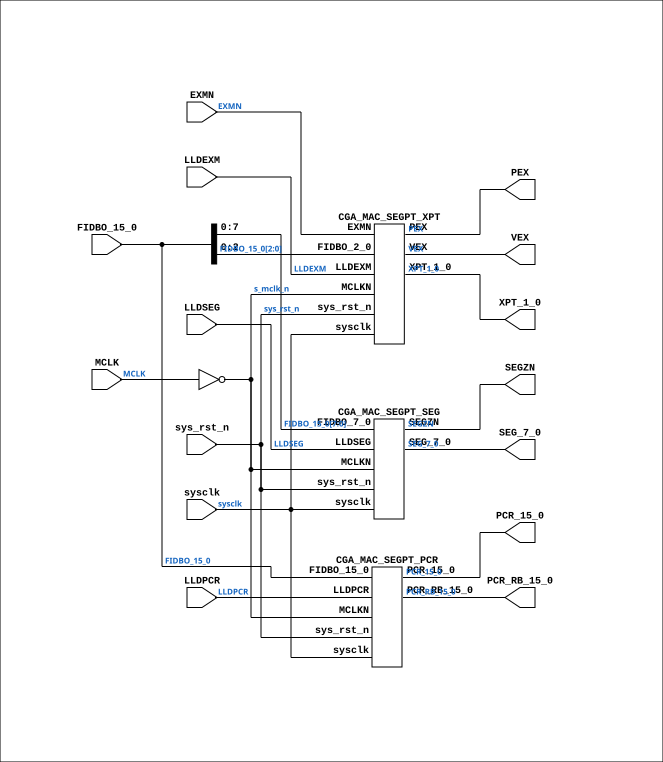

# CGA_MAC_SEGPT

Source: `Verilog/DELILAH-CPU/CGA_MAC/circuit/CGA_MAC_SEGPT.v`

<!-- Generated by Verilog/tests/module_doc.py from the //! comments in the source. Do not edit by hand - edit the RTL comments and regenerate. -->

<!-- HIERARCHY-NAV:BEGIN - written by Verilog/tests/gen_hierarchy.py, do not edit -->

**Where it sits** (Simulation): [ND120_TOP](../../../../doc/ND120_TOP.md) > [ND120_CORE](../../../../doc/ND120_CORE.md) > [ND3202D](../../../../CPU-BOARD-3202/circuit/doc/ND3202D.md) > [CPU_15](../../../../CPU-BOARD-3202/circuit/doc/CPU_15.md) > [CPU_PROC_32](../../../../CPU-BOARD-3202/circuit/doc/CPU_PROC_32.md) > [CPU_PROC_CGA_33](../../../../CPU-BOARD-3202/circuit/doc/CPU_PROC_CGA_33.md) > [CGA](../../../CGA/circuit/doc/CGA.md) > [CGA_MAC](CGA_MAC.md) > **CGA_MAC_SEGPT**
- instance path: `CORE.CPU_BOARD.CPU.PROC.CGA.DELILAH.MAC.MAC_SEGPT`

**Used in:** [CGA_MAC](CGA_MAC.md) (all tops)

**Contains:** [CGA_MAC_SEGPT_PCR](CGA_MAC_SEGPT_PCR.md), [CGA_MAC_SEGPT_SEG](CGA_MAC_SEGPT_SEG.md), [CGA_MAC_SEGPT_XPT](CGA_MAC_SEGPT_XPT.md)

[Module hierarchy](../../../../HIERARCHY.md) - [All modules](../../../../MODULES.md)

<!-- HIERARCHY-NAV:END -->


<!-- SCHEMATIC:BEGIN - written by Verilog/tests/gen_schematics.py, do not edit -->

## Schematic

Drawn from the Verilog: the yosys netlist of the Simulation (Verilator) build, instance `CORE.CPU_BOARD.CPU.PROC.CGA.DELILAH.MAC.MAC_SEGPT`. Sub-modules are boxes (click the picture to open it full size; there every sub-module box links to its page, and every wire shows its Verilog name).

[](CGA_MAC_SEGPT.svg)

<!-- SCHEMATIC:END -->

## Description

ND120 CGA (CPU Gate Array / DELILAH)
/CGA/MAC/SEGPT
SEGPT
Page 35
SHEET 1 of 1
Last reviewed: 9-FEB-2025
Ronny Hansen
02-FEB-2025 - Refactored and merged output PCR_14_13_10_9_N and
PCR_15_7_2_0 to PCR_15_0

## Ports

| Direction | Width | Name | Description |
|---|---|---|---|
| input | `1` | `sysclk` | System clock in FPGA |
| input | `1` | `sys_rst_n` *(active low)* | System reset in FPGA |
| input | `1` | `EXMN` |  |
| input | `[15:0]` | `FIDBO_15_0` | FIDBO output from previous stage (from CGA_MAC.FIDBO_15_0) |
| input | `1` | `LLDEXM` |  |
| input | `1` | `LLDPCR` |  |
| input | `1` | `LLDSEG` |  |
| input | `1` | `MCLK` | Master CLock (from CGA_MAC.MCLK) |
| output | `[15:0]` | `PCR_15_0` | Program Counter Register bits 15 to 0 (to CGA_MAC.PCR_15_0) |
| output | `[15:0]` | `PCR_RB_15_0` | registered readback tap for IDBCTL/SEL6 (loop cut) |
| output | `1` | `PEX` |  |
| output | `1` | `SEGZN` |  |
| output | `[7:0]` | `SEG_7_0` |  |
| output | `1` | `VEX` | Vector EXecute signal (to CGA_MAC.VEX) |
| output | `[1:0]` | `XPT_1_0` |  |

## Verilog source

[`Verilog/DELILAH-CPU/CGA_MAC/circuit/CGA_MAC_SEGPT.v`](https://github.com/RetroCoreLabs/nd-120/blob/main/Verilog/DELILAH-CPU/CGA_MAC/circuit/CGA_MAC_SEGPT.v) on GitHub.

<details markdown="1">
<summary>Show the Verilog of CGA_MAC_SEGPT (140 lines)</summary>

```verilog
/**************************************************************************
** ND120 CGA (CPU Gate Array / DELILAH)                                  **
** /CGA/MAC/SEGPT                                                        **
** SEGPT                                                                 **
**                                                                       **
** Page 35                                                               **
** SHEET 1 of 1                                                          **
**                                                                       **
** Last reviewed: 9-FEB-2025                                             **
** Ronny Hansen                                                          **
**                                                                       **
** 02-FEB-2025 - Refactored and merged output PCR_14_13_10_9_N and       **
**               PCR_15_7_2_0 to PCR_15_0                                **
***************************************************************************/


module CGA_MAC_SEGPT (
    // System input signals
    input sysclk,    // System clock in FPGA
    input sys_rst_n, // System reset in FPGA

    // Input signals
    input        EXMN,
    input [15:0] FIDBO_15_0,  //! FIDBO output from previous stage (from CGA_MAC.FIDBO_15_0)
    input        LLDEXM,
    input        LLDPCR,
    input        LLDSEG,
    input        MCLK,  //! Master CLock (from CGA_MAC.MCLK)

    // Output signals
    output [15:0] PCR_15_0,  //! Program Counter Register bits 15 to 0 (to CGA_MAC.PCR_15_0)
    output [15:0] PCR_RB_15_0,  //! registered readback tap for IDBCTL/SEL6 (loop cut)
    output        PEX,
    output        SEGZN,
    output [ 7:0] SEG_7_0,
    output        VEX,  //! Vector EXecute signal (to CGA_MAC.VEX)
    output [ 1:0] XPT_1_0
);

  /*******************************************************************************
   ** The wires are defined here                                                 **
   *******************************************************************************/

  wire [ 1:0] x_xpt_1_0_out;
  wire [ 7:0] s_seg_7_0_out;
  wire [15:0] s_fidbo_15_0;
  wire [15:0] s_pcr_15_0_out;

  wire        s_exm_n;
  wire        s_lldexm;
  wire        s_lldpcr;
  wire        s_lldseg;
  wire        s_mclk_n;
  wire        s_mclk;
  wire        s_pex_out;
  wire        s_segz_n_out;
  wire        s_vex_out;


  /*******************************************************************************
   ** Here all input connections are defined                                     **
   *******************************************************************************/
  assign s_fidbo_15_0[15:0]   = FIDBO_15_0;
  assign s_lldpcr             = LLDPCR;
  assign s_mclk               = MCLK;
  assign s_lldexm             = LLDEXM;
  assign s_exm_n              = EXMN;
  assign s_lldseg             = LLDSEG;

  /*******************************************************************************
   ** Here all output connections are defined                                    **
   *******************************************************************************/
  assign PCR_15_0             = s_pcr_15_0_out[15:0];
  assign PEX                  = s_pex_out;
  assign SEGZN                = s_segz_n_out;
  assign SEG_7_0              = s_seg_7_0_out[7:0];
  assign VEX                  = s_vex_out;
  assign XPT_1_0              = x_xpt_1_0_out[1:0];

  /*******************************************************************************
   ** Here all in-lined components are defined                                   **
   *******************************************************************************/

  // NOT Gate
  assign s_mclk_n             = ~s_mclk;

  /*******************************************************************************
   ** Here all sub-circuits are defined                                          **
   *******************************************************************************/

  CGA_MAC_SEGPT_XPT XPT
  (
    // System Input signals
    .sysclk(sysclk),                          // System clock in FPGA
    .sys_rst_n(sys_rst_n),                    // System reset in FPGA

    // Input signals
    .EXMN(s_exm_n),
    .FIDBO_2_0(s_fidbo_15_0[2:0]),
    .LLDEXM(s_lldexm),
    .MCLKN(s_mclk_n),

    // Output signals
    .PEX(s_pex_out),
    .VEX(s_vex_out),
    .XPT_1_0(x_xpt_1_0_out[1:0])
  );

  CGA_MAC_SEGPT_SEG SEG
  (
    // System Input signals
    .sysclk(sysclk),                          // System clock in FPGA
    .sys_rst_n(sys_rst_n),                    // System reset in FPGA

    // Input signals
    .FIDBO_7_0(s_fidbo_15_0[7:0]),
    .LLDSEG(s_lldseg),
    .MCLKN(s_mclk_n),

    // Output signals
    .SEGZN(s_segz_n_out),
    .SEG_7_0(s_seg_7_0_out[7:0])
  );

  CGA_MAC_SEGPT_PCR PCR
  (
    // System Input signals
    .sysclk(sysclk),                          // System clock in FPGA
    .sys_rst_n(sys_rst_n),                    // System reset in FPGA
    // Input signals
    .FIDBO_15_0(s_fidbo_15_0[15:0]),
    .LLDPCR(s_lldpcr),
    .MCLKN(s_mclk_n),

    // Output signals
    .PCR_15_0(s_pcr_15_0_out[15:0]),
    .PCR_RB_15_0(PCR_RB_15_0)
  );

endmodule
```

</details>
