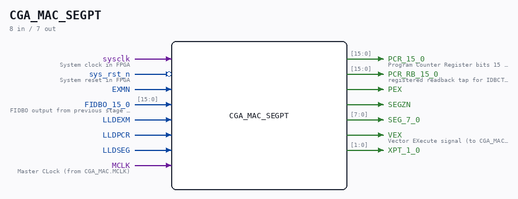

# CGA_MAC_SEGPT

Source: `Verilog/DELILAH-CPU/CGA_MAC/circuit/CGA_MAC_SEGPT.v`

> Generated by `Verilog/tests/module_doc.py` from the `//!`
> comments in the source. Do not edit by hand - edit the RTL comments and regenerate.

<!-- HIERARCHY-NAV:BEGIN - written by Verilog/tests/gen_hierarchy.py, do not edit -->

**Where it sits** (Simulation): [ND120_TOP](../../../../doc/ND120_TOP.md) > [ND120_CORE](../../../../doc/ND120_CORE.md) > [ND3202D](../../../../CPU-BOARD-3202/circuit/doc/ND3202D.md) > [CPU_15](../../../../CPU-BOARD-3202/circuit/doc/CPU_15.md) > [CPU_PROC_32](../../../../CPU-BOARD-3202/circuit/doc/CPU_PROC_32.md) > [CPU_PROC_CGA_33](../../../../CPU-BOARD-3202/circuit/doc/CPU_PROC_CGA_33.md) > [CGA](../../../CGA/circuit/doc/CGA.md) > [CGA_MAC](CGA_MAC.md) > **CGA_MAC_SEGPT**
- instance path: `CORE.CPU_BOARD.CPU.PROC.CGA.DELILAH.MAC.MAC_SEGPT`

**Used in:** [CGA_MAC](CGA_MAC.md) (all tops)

**Contains:** [CGA_MAC_SEGPT_PCR](CGA_MAC_SEGPT_PCR.md), [CGA_MAC_SEGPT_SEG](CGA_MAC_SEGPT_SEG.md), [CGA_MAC_SEGPT_XPT](CGA_MAC_SEGPT_XPT.md)

[Module hierarchy](../../../../HIERARCHY.md) - [All modules](../../../../MODULES.md)

<!-- HIERARCHY-NAV:END -->

## Description

ND120 CGA (CPU Gate Array / DELILAH)
/CGA/MAC/SEGPT
SEGPT
Page 35
SHEET 1 of 1
Last reviewed: 9-FEB-2025
Ronny Hansen
02-FEB-2025 - Refactored and merged output PCR_14_13_10_9_N and
PCR_15_7_2_0 to PCR_15_0

## Ports

| Direction | Width | Name | Description |
|---|---|---|---|
| input | `1` | `sysclk` | System clock in FPGA |
| input | `1` | `sys_rst_n` *(active low)* | System reset in FPGA |
| input | `1` | `EXMN` |  |
| input | `[15:0]` | `FIDBO_15_0` |  |
| input | `1` | `LLDEXM` |  |
| input | `1` | `LLDPCR` |  |
| input | `1` | `LLDSEG` |  |
| input | `1` | `MCLK` |  |
| output | `[15:0]` | `PCR_15_0` |  |
| output | `[15:0]` | `PCR_RB_15_0` | registered readback tap for IDBCTL/SEL6 (loop cut) |
| output | `1` | `PEX` |  |
| output | `1` | `SEGZN` |  |
| output | `[7:0]` | `SEG_7_0` |  |
| output | `1` | `VEX` |  |
| output | `[1:0]` | `XPT_1_0` |  |
