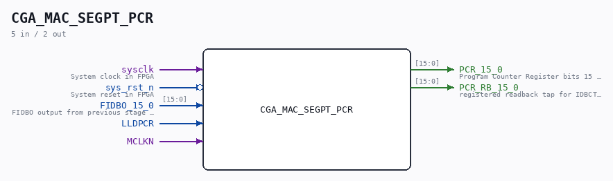
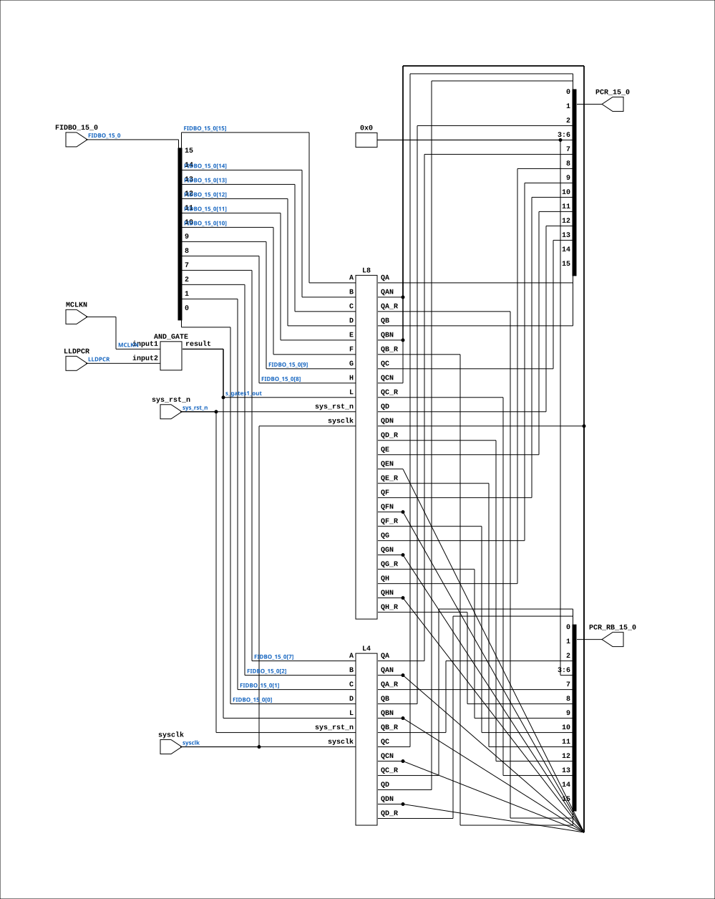

# CGA_MAC_SEGPT_PCR

Source: `Verilog/DELILAH-CPU/CGA_MAC/circuit/CGA_MAC_SEGPT_PCR.v`

<!-- Generated by Verilog/tests/module_doc.py from the //! comments in the source. Do not edit by hand - edit the RTL comments and regenerate. -->

<!-- HIERARCHY-NAV:BEGIN - written by Verilog/tests/gen_hierarchy.py, do not edit -->

**Where it sits** (Simulation): [ND120_TOP](../../../../doc/ND120_TOP.md) > [ND120_CORE](../../../../doc/ND120_CORE.md) > [ND3202D](../../../../CPU-BOARD-3202/circuit/doc/ND3202D.md) > [CPU_15](../../../../CPU-BOARD-3202/circuit/doc/CPU_15.md) > [CPU_PROC_32](../../../../CPU-BOARD-3202/circuit/doc/CPU_PROC_32.md) > [CPU_PROC_CGA_33](../../../../CPU-BOARD-3202/circuit/doc/CPU_PROC_CGA_33.md) > [CGA](../../../CGA/circuit/doc/CGA.md) > [CGA_MAC](CGA_MAC.md) > [CGA_MAC_SEGPT](CGA_MAC_SEGPT.md) > **CGA_MAC_SEGPT_PCR**
- instance path: `CORE.CPU_BOARD.CPU.PROC.CGA.DELILAH.MAC.MAC_SEGPT.PCR`

**Used in:** [CGA_MAC_SEGPT](CGA_MAC_SEGPT.md) (all tops)

**Contains:** [AND_GATE](../../../../Shared/logisim/doc/AND_GATE.md), [L4](../../../../Shared/ndlib/doc/L4.md), [L8](../../../../Shared/ndlib/doc/L8.md)

[Module hierarchy](../../../../HIERARCHY.md) - [All modules](../../../../MODULES.md)

<!-- HIERARCHY-NAV:END -->



<!-- SCHEMATIC:BEGIN - written by Verilog/tests/gen_schematics.py, do not edit -->

## Schematic

Drawn from the Verilog: the yosys netlist of the Simulation (Verilator) build, instance `CORE.CPU_BOARD.CPU.PROC.CGA.DELILAH.MAC.MAC_SEGPT.PCR`. Sub-modules are boxes (click the picture to open it full size; there every sub-module box links to its page, and every wire shows its Verilog name).

[](CGA_MAC_SEGPT_PCR.svg)

<!-- SCHEMATIC:END -->

## Description

ND120 CGA (CPU Gate Array / DELILAH)
/CGA/MAC/SEGPT/PCR
PCR REGISTER
Page 37
SHEET 1 of 1
Last reviewed: 9-FEB-2025
Ronny Hansen
02-FEB-2025 - Refactored and renamed FIDBO_15_7_2_0 to FIDBO_15_0
Refactored and merged output PCR_14_13_10_9_N and
PCR_15_7_2_0 to PCR_15_0

## Ports

| Direction | Width | Name | Description |
|---|---|---|---|
| input | `1` | `sysclk` | System clock in FPGA |
| input | `1` | `sys_rst_n` *(active low)* | System reset in FPGA |
| input | `[15:0]` | `FIDBO_15_0` | FIDBO output from previous stage (from CGA_MAC.FIDBO_15_0) |
| input | `1` | `LLDPCR` |  |
| input | `1` | `MCLKN` |  |
| output | `[15:0]` | `PCR_15_0` | Program Counter Register bits 15 to 0 (to CGA_MAC.PCR_15_0) |
| output | `[15:0]` | `PCR_RB_15_0` | registered readback tap for IDBCTL/SEL6 (loop cut) (to CGA_MAC_SEGPT.PCR_RB_15_0) |

## Verilog source

[`Verilog/DELILAH-CPU/CGA_MAC/circuit/CGA_MAC_SEGPT_PCR.v`](https://github.com/RetroCoreLabs/nd-120/blob/main/Verilog/DELILAH-CPU/CGA_MAC/circuit/CGA_MAC_SEGPT_PCR.v) on GitHub.

<details markdown="1">
<summary>Show the Verilog of CGA_MAC_SEGPT_PCR (155 lines)</summary>

```verilog
/**************************************************************************
** ND120 CGA (CPU Gate Array / DELILAH)                                  **
** /CGA/MAC/SEGPT/PCR                                                    **
** PCR REGISTER                                                          **
**                                                                       **
** Page 37                                                               **
** SHEET 1 of 1                                                          **
**                                                                       **
** Last reviewed: 9-FEB-2025                                             **
** Ronny Hansen                                                          **
**                                                                       **
** 02-FEB-2025 - Refactored and renamed FIDBO_15_7_2_0 to FIDBO_15_0     **
**               Refactored and merged output PCR_14_13_10_9_N and       **
**               PCR_15_7_2_0 to PCR_15_0                                **
***************************************************************************/


module CGA_MAC_SEGPT_PCR (
    // System input signals
    input sysclk,    // System clock in FPGA
    input sys_rst_n, // System reset in FPGA

    // Input signals
    input [15:0] FIDBO_15_0,  //! FIDBO output from previous stage (from CGA_MAC.FIDBO_15_0)
    input        LLDPCR,
    input        MCLKN,

    // Output signals
    output [15:0] PCR_15_0,  //! Program Counter Register bits 15 to 0 (to CGA_MAC.PCR_15_0)

    // Registered readback tap (21-AUG-2026): same stored value as PCR_15_0
    // but taken from the L8/L4 register (QA_R taps), WITHOUT the FF-mode
    // transparent bypass. Feeds ONLY the IDBCTL/SEL6 IDB readback - this
    // cuts the combinational IDB ring FIDBO -> PCR -> SEL6 -> FIDBI ->
    // OUTMUX(EFIDB) -> FIDBO. All other consumers keep PCR_15_0.
    output [15:0] PCR_RB_15_0  //! registered readback tap for IDBCTL/SEL6 (loop cut) (to CGA_MAC_SEGPT.PCR_RB_15_0)
);

  /*******************************************************************************
   ** The wires are defined here                                                 **
   *******************************************************************************/
  wire [15:0] s_pcr_15_0_out;
  wire [15:0] s_pcr_rb_15_0_out;
  wire [15:0] s_fidbo_15_0;
  wire        s_gates1_out;
  wire        s_lldpcr;
  wire        s_mclk_n;

  /*******************************************************************************
   ** Here all input connections are defined                                     **
   *******************************************************************************/
  assign s_fidbo_15_0[15:0]     = FIDBO_15_0;
  assign s_mclk_n               = MCLKN;
  assign s_lldpcr               = LLDPCR;

  /*******************************************************************************
   ** Here all output connections are defined                                    **
   *******************************************************************************/
  assign PCR_15_0               = s_pcr_15_0_out[15:0];
  assign PCR_RB_15_0            = s_pcr_rb_15_0_out[15:0];

  // Bits 6:3 is PIL (current program level), and is not set here.
  assign s_pcr_15_0_out[6:3] = 4'b0000;
  assign s_pcr_rb_15_0_out[6:3] = 4'b0000;

  // Code to make LINTER not complain about bits not read in FIDBO 6:3
  (* keep = "true", DONT_TOUCH = "true" *) wire [4:0] unused_FIDBO_bits;
  assign unused_FIDBO_bits[4:0] = s_fidbo_15_0[6:3];

  /*******************************************************************************
   ** Here all normal components are defined                                     **
   *******************************************************************************/
  AND_GATE #(
      .BubblesMask(2'b00)
  ) GATES_1 (
      .input1(s_mclk_n),
      .input2(s_lldpcr),
      .result(s_gates1_out)
  );


  /*******************************************************************************
   ** Here all sub-circuits are defined                                          **
   *******************************************************************************/

  L8 PCR_HI (
    // Input signals
    .sysclk(sysclk),                          // System clock in FPGA
    .sys_rst_n(sys_rst_n),                    // System reset in FPGA

    .A  (s_fidbo_15_0[15]),
    .B  (s_fidbo_15_0[14]),
    .C  (s_fidbo_15_0[13]),
    .D  (s_fidbo_15_0[12]),
    .E  (s_fidbo_15_0[11]),
    .F  (s_fidbo_15_0[10]),
    .G  (s_fidbo_15_0[9]),
    .H  (s_fidbo_15_0[8]),
    .L  (s_gates1_out),
    .QA (s_pcr_15_0_out[15]),
    .QAN(),
    .QB (s_pcr_15_0_out[14]),
    .QBN(),
    .QC (s_pcr_15_0_out[13]),
    .QCN(),
    .QD (s_pcr_15_0_out[12]),
    .QDN(),
    .QE (s_pcr_15_0_out[11]),
    .QEN(),
    .QF (s_pcr_15_0_out[10]),
    .QFN(),
    .QG (s_pcr_15_0_out[9]),
    .QGN(),
    .QH (s_pcr_15_0_out[8]),
    .QHN(),
    .QA_R(s_pcr_rb_15_0_out[15]),
    .QB_R(s_pcr_rb_15_0_out[14]),
    .QC_R(s_pcr_rb_15_0_out[13]),
    .QD_R(s_pcr_rb_15_0_out[12]),
    .QE_R(s_pcr_rb_15_0_out[11]),
    .QF_R(s_pcr_rb_15_0_out[10]),
    .QG_R(s_pcr_rb_15_0_out[9]),
    .QH_R(s_pcr_rb_15_0_out[8])
  );


  L4 PCR_LO
  (
    // Input signals
    .sysclk(sysclk),                          // System clock in FPGA
    .sys_rst_n(sys_rst_n),                    // System reset in FPGA

    .L  (s_gates1_out),

    .A  (s_fidbo_15_0[7]),
    .B  (s_fidbo_15_0[2]),
    .C  (s_fidbo_15_0[1]),
    .D  (s_fidbo_15_0[0]),

    .QA (s_pcr_15_0_out[7]),
    .QAN(),
    .QB (s_pcr_15_0_out[2]),
    .QBN(),
    .QC (s_pcr_15_0_out[1]),
    .QCN(),
    .QD (s_pcr_15_0_out[0]),
    .QDN(),
    .QA_R(s_pcr_rb_15_0_out[7]),
    .QB_R(s_pcr_rb_15_0_out[2]),
    .QC_R(s_pcr_rb_15_0_out[1]),
    .QD_R(s_pcr_rb_15_0_out[0])
  );

endmodule
```

</details>
