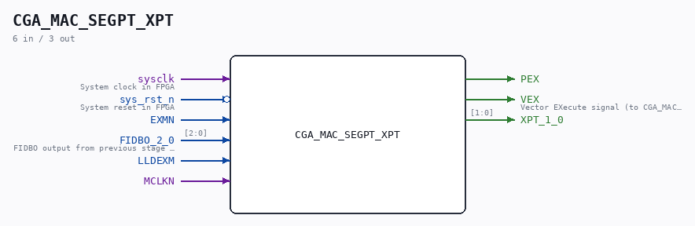

# CGA_MAC_SEGPT_XPT

Source: `Verilog/DELILAH-CPU/CGA_MAC/circuit/CGA_MAC_SEGPT_XPT.v`

<!-- Generated by Verilog/tests/module_doc.py from the //! comments in the source. Do not edit by hand - edit the RTL comments and regenerate. -->

<!-- HIERARCHY-NAV:BEGIN - written by Verilog/tests/gen_hierarchy.py, do not edit -->

**Where it sits** (Simulation): [ND120_TOP](../../../../doc/ND120_TOP.md) > [ND120_CORE](../../../../doc/ND120_CORE.md) > [ND3202D](../../../../CPU-BOARD-3202/circuit/doc/ND3202D.md) > [CPU_15](../../../../CPU-BOARD-3202/circuit/doc/CPU_15.md) > [CPU_PROC_32](../../../../CPU-BOARD-3202/circuit/doc/CPU_PROC_32.md) > [CPU_PROC_CGA_33](../../../../CPU-BOARD-3202/circuit/doc/CPU_PROC_CGA_33.md) > [CGA](../../../CGA/circuit/doc/CGA.md) > [CGA_MAC](CGA_MAC.md) > [CGA_MAC_SEGPT](CGA_MAC_SEGPT.md) > **CGA_MAC_SEGPT_XPT**
- instance path: `CORE.CPU_BOARD.CPU.PROC.CGA.DELILAH.MAC.MAC_SEGPT.XPT`

**Used in:** [CGA_MAC_SEGPT](CGA_MAC_SEGPT.md) (all tops)

**Contains:** [AND_GATE](../../../../Shared/logisim/doc/AND_GATE.md) x3, [L4](../../../../Shared/ndlib/doc/L4.md)

[Module hierarchy](../../../../HIERARCHY.md) - [All modules](../../../../MODULES.md)

<!-- HIERARCHY-NAV:END -->

## Description

ND120 CGA (CPU Gate Array / DELILAH)
/CGA/MAC/SEGPT/XPT
XPT
Page 38
SHEET 1 of 1
Last reviewed: 9-FEB-2025
Ronny Hansen

## Ports

| Direction | Width | Name | Description |
|---|---|---|---|
| input | `1` | `sysclk` | System clock in FPGA |
| input | `1` | `sys_rst_n` *(active low)* | System reset in FPGA |
| input | `1` | `EXMN` |  |
| input | `[2:0]` | `FIDBO_2_0` |  |
| input | `1` | `LLDEXM` |  |
| input | `1` | `MCLKN` |  |
| output | `1` | `PEX` |  |
| output | `1` | `VEX` |  |
| output | `[1:0]` | `XPT_1_0` |  |
