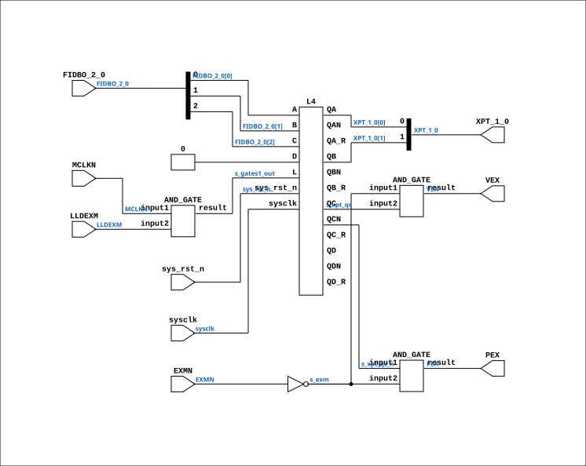

# CGA_MAC_SEGPT_XPT

Source: `Verilog/DELILAH-CPU/CGA_MAC/circuit/CGA_MAC_SEGPT_XPT.v`

<!-- Generated by Verilog/tests/module_doc.py from the //! comments in the source. Do not edit by hand - edit the RTL comments and regenerate. -->

<!-- HIERARCHY-NAV:BEGIN - written by Verilog/tests/gen_hierarchy.py, do not edit -->

**Where it sits** (Simulation): [ND120_TOP](../../../../doc/ND120_TOP.md) > [ND120_CORE](../../../../doc/ND120_CORE.md) > [ND3202D](../../../../CPU-BOARD-3202/circuit/doc/ND3202D.md) > [CPU_15](../../../../CPU-BOARD-3202/circuit/doc/CPU_15.md) > [CPU_PROC_32](../../../../CPU-BOARD-3202/circuit/doc/CPU_PROC_32.md) > [CPU_PROC_CGA_33](../../../../CPU-BOARD-3202/circuit/doc/CPU_PROC_CGA_33.md) > [CGA](../../../CGA/circuit/doc/CGA.md) > [CGA_MAC](CGA_MAC.md) > [CGA_MAC_SEGPT](CGA_MAC_SEGPT.md) > **CGA_MAC_SEGPT_XPT**
- instance path: `CORE.CPU_BOARD.CPU.PROC.CGA.DELILAH.MAC.MAC_SEGPT.XPT`

**Used in:** [CGA_MAC_SEGPT](CGA_MAC_SEGPT.md) (all tops)

**Contains:** [AND_GATE](../../../../Shared/logisim/doc/AND_GATE.md) x3, [L4](../../../../Shared/ndlib/doc/L4.md)

[Module hierarchy](../../../../HIERARCHY.md) - [All modules](../../../../MODULES.md)

<!-- HIERARCHY-NAV:END -->


<!-- SCHEMATIC:BEGIN - written by Verilog/tests/gen_schematics.py, do not edit -->

## Schematic

Drawn from the Verilog: the yosys netlist of the Simulation (Verilator) build, instance `CORE.CPU_BOARD.CPU.PROC.CGA.DELILAH.MAC.MAC_SEGPT.XPT`. Sub-modules are boxes (click the picture to open it full size; there every sub-module box links to its page, and every wire shows its Verilog name).

[](CGA_MAC_SEGPT_XPT.svg)

<!-- SCHEMATIC:END -->

## Description

ND120 CGA (CPU Gate Array / DELILAH)
/CGA/MAC/SEGPT/XPT
XPT
Page 38
SHEET 1 of 1
Last reviewed: 9-FEB-2025
Ronny Hansen

## Ports

| Direction | Width | Name | Description |
|---|---|---|---|
| input | `1` | `sysclk` | System clock in FPGA |
| input | `1` | `sys_rst_n` *(active low)* | System reset in FPGA |
| input | `1` | `EXMN` |  |
| input | `[2:0]` | `FIDBO_2_0` | FIDBO output from previous stage (from CGA_MAC.FIDBO_15_0[2:0]) |
| input | `1` | `LLDEXM` |  |
| input | `1` | `MCLKN` |  |
| output | `1` | `PEX` |  |
| output | `1` | `VEX` | Vector EXecute signal (to CGA_MAC.VEX) |
| output | `[1:0]` | `XPT_1_0` |  |

## Verilog source

[`Verilog/DELILAH-CPU/CGA_MAC/circuit/CGA_MAC_SEGPT_XPT.v`](https://github.com/RetroCoreLabs/nd-120/blob/main/Verilog/DELILAH-CPU/CGA_MAC/circuit/CGA_MAC_SEGPT_XPT.v) on GitHub.

<details markdown="1">
<summary>Show the Verilog of CGA_MAC_SEGPT_XPT (133 lines)</summary>

```verilog
/**************************************************************************
** ND120 CGA (CPU Gate Array / DELILAH)                                  **
** /CGA/MAC/SEGPT/XPT                                                    **
** XPT                                                                   **
**                                                                       **
** Page 38                                                               **
** SHEET 1 of 1                                                          **
**                                                                       **
** Last reviewed: 9-FEB-2025                                             **
** Ronny Hansen                                                          **
***************************************************************************/

module CGA_MAC_SEGPT_XPT (
    // System input signals
    input sysclk,    // System clock in FPGA
    input sys_rst_n, // System reset in FPGA

    // Input signals
    input       EXMN,
    input [2:0] FIDBO_2_0,  //! FIDBO output from previous stage (from CGA_MAC.FIDBO_15_0[2:0])
    input       LLDEXM,
    input       MCLKN,

    // Output signals
    output       PEX,
    output       VEX,  //! Vector EXecute signal (to CGA_MAC.VEX)
    output [1:0] XPT_1_0
);

  /*******************************************************************************
   ** The wires are defined here                                                 **
   *******************************************************************************/
  wire [1:0] s_xpt_1_0_out;
  wire [2:0] s_fidbo_2_0;
  wire       s_exm_n;
  wire       s_exm;
  wire       s_gates1_out;
  wire       s_lldexm;
  wire       s_mclk_n;
  wire       s_pex_out;
  wire       s_vex_out;
  wire       s_xpt_qc_n;
  wire       s_xpt_qc;

  /*******************************************************************************
   ** The module functionality is described here                                 **
   *******************************************************************************/

  /*******************************************************************************
   ** Here all input connections are defined                                     **
   *******************************************************************************/
  assign s_fidbo_2_0[2:0] = FIDBO_2_0;
  assign s_mclk_n         = MCLKN;
  assign s_lldexm         = LLDEXM;
  assign s_exm_n          = EXMN;

  /*******************************************************************************
   ** Here all output connections are defined                                    **
   *******************************************************************************/
  assign PEX              = s_pex_out;
  assign VEX              = s_vex_out;
  assign XPT_1_0          = s_xpt_1_0_out[1:0];

  /*******************************************************************************
   ** Here all in-lined components are defined                                   **
   *******************************************************************************/

  // NOT Gate
  assign s_exm            = ~s_exm_n;

  /*******************************************************************************
   ** Here all normal components are defined                                     **
   *******************************************************************************/
  AND_GATE #(
      .BubblesMask(2'b00)
  ) GATES_1 (
      .input1(s_mclk_n),
      .input2(s_lldexm),
      .result(s_gates1_out)
  );

  AND_GATE #(
      .BubblesMask(2'b00)
  ) GATES_2 (
      .input1(s_exm),
      .input2(s_xpt_qc),
      .result(s_vex_out)
  );

  AND_GATE #(
      .BubblesMask(2'b00)
  ) GATES_3 (
      .input1(s_xpt_qc_n),
      .input2(s_exm),
      .result(s_pex_out)
  );


  /*******************************************************************************
   ** Here all sub-circuits are defined                                          **
   *******************************************************************************/

  L4 XPT_L
  (
    // Input signals
    .sysclk(sysclk),                          // System clock in FPGA
    .sys_rst_n(sys_rst_n),                    // System reset in FPGA

    // Input signals
    .L  (s_gates1_out),
    .A  (s_fidbo_2_0[0]),
    .B  (s_fidbo_2_0[1]),
    .C  (s_fidbo_2_0[2]),
    .D  (1'b0),

    //Output signals
    .QA (s_xpt_1_0_out[0]),
    .QAN(),
    .QB (s_xpt_1_0_out[1]),
    .QBN(),
    .QC (s_xpt_qc),
    .QCN(s_xpt_qc_n),
    .QD (),
    .QDN(),
    // registered-value taps: deliberately unconnected here -
    // the transparent output is the wanted one (see L8/L4 header).
    .QA_R(),
    .QB_R(),
    .QC_R(),
    .QD_R()
  );

endmodule
```

</details>
