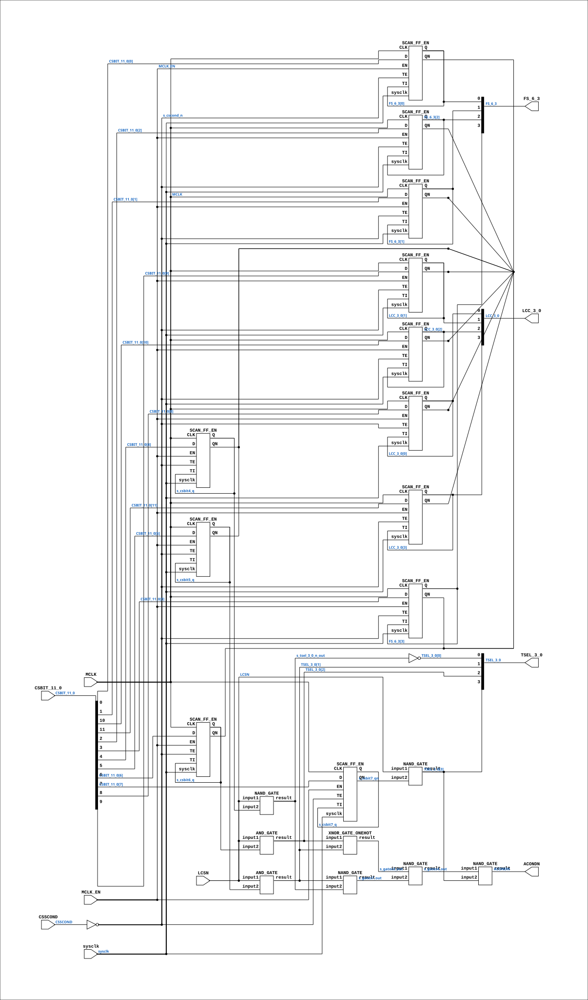

# CGA_MIC_CONDREG

Source: `Verilog/DELILAH-CPU/CGA_MIC/circuit/CGA_MIC_CONDREG.v`

<!-- Generated by Verilog/tests/module_doc.py from the //! comments in the source. Do not edit by hand - edit the RTL comments and regenerate. -->

<!-- HIERARCHY-NAV:BEGIN - written by Verilog/tests/gen_hierarchy.py, do not edit -->

**Where it sits** (Simulation): [ND120_TOP](../../../../doc/ND120_TOP.md) > [ND120_CORE](../../../../doc/ND120_CORE.md) > [ND3202D](../../../../CPU-BOARD-3202/circuit/doc/ND3202D.md) > [CPU_15](../../../../CPU-BOARD-3202/circuit/doc/CPU_15.md) > [CPU_PROC_32](../../../../CPU-BOARD-3202/circuit/doc/CPU_PROC_32.md) > [CPU_PROC_CGA_33](../../../../CPU-BOARD-3202/circuit/doc/CPU_PROC_CGA_33.md) > [CGA](../../../CGA/circuit/doc/CGA.md) > [CGA_MIC](CGA_MIC.md) > **CGA_MIC_CONDREG**
- instance path: `CORE.CPU_BOARD.CPU.PROC.CGA.DELILAH.MIC.CONDREG`

**Used in:** [CGA_MIC](CGA_MIC.md) (all tops)

**Contains:** [AND_GATE](../../../../Shared/logisim/doc/AND_GATE.md) x2, [NAND_GATE](../../../../Shared/logisim/doc/NAND_GATE.md) x5, [SCAN_FF_EN](../../../../Shared/ndlib/doc/SCAN_FF_EN.md) x12, [XNOR_GATE_ONEHOT](../../../../Shared/logisim/doc/XNOR_GATE_ONEHOT.md)

[Module hierarchy](../../../../HIERARCHY.md) - [All modules](../../../../MODULES.md)

<!-- HIERARCHY-NAV:END -->


<!-- SCHEMATIC:BEGIN - written by Verilog/tests/gen_schematics.py, do not edit -->

## Schematic

Drawn from the Verilog: the yosys netlist of the Simulation (Verilator) build, instance `CORE.CPU_BOARD.CPU.PROC.CGA.DELILAH.MIC.CONDREG`. Sub-modules are boxes (click the picture to open it full size; there every sub-module box links to its page, and every wire shows its Verilog name).

[](CGA_MIC_CONDREG.svg)

<!-- SCHEMATIC:END -->

## Description

ND120 CGA (CPU Gate Array / DELILAH)
/CGA/MIC/CONDREG
CONDITION REGISTER
Page 15
SHEET 1 of 1
Last reviewed: 20-DEC-2024
Ronny Hansen

## Ports

| Direction | Width | Name | Description |
|---|---|---|---|
| input | `1` | `sysclk` | FPGA system clock (P2: MCLK_EN capture) |
| input | `1` | `MCLK_EN` | MCLK clock-enable pulse (FPGA_FF_MODE, else 0) |
| input | `[11:0]` | `CSBIT_11_0` | Microcode bits 11:0 |
| input | `1` | `CSSCOND` | Microcode "SCOND" - COND) sets a 4-bit condition-code to be tested on a later occasion. |
| input | `1` | `LCSN` | Load Control Store |
| input | `1` | `MCLK` | Master Clock |
| output | `1` | `ACONDN` | ACOND - ACOND is the output of the condition register. Input to PAL 44403 in Cycle Control to control DLY0 signal |
| output | `[3:0]` | `FS_6_3` | False Select. CSBIT 3:0 |
| output | `[3:0]` | `LCC_3_0` | Loop Counter Compare (?)  CSBIT 11:8 |
| output | `[3:0]` | `TSEL_3_0` | Test Select. CSBIT 7:4 |

## Verilog source

[`Verilog/DELILAH-CPU/CGA_MIC/circuit/CGA_MIC_CONDREG.v`](https://github.com/RetroCoreLabs/nd-120/blob/main/Verilog/DELILAH-CPU/CGA_MIC/circuit/CGA_MIC_CONDREG.v) on GitHub.

<details markdown="1">
<summary>Show the Verilog of CGA_MIC_CONDREG (306 lines)</summary>

```verilog
/**************************************************************************
** ND120 CGA (CPU Gate Array / DELILAH)                                  **
** /CGA/MIC/CONDREG                                                      **
** CONDITION REGISTER                                                    **
**                                                                       **
** Page 15                                                               **
** SHEET 1 of 1                                                          **
**                                                                       **
** Last reviewed: 20-DEC-2024                                            **
** Ronny Hansen                                                          **
***************************************************************************/

module CGA_MIC_CONDREG (
    input sysclk,   //! FPGA system clock (P2: MCLK_EN capture)
    input MCLK_EN,  //! MCLK clock-enable pulse (FPGA_FF_MODE, else 0)

    input [11:0] CSBIT_11_0,  //! Microcode bits 11:0
    input        CSSCOND,  //! Microcode "SCOND" - COND) sets a 4-bit condition-code to be tested on a later occasion.
    input LCSN,  //! Load Control Store
    input MCLK,  //! Master Clock

    output       ACONDN,    //! ACOND - ACOND is the output of the condition register. Input to PAL 44403 in Cycle Control to control DLY0 signal
    output [3:0] FS_6_3,  //! False Select. CSBIT 3:0
    output [3:0] LCC_3_0,  //! Loop Counter Compare (?)  CSBIT 11:8
    output [3:0] TSEL_3_0  //! Test Select. CSBIT 7:4
);

  /*******************************************************************************
   ** The wires are defined here                                                 **
   *******************************************************************************/
  wire [ 3:0] s_fc_6_3_out;
  wire [ 3:0] s_lcc_3_0_out;
  wire [11:0] s_csbit_11_0;
  wire [ 3:0] s_tsel_3_0_out;
  wire        s_acond_n_out;
  wire        s_csbit4_q;
  wire        s_csbit5_q;
  wire        s_csbit6_q;
  wire        s_csbit7_q;
  wire        s_csbit7_qn;
  wire        s_cscond_n;
  wire        s_csscond;
  wire        s_gates3_out;
  wire        s_gates4_out;
  wire        s_gates7_out;
  wire        s_lcs_n;
  wire        s_mclk;
  wire        s_tsel_3_0_n_out;

  /*******************************************************************************
   ** The module functionality is described here                                 **
   *******************************************************************************/

  /*******************************************************************************
   ** Here all input connections are defined                                     **
   *******************************************************************************/
  assign s_csbit_11_0[11:0] = CSBIT_11_0;
  assign s_csscond          = CSSCOND;
  assign s_lcs_n            = LCSN;
  assign s_mclk             = MCLK;

  // P2 (docs/plan-fix-unconstrained-clocks.md): in FF mode the MCLK-
  // clocked registers capture on posedge sysclk gated by MCLK_EN
  // (aligned to the MCLK rise) instead of clocking on the routed net.
`ifdef FPGA_FF_MODE
  localparam MCLK_CE = 1;
`else
  localparam MCLK_CE = 0;
`endif

  /*******************************************************************************
   ** Here all output connections are defined                                    **
   *******************************************************************************/
  assign ACONDN             = s_acond_n_out;
  assign FS_6_3             = s_fc_6_3_out[3:0];
  assign LCC_3_0            = s_lcc_3_0_out[3:0];
  assign TSEL_3_0           = s_tsel_3_0_out[3:0];

  /*******************************************************************************
   ** Here all in-lined components are defined                                   **
   *******************************************************************************/

  // NOT Gate
  assign s_cscond_n         = ~s_csscond;

  // NOT Gate
  assign s_tsel_3_0_out[0]  = ~s_tsel_3_0_n_out;

  /*******************************************************************************
   ** Here all normal components are defined                                     **
   *******************************************************************************/
  NAND_GATE #(
      .BubblesMask(2'b00)
  ) GATES_1 (
      .input1(s_lcs_n),
      .input2(s_csbit7_qn),
      .result(s_tsel_3_0_out[3])
  );

  AND_GATE #(
      .BubblesMask(2'b00)
  ) GATES_2 (
      .input1(s_lcs_n),
      .input2(s_csbit6_q),
      .result(s_tsel_3_0_out[2])
  );

  XNOR_GATE_ONEHOT #(
      .BubblesMask(2'b00)
  ) GATES_3 (
      .input1(s_tsel_3_0_out[2]),
      .input2(s_tsel_3_0_out[1]),
      .result(s_gates3_out)
  );

  NAND_GATE #(
      .BubblesMask(2'b00)
  ) GATES_4 (
      .input1(s_gates3_out),
      .input2(s_gates7_out),
      .result(s_gates4_out)
  );

  NAND_GATE #(
      .BubblesMask(2'b00)
  ) GATES_5 (
      .input1(s_gates4_out),
      .input2(s_tsel_3_0_out[3]),
      .result(s_acond_n_out)
  );

  AND_GATE #(
      .BubblesMask(2'b00)
  ) GATES_6 (
      .input1(s_lcs_n),
      .input2(s_csbit5_q),
      .result(s_tsel_3_0_out[1])
  );

  NAND_GATE #(
      .BubblesMask(2'b00)
  ) GATES_7 (
      .input1(s_tsel_3_0_out[1]),
      .input2(s_tsel_3_0_n_out),
      .result(s_gates7_out)
  );

  NAND_GATE #(
      .BubblesMask(2'b00)
  ) GATES_8 (
      .input1(s_lcs_n),
      .input2(s_csbit4_q),
      .result(s_tsel_3_0_n_out)
  );


  /*******************************************************************************
   ** Here all sub-circuits are defined                                          **
   *******************************************************************************/
  // MCLK domain: clocked on posedge s_mclk
  SCAN_FF_EN #(.USE_ENABLE(MCLK_CE)) CSBIT11 (
      .sysclk(sysclk),
      .EN(MCLK_EN),
      .CLK(s_mclk),
      .D  (s_csbit_11_0[11]),
      .Q  (s_lcc_3_0_out[3]),
      .QN (),
      .TE (s_cscond_n),
      .TI (s_lcc_3_0_out[3])
  );

  // MCLK domain: clocked on posedge s_mclk
  SCAN_FF_EN #(.USE_ENABLE(MCLK_CE)) CSBIT10 (
      .sysclk(sysclk),
      .EN(MCLK_EN),
      .CLK(s_mclk),
      .D  (s_csbit_11_0[10]),
      .Q  (s_lcc_3_0_out[2]),
      .QN (),
      .TE (s_cscond_n),
      .TI (s_lcc_3_0_out[2])
  );

  // MCLK domain: clocked on posedge s_mclk
  SCAN_FF_EN #(.USE_ENABLE(MCLK_CE)) CSBIT9 (
      .sysclk(sysclk),
      .EN(MCLK_EN),
      .CLK(s_mclk),
      .D  (s_csbit_11_0[9]),
      .Q  (s_lcc_3_0_out[1]),
      .QN (),
      .TE (s_cscond_n),
      .TI (s_lcc_3_0_out[1])
  );

  // MCLK domain: clocked on posedge s_mclk
  SCAN_FF_EN #(.USE_ENABLE(MCLK_CE)) CSBIT8 (
      .sysclk(sysclk),
      .EN(MCLK_EN),
      .CLK(s_mclk),
      .D  (s_csbit_11_0[8]),
      .Q  (s_lcc_3_0_out[0]),
      .QN (),
      .TE (s_cscond_n),
      .TI (s_lcc_3_0_out[0])
  );

  // MCLK domain: clocked on posedge s_mclk
  SCAN_FF_EN #(.USE_ENABLE(MCLK_CE)) CSBIT7 (
      .sysclk(sysclk),
      .EN(MCLK_EN),
      .CLK(s_mclk),
      .D  (s_csbit_11_0[7]),
      .Q  (s_csbit7_q),
      .QN (s_csbit7_qn),
      .TE (s_cscond_n),
      .TI (s_csbit7_q)
  );

  // MCLK domain: clocked on posedge s_mclk
  SCAN_FF_EN #(.USE_ENABLE(MCLK_CE)) CSBIT6 (
      .sysclk(sysclk),
      .EN(MCLK_EN),
      .CLK(s_mclk),
      .D  (s_csbit_11_0[6]),
      .Q  (s_csbit6_q),
      .QN (),
      .TE (s_cscond_n),
      .TI (s_csbit6_q)
  );

  // MCLK domain: clocked on posedge s_mclk
  SCAN_FF_EN #(.USE_ENABLE(MCLK_CE)) CSBIT5 (
      .sysclk(sysclk),
      .EN(MCLK_EN),
      .CLK(s_mclk),
      .D  (s_csbit_11_0[5]),
      .Q  (s_csbit5_q),
      .QN (),
      .TE (s_cscond_n),
      .TI (s_csbit5_q)
  );

  // MCLK domain: clocked on posedge s_mclk
  SCAN_FF_EN #(.USE_ENABLE(MCLK_CE)) CSBIT4 (
      .sysclk(sysclk),
      .EN(MCLK_EN),
      .CLK(s_mclk),
      .D  (s_csbit_11_0[4]),
      .Q  (s_csbit4_q),
      .QN (),
      .TE (s_cscond_n),
      .TI (s_csbit4_q)
  );

  // MCLK domain: clocked on posedge s_mclk
  SCAN_FF_EN #(.USE_ENABLE(MCLK_CE)) CSBIT3 (
      .sysclk(sysclk),
      .EN(MCLK_EN),
      .CLK(s_mclk),
      .D  (s_csbit_11_0[3]),
      .Q  (s_fc_6_3_out[3]),
      .QN (),
      .TE (s_cscond_n),
      .TI (s_fc_6_3_out[3])
  );

  // MCLK domain: clocked on posedge s_mclk
  SCAN_FF_EN #(.USE_ENABLE(MCLK_CE)) CSBIT2 (
      .sysclk(sysclk),
      .EN(MCLK_EN),
      .CLK(s_mclk),
      .D  (s_csbit_11_0[2]),
      .Q  (s_fc_6_3_out[2]),
      .QN (),
      .TE (s_cscond_n),
      .TI (s_fc_6_3_out[2])
  );

  // MCLK domain: clocked on posedge s_mclk
  SCAN_FF_EN #(.USE_ENABLE(MCLK_CE)) CSBIT1 (
      .sysclk(sysclk),
      .EN(MCLK_EN),
      .CLK(s_mclk),
      .D  (s_csbit_11_0[1]),
      .Q  (s_fc_6_3_out[1]),
      .QN (),
      .TE (s_cscond_n),
      .TI (s_fc_6_3_out[1])
  );

  // MCLK domain: clocked on posedge s_mclk
  SCAN_FF_EN #(.USE_ENABLE(MCLK_CE)) CSBIT0 (
      .sysclk(sysclk),
      .EN(MCLK_EN),
      .CLK(s_mclk),
      .D  (s_csbit_11_0[0]),
      .Q  (s_fc_6_3_out[0]),
      .QN (),
      .TE (s_cscond_n),
      .TI (s_fc_6_3_out[0])
  );


endmodule
```

</details>
