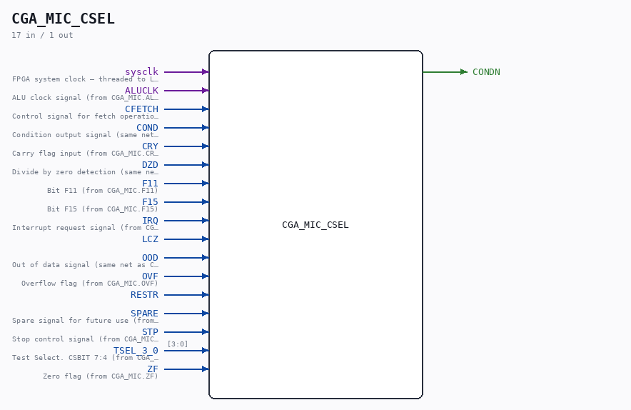

# CGA_MIC_CSEL

Source: `Verilog/DELILAH-CPU/CGA_MIC/circuit/CGA_MIC_CSEL.v`

<!-- Generated by Verilog/tests/module_doc.py from the //! comments in the source. Do not edit by hand - edit the RTL comments and regenerate. -->

<!-- HIERARCHY-NAV:BEGIN - written by Verilog/tests/gen_hierarchy.py, do not edit -->

**Where it sits** (Simulation): [ND120_TOP](../../../../doc/ND120_TOP.md) > [ND120_CORE](../../../../doc/ND120_CORE.md) > [ND3202D](../../../../CPU-BOARD-3202/circuit/doc/ND3202D.md) > [CPU_15](../../../../CPU-BOARD-3202/circuit/doc/CPU_15.md) > [CPU_PROC_32](../../../../CPU-BOARD-3202/circuit/doc/CPU_PROC_32.md) > [CPU_PROC_CGA_33](../../../../CPU-BOARD-3202/circuit/doc/CPU_PROC_CGA_33.md) > [CGA](../../../CGA/circuit/doc/CGA.md) > [CGA_MIC](CGA_MIC.md) > **CGA_MIC_CSEL**
- instance path: `CORE.CPU_BOARD.CPU.PROC.CGA.DELILAH.MIC.CSEL`

**Used in:** [CGA_MIC](CGA_MIC.md) (all tops)

**Contains:** [LATCH](../../../../Shared/ndlib/doc/LATCH.md) (only on Simulation, Tang, Nexys, MEGA65 R6, MEGA65 R3, QMTECH, Basys3, Cmod), [Multiplexer_2](../../../../Shared/logisim/doc/Multiplexer_2.md), [Multiplexer_8](../../../../Shared/logisim/doc/Multiplexer_8.md) x2, [ND120_LATCH](../../../../Shared/ndlib/doc/ND120_LATCH.md) (only on MiSTer)

[Module hierarchy](../../../../HIERARCHY.md) - [All modules](../../../../MODULES.md)

<!-- HIERARCHY-NAV:END -->

## Description

ND120 CGA (CPU Gate Array / DELILAH)
/CGA/MIC/CSEL
CONDITION SELECT
Page 14
SHEET 1 of 1
Last reviewed: 10-NOV-2024
Ronny Hansen

## Ports

| Direction | Width | Name | Description |
|---|---|---|---|
| input | `1` | `sysclk` | FPGA system clock — threaded to LATCH |
| input | `1` | `ALUCLK` |  |
| input | `1` | `CFETCH` |  |
| input | `1` | `COND` |  |
| input | `1` | `CRY` |  |
| input | `1` | `DZD` |  |
| input | `1` | `F11` |  |
| input | `1` | `F15` |  |
| input | `1` | `IRQ` |  |
| input | `1` | `LCZ` |  |
| input | `1` | `OOD` |  |
| input | `1` | `OVF` |  |
| input | `1` | `RESTR` |  |
| input | `1` | `SPARE` |  |
| input | `1` | `STP` |  |
| input | `[3:0]` | `TSEL_3_0` |  |
| input | `1` | `ZF` |  |
| output | `1` | `CONDN` |  |
