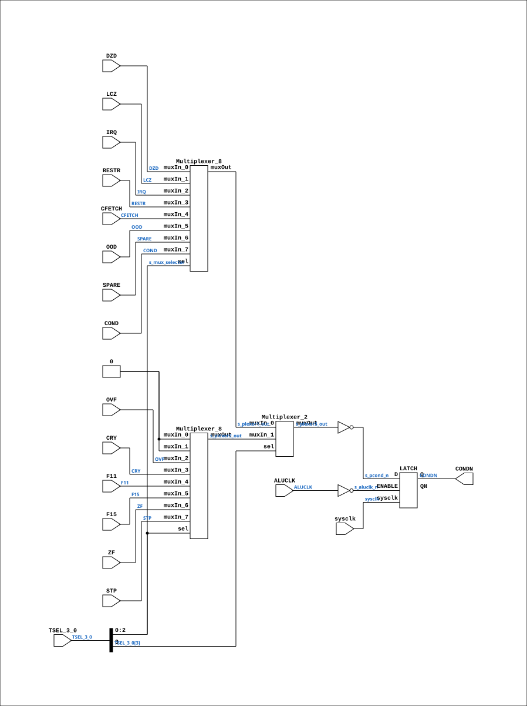

# CGA_MIC_CSEL

Source: `Verilog/DELILAH-CPU/CGA_MIC/circuit/CGA_MIC_CSEL.v`

<!-- Generated by Verilog/tests/module_doc.py from the //! comments in the source. Do not edit by hand - edit the RTL comments and regenerate. -->

<!-- HIERARCHY-NAV:BEGIN - written by Verilog/tests/gen_hierarchy.py, do not edit -->

**Where it sits** (Simulation): [ND120_TOP](../../../../doc/ND120_TOP.md) > [ND120_CORE](../../../../doc/ND120_CORE.md) > [ND3202D](../../../../CPU-BOARD-3202/circuit/doc/ND3202D.md) > [CPU_15](../../../../CPU-BOARD-3202/circuit/doc/CPU_15.md) > [CPU_PROC_32](../../../../CPU-BOARD-3202/circuit/doc/CPU_PROC_32.md) > [CPU_PROC_CGA_33](../../../../CPU-BOARD-3202/circuit/doc/CPU_PROC_CGA_33.md) > [CGA](../../../CGA/circuit/doc/CGA.md) > [CGA_MIC](CGA_MIC.md) > **CGA_MIC_CSEL**
- instance path: `CORE.CPU_BOARD.CPU.PROC.CGA.DELILAH.MIC.CSEL`

**Used in:** [CGA_MIC](CGA_MIC.md) (all tops)

**Contains:** [LATCH](../../../../Shared/ndlib/doc/LATCH.md) (only on Simulation, Tang, Nexys, MEGA65 R6, MEGA65 R3, QMTECH, Basys3, Cmod), [Multiplexer_2](../../../../Shared/logisim/doc/Multiplexer_2.md), [Multiplexer_8](../../../../Shared/logisim/doc/Multiplexer_8.md) x2, [ND120_LATCH](../../../../Shared/ndlib/doc/ND120_LATCH.md) (only on MiSTer)

[Module hierarchy](../../../../HIERARCHY.md) - [All modules](../../../../MODULES.md)

<!-- HIERARCHY-NAV:END -->


<!-- SCHEMATIC:BEGIN - written by Verilog/tests/gen_schematics.py, do not edit -->

## Schematic

Drawn from the Verilog: the yosys netlist of the Simulation (Verilator) build, instance `CORE.CPU_BOARD.CPU.PROC.CGA.DELILAH.MIC.CSEL`. Sub-modules are boxes (click the picture to open it full size; there every sub-module box links to its page, and every wire shows its Verilog name).

[](CGA_MIC_CSEL.svg)

<!-- SCHEMATIC:END -->

## Description

ND120 CGA (CPU Gate Array / DELILAH)
/CGA/MIC/CSEL
CONDITION SELECT
Page 14
SHEET 1 of 1
Last reviewed: 10-NOV-2024
Ronny Hansen

## Ports

| Direction | Width | Name | Description |
|---|---|---|---|
| input | `1` | `sysclk` | FPGA system clock — threaded to LATCH |
| input | `1` | `ALUCLK` | ALU clock signal (from CGA_MIC.ALUCLK) |
| input | `1` | `CFETCH` | Control signal for fetch operation (from CGA_MIC.CFETCH) |
| input | `1` | `COND` | Condition output signal (same net as CGA_MIC.COND) |
| input | `1` | `CRY` | Carry flag input (from CGA_MIC.CRY) |
| input | `1` | `DZD` | Divide by zero detection (same net as CGA_MIC.DZD) |
| input | `1` | `F11` | Bit F11 (from CGA_MIC.F11) |
| input | `1` | `F15` | Bit F15 (from CGA_MIC.F15) |
| input | `1` | `IRQ` | Interrupt request signal (from CGA_MIC.IRQ) |
| input | `1` | `LCZ` |  |
| input | `1` | `OOD` | Out of data signal (same net as CGA_MIC.OOD) |
| input | `1` | `OVF` | Overflow flag (from CGA_MIC.OVF) |
| input | `1` | `RESTR` |  |
| input | `1` | `SPARE` | Spare signal for future use (from CGA_MIC.SPARE) |
| input | `1` | `STP` | Stop control signal (from CGA_MIC.STP) |
| input | `[3:0]` | `TSEL_3_0` | Test Select. CSBIT 7:4 (from CGA_MIC_CONDREG.TSEL_3_0) |
| input | `1` | `ZF` | Zero flag (from CGA_MIC.ZF) |
| output | `1` | `CONDN` |  |

## Verilog source

[`Verilog/DELILAH-CPU/CGA_MIC/circuit/CGA_MIC_CSEL.v`](https://github.com/RetroCoreLabs/nd-120/blob/main/Verilog/DELILAH-CPU/CGA_MIC/circuit/CGA_MIC_CSEL.v) on GitHub.

<details markdown="1">
<summary>Show the Verilog of CGA_MIC_CSEL (170 lines)</summary>

```verilog
/**************************************************************************
** ND120 CGA (CPU Gate Array / DELILAH)                                  **
** /CGA/MIC/CSEL                                                         **
** CONDITION SELECT                                                      **
**                                                                       **
** Page 14                                                               **
** SHEET 1 of 1                                                          **
**                                                                       **
** Last reviewed: 10-NOV-2024                                            **
** Ronny Hansen                                                          **
***************************************************************************/

module CGA_MIC_CSEL (
    input       sysclk,    //! FPGA system clock — threaded to LATCH
    input       ALUCLK,    //! ALU clock signal (from CGA_MIC.ALUCLK)
    input       CFETCH,    //! Control signal for fetch operation (from CGA_MIC.CFETCH)
    input       COND,      //! Condition output signal (same net as CGA_MIC.COND)
    input       CRY,       //! Carry flag input (from CGA_MIC.CRY)
    input       DZD,       //! Divide by zero detection (same net as CGA_MIC.DZD)
    input       F11,       //! Bit F11 (from CGA_MIC.F11)
    input       F15,       //! Bit F15 (from CGA_MIC.F15)
    input       IRQ,       //! Interrupt request signal (from CGA_MIC.IRQ)
    input       LCZ,
    input       OOD,       //! Out of data signal (same net as CGA_MIC.OOD)
    input       OVF,       //! Overflow flag (from CGA_MIC.OVF)
    input       RESTR,
    input       SPARE,     //! Spare signal for future use (from CGA_MIC.SPARE)
    input       STP,       //! Stop control signal (from CGA_MIC.STP)
    input [3:0] TSEL_3_0,  //! Test Select. CSBIT 7:4 (from CGA_MIC_CONDREG.TSEL_3_0)
    input       ZF,        //! Zero flag (from CGA_MIC.ZF)

    output CONDN
);

  /*******************************************************************************
   ** The wires are defined here                                                 **
   *******************************************************************************/
  wire [2:0] s_mux_selector;
  wire [3:0] s_tsel_3_0;
  wire       s_aluclk_n;
  (* mark_debug = "true", DONT_TOUCH = "true" *) wire       s_aluclk;
  wire       s_cfetch_n;
  (* mark_debug = "true", DONT_TOUCH = "true" *) wire       s_cond_n_out;
  wire       s_cond;
  wire       s_cry;
  wire       s_dzd;
  wire       s_F11;
  wire       s_f15;
  wire       s_gnd;
  wire       s_irq;
  wire       s_lcz; 
  wire       s_ood;
  wire       s_ovf;
  (* mark_debug = "true", DONT_TOUCH = "true" *) wire       s_pcond_n;
  wire       s_plexer1_out;
  wire       s_plexer2_out;
  wire       s_plexer3_out;
  wire       s_restr;
  wire       s_spare;
  wire       s_stp;
  wire       s_tsel_0;
  wire       s_tsel_1;
  wire       s_tsel_2;
  wire       s_zf;

  /*******************************************************************************
   ** Here all wiring is defined                                                 **
   *******************************************************************************/
  assign s_mux_selector[0] = s_tsel_0;
  assign s_mux_selector[1] = s_tsel_1;
  assign s_mux_selector[2] = s_tsel_2;
  assign s_tsel_0         = s_tsel_3_0[0];
  assign s_tsel_1         = s_tsel_3_0[1];
  assign s_tsel_2         = s_tsel_3_0[2];

  /*******************************************************************************
   ** Here all input connections are defined                                     **
   *******************************************************************************/
  assign s_aluclk         = ALUCLK;
  assign s_cfetch_n       = CFETCH;
  assign s_cond           = COND;
  assign s_cry            = CRY;
  assign s_dzd            = DZD;
  assign s_F11            = F11;
  assign s_f15            = F15;
  assign s_irq            = IRQ;
  assign s_lcz            = LCZ;
  assign s_ood            = OOD;
  assign s_ovf            = OVF;
  assign s_restr          = RESTR;
  assign s_spare          = SPARE;
  assign s_stp            = STP;
  assign s_tsel_3_0[3:0]  = TSEL_3_0;
  assign s_zf             = ZF;

  /*******************************************************************************
   ** Here all output connections are defined                                    **
   *******************************************************************************/
  assign CONDN            = s_cond_n_out;

  /*******************************************************************************
   ** Here all in-lined components are defined                                   **
   *******************************************************************************/

  // Ground
  assign s_gnd   = 1'b0;


  // NOT Gate
  assign s_pcond_n   = ~s_plexer3_out;

  // NOT Gate
  assign s_aluclk_n    = ~s_aluclk;

  /*******************************************************************************
   ** Here all normal components are defined                                     **
   *******************************************************************************/
  Multiplexer_8 PLEXERS_1 (
      .muxIn_0(s_dzd),
      .muxIn_1(s_lcz),
      .muxIn_2(s_irq),
      .muxIn_3(s_restr),
      .muxIn_4(s_cfetch_n),
      .muxIn_5(s_ood),
      .muxIn_6(s_spare),
      .muxIn_7(s_cond),
      .muxOut(s_plexer1_out),
      .sel(s_mux_selector[2:0])
  );

  Multiplexer_8 PLEXERS_2 (
      .muxIn_0(s_gnd),
      .muxIn_1(s_gnd),
      .muxIn_2(s_ovf),
      .muxIn_3(s_cry),
      .muxIn_4(s_F11),
      .muxIn_5(s_f15),
      .muxIn_6(s_zf),
      .muxIn_7(s_stp),
      .muxOut(s_plexer2_out),
      .sel(s_mux_selector[2:0])
  );

  Multiplexer_2 PLEXERS_3 (
      .muxIn_0(s_plexer1_out),
      .muxIn_1(s_plexer2_out),
      .muxOut(s_plexer3_out),
      .sel(s_tsel_3_0[3])
  );


  /*******************************************************************************
   ** Here all sub-circuits are defined                                          **
   *******************************************************************************/

  // QUARTUS_LATCH_RENAME: see the header comment in Shared/ndlib/LATCH.v -
  // Quartus's built-in LATCH primitive collides with this module's name.
`ifdef QUARTUS_LATCH_RENAME
  ND120_LATCH CSEL_LATCH (
`else
  LATCH CSEL_LATCH (
`endif
      .sysclk(sysclk),
      .D(s_pcond_n),
      .ENABLE(s_aluclk_n),
      .Q(s_cond_n_out),
      .QN()
  );

endmodule
```

</details>
