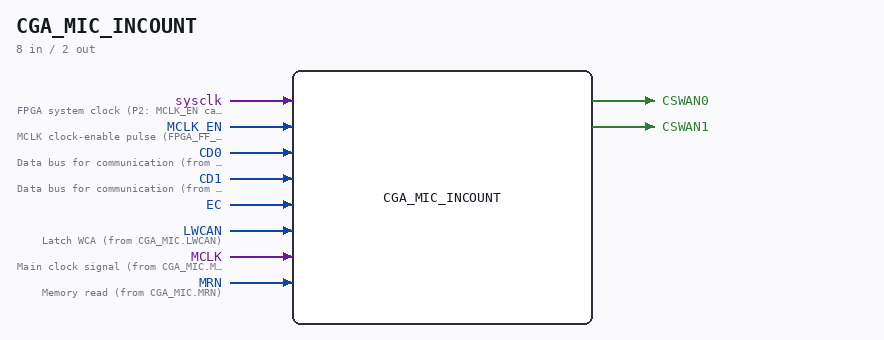

# CGA_MIC_INCOUNT

Source: `Verilog/DELILAH-CPU/CGA_MIC/circuit/CGA_MIC_INCOUNT.v`

<!-- Generated by Verilog/tests/module_doc.py from the //! comments in the source. Do not edit by hand - edit the RTL comments and regenerate. -->

<!-- HIERARCHY-NAV:BEGIN - written by Verilog/tests/gen_hierarchy.py, do not edit -->

**Where it sits** (Simulation): [ND120_TOP](../../../../doc/ND120_TOP.md) > [ND120_CORE](../../../../doc/ND120_CORE.md) > [ND3202D](../../../../CPU-BOARD-3202/circuit/doc/ND3202D.md) > [CPU_15](../../../../CPU-BOARD-3202/circuit/doc/CPU_15.md) > [CPU_PROC_32](../../../../CPU-BOARD-3202/circuit/doc/CPU_PROC_32.md) > [CPU_PROC_CGA_33](../../../../CPU-BOARD-3202/circuit/doc/CPU_PROC_CGA_33.md) > [CGA](../../../CGA/circuit/doc/CGA.md) > [CGA_MIC](CGA_MIC.md) > **CGA_MIC_INCOUNT**
- instance path: `CORE.CPU_BOARD.CPU.PROC.CGA.DELILAH.MIC.MIC_INCOUNT`

**Used in:** [CGA_MIC](CGA_MIC.md) (all tops)

**Contains:** [D_FLIPFLOP_EN](../../../../Shared/ndlib/doc/D_FLIPFLOP_EN.md) x2, [Multiplexer_2](../../../../Shared/logisim/doc/Multiplexer_2.md) x2, [NAND_GATE](../../../../Shared/logisim/doc/NAND_GATE.md), [XNOR_GATE_ONEHOT](../../../../Shared/logisim/doc/XNOR_GATE_ONEHOT.md), [XOR_GATE_ONEHOT](../../../../Shared/logisim/doc/XOR_GATE_ONEHOT.md)

[Module hierarchy](../../../../HIERARCHY.md) - [All modules](../../../../MODULES.md)

<!-- HIERARCHY-NAV:END -->

## Description

ND120 CGA (CPU Gate Array / DELILAH)
/CGA/MIC/INCOUNT
INCOUNT
Page 23
SHEET 1 of 1
Last reviewed: 10-NOV-2024
Ronny Hansen

## Ports

| Direction | Width | Name | Description |
|---|---|---|---|
| input | `1` | `sysclk` | FPGA system clock (P2: MCLK_EN capture) |
| input | `1` | `MCLK_EN` | MCLK clock-enable pulse (FPGA_FF_MODE, else 0) |
| input | `1` | `CD0` |  |
| input | `1` | `CD1` |  |
| input | `1` | `EC` |  |
| input | `1` | `LWCAN` |  |
| input | `1` | `MCLK` |  |
| input | `1` | `MRN` |  |
| output | `1` | `CSWAN0` |  |
| output | `1` | `CSWAN1` |  |
