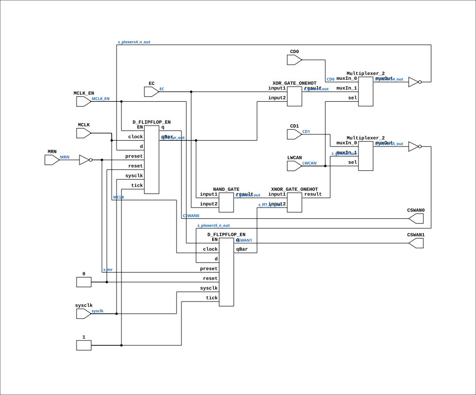

# CGA_MIC_INCOUNT

Source: `Verilog/DELILAH-CPU/CGA_MIC/circuit/CGA_MIC_INCOUNT.v`

<!-- Generated by Verilog/tests/module_doc.py from the //! comments in the source. Do not edit by hand - edit the RTL comments and regenerate. -->

<!-- HIERARCHY-NAV:BEGIN - written by Verilog/tests/gen_hierarchy.py, do not edit -->

**Where it sits** (Simulation): [ND120_TOP](../../../../doc/ND120_TOP.md) > [ND120_CORE](../../../../doc/ND120_CORE.md) > [ND3202D](../../../../CPU-BOARD-3202/circuit/doc/ND3202D.md) > [CPU_15](../../../../CPU-BOARD-3202/circuit/doc/CPU_15.md) > [CPU_PROC_32](../../../../CPU-BOARD-3202/circuit/doc/CPU_PROC_32.md) > [CPU_PROC_CGA_33](../../../../CPU-BOARD-3202/circuit/doc/CPU_PROC_CGA_33.md) > [CGA](../../../CGA/circuit/doc/CGA.md) > [CGA_MIC](CGA_MIC.md) > **CGA_MIC_INCOUNT**
- instance path: `CORE.CPU_BOARD.CPU.PROC.CGA.DELILAH.MIC.MIC_INCOUNT`

**Used in:** [CGA_MIC](CGA_MIC.md) (all tops)

**Contains:** [D_FLIPFLOP_EN](../../../../Shared/ndlib/doc/D_FLIPFLOP_EN.md) x2, [Multiplexer_2](../../../../Shared/logisim/doc/Multiplexer_2.md) x2, [NAND_GATE](../../../../Shared/logisim/doc/NAND_GATE.md), [XNOR_GATE_ONEHOT](../../../../Shared/logisim/doc/XNOR_GATE_ONEHOT.md), [XOR_GATE_ONEHOT](../../../../Shared/logisim/doc/XOR_GATE_ONEHOT.md)

[Module hierarchy](../../../../HIERARCHY.md) - [All modules](../../../../MODULES.md)

<!-- HIERARCHY-NAV:END -->


<!-- SCHEMATIC:BEGIN - written by Verilog/tests/gen_schematics.py, do not edit -->

## Schematic

Drawn from the Verilog: the yosys netlist of the Simulation (Verilator) build, instance `CORE.CPU_BOARD.CPU.PROC.CGA.DELILAH.MIC.MIC_INCOUNT`. Sub-modules are boxes (click the picture to open it full size; there every sub-module box links to its page, and every wire shows its Verilog name).

[](CGA_MIC_INCOUNT.svg)

<!-- SCHEMATIC:END -->

## Description

ND120 CGA (CPU Gate Array / DELILAH)
/CGA/MIC/INCOUNT
INCOUNT
Page 23
SHEET 1 of 1
Last reviewed: 10-NOV-2024
Ronny Hansen

## Ports

| Direction | Width | Name | Description |
|---|---|---|---|
| input | `1` | `sysclk` | FPGA system clock (P2: MCLK_EN capture) |
| input | `1` | `MCLK_EN` | MCLK clock-enable pulse (FPGA_FF_MODE, else 0) |
| input | `1` | `CD0` | Data bus for communication (from CGA_MIC.CD_15_0[0]) |
| input | `1` | `CD1` | Data bus for communication (from CGA_MIC.CD_15_0[1]) |
| input | `1` | `EC` |  |
| input | `1` | `LWCAN` | Latch WCA (from CGA_MIC.LWCAN) |
| input | `1` | `MCLK` | Main clock signal (from CGA_MIC.MCLK) |
| input | `1` | `MRN` | Memory read (from CGA_MIC.MRN) |
| output | `1` | `CSWAN0` |  |
| output | `1` | `CSWAN1` |  |

## Verilog source

[`Verilog/DELILAH-CPU/CGA_MIC/circuit/CGA_MIC_INCOUNT.v`](https://github.com/RetroCoreLabs/nd-120/blob/main/Verilog/DELILAH-CPU/CGA_MIC/circuit/CGA_MIC_INCOUNT.v) on GitHub.

<details markdown="1">
<summary>Show the Verilog of CGA_MIC_INCOUNT (158 lines)</summary>

```verilog
/**************************************************************************
** ND120 CGA (CPU Gate Array / DELILAH)                                  **
** /CGA/MIC/INCOUNT                                                      **
** INCOUNT                                                               **
**                                                                       **
** Page 23                                                               **
** SHEET 1 of 1                                                          **
**                                                                       **
** Last reviewed: 10-NOV-2024                                            **
** Ronny Hansen                                                          **
***************************************************************************/

module CGA_MIC_INCOUNT (
    input sysclk,   //! FPGA system clock (P2: MCLK_EN capture)
    input MCLK_EN,  //! MCLK clock-enable pulse (FPGA_FF_MODE, else 0)

    input CD0,      //! Data bus for communication (from CGA_MIC.CD_15_0[0])
    input CD1,      //! Data bus for communication (from CGA_MIC.CD_15_0[1])
    input EC,
    input LWCAN,    //! Latch WCA (from CGA_MIC.LWCAN)
    input MCLK,     //! Main clock signal (from CGA_MIC.MCLK)
    input MRN,      //! Memory read (from CGA_MIC.MRN)

    output CSWAN0,
    output CSWAN1
);

  /*******************************************************************************
   ** The wires are defined here                                                 **
   *******************************************************************************/
  wire s_cd0;
  wire s_cd1;
  wire s_cswan0_out;
  wire s_cswan1_out;
  wire s_ec;
  wire s_ff6_qn_out;
  wire s_ff7_qn_out;
  wire s_gates1_out;
  wire s_gates2_out;
  wire s_gates3_out;
  wire s_lwca_n;
  wire s_mclk;
  wire s_mr_n;
  wire s_mr;
  wire s_plexers4_n_out;
  wire s_plexers4_out;
  wire s_plexers5_n_out;
  wire s_plexers5_out;

  /*******************************************************************************
   ** The module functionality is described here                                 **
   *******************************************************************************/

  /*******************************************************************************
   ** Here all input connections are defined                                     **
   *******************************************************************************/
  assign s_mclk           = MCLK;
  assign s_cd0            = CD0;
  assign s_mr_n           = MRN;
  assign s_cd1            = CD1;
  assign s_lwca_n         = LWCAN;
  assign s_ec             = EC;

  // P2 (docs/plan-fix-unconstrained-clocks.md): in FF mode the MCLK-
  // clocked registers capture on posedge sysclk gated by MCLK_EN
  // (aligned to the MCLK rise) instead of clocking on the routed net.
`ifdef FPGA_FF_MODE
  localparam MCLK_CE = 1;
`else
  localparam MCLK_CE = 0;
`endif

  /*******************************************************************************
   ** Here all output connections are defined                                    **
   *******************************************************************************/
  assign CSWAN0           = s_cswan0_out;
  assign CSWAN1           = s_cswan1_out;

  /*******************************************************************************
   ** Here all in-lined components are defined                                   **
   *******************************************************************************/

  // NOT Gate
  assign s_plexers4_n_out = ~s_plexers4_out;
  assign s_plexers5_n_out = ~s_plexers5_out;
  assign s_mr             = ~s_mr_n;

  /*******************************************************************************
   ** Here all normal components are defined                                     **
   *******************************************************************************/
  XOR_GATE_ONEHOT #(
      .BubblesMask(2'b00)
  ) GATES_1 (
      .input1(s_ec),
      .input2(s_ff6_qn_out),
      .result(s_gates1_out)
  );

  NAND_GATE #(
      .BubblesMask(2'b00)
  ) GATES_2 (
      .input1(s_ff6_qn_out),
      .input2(s_ec),
      .result(s_gates2_out)
  );

  XNOR_GATE_ONEHOT #(
      .BubblesMask(2'b00)
  ) GATES_3 (
      .input1(s_gates2_out),
      .input2(s_ff7_qn_out),
      .result(s_gates3_out)
  );

  Multiplexer_2 PLEXERS_4 (
      .muxIn_0(s_cd0),
      .muxIn_1(s_gates1_out),
      .muxOut(s_plexers4_out),
      .sel(s_lwca_n)
  );

  Multiplexer_2 PLEXERS_5 (
      .muxIn_0(s_cd1),
      .muxIn_1(s_gates3_out),
      .muxOut(s_plexers5_out),
      .sel(s_lwca_n)
  );

  // MCLK domain: clocked on posedge s_mclk (async preset s_mr)
  D_FLIPFLOP_EN #(.USE_ENABLE(MCLK_CE), .ASYNC_RESET(1)
  ) MEMORY_6 (
      .sysclk(sysclk),
      .EN(MCLK_EN),
      .clock(s_mclk),
      .d(s_plexers4_n_out),
      .preset(s_mr),
      .q(s_cswan0_out),
      .qBar(s_ff6_qn_out),
      .reset(1'b0),
      .tick(1'b1)
  );

  // MCLK domain: clocked on posedge s_mclk (async preset s_mr)
  D_FLIPFLOP_EN #(.USE_ENABLE(MCLK_CE), .ASYNC_RESET(1)
  ) MEMORY_7 (
      .sysclk(sysclk),
      .EN(MCLK_EN),
      .clock(s_mclk),
      .d(s_plexers5_n_out),
      .preset(s_mr),
      .q(s_cswan1_out),
      .qBar(s_ff7_qn_out),
      .reset(1'b0),
      .tick(1'b1)
  );


endmodule
```

</details>
