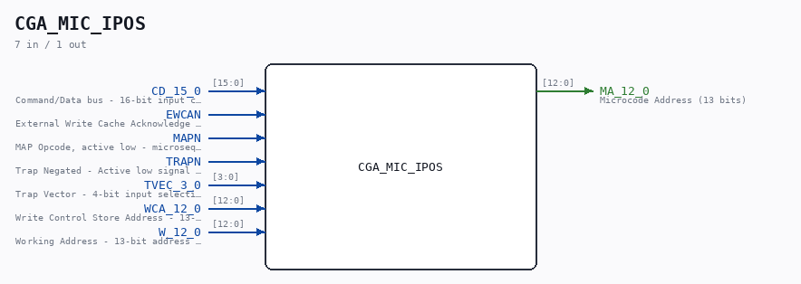
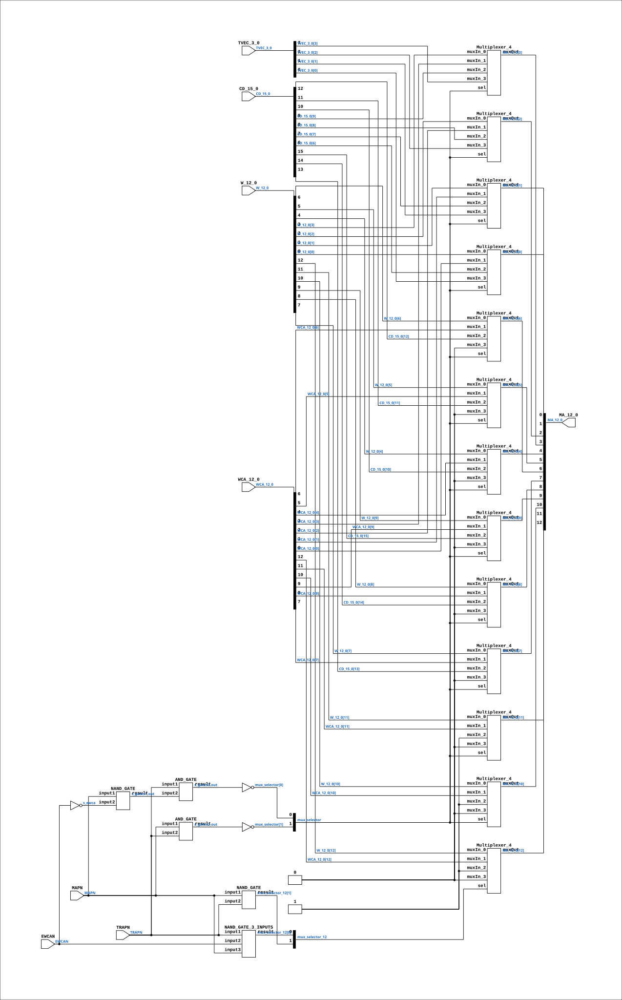

# CGA_MIC_IPOS

Source: `Verilog/DELILAH-CPU/CGA_MIC/circuit/CGA_MIC_IPOS.v`

<!-- Generated by Verilog/tests/module_doc.py from the //! comments in the source. Do not edit by hand - edit the RTL comments and regenerate. -->

<!-- HIERARCHY-NAV:BEGIN - written by Verilog/tests/gen_hierarchy.py, do not edit -->

**Where it sits** (Simulation): [ND120_TOP](../../../../doc/ND120_TOP.md) > [ND120_CORE](../../../../doc/ND120_CORE.md) > [ND3202D](../../../../CPU-BOARD-3202/circuit/doc/ND3202D.md) > [CPU_15](../../../../CPU-BOARD-3202/circuit/doc/CPU_15.md) > [CPU_PROC_32](../../../../CPU-BOARD-3202/circuit/doc/CPU_PROC_32.md) > [CPU_PROC_CGA_33](../../../../CPU-BOARD-3202/circuit/doc/CPU_PROC_CGA_33.md) > [CGA](../../../CGA/circuit/doc/CGA.md) > [CGA_MIC](CGA_MIC.md) > **CGA_MIC_IPOS**
- instance path: `CORE.CPU_BOARD.CPU.PROC.CGA.DELILAH.MIC.MIC_IPOS`

**Used in:** [CGA_MIC](CGA_MIC.md) (all tops)

**Contains:** [AND_GATE](../../../../Shared/logisim/doc/AND_GATE.md) x2, [Multiplexer_4](../../../../Shared/logisim/doc/Multiplexer_4.md) x13, [NAND_GATE](../../../../Shared/logisim/doc/NAND_GATE.md) x2, [NAND_GATE_3_INPUTS](../../../../Shared/logisim/doc/NAND_GATE_3_INPUTS.md)

[Module hierarchy](../../../../HIERARCHY.md) - [All modules](../../../../MODULES.md)

<!-- HIERARCHY-NAV:END -->



<!-- SCHEMATIC:BEGIN - written by Verilog/tests/gen_schematics.py, do not edit -->

## Schematic

Drawn from the Verilog: the yosys netlist of the Simulation (Verilator) build, instance `CORE.CPU_BOARD.CPU.PROC.CGA.DELILAH.MIC.MIC_IPOS`. Sub-modules are boxes (click the picture to open it full size; there every sub-module box links to its page, and every wire shows its Verilog name).

[](CGA_MIC_IPOS.svg)

<!-- SCHEMATIC:END -->

## Description

ND120 CGA (CPU Gate Array / DELILAH)
/CGA/MIC/IPOS
INSTRUCTION POSITION
Page 22
SHEET 1 of 1
Last reviewed: 02-FEB-2025
Ronny Hansen

## Ports

| Direction | Width | Name | Description |
|---|---|---|---|
| input | `[15:0]` | `CD_15_0` | Command/Data bus - 16-bit input carrying instruction/data |
| input | `1` | `EWCAN` | External Write Cache Acknowledge Negated - Active low signal indicating cache write completion |
| input | `1` | `MAPN` | MAP Opcode, active low - microsequencer loads next micro-address from the opcode mapper |
| input | `1` | `TRAPN` | Trap Negated - Active low signal indicating trap condition |
| input | `[3:0]` | `TVEC_3_0` | Trap Vector - 4-bit input selecting trap handling routine address |
| input | `[12:0]` | `WCA_12_0` | Write Control Store Address - 13-bit address for writing to control store |
| input | `[12:0]` | `W_12_0` | Working Address - 13-bit address used during normal operation |
| output | `[12:0]` | `MA_12_0` | Microcode Address (13 bits) |

## Verilog source

[`Verilog/DELILAH-CPU/CGA_MIC/circuit/CGA_MIC_IPOS.v`](https://github.com/RetroCoreLabs/nd-120/blob/main/Verilog/DELILAH-CPU/CGA_MIC/circuit/CGA_MIC_IPOS.v) on GitHub.

<details markdown="1">
<summary>Show the Verilog of CGA_MIC_IPOS (248 lines)</summary>

```verilog
/**************************************************************************
** ND120 CGA (CPU Gate Array / DELILAH)                                  **
** /CGA/MIC/IPOS                                                         **
** INSTRUCTION POSITION                                                  **
**                                                                       **
** Page 22                                                               **
** SHEET 1 of 1                                                          **
**                                                                       **
** Last reviewed: 02-FEB-2025                                            **
** Ronny Hansen                                                          **
***************************************************************************/

module CGA_MIC_IPOS (
    input [15:0] CD_15_0,    //! Command/Data bus - 16-bit input carrying instruction/data
    input        EWCAN,      //! External Write Cache Acknowledge Negated - Active low signal indicating cache write completion
    input        MAPN,       //! MAP Opcode, active low - microsequencer loads next micro-address from the opcode mapper
    input        TRAPN,      //! Trap Negated - Active low signal indicating trap condition
    input [ 3:0] TVEC_3_0,   //! Trap Vector - 4-bit input selecting trap handling routine address
    input [12:0] WCA_12_0,   //! Write Control Store Address - 13-bit address for writing to control store
    input [12:0] W_12_0,     //! Working Address - 13-bit address used during normal operation

    output [12:0] MA_12_0  //! Microcode Address (13 bits)
);

  /*******************************************************************************
   ** The wires are defined here                                                 **
   *******************************************************************************/
  wire [ 1:0] mux_selector_12;
  wire [ 1:0] mux_selector;
  wire [ 3:0] s_tvec_3_0;
  wire [12:0] s_ma_12_0_out;
  wire [12:0] s_w_12_0;
  wire [12:0] s_wca_12_0;
  wire [15:0] s_cd_15_0;
  wire        s_ewca_n;
  wire        s_ewca;
  wire        s_gates1_out;
  wire        s_gates2_out;
  wire        s_gates3_out;
  wire        s_gnd;
  wire        s_map_n;
  wire        s_power;
  wire        s_trap_n;

  /*******************************************************************************
   ** The module functionality is described here                                 **
   *******************************************************************************/

  /*******************************************************************************
   ** Here all input connections are defined                                     **
   *******************************************************************************/
  assign s_cd_15_0[15:0]  = CD_15_0;
  assign s_ewca_n         = EWCAN;
  assign s_map_n          = MAPN;
  assign s_trap_n         = TRAPN;
  assign s_tvec_3_0[3:0]  = TVEC_3_0;
  assign s_w_12_0[12:0]   = W_12_0;
  assign s_wca_12_0[12:0] = WCA_12_0;

  /*******************************************************************************
   ** Here all output connections are defined                                    **
   *******************************************************************************/
  assign MA_12_0          = s_ma_12_0_out[12:0];

  /*******************************************************************************
   ** Here all in-lined components are defined                                   **
   *******************************************************************************/

  // Power
  assign s_power          = 1'b1;


  // Ground
  assign s_gnd            = 1'b0;


  // NOT Gate
  assign s_ewca           = ~s_ewca_n;
  assign mux_selector[1]  = ~s_gates2_out;
  assign mux_selector[0]  = ~s_gates3_out;

  // Code to make LINTER not complain about bits not read in CD 5:0
  // TODO-MAYBE: Refactor code to not have CD_15_0 but CD_15_6, and remove this "hack"
  (* keep = "true", DONT_TOUCH = "true" *) wire [5:0] unused_CD_bits;
  assign unused_CD_bits[5:0] = s_cd_15_0[5:0];

  /*******************************************************************************
   ** Here all normal components are defined                                     **
   *******************************************************************************/
  NAND_GATE #(
      .BubblesMask(2'b00)
  ) GATES_1 (
      .input1(s_map_n),
      .input2(s_ewca),
      .result(s_gates1_out)
  );

  AND_GATE #(
      .BubblesMask(2'b00)
  ) GATES_2 (
      .input1(s_map_n),
      .input2(s_trap_n),
      .result(s_gates2_out)
  );

  AND_GATE #(
      .BubblesMask(2'b00)
  ) GATES_3 (
      .input1(s_trap_n),
      .input2(s_gates1_out),
      .result(s_gates3_out)
  );

  NAND_GATE_3_INPUTS #(
      .BubblesMask(3'b000)
  ) GATES_4 (
      .input1(s_trap_n),
      .input2(s_ewca_n),
      .input3(s_map_n),
      .result(mux_selector_12[0])
  );

  NAND_GATE #(
      .BubblesMask(2'b00)
  ) GATES_5 (
      .input1(s_map_n),
      .input2(s_trap_n),
      .result(mux_selector_12[1])
  );

  Multiplexer_4 PLEXERS_17 (
      .muxIn_0(s_w_12_0[12]),
      .muxIn_1(s_wca_12_0[12]),
      .muxIn_2(s_power),
      .muxIn_3(s_gnd),
      .muxOut(s_ma_12_0_out[12]),
      .sel(mux_selector_12[1:0])
  );

  Multiplexer_4 PLEXERS_18 (
      .muxIn_0(s_w_12_0[11]),
      .muxIn_1(s_wca_12_0[11]),
      .muxIn_2(s_power),
      .muxIn_3(s_gnd),
      .muxOut(s_ma_12_0_out[11]),
      .sel(mux_selector[1:0])
  );

  Multiplexer_4 PLEXERS_6 (
      .muxIn_0(s_w_12_0[10]),
      .muxIn_1(s_wca_12_0[10]),
      .muxIn_2(s_power),
      .muxIn_3(s_gnd),
      .muxOut(s_ma_12_0_out[10]),
      .sel(mux_selector[1:0])
  );

  Multiplexer_4 PLEXERS_7 (
      .muxIn_0(s_w_12_0[9]),
      .muxIn_1(s_wca_12_0[9]),
      .muxIn_2(s_cd_15_0[15]),
      .muxIn_3(s_gnd),
      .muxOut(s_ma_12_0_out[9]),
      .sel(mux_selector[1:0])
  );

  Multiplexer_4 PLEXERS_8 (
      .muxIn_0(s_w_12_0[8]),
      .muxIn_1(s_wca_12_0[8]),
      .muxIn_2(s_cd_15_0[14]),
      .muxIn_3(s_gnd),
      .muxOut(s_ma_12_0_out[8]),
      .sel(mux_selector[1:0])
  );

  Multiplexer_4 PLEXERS_9 (
      .muxIn_0(s_w_12_0[7]),
      .muxIn_1(s_wca_12_0[7]),
      .muxIn_2(s_cd_15_0[13]),
      .muxIn_3(s_gnd),
      .muxOut(s_ma_12_0_out[7]),
      .sel(mux_selector[1:0])
  );

  Multiplexer_4 PLEXERS_10 (
      .muxIn_0(s_w_12_0[6]),
      .muxIn_1(s_wca_12_0[6]),
      .muxIn_2(s_cd_15_0[12]),
      .muxIn_3(s_gnd),
      .muxOut(s_ma_12_0_out[6]),
      .sel(mux_selector[1:0])
  );

  Multiplexer_4 PLEXERS_11 (
      .muxIn_0(s_w_12_0[5]),
      .muxIn_1(s_wca_12_0[5]),
      .muxIn_2(s_cd_15_0[11]),
      .muxIn_3(s_gnd),
      .muxOut(s_ma_12_0_out[5]),
      .sel(mux_selector[1:0])
  );

  Multiplexer_4 PLEXERS_12 (
      .muxIn_0(s_w_12_0[4]),
      .muxIn_1(s_wca_12_0[4]),
      .muxIn_2(s_cd_15_0[10]),
      .muxIn_3(s_gnd),
      .muxOut(s_ma_12_0_out[4]),
      .sel(mux_selector[1:0])
  );

  Multiplexer_4 PLEXERS_13 (
      .muxIn_0(s_w_12_0[3]),
      .muxIn_1(s_wca_12_0[3]),
      .muxIn_2(s_cd_15_0[9]),
      .muxIn_3(s_tvec_3_0[3]),
      .muxOut(s_ma_12_0_out[3]),
      .sel(mux_selector[1:0])
  );

  Multiplexer_4 PLEXERS_14 (
      .muxIn_0(s_w_12_0[2]),
      .muxIn_1(s_wca_12_0[2]),
      .muxIn_2(s_cd_15_0[8]),
      .muxIn_3(s_tvec_3_0[2]),
      .muxOut(s_ma_12_0_out[2]),
      .sel(mux_selector[1:0])
  );

  Multiplexer_4 PLEXERS_15 (
      .muxIn_0(s_w_12_0[1]),
      .muxIn_1(s_wca_12_0[1]),
      .muxIn_2(s_cd_15_0[7]),
      .muxIn_3(s_tvec_3_0[1]),
      .muxOut(s_ma_12_0_out[1]),
      .sel(mux_selector[1:0])
  );

  Multiplexer_4 PLEXERS_16 (
      .muxIn_0(s_w_12_0[0]),
      .muxIn_1(s_wca_12_0[0]),
      .muxIn_2(s_cd_15_0[6]),
      .muxIn_3(s_tvec_3_0[0]),
      .muxOut(s_ma_12_0_out[0]),
      .sel(mux_selector[1:0])
  );

endmodule
```

</details>
