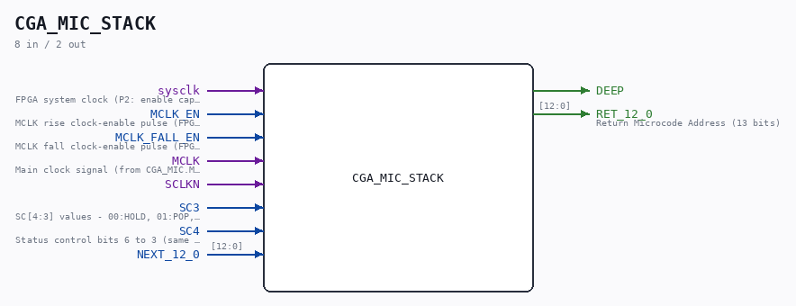
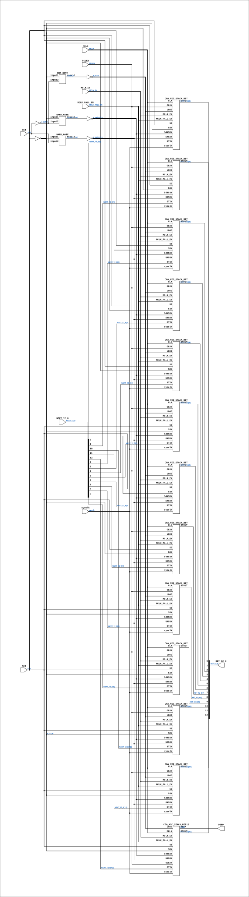

# CGA_MIC_STACK

Source: `Verilog/DELILAH-CPU/CGA_MIC/circuit/CGA_MIC_STACK.v`

<!-- Generated by Verilog/tests/module_doc.py from the //! comments in the source. Do not edit by hand - edit the RTL comments and regenerate. -->

<!-- HIERARCHY-NAV:BEGIN - written by Verilog/tests/gen_hierarchy.py, do not edit -->

**Where it sits** (Simulation): [ND120_TOP](../../../../doc/ND120_TOP.md) > [ND120_CORE](../../../../doc/ND120_CORE.md) > [ND3202D](../../../../CPU-BOARD-3202/circuit/doc/ND3202D.md) > [CPU_15](../../../../CPU-BOARD-3202/circuit/doc/CPU_15.md) > [CPU_PROC_32](../../../../CPU-BOARD-3202/circuit/doc/CPU_PROC_32.md) > [CPU_PROC_CGA_33](../../../../CPU-BOARD-3202/circuit/doc/CPU_PROC_CGA_33.md) > [CGA](../../../CGA/circuit/doc/CGA.md) > [CGA_MIC](CGA_MIC.md) > **CGA_MIC_STACK**
- instance path: `CORE.CPU_BOARD.CPU.PROC.CGA.DELILAH.MIC.MIC_STACK`

**Used in:** [CGA_MIC](CGA_MIC.md) (all tops)

**Contains:** [CGA_MIC_STACK_BIT](CGA_MIC_STACK_BIT.md) x12, [CGA_MIC_STACK_BIT12](CGA_MIC_STACK_BIT12.md), [NAND_GATE](../../../../Shared/logisim/doc/NAND_GATE.md) x2, [NOR_GATE](../../../../Shared/logisim/doc/NOR_GATE.md)

[Module hierarchy](../../../../HIERARCHY.md) - [All modules](../../../../MODULES.md)

<!-- HIERARCHY-NAV:END -->



<!-- SCHEMATIC:BEGIN - written by Verilog/tests/gen_schematics.py, do not edit -->

## Schematic

Drawn from the Verilog: the yosys netlist of the Simulation (Verilator) build, instance `CORE.CPU_BOARD.CPU.PROC.CGA.DELILAH.MIC.MIC_STACK`. Sub-modules are boxes (click the picture to open it full size; there every sub-module box links to its page, and every wire shows its Verilog name).

[](CGA_MIC_STACK.svg)

<!-- SCHEMATIC:END -->

## Description

ND120 CGA (CPU Gate Array / DELILAH)
/CGA/MIC/STACK
Microcode STACK
Modelled after 74S482
Page 17
SHEET 1 of 1
Last reviewed: 10-NOV-2024
Ronny Hansen

## Ports

| Direction | Width | Name | Description |
|---|---|---|---|
| input | `1` | `sysclk` | FPGA system clock (P2: enable capture) |
| input | `1` | `MCLK_EN` | MCLK rise clock-enable pulse (FPGA_FF_MODE, else 0) |
| input | `1` | `MCLK_FALL_EN` | MCLK fall clock-enable pulse (FPGA_FF_MODE, else 0) |
| input | `1` | `MCLK` | Main clock signal (from CGA_MIC.MCLK) |
| input | `1` | `SCLKN` |  |
| input | `1` | `SC3` | SC[4:3] values - 00:HOLD, 01:POP, 10:LOAD, 11:PUSH |
| input | `1` | `SC4` | Status control bits 6 to 3 (same net as CGA_MIC.SC_6_3[1]) |
| input | `[12:0]` | `NEXT_12_0` |  |
| output | `1` | `DEEP` |  |
| output | `[12:0]` | `RET_12_0` | Return Microcode Address (13 bits) |

## Verilog source

[`Verilog/DELILAH-CPU/CGA_MIC/circuit/CGA_MIC_STACK.v`](https://github.com/RetroCoreLabs/nd-120/blob/main/Verilog/DELILAH-CPU/CGA_MIC/circuit/CGA_MIC_STACK.v) on GitHub.

<details markdown="1">
<summary>Show the Verilog of CGA_MIC_STACK (303 lines)</summary>

```verilog
/**************************************************************************
** ND120 CGA (CPU Gate Array / DELILAH)                                  **
** /CGA/MIC/STACK                                                        **
** Microcode STACK                                                       **
**                                                                       **
** Modelled after 74S482                                                 **
**                                                                       **
** Page 17                                                               **
** SHEET 1 of 1                                                          **
**                                                                       **
** Last reviewed: 10-NOV-2024                                            **
** Ronny Hansen                                                          **
***************************************************************************/

module CGA_MIC_STACK (
    input        sysclk,        //! FPGA system clock (P2: enable capture)
    input        MCLK_EN,       //! MCLK rise clock-enable pulse (FPGA_FF_MODE, else 0)
    input        MCLK_FALL_EN,  //! MCLK fall clock-enable pulse (FPGA_FF_MODE, else 0)

    input        MCLK,          //! Main clock signal (from CGA_MIC.MCLK)
    input        SCLKN,
    input        SC3,            //! SC[4:3] values - 00:HOLD, 01:POP, 10:LOAD, 11:PUSH
    input        SC4,           //! Status control bits 6 to 3 (same net as CGA_MIC.SC_6_3[1])
    input [12:0] NEXT_12_0,

    output        DEEP,
    output [12:0] RET_12_0  //! Return Microcode Address (13 bits)
);

  /*******************************************************************************
   ** The wires are defined here                                                 **
   *******************************************************************************/
  wire [12:0] s_ret_12_0_out;
  wire [12:0] s_next_12_0;
  wire        s_deep_out;
  wire        s_gates1_n;
  wire        s_gates1_out;
  wire        s_gates2_n;
  wire        s_gates2_out;
  wire        s_load;
  wire        s_load_n;
  wire        s_mclk;
  wire        s_sc3_n;
  wire        s_sc3;
  wire        s_sc4_n;
  wire        s_sc4;
  wire        s_sclk_n;

  /*******************************************************************************
   ** Here all input connections are defined                                     **
   *******************************************************************************/
  assign s_next_12_0[12:0] = NEXT_12_0;
  assign s_sc4             = SC4;
  assign s_mclk            = MCLK;
  assign s_sclk_n          = SCLKN;
  assign s_sc3             = SC3;

  /*******************************************************************************
   ** Here all output connections are defined                                    **
   *******************************************************************************/
  assign DEEP              = s_deep_out;
  assign RET_12_0          = s_ret_12_0_out[12:0];

  /*******************************************************************************
   ** Here all in-lined components are defined                                   **
   *******************************************************************************/

  // NOT Gate
  assign s_sc3_n           = ~s_sc3;
  assign s_sc4_n           = ~s_sc4;
  assign s_gates1_n        = ~s_gates1_out;
  assign s_gates2_n        = ~s_gates2_out;
  assign s_load        = ~s_load_n;

  /*******************************************************************************
   ** Here all normal components are defined                                     **
   *******************************************************************************/
  NAND_GATE #(
      .BubblesMask(2'b00)
  ) GATES_1 (
      .input1(s_sc3_n),
      .input2(s_sc4),
      .result(s_gates1_out)
  );

  NAND_GATE #(
      .BubblesMask(2'b00)
  ) GATES_2 (
      .input1(s_sc3_n),
      .input2(s_sc4_n),
      .result(s_gates2_out)
  );

  NOR_GATE #(
      .BubblesMask(2'b00)
  ) GATES_3 (
      .input1(s_sc3_n),
      .input2(s_sc4_n),
      .result(s_load_n)
  );


  /*******************************************************************************
   ** Here all sub-circuits are defined                                          **
   *******************************************************************************/

  CGA_MIC_STACK_BIT Bit11 (
      .sysclk(sysclk),
      .MCLK_EN(MCLK_EN),
      .MCLK_FALL_EN(MCLK_FALL_EN),
      .CLK(s_mclk),
      .CLKN(s_sclk_n),
      .LOAD(s_load),
      .S3(s_sc3),
      .S3N(s_sc3_n),
      .S4NS3N(s_gates2_n),
      .S4S3N(s_gates1_n),
      .STIN(s_next_12_0[11]),
      .STOUT(s_ret_12_0_out[11])
  );

  CGA_MIC_STACK_BIT Bit10 (
      .sysclk(sysclk),
      .MCLK_EN(MCLK_EN),
      .MCLK_FALL_EN(MCLK_FALL_EN),
      .CLK(s_mclk),
      .CLKN(s_sclk_n),
      .LOAD(s_load),
      .S3(s_sc3),
      .S3N(s_sc3_n),
      .S4NS3N(s_gates2_n),
      .S4S3N(s_gates1_n),
      .STIN(s_next_12_0[10]),
      .STOUT(s_ret_12_0_out[10])
  );

  CGA_MIC_STACK_BIT Bit9 (
      .sysclk(sysclk),
      .MCLK_EN(MCLK_EN),
      .MCLK_FALL_EN(MCLK_FALL_EN),
      .CLK(s_mclk),
      .CLKN(s_sclk_n),
      .LOAD(s_load),
      .S3(s_sc3),
      .S3N(s_sc3_n),
      .S4NS3N(s_gates2_n),
      .S4S3N(s_gates1_n),
      .STIN(s_next_12_0[9]),
      .STOUT(s_ret_12_0_out[9])
  );

  CGA_MIC_STACK_BIT Bit8 (
      .sysclk(sysclk),
      .MCLK_EN(MCLK_EN),
      .MCLK_FALL_EN(MCLK_FALL_EN),
      .CLK(s_mclk),
      .CLKN(s_sclk_n),
      .LOAD(s_load),
      .S3(s_sc3),
      .S3N(s_sc3_n),
      .S4NS3N(s_gates2_n),
      .S4S3N(s_gates1_n),
      .STIN(s_next_12_0[8]),
      .STOUT(s_ret_12_0_out[8])
  );

  CGA_MIC_STACK_BIT Bit7 (
      .sysclk(sysclk),
      .MCLK_EN(MCLK_EN),
      .MCLK_FALL_EN(MCLK_FALL_EN),
      .CLK(s_mclk),
      .CLKN(s_sclk_n),
      .LOAD(s_load),
      .S3(s_sc3),
      .S3N(s_sc3_n),
      .S4NS3N(s_gates2_n),
      .S4S3N(s_gates1_n),
      .STIN(s_next_12_0[7]),
      .STOUT(s_ret_12_0_out[7])
  );

  CGA_MIC_STACK_BIT Bit6 (
      .sysclk(sysclk),
      .MCLK_EN(MCLK_EN),
      .MCLK_FALL_EN(MCLK_FALL_EN),
      .CLK(s_mclk),
      .CLKN(s_sclk_n),
      .LOAD(s_load),
      .S3(s_sc3),
      .S3N(s_sc3_n),
      .S4NS3N(s_gates2_n),
      .S4S3N(s_gates1_n),
      .STIN(s_next_12_0[6]),
      .STOUT(s_ret_12_0_out[6])
  );

  CGA_MIC_STACK_BIT Bit5 (
      .sysclk(sysclk),
      .MCLK_EN(MCLK_EN),
      .MCLK_FALL_EN(MCLK_FALL_EN),
      .CLK(s_mclk),
      .CLKN(s_sclk_n),
      .LOAD(s_load),
      .S3(s_sc3),
      .S3N(s_sc3_n),
      .S4NS3N(s_gates2_n),
      .S4S3N(s_gates1_n),
      .STIN(s_next_12_0[5]),
      .STOUT(s_ret_12_0_out[5])
  );

  CGA_MIC_STACK_BIT Bit4 (
      .sysclk(sysclk),
      .MCLK_EN(MCLK_EN),
      .MCLK_FALL_EN(MCLK_FALL_EN),
      .CLK(s_mclk),
      .CLKN(s_sclk_n),
      .LOAD(s_load),
      .S3(s_sc3),
      .S3N(s_sc3_n),
      .S4NS3N(s_gates2_n),
      .S4S3N(s_gates1_n),
      .STIN(s_next_12_0[4]),
      .STOUT(s_ret_12_0_out[4])
  );

  CGA_MIC_STACK_BIT Bit3 (
      .sysclk(sysclk),
      .MCLK_EN(MCLK_EN),
      .MCLK_FALL_EN(MCLK_FALL_EN),
      .CLK(s_mclk),
      .CLKN(s_sclk_n),
      .LOAD(s_load),
      .S3(s_sc3),
      .S3N(s_sc3_n),
      .S4NS3N(s_gates2_n),
      .S4S3N(s_gates1_n),
      .STIN(s_next_12_0[3]),
      .STOUT(s_ret_12_0_out[3])
  );

  CGA_MIC_STACK_BIT Bit2 (
      .sysclk(sysclk),
      .MCLK_EN(MCLK_EN),
      .MCLK_FALL_EN(MCLK_FALL_EN),
      .CLK(s_mclk),
      .CLKN(s_sclk_n),
      .LOAD(s_load),
      .S3(s_sc3),
      .S3N(s_sc3_n),
      .S4NS3N(s_gates2_n),
      .S4S3N(s_gates1_n),
      .STIN(s_next_12_0[2]),
      .STOUT(s_ret_12_0_out[2])
  );

  CGA_MIC_STACK_BIT Bit1 (
      .sysclk(sysclk),
      .MCLK_EN(MCLK_EN),
      .MCLK_FALL_EN(MCLK_FALL_EN),
      .CLK(s_mclk),
      .CLKN(s_sclk_n),
      .LOAD(s_load),
      .S3(s_sc3),
      .S3N(s_sc3_n),
      .S4NS3N(s_gates2_n),
      .S4S3N(s_gates1_n),
      .STIN(s_next_12_0[1]),
      .STOUT(s_ret_12_0_out[1])
  );

  CGA_MIC_STACK_BIT Bit0 (
      .sysclk(sysclk),
      .MCLK_EN(MCLK_EN),
      .MCLK_FALL_EN(MCLK_FALL_EN),
      .CLK(s_mclk),
      .CLKN(s_sclk_n),
      .LOAD(s_load),
      .S3(s_sc3),
      .S3N(s_sc3_n),
      .S4NS3N(s_gates2_n),
      .S4S3N(s_gates1_n),
      .STIN(s_next_12_0[0]),
      .STOUT(s_ret_12_0_out[0])
  );

  CGA_MIC_STACK_BIT12 Bit12 (
      .sysclk(sysclk),
      .MCLK_EN(MCLK_EN),
      .MCLK_FALL_EN(MCLK_FALL_EN),
      .DEEP(s_deep_out),
      .LOAD(s_load),
      .MCLK(s_mclk),
      .S3(s_sc3),
      .S3N(s_sc3_n),
      .S4NS3N(s_gates2_n),
      .S4S3N(s_gates1_n),
      .SCLKN(s_sclk_n),
      .STIN(s_next_12_0[12]),
      .STOUT(s_ret_12_0_out[12])
  );

endmodule
```

</details>
