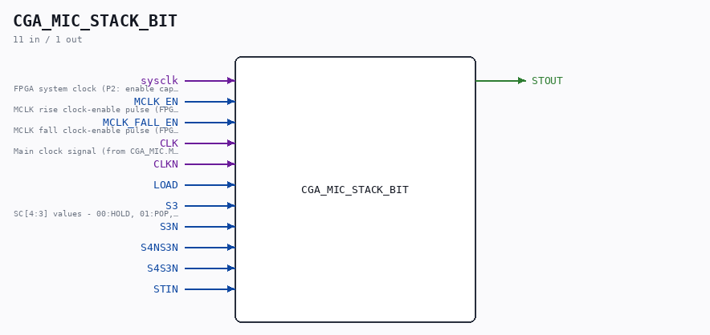
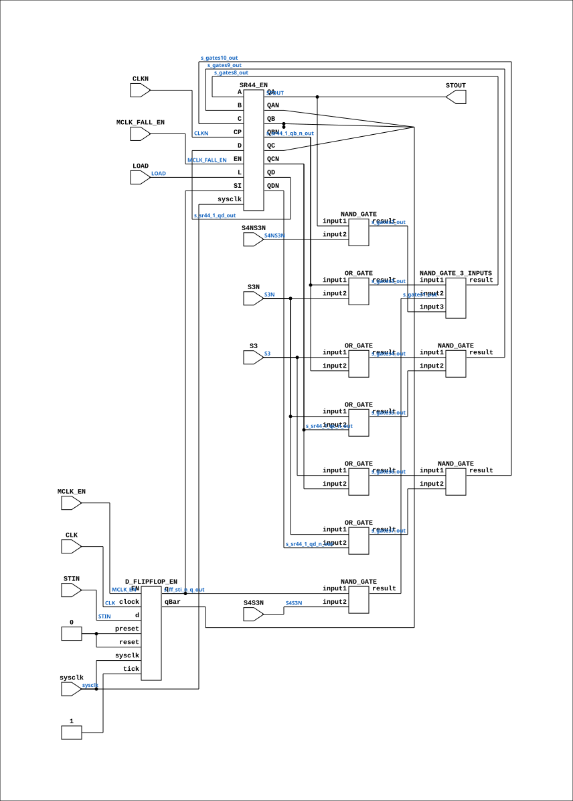

# CGA_MIC_STACK_BIT

Source: `Verilog/DELILAH-CPU/CGA_MIC/circuit/CGA_MIC_STACK_BIT.v`

<!-- Generated by Verilog/tests/module_doc.py from the //! comments in the source. Do not edit by hand - edit the RTL comments and regenerate. -->

<!-- HIERARCHY-NAV:BEGIN - written by Verilog/tests/gen_hierarchy.py, do not edit -->

**Where it sits** (Simulation): [ND120_TOP](../../../../doc/ND120_TOP.md) > [ND120_CORE](../../../../doc/ND120_CORE.md) > [ND3202D](../../../../CPU-BOARD-3202/circuit/doc/ND3202D.md) > [CPU_15](../../../../CPU-BOARD-3202/circuit/doc/CPU_15.md) > [CPU_PROC_32](../../../../CPU-BOARD-3202/circuit/doc/CPU_PROC_32.md) > [CPU_PROC_CGA_33](../../../../CPU-BOARD-3202/circuit/doc/CPU_PROC_CGA_33.md) > [CGA](../../../CGA/circuit/doc/CGA.md) > [CGA_MIC](CGA_MIC.md) > [CGA_MIC_STACK](CGA_MIC_STACK.md) > **CGA_MIC_STACK_BIT**
- instance path: `CORE.CPU_BOARD.CPU.PROC.CGA.DELILAH.MIC.MIC_STACK.Bit11`

**Used in:** [CGA_MIC_STACK](CGA_MIC_STACK.md) (all tops)

**Contains:** [D_FLIPFLOP_EN](../../../../Shared/ndlib/doc/D_FLIPFLOP_EN.md), [NAND_GATE](../../../../Shared/logisim/doc/NAND_GATE.md) x4, [NAND_GATE_3_INPUTS](../../../../Shared/logisim/doc/NAND_GATE_3_INPUTS.md), [OR_GATE](../../../../Shared/logisim/doc/OR_GATE.md) x5, [SR44_EN](../../../../Shared/ndlib/doc/SR44_EN.md)

[Module hierarchy](../../../../HIERARCHY.md) - [All modules](../../../../MODULES.md)

<!-- HIERARCHY-NAV:END -->



<!-- SCHEMATIC:BEGIN - written by Verilog/tests/gen_schematics.py, do not edit -->

## Schematic

Drawn from the Verilog: the yosys netlist of the Simulation (Verilator) build, instance `CORE.CPU_BOARD.CPU.PROC.CGA.DELILAH.MIC.MIC_STACK.Bit11`. Sub-modules are boxes (click the picture to open it full size; there every sub-module box links to its page, and every wire shows its Verilog name).

[](CGA_MIC_STACK_BIT.svg)

<!-- SCHEMATIC:END -->

## Description

ND120 CGA (CPU Gate Array / DELILAH)
/CGA/MIC/STACK/BIT
BIT
Page 17
SHEET 1 of 1
Last reviewed: 10-NOV-2024
Ronny Hansen

## Ports

| Direction | Width | Name | Description |
|---|---|---|---|
| input | `1` | `sysclk` | FPGA system clock (P2: enable capture) |
| input | `1` | `MCLK_EN` | MCLK rise clock-enable pulse (FPGA_FF_MODE, else 0) |
| input | `1` | `MCLK_FALL_EN` | MCLK fall clock-enable pulse (FPGA_FF_MODE, else 0) |
| input | `1` | `CLK` | Main clock signal (from CGA_MIC.MCLK) |
| input | `1` | `CLKN` |  |
| input | `1` | `LOAD` |  |
| input | `1` | `S3` | SC[4:3] values - 00:HOLD, 01:POP, 10:LOAD, 11:PUSH (from CGA_MIC_STACK.SC3) |
| input | `1` | `S3N` |  |
| input | `1` | `S4NS3N` |  |
| input | `1` | `S4S3N` |  |
| input | `1` | `STIN` |  |
| output | `1` | `STOUT` |  |

## Verilog source

[`Verilog/DELILAH-CPU/CGA_MIC/circuit/CGA_MIC_STACK_BIT.v`](https://github.com/RetroCoreLabs/nd-120/blob/main/Verilog/DELILAH-CPU/CGA_MIC/circuit/CGA_MIC_STACK_BIT.v) on GitHub.

<details markdown="1">
<summary>Show the Verilog of CGA_MIC_STACK_BIT (216 lines)</summary>

```verilog
/**************************************************************************
** ND120 CGA (CPU Gate Array / DELILAH)                                  **
** /CGA/MIC/STACK/BIT                                                    **
** BIT                                                                   **
**                                                                       **
** Page 17                                                               **
** SHEET 1 of 1                                                          **
**                                                                       **
** Last reviewed: 10-NOV-2024                                            **
** Ronny Hansen                                                          **
***************************************************************************/

module CGA_MIC_STACK_BIT (
    input sysclk,        //! FPGA system clock (P2: enable capture)
    input MCLK_EN,       //! MCLK rise clock-enable pulse (FPGA_FF_MODE, else 0)
    input MCLK_FALL_EN,  //! MCLK fall clock-enable pulse (FPGA_FF_MODE, else 0)

    input CLK,           //! Main clock signal (from CGA_MIC.MCLK)
    input CLKN,
    input LOAD,
    input S3,            //! SC[4:3] values - 00:HOLD, 01:POP, 10:LOAD, 11:PUSH (from CGA_MIC_STACK.SC3)
    input S3N,
    input S4NS3N,
    input S4S3N,
    input STIN,

    output STOUT
);
  /*******************************************************************************
   ** The wires are defined here                                                 **
   *******************************************************************************/
  wire s_sr44_1_qa_out;
  wire s_sr44_1_qc_n_out;
  wire s_ff_sti_n_q_out;
  wire s_s3n;
  wire s_sr44_1_qd_n_out;
  wire s_gates3_out;
  wire s_gates2_out;
  wire s_s3;
  wire s_gates10_out;
  wire s_clkn;
  wire s_gates7_out;
  wire s_s4n_s3n;
  wire s_gates5_out;
  wire s_gates1_out;
  wire s_clk;
  wire s_sti_n;
  wire s_gates8_out;
  wire s_gates6_out;
  wire s_gates9_out;
  wire s_load;
  wire s_sr44_1_qb_n_out;
  wire s_sr44_1_qd_out;
  wire s_gates4_out;
  wire s_s4_s3n;

  /*******************************************************************************
   ** The module functionality is described here                                 **
   *******************************************************************************/

  /*******************************************************************************
   ** Here all input connections are defined                                     **
   *******************************************************************************/
  assign s_s3n = S3N;
  assign s_s3 = S3;
  assign s_clkn = CLKN;
  assign s_s4n_s3n = S4NS3N;
  assign s_clk = CLK;
  assign s_sti_n = STIN;
  assign s_load = LOAD;
  assign s_s4_s3n = S4S3N;

  // P2 (docs/plan-fix-unconstrained-clocks.md): in FF mode the derived-
  // clock registers capture on posedge sysclk gated by the matching
  // enable pulse instead of clocking on the routed net.
`ifdef FPGA_FF_MODE
  localparam MCLK_CE = 1;
  localparam MCLK_FALL_CE = 1;
`else
  localparam MCLK_CE = 0;
  localparam MCLK_FALL_CE = 0;
`endif

  /*******************************************************************************
   ** Here all output connections are defined                                    **
   *******************************************************************************/
  assign STOUT = s_sr44_1_qa_out;

  /*******************************************************************************
   ** Here all normal components are defined                                     **
   *******************************************************************************/
  NAND_GATE #(
      .BubblesMask(2'b00)
  ) GATES_1 (
      .input1(s_ff_sti_n_q_out),
      .input2(s_s4_s3n),
      .result(s_gates1_out)
  );

  NAND_GATE #(
      .BubblesMask(2'b00)
  ) GATES_2 (
      .input1(s_sr44_1_qa_out),
      .input2(s_s4n_s3n),
      .result(s_gates2_out)
  );

  OR_GATE #(
      .BubblesMask(2'b00)
  ) GATES_3 (
      .input1(s_sr44_1_qb_n_out),
      .input2(s_s3n),
      .result(s_gates3_out)
  );

  OR_GATE #(
      .BubblesMask(2'b00)
  ) GATES_4 (
      .input1(s_s3),
      .input2(s_sr44_1_qb_n_out),
      .result(s_gates4_out)
  );

  OR_GATE #(
      .BubblesMask(2'b00)
  ) GATES_5 (
      .input1(s_s3n),
      .input2(s_sr44_1_qc_n_out),
      .result(s_gates5_out)
  );

  OR_GATE #(
      .BubblesMask(2'b00)
  ) GATES_6 (
      .input1(s_s3),
      .input2(s_sr44_1_qc_n_out),
      .result(s_gates6_out)
  );

  OR_GATE #(
      .BubblesMask(2'b00)
  ) GATES_7 (
      .input1(s_s3n),
      .input2(s_sr44_1_qd_n_out),
      .result(s_gates7_out)
  );

  NAND_GATE_3_INPUTS #(
      .BubblesMask(3'b000)
  ) GATES_8 (
      .input1(s_gates3_out),
      .input2(s_gates1_out),
      .input3(s_gates2_out),
      .result(s_gates8_out)
  );

  NAND_GATE #(
      .BubblesMask(2'b00)
  ) GATES_9 (
      .input1(s_gates4_out),
      .input2(s_gates5_out),
      .result(s_gates9_out)
  );

  NAND_GATE #(
      .BubblesMask(2'b00)
  ) GATES_10 (
      .input1(s_gates6_out),
      .input2(s_gates7_out),
      .result(s_gates10_out)
  );

  // MCLK domain: s_clk = CLK = MCLK, clocked on posedge MCLK
  D_FLIPFLOP_EN #(
      .USE_ENABLE(MCLK_CE)
  ) MEMORY_11 (
      .sysclk(sysclk),
      .EN(MCLK_EN),
      .clock(s_clk),
      .d(s_sti_n),
      .preset(1'b0),
      .q(s_ff_sti_n_q_out),
      .qBar(),
      .reset(1'b0),
      .tick(1'b1)
  );


  /*******************************************************************************
   ** Here all sub-circuits are defined                                          **
   *******************************************************************************/

  // MCLK_FALL domain: s_clkn = CLKN = ~MCLK, posedge ~MCLK = MCLK falling edge
  SR44_EN #(.USE_ENABLE(MCLK_FALL_CE)) SR44_1 (
      .sysclk(sysclk),
      .EN(MCLK_FALL_EN),
      .CP(s_clkn),
      .L (s_load),

      .A(s_gates8_out),
      .B(s_gates9_out),
      .C(s_gates10_out),
      .D(s_sr44_1_qd_out),

      .QA (s_sr44_1_qa_out),
      .QAN(),
      .QB (),
      .QBN(s_sr44_1_qb_n_out),
      .QC (),
      .QCN(s_sr44_1_qc_n_out),
      .QD (s_sr44_1_qd_out),
      .QDN(s_sr44_1_qd_n_out),
      .SI (s_ff_sti_n_q_out)
  );

endmodule
```

</details>
