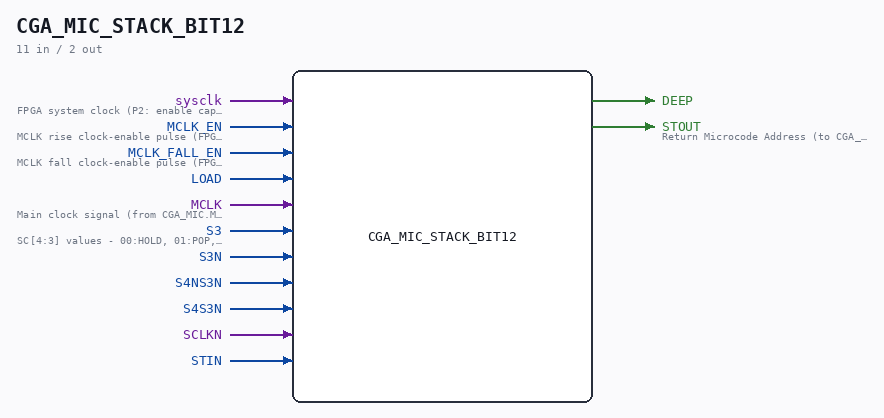

# CGA_MIC_STACK_BIT12

Source: `Verilog/DELILAH-CPU/CGA_MIC/circuit/CGA_MIC_STACK_BIT12.v`

> Generated by `Verilog/tests/module_doc.py` from the `//!`
> comments in the source. Do not edit by hand - edit the RTL comments and regenerate.

<!-- HIERARCHY-NAV:BEGIN - written by Verilog/tests/gen_hierarchy.py, do not edit -->

**Where it sits** (Simulation): [ND120_TOP](../../../../doc/ND120_TOP.md) > [ND120_CORE](../../../../doc/ND120_CORE.md) > [ND3202D](../../../../CPU-BOARD-3202/circuit/doc/ND3202D.md) > [CPU_15](../../../../CPU-BOARD-3202/circuit/doc/CPU_15.md) > [CPU_PROC_32](../../../../CPU-BOARD-3202/circuit/doc/CPU_PROC_32.md) > [CPU_PROC_CGA_33](../../../../CPU-BOARD-3202/circuit/doc/CPU_PROC_CGA_33.md) > [CGA](../../../CGA/circuit/doc/CGA.md) > [CGA_MIC](CGA_MIC.md) > [CGA_MIC_STACK](CGA_MIC_STACK.md) > **CGA_MIC_STACK_BIT12**
- instance path: `CORE.CPU_BOARD.CPU.PROC.CGA.DELILAH.MIC.MIC_STACK.Bit12`

**Used in:** [CGA_MIC_STACK](CGA_MIC_STACK.md) (all tops)

**Contains:** [D_FLIPFLOP_EN](../../../../Shared/ndlib/doc/D_FLIPFLOP_EN.md), [NAND_GATE](../../../../Shared/logisim/doc/NAND_GATE.md) x4, [NAND_GATE_3_INPUTS](../../../../Shared/logisim/doc/NAND_GATE_3_INPUTS.md), [OR_GATE](../../../../Shared/logisim/doc/OR_GATE.md) x5, [SR44_EN](../../../../Shared/ndlib/doc/SR44_EN.md)

[Module hierarchy](../../../../HIERARCHY.md) - [All modules](../../../../MODULES.md)

<!-- HIERARCHY-NAV:END -->

## Description

ND120 CGA (CPU Gate Array / DELILAH)
/CGA/MIC/STACK/BIT12
BIT12
Page 18
SHEET 1 of 1
Last reviewed: 10-NOV-2024
Ronny Hansen

## Ports

| Direction | Width | Name | Description |
|---|---|---|---|
| input | `1` | `sysclk` | FPGA system clock (P2: enable capture) |
| input | `1` | `MCLK_EN` | MCLK rise clock-enable pulse (FPGA_FF_MODE, else 0) |
| input | `1` | `MCLK_FALL_EN` | MCLK fall clock-enable pulse (FPGA_FF_MODE, else 0) |
| input | `1` | `LOAD` |  |
| input | `1` | `MCLK` |  |
| input | `1` | `S3` |  |
| input | `1` | `S3N` |  |
| input | `1` | `S4NS3N` |  |
| input | `1` | `S4S3N` |  |
| input | `1` | `SCLKN` |  |
| input | `1` | `STIN` |  |
| output | `1` | `DEEP` |  |
| output | `1` | `STOUT` |  |
