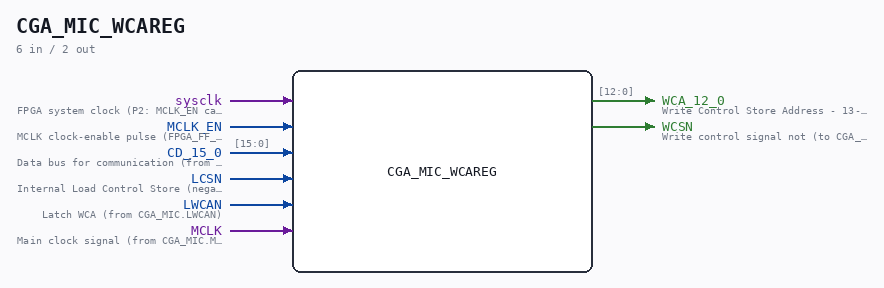
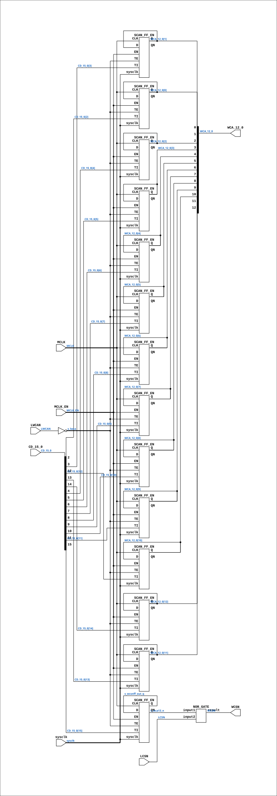

# CGA_MIC_WCAREG

Source: `Verilog/DELILAH-CPU/CGA_MIC/circuit/CGA_MIC_WCAREG.v`

<!-- Generated by Verilog/tests/module_doc.py from the //! comments in the source. Do not edit by hand - edit the RTL comments and regenerate. -->

<!-- HIERARCHY-NAV:BEGIN - written by Verilog/tests/gen_hierarchy.py, do not edit -->

**Where it sits** (Simulation): [ND120_TOP](../../../../doc/ND120_TOP.md) > [ND120_CORE](../../../../doc/ND120_CORE.md) > [ND3202D](../../../../CPU-BOARD-3202/circuit/doc/ND3202D.md) > [CPU_15](../../../../CPU-BOARD-3202/circuit/doc/CPU_15.md) > [CPU_PROC_32](../../../../CPU-BOARD-3202/circuit/doc/CPU_PROC_32.md) > [CPU_PROC_CGA_33](../../../../CPU-BOARD-3202/circuit/doc/CPU_PROC_CGA_33.md) > [CGA](../../../CGA/circuit/doc/CGA.md) > [CGA_MIC](CGA_MIC.md) > **CGA_MIC_WCAREG**
- instance path: `CORE.CPU_BOARD.CPU.PROC.CGA.DELILAH.MIC.MIC_WCAREG`

**Used in:** [CGA_MIC](CGA_MIC.md) (all tops)

**Contains:** [NOR_GATE](../../../../Shared/logisim/doc/NOR_GATE.md), [SCAN_FF_EN](../../../../Shared/ndlib/doc/SCAN_FF_EN.md) x14

[Module hierarchy](../../../../HIERARCHY.md) - [All modules](../../../../MODULES.md)

<!-- HIERARCHY-NAV:END -->



<!-- SCHEMATIC:BEGIN - written by Verilog/tests/gen_schematics.py, do not edit -->

## Schematic

Drawn from the Verilog: the yosys netlist of the Simulation (Verilator) build, instance `CORE.CPU_BOARD.CPU.PROC.CGA.DELILAH.MIC.MIC_WCAREG`. Sub-modules are boxes (click the picture to open it full size; there every sub-module box links to its page, and every wire shows its Verilog name).

[](CGA_MIC_WCAREG.svg)

<!-- SCHEMATIC:END -->

## Description

ND120 CGA (CPU Gate Array / DELILAH)
/CGA/MIC/WCAREG
WCAREG
Page 21
SHEET 1 of 1
Last reviewed: 02-FEB-2025
Ronny Hansen

## Ports

| Direction | Width | Name | Description |
|---|---|---|---|
| input | `1` | `sysclk` | FPGA system clock (P2: MCLK_EN capture) |
| input | `1` | `MCLK_EN` | MCLK clock-enable pulse (FPGA_FF_MODE, else 0) |
| input | `[15:0]` | `CD_15_0` | Data bus for communication (from CGA_MIC.CD_15_0) |
| input | `1` | `LCSN` | Internal Load Control Store (negated) (from CGA_MIC.ILCSN) |
| input | `1` | `LWCAN` | Latch WCA (from CGA_MIC.LWCAN) |
| input | `1` | `MCLK` | Main clock signal (from CGA_MIC.MCLK) |
| output | `[12:0]` | `WCA_12_0` | Write Control Store Address - 13-bit address for writing to control store (to CGA_MIC_IPOS.WCA_12_0) |
| output | `1` | `WCSN` | Write control signal not (to CGA_MIC.WCSN) |

## Verilog source

[`Verilog/DELILAH-CPU/CGA_MIC/circuit/CGA_MIC_WCAREG.v`](https://github.com/RetroCoreLabs/nd-120/blob/main/Verilog/DELILAH-CPU/CGA_MIC/circuit/CGA_MIC_WCAREG.v) on GitHub.

<details markdown="1">
<summary>Show the Verilog of CGA_MIC_WCAREG (259 lines)</summary>

```verilog
/**************************************************************************
** ND120 CGA (CPU Gate Array / DELILAH)                                  **
** /CGA/MIC/WCAREG                                                       **
** WCAREG                                                                **
**                                                                       **
** Page 21                                                               **
** SHEET 1 of 1                                                          **
**                                                                       **
** Last reviewed: 02-FEB-2025                                            **
** Ronny Hansen                                                          **
***************************************************************************/

module CGA_MIC_WCAREG (
    input        sysclk,   //! FPGA system clock (P2: MCLK_EN capture)
    input        MCLK_EN,  //! MCLK clock-enable pulse (FPGA_FF_MODE, else 0)

    input [15:0] CD_15_0,  //! Data bus for communication (from CGA_MIC.CD_15_0)
    input        LCSN,     //! Internal Load Control Store (negated) (from CGA_MIC.ILCSN)
    input        LWCAN,    //! Latch WCA (from CGA_MIC.LWCAN)
    input        MCLK,     //! Main clock signal (from CGA_MIC.MCLK)

    output [12:0] WCA_12_0,  //! Write Control Store Address - 13-bit address for writing to control store (to CGA_MIC_IPOS.WCA_12_0)
    output        WCSN     //! Write control signal not (to CGA_MIC.WCSN)
);

  /*******************************************************************************
   ** The wires are defined here                                                 **
   *******************************************************************************/
  wire [15:0] s_cd_15_0;
  wire [12:0] s_wca_12_0_out;
  wire        s_lcs_n;
  wire        s_lwca_n;
  wire        s_lwca;
  wire        s_mclk;
  wire        s_wca13_n;
  wire        s_wcs_n_out;
  wire        s_wcsnff_out_q;

  /*******************************************************************************
   ** Here all input connections are defined                                     **
   *******************************************************************************/
  assign s_cd_15_0[15:0] = CD_15_0;
  assign s_mclk          = MCLK;
  assign s_lcs_n         = LCSN;
  assign s_lwca_n        = LWCAN;

  // P2 (docs/plan-fix-unconstrained-clocks.md): in FF mode the MCLK-
  // clocked registers capture on posedge sysclk gated by MCLK_EN
  // (aligned to the MCLK rise) instead of clocking on the routed net.
`ifdef FPGA_FF_MODE
  localparam MCLK_CE = 1;
`else
  localparam MCLK_CE = 0;
`endif

  // Code to make LINTER _not_ complain about bits not read in CD bits 1:0
  (* keep = "true", DONT_TOUCH = "true" *) wire [1:0] unused_CD_bits;
  assign unused_CD_bits[1:0] = s_cd_15_0[1:0];


  /*******************************************************************************
   ** Here all output connections are defined                                    **
   *******************************************************************************/
  assign WCA_12_0        = s_wca_12_0_out[12:0];
  assign WCSN            = s_wcs_n_out;

  /*******************************************************************************
   ** Here all in-lined components are defined                                   **
   *******************************************************************************/

  // NOT Gate
  assign s_lwca          = ~s_lwca_n;

  /*******************************************************************************
   ** Here all normal components are defined                                     **
   *******************************************************************************/
  NOR_GATE #(
      .BubblesMask(2'b11)
  ) GATES_1 (
      .input1(s_wca13_n),
      .input2(s_lcs_n),
      .result(s_wcs_n_out)
  );


  /*******************************************************************************
   ** Here all sub-circuits are defined                                          **
   *******************************************************************************/
  // MCLK domain: clocked on posedge s_mclk
  SCAN_FF_EN #(.USE_ENABLE(MCLK_CE)) WCAFF12 (
      .sysclk(sysclk),
      .EN(MCLK_EN),
      .CLK(s_mclk),
      .D  (s_wca_12_0_out[12]),
      .Q  (s_wca_12_0_out[12]),
      .QN (),
      .TE (s_lwca),
      .TI (s_cd_15_0[14])
  );

  // MCLK domain: clocked on posedge s_mclk
  SCAN_FF_EN #(.USE_ENABLE(MCLK_CE)) WCAFF11 (
      .sysclk(sysclk),
      .EN(MCLK_EN),
      .CLK(s_mclk),
      .D  (s_wca_12_0_out[11]),
      .Q  (s_wca_12_0_out[11]),
      .QN (),
      .TE (s_lwca),
      .TI (s_cd_15_0[13])
  );

  // MCLK domain: clocked on posedge s_mclk
  SCAN_FF_EN #(.USE_ENABLE(MCLK_CE)) WCAFF10 (
      .sysclk(sysclk),
      .EN(MCLK_EN),
      .CLK(s_mclk),
      .D  (s_wca_12_0_out[10]),
      .Q  (s_wca_12_0_out[10]),
      .QN (),
      .TE (s_lwca),
      .TI (s_cd_15_0[12])
  );

  // MCLK domain: clocked on posedge s_mclk
  SCAN_FF_EN #(.USE_ENABLE(MCLK_CE)) WCAFF9 (
      .sysclk(sysclk),
      .EN(MCLK_EN),
      .CLK(s_mclk),
      .D  (s_wca_12_0_out[9]),
      .Q  (s_wca_12_0_out[9]),
      .QN (),
      .TE (s_lwca),
      .TI (s_cd_15_0[11])
  );

  // MCLK domain: clocked on posedge s_mclk
  SCAN_FF_EN #(.USE_ENABLE(MCLK_CE)) WCAFF8 (
      .sysclk(sysclk),
      .EN(MCLK_EN),
      .CLK(s_mclk),
      .D  (s_wca_12_0_out[8]),
      .Q  (s_wca_12_0_out[8]),
      .QN (),
      .TE (s_lwca),
      .TI (s_cd_15_0[10])
  );

  // MCLK domain: clocked on posedge s_mclk
  SCAN_FF_EN #(.USE_ENABLE(MCLK_CE)) WCAFF7 (
      .sysclk(sysclk),
      .EN(MCLK_EN),
      .CLK(s_mclk),
      .D  (s_wca_12_0_out[7]),
      .Q  (s_wca_12_0_out[7]),
      .QN (),
      .TE (s_lwca),
      .TI (s_cd_15_0[9])
  );

  // MCLK domain: clocked on posedge s_mclk
  SCAN_FF_EN #(.USE_ENABLE(MCLK_CE)) WCAFF6 (
      .sysclk(sysclk),
      .EN(MCLK_EN),
      .CLK(s_mclk),
      .D  (s_wca_12_0_out[6]),
      .Q  (s_wca_12_0_out[6]),
      .QN (),
      .TE (s_lwca),
      .TI (s_cd_15_0[8])
  );

  // MCLK domain: clocked on posedge s_mclk
  SCAN_FF_EN #(.USE_ENABLE(MCLK_CE)) WCAFF5 (
      .sysclk(sysclk),
      .EN(MCLK_EN),
      .CLK(s_mclk),
      .D  (s_wca_12_0_out[5]),
      .Q  (s_wca_12_0_out[5]),
      .QN (),
      .TE (s_lwca),
      .TI (s_cd_15_0[7])
  );

  // MCLK domain: clocked on posedge s_mclk
  SCAN_FF_EN #(.USE_ENABLE(MCLK_CE)) WCAFF4 (
      .sysclk(sysclk),
      .EN(MCLK_EN),
      .CLK(s_mclk),
      .D  (s_wca_12_0_out[4]),
      .Q  (s_wca_12_0_out[4]),
      .QN (),
      .TE (s_lwca),
      .TI (s_cd_15_0[6])
  );

  // MCLK domain: clocked on posedge s_mclk
  SCAN_FF_EN #(.USE_ENABLE(MCLK_CE)) WCAFF3 (
      .sysclk(sysclk),
      .EN(MCLK_EN),
      .CLK(s_mclk),
      .D  (s_wca_12_0_out[3]),
      .Q  (s_wca_12_0_out[3]),
      .QN (),
      .TE (s_lwca),
      .TI (s_cd_15_0[5])
  );

  // MCLK domain: clocked on posedge s_mclk
  SCAN_FF_EN #(.USE_ENABLE(MCLK_CE)) WCAFF2 (
      .sysclk(sysclk),
      .EN(MCLK_EN),
      .CLK(s_mclk),
      .D  (s_wca_12_0_out[2]),
      .Q  (s_wca_12_0_out[2]),
      .QN (),
      .TE (s_lwca),
      .TI (s_cd_15_0[4])
  );

  // MCLK domain: clocked on posedge s_mclk
  SCAN_FF_EN #(.USE_ENABLE(MCLK_CE)) WCAFF1 (
      .sysclk(sysclk),
      .EN(MCLK_EN),
      .CLK(s_mclk),
      .D  (s_wca_12_0_out[1]),
      .Q  (s_wca_12_0_out[1]),
      .QN (),
      .TE (s_lwca),
      .TI (s_cd_15_0[3])
  );

  // MCLK domain: clocked on posedge s_mclk
  SCAN_FF_EN #(.USE_ENABLE(MCLK_CE)) WCAFF0 (
      .sysclk(sysclk),
      .EN(MCLK_EN),
      .CLK(s_mclk),
      .D  (s_wca_12_0_out[0]),
      .Q  (s_wca_12_0_out[0]),
      .QN (),
      .TE (s_lwca),
      .TI (s_cd_15_0[2])
  );

  // MCLK domain: clocked on posedge s_mclk
  SCAN_FF_EN #(.USE_ENABLE(MCLK_CE)) WCSNFF (
      .sysclk(sysclk),
      .EN(MCLK_EN),
      .CLK(s_mclk),
      .D  (s_wcsnff_out_q),
      .Q  (s_wcsnff_out_q),
      .QN (s_wca13_n),
      .TE (s_lwca),
      .TI (s_cd_15_0[15])
  );


endmodule
```

</details>
