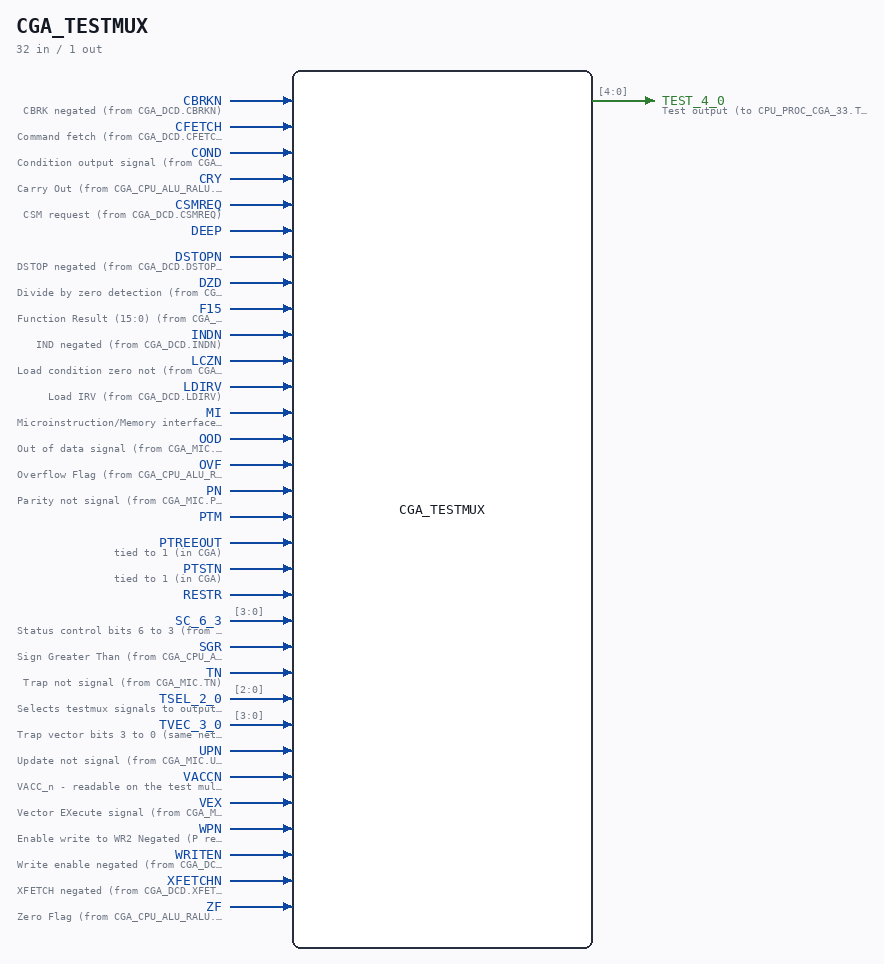
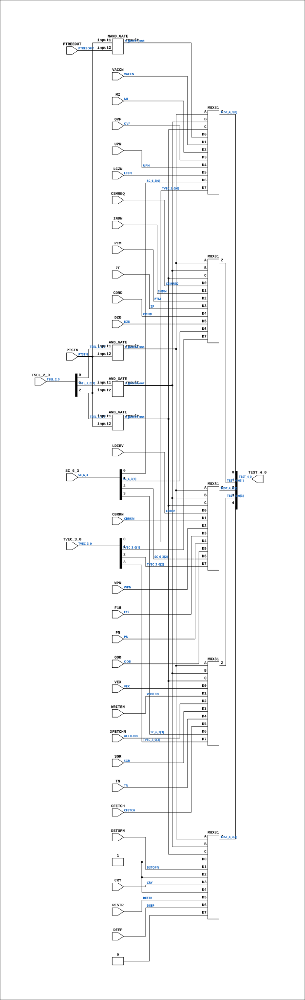

# CGA_TESTMUX

Source: `Verilog/DELILAH-CPU/CGA_TESTMUX/circuit/CGA_TESTMUX.v`

<!-- Generated by Verilog/tests/module_doc.py from the //! comments in the source. Do not edit by hand - edit the RTL comments and regenerate. -->

<!-- HIERARCHY-NAV:BEGIN - written by Verilog/tests/gen_hierarchy.py, do not edit -->

**Where it sits** (Simulation): [ND120_TOP](../../../../doc/ND120_TOP.md) > [ND120_CORE](../../../../doc/ND120_CORE.md) > [ND3202D](../../../../CPU-BOARD-3202/circuit/doc/ND3202D.md) > [CPU_15](../../../../CPU-BOARD-3202/circuit/doc/CPU_15.md) > [CPU_PROC_32](../../../../CPU-BOARD-3202/circuit/doc/CPU_PROC_32.md) > [CPU_PROC_CGA_33](../../../../CPU-BOARD-3202/circuit/doc/CPU_PROC_CGA_33.md) > [CGA](../../../CGA/circuit/doc/CGA.md) > **CGA_TESTMUX**
- instance path: `CORE.CPU_BOARD.CPU.PROC.CGA.DELILAH.TESTMUX`

**Used in:** [CGA](../../../CGA/circuit/doc/CGA.md) (all tops)

**Contains:** [AND_GATE](../../../../Shared/logisim/doc/AND_GATE.md) x3, [MUX81](../../../../Shared/ndlib/doc/MUX81.md) x5, [NAND_GATE](../../../../Shared/logisim/doc/NAND_GATE.md)

[Module hierarchy](../../../../HIERARCHY.md) - [All modules](../../../../MODULES.md)

<!-- HIERARCHY-NAV:END -->



<!-- SCHEMATIC:BEGIN - written by Verilog/tests/gen_schematics.py, do not edit -->

## Schematic

Drawn from the Verilog: the yosys netlist of the Simulation (Verilator) build, instance `CORE.CPU_BOARD.CPU.PROC.CGA.DELILAH.TESTMUX`. Sub-modules are boxes (click the picture to open it full size; there every sub-module box links to its page, and every wire shows its Verilog name).

[](CGA_TESTMUX.svg)

<!-- SCHEMATIC:END -->

## Description

ND120 CGA (CPU Gate Array / DELILAH)
/CGA/TESTMUX
TESTMUX
Page 105
SHEET 1 of 1
Last reviewed: 10-NOV-2024
Ronny Hansen

## Ports

| Direction | Width | Name | Description |
|---|---|---|---|
| input | `1` | `CBRKN` | CBRK negated (from CGA_DCD.CBRKN) |
| input | `1` | `CFETCH` | Command fetch (from CGA_DCD.CFETCH) |
| input | `1` | `COND` | Condition output signal (from CGA_MIC.COND) |
| input | `1` | `CRY` | Carry Out (from CGA_CPU_ALU_RALU.CRY) |
| input | `1` | `CSMREQ` | CSM request (from CGA_DCD.CSMREQ) |
| input | `1` | `DEEP` |  |
| input | `1` | `DSTOPN` | DSTOP negated (from CGA_DCD.DSTOPN) |
| input | `1` | `DZD` | Divide by zero detection (from CGA_MIC.DZD) |
| input | `1` | `F15` | Function Result (15:0) (from CGA_CPU_ALU_RALU.F_15_0[15]) |
| input | `1` | `INDN` | IND negated (from CGA_DCD.INDN) |
| input | `1` | `LCZN` | Load condition zero not (from CGA_MIC.LCZN) |
| input | `1` | `LDIRV` | Load IRV (from CGA_DCD.LDIRV) |
| input | `1` | `MI` | Microinstruction/Memory interface indicator (from CGA_CPU_ALU_CONTR.MI) |
| input | `1` | `OOD` | Out of data signal (from CGA_MIC.OOD) |
| input | `1` | `OVF` | Overflow Flag (from CGA_CPU_ALU_RALU.OVF) |
| input | `1` | `PN` | Parity not signal (from CGA_MIC.PN) |
| input | `1` | `PTM` |  |
| input | `1` | `PTREEOUT` | tied to 1 (in CGA) |
| input | `1` | `PTSTN` | tied to 1 (in CGA) |
| input | `1` | `RESTR` |  |
| input | `[3:0]` | `SC_6_3` | Status control bits 6 to 3 (from CGA_MIC.SC_6_3) |
| input | `1` | `SGR` | Sign Greater Than (from CGA_CPU_ALU_RALU.SGR) |
| input | `1` | `TN` | Trap not signal (from CGA_MIC.TN) |
| input | `[2:0]` | `TSEL_2_0` | Selects testmux signals to output on TEST_4_0 (from CPU_PROC_CGA_33.SEL_TESTMUX) |
| input | `[3:0]` | `TVEC_3_0` | Trap vector bits 3 to 0 (same net as CGA_MIC.TVEC_3_0) |
| input | `1` | `UPN` | Update not signal (from CGA_MIC.UPN) |
| input | `1` | `VACCN` | VACC_n - readable on the test multiplexer, D1 input |
| input | `1` | `VEX` | Vector EXecute signal (from CGA_MAC.VEX) |
| input | `1` | `WPN` | Enable write to WR2 Negated (P register) (from WR_15_0) (from CGA_WRF.WPN) |
| input | `1` | `WRITEN` | Write enable negated (from CGA_DCD.WRITEN) |
| input | `1` | `XFETCHN` | XFETCH negated (from CGA_DCD.XFETCHN) |
| input | `1` | `ZF` | Zero Flag (from CGA_CPU_ALU_RALU.ZF) |
| output | `[4:0]` | `TEST_4_0` | Test output (to CPU_PROC_CGA_33.TEST_4_0) |

## Verilog source

[`Verilog/DELILAH-CPU/CGA_TESTMUX/circuit/CGA_TESTMUX.v`](https://github.com/RetroCoreLabs/nd-120/blob/main/Verilog/DELILAH-CPU/CGA_TESTMUX/circuit/CGA_TESTMUX.v) on GitHub.

<details markdown="1">
<summary>Show the Verilog of CGA_TESTMUX (264 lines)</summary>

```verilog
/**************************************************************************
** ND120 CGA (CPU Gate Array / DELILAH)                                  **
** /CGA/TESTMUX                                                          **
** TESTMUX                                                               **
**                                                                       **
** Page 105                                                              **
** SHEET 1 of 1                                                          **
**                                                                       **
** Last reviewed: 10-NOV-2024                                            **
** Ronny Hansen                                                          **
***************************************************************************/

module CGA_TESTMUX (
    input       CBRKN,       //! CBRK negated (from CGA_DCD.CBRKN)
    input       CFETCH,      //! Command fetch (from CGA_DCD.CFETCH)
    input       COND,        //! Condition output signal (from CGA_MIC.COND)
    input       CRY,         //! Carry Out (from CGA_CPU_ALU_RALU.CRY)
    input       CSMREQ,      //! CSM request (from CGA_DCD.CSMREQ)
    input       DEEP,
    input       DSTOPN,      //! DSTOP negated (from CGA_DCD.DSTOPN)
    input       DZD,         //! Divide by zero detection (from CGA_MIC.DZD)
    input       F15,         //! Function Result (15:0) (from CGA_CPU_ALU_RALU.F_15_0[15])
    input       INDN,        //! IND negated (from CGA_DCD.INDN)
    input       LCZN,        //! Load condition zero not (from CGA_MIC.LCZN)
    input       LDIRV,       //! Load IRV (from CGA_DCD.LDIRV)
    input       MI,          //! Microinstruction/Memory interface indicator (from CGA_CPU_ALU_CONTR.MI)
    input       OOD,         //! Out of data signal (from CGA_MIC.OOD)
    input       OVF,         //! Overflow Flag (from CGA_CPU_ALU_RALU.OVF)
    input       PN,          //! Parity not signal (from CGA_MIC.PN)
    input       PTM,
    input       PTREEOUT,    //! tied to 1 (in CGA)
    input       PTSTN,       //! tied to 1 (in CGA)
    input       RESTR,
    input [3:0] SC_6_3,      //! Status control bits 6 to 3 (from CGA_MIC.SC_6_3)
    input       SGR,         //! Sign Greater Than (from CGA_CPU_ALU_RALU.SGR)
    input       TN,          //! Trap not signal (from CGA_MIC.TN)
    input [2:0] TSEL_2_0,    //! Selects testmux signals to output on TEST_4_0 (from CPU_PROC_CGA_33.SEL_TESTMUX)
    input [3:0] TVEC_3_0,    //! Trap vector bits 3 to 0 (same net as CGA_MIC.TVEC_3_0)
    input       UPN,         //! Update not signal (from CGA_MIC.UPN)
    input       VACCN,       //! VACC_n - readable on the test multiplexer, D1 input
    input       VEX,         //! Vector EXecute signal (from CGA_MAC.VEX)
    input       WPN,         //! Enable write to WR2 Negated (P register) (from WR_15_0) (from CGA_WRF.WPN)
    input       WRITEN,      //! Write enable negated (from CGA_DCD.WRITEN)
    input       XFETCHN,     //! XFETCH negated (from CGA_DCD.XFETCHN)
    input       ZF,          //! Zero Flag (from CGA_CPU_ALU_RALU.ZF)

    output [4:0] TEST_4_0    //! Test output (to CPU_PROC_CGA_33.TEST_4_0)
);

  /*******************************************************************************
   ** The wires are defined here                                                 **
   *******************************************************************************/
  wire [3:0] s_tvec_3_0;
  wire [2:0] s_tsel_2_0;
  wire [4:0] s_test_4_0_out;
  wire [3:0] s_sc_6_3;
  wire       s_cbrk_n;
  wire       s_cfetch;
  wire       s_cond;
  wire       s_cry;
  wire       s_csmreq;
  wire       s_deep;
  wire       s_dstop_n;
  wire       s_dzd;
  wire       s_f15;
  wire       s_gates1_out;
  wire       s_gates2_out;
  wire       s_gates3_out;
  wire       s_gates4_out;
  wire       s_gnd;
  wire       s_ind_n;
  wire       s_lcz_n;
  wire       s_ldirv;
  wire       s_mi;
  wire       s_ood;
  wire       s_ovf;
  wire       s_pn;
  wire       s_power;
  wire       s_ptm;
  wire       s_ptreeout;
  wire       s_ptst_n;
  wire       s_restr;
  wire       s_sgr;
  wire       s_tn;
  wire       s_up_n;
  wire       s_vacc_n;
  wire       s_vex;
  wire       s_wpn;
  wire       s_write_n;
  wire       s_xfetch_n;
  wire       s_zf;

  /*******************************************************************************
   ** The module functionality is described here                                 **
   *******************************************************************************/

  /*******************************************************************************
   ** Here all input connections are defined                                     **
   *******************************************************************************/
  assign s_tvec_3_0[3:0] = TVEC_3_0;
  assign s_tsel_2_0[2:0] = TSEL_2_0;
  assign s_sc_6_3[3:0]   = SC_6_3;
  assign s_write_n       = WRITEN;
  assign s_cond          = COND;
  assign s_sgr           = SGR;
  assign s_cfetch        = CFETCH;
  assign s_csmreq        = CSMREQ;
  assign s_ptm           = PTM;
  assign s_deep          = DEEP;
  assign s_ldirv         = LDIRV;
  assign s_lcz_n         = LCZN;
  assign s_wpn           = WPN;
  assign s_pn            = PN;
  assign s_vacc_n        = VACCN;
  assign s_ovf           = OVF;
  assign s_zf            = ZF;
  assign s_tn            = TN;
  assign s_ind_n         = INDN;
  assign s_vex           = VEX;
  assign s_dzd           = DZD;
  assign s_xfetch_n      = XFETCHN;
  assign s_dstop_n       = DSTOPN;
  assign s_cry           = CRY;
  assign s_restr         = RESTR;
  assign s_cbrk_n        = CBRKN;
  assign s_f15           = F15;
  assign s_ood           = OOD;
  assign s_mi            = MI;
  assign s_up_n          = UPN;
  assign s_ptreeout      = PTREEOUT;
  assign s_ptst_n        = PTSTN;

  /*******************************************************************************
   ** Here all output connections are defined                                    **
   *******************************************************************************/
  assign TEST_4_0        = s_test_4_0_out[4:0];

  /*******************************************************************************
   ** Here all in-lined components are defined                                   **
   *******************************************************************************/

  // Power
  assign s_power         = 1'b1;

  // Ground
  assign s_gnd           = 1'b0;


  /*******************************************************************************
   ** Here all normal components are defined                                     **
   *******************************************************************************/
  NAND_GATE #(
      .BubblesMask(2'b11)
  ) GATES_1 (
      .input1(s_ptst_n),
      .input2(s_ptreeout),
      .result(s_gates1_out)
  );

  AND_GATE #(
      .BubblesMask(2'b00)
  ) GATES_2 (
      .input1(s_tsel_2_0[0]),
      .input2(s_ptst_n),
      .result(s_gates2_out)
  );

  AND_GATE #(
      .BubblesMask(2'b00)
  ) GATES_3 (
      .input1(s_tsel_2_0[1]),
      .input2(s_ptst_n),
      .result(s_gates3_out)
  );

  AND_GATE #(
      .BubblesMask(2'b00)
  ) GATES_4 (
      .input1(s_tsel_2_0[2]),
      .input2(s_ptst_n),
      .result(s_gates4_out)
  );


  /*******************************************************************************
   ** Here all sub-circuits are defined                                          **
   *******************************************************************************/

  MUX81 TM2 (
      .A (s_gates2_out),
      .B (s_gates3_out),
      .C (s_gates4_out),
      .D0(s_ldirv),
      .D1(s_cbrk_n),
      .D2(s_wpn),
      .D3(s_f15),
      .D4(s_pn),
      .D5(s_ood),
      .D6(s_sc_6_3[2]),
      .D7(s_tvec_3_0[2]),
      .Z (s_test_4_0_out[2])
  );

  MUX81 TM3 (
      .A (s_gates2_out),
      .B (s_gates3_out),
      .C (s_gates4_out),
      .D0(s_vex),
      .D1(s_write_n),
      .D2(s_xfetch_n),
      .D3(s_sgr),
      .D4(s_tn),
      .D5(s_cfetch),
      .D6(s_sc_6_3[3]),
      .D7(s_tvec_3_0[3]),
      .Z (s_test_4_0_out[3])
  );

  MUX81 TM4 (
      .A (s_gates2_out),
      .B (s_gates3_out),
      .C (s_gates4_out),
      .D0(s_power),
      .D1(s_dstop_n),
      .D2(s_power),
      .D3(s_cry),
      .D4(s_power),
      .D5(s_restr),
      .D6(s_deep),
      .D7(s_gnd),
      .Z (s_test_4_0_out[4])
  );

  MUX81 TM0 (
      .A (s_gates2_out),
      .B (s_gates3_out),
      .C (s_gates4_out),
      .D0(s_gates1_out),
      .D1(s_vacc_n),
      .D2(s_mi),
      .D3(s_ovf),
      .D4(s_up_n),
      .D5(s_lcz_n),
      .D6(s_sc_6_3[0]),
      .D7(s_tvec_3_0[0]),
      .Z (s_test_4_0_out[0])
  );

  MUX81 TM1 (
      .A (s_gates2_out),
      .B (s_gates3_out),
      .C (s_gates4_out),
      .D0(s_csmreq),
      .D1(s_ind_n),
      .D2(s_ptm),
      .D3(s_zf),
      .D4(s_cond),
      .D5(s_dzd),
      .D6(s_sc_6_3[1]),
      .D7(s_tvec_3_0[1]),
      .Z (s_test_4_0_out[1])
  );

endmodule
```

</details>
