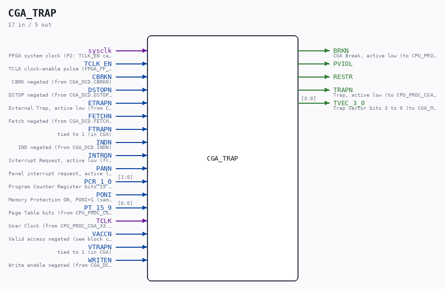
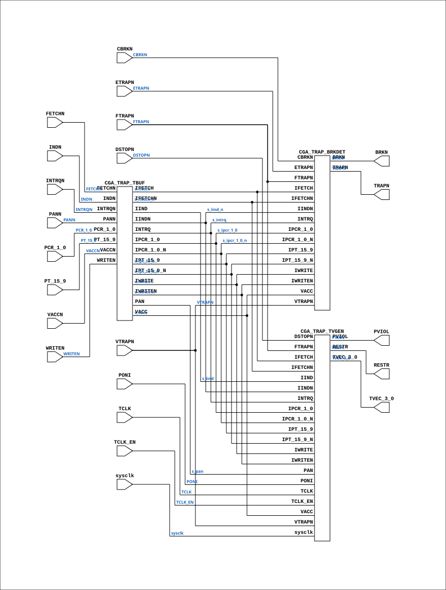

# CGA_TRAP

Source: `Verilog/DELILAH-CPU/CGA_TRAP/circuit/CGA_TRAP.v`

<!-- Generated by Verilog/tests/module_doc.py from the //! comments in the source. Do not edit by hand - edit the RTL comments and regenerate. -->

<!-- HIERARCHY-NAV:BEGIN - written by Verilog/tests/gen_hierarchy.py, do not edit -->

**Where it sits** (Simulation): [ND120_TOP](../../../../doc/ND120_TOP.md) > [ND120_CORE](../../../../doc/ND120_CORE.md) > [ND3202D](../../../../CPU-BOARD-3202/circuit/doc/ND3202D.md) > [CPU_15](../../../../CPU-BOARD-3202/circuit/doc/CPU_15.md) > [CPU_PROC_32](../../../../CPU-BOARD-3202/circuit/doc/CPU_PROC_32.md) > [CPU_PROC_CGA_33](../../../../CPU-BOARD-3202/circuit/doc/CPU_PROC_CGA_33.md) > [CGA](../../../CGA/circuit/doc/CGA.md) > **CGA_TRAP**
- instance path: `CORE.CPU_BOARD.CPU.PROC.CGA.DELILAH.TRAP`

**Used in:** [CGA](../../../CGA/circuit/doc/CGA.md) (all tops)

**Contains:** [CGA_TRAP_BRKDET](CGA_TRAP_BRKDET.md), [CGA_TRAP_TBUF](CGA_TRAP_TBUF.md), [CGA_TRAP_TVGEN](CGA_TRAP_TVGEN.md)

[Module hierarchy](../../../../HIERARCHY.md) - [All modules](../../../../MODULES.md)

<!-- HIERARCHY-NAV:END -->



<!-- SCHEMATIC:BEGIN - written by Verilog/tests/gen_schematics.py, do not edit -->

## Schematic

Drawn from the Verilog: the yosys netlist of the Simulation (Verilator) build, instance `CORE.CPU_BOARD.CPU.PROC.CGA.DELILAH.TRAP`. Sub-modules are boxes (click the picture to open it full size; there every sub-module box links to its page, and every wire shows its Verilog name).

[](CGA_TRAP.svg)

<!-- SCHEMATIC:END -->

## Description

ND120 CGA (CPU Gate Array / DELILAH)
/CGA/TRAP
Trap
Page 100
SHEET 1 of 1
Last reviewed: 19-JAN-2025
Ronny Hansen

## Ports

| Direction | Width | Name | Description |
|---|---|---|---|
| input | `1` | `sysclk` | FPGA system clock (P2: TCLK_EN capture) |
| input | `1` | `TCLK_EN` | TCLK clock-enable pulse (FPGA_FF_MODE, else 0) |
| input | `1` | `CBRKN` | CBRK negated (from CGA_DCD.CBRKN) |
| input | `1` | `DSTOPN` | DSTOP negated (from CGA_DCD.DSTOPN) |
| input | `1` | `ETRAPN` | External Trap, active low (from CPU_PROC_CGA_33.ETRAP_n) |
| input | `1` | `FETCHN` | Fetch negated (from CGA_DCD.FETCHN) |
| input | `1` | `FTRAPN` | tied to 1 (in CGA) |
| input | `1` | `INDN` | IND negated (from CGA_DCD.INDN) |
| input | `1` | `INTRQN` | Interrupt Request, active low (from CGA_INTR.INTRQN) |
| input | `1` | `PANN` | Panel interrupt request, active low (from CPU_PROC_CGA_33.PAN_n) |
| input | `[1:0]` | `PCR_1_0` | Program Counter Register bits 15 to 0 (from CGA_MAC.PCR_15_0[1:0]) |
| input | `1` | `PONI` | Memory Protection ON, PONI=1 (same net as CGA.XPONI) |
| input | `[6:0]` | `PT_15_9` | Page Table bits (from CPU_PROC_CGA_33.PT_15_9) |
| input | `1` | `TCLK` | User Clock (from CPU_PROC_CGA_33.UCLK) |
| input | `1` | `VACCN` | Valid access negated (see block comment, sheet 10/10) (from CGA_DCD.VACCN) |
| input | `1` | `VTRAPN` | tied to 1 (in CGA) |
| input | `1` | `WRITEN` | Write enable negated (from CGA_DCD.WRITEN) |
| output | `1` | `BRKN` | CGA Break, active low (to CPU_PROC_CGA_33.CGABRK_n) |
| output | `1` | `PVIOL` |  |
| output | `1` | `RESTR` |  |
| output | `1` | `TRAPN` | Trap, active low (to CPU_PROC_CGA_33.TRAP_n) |
| output | `[3:0]` | `TVEC_3_0` | Trap vector bits 3 to 0 (to CGA_MIC.TVEC_3_0) |

## Verilog source

[`Verilog/DELILAH-CPU/CGA_TRAP/circuit/CGA_TRAP.v`](https://github.com/RetroCoreLabs/nd-120/blob/main/Verilog/DELILAH-CPU/CGA_TRAP/circuit/CGA_TRAP.v) on GitHub.

<details markdown="1">
<summary>Show the Verilog of CGA_TRAP (215 lines)</summary>

```verilog
/**************************************************************************
** ND120 CGA (CPU Gate Array / DELILAH)                                  **
** /CGA/TRAP                                                             **
** Trap                                                                  **
**                                                                       **
** Page 100                                                              **
** SHEET 1 of 1                                                          **
**                                                                       **
** Last reviewed: 19-JAN-2025                                            **
** Ronny Hansen                                                          **
***************************************************************************/


module CGA_TRAP (
    input sysclk,   //! FPGA system clock (P2: TCLK_EN capture)
    input TCLK_EN,  //! TCLK clock-enable pulse (FPGA_FF_MODE, else 0)

    input CBRKN,    //! CBRK negated (from CGA_DCD.CBRKN)
    input DSTOPN,   //! DSTOP negated (from CGA_DCD.DSTOPN)
    input ETRAPN,   //! External Trap, active low (from CPU_PROC_CGA_33.ETRAP_n)
    input FETCHN,   //! Fetch negated (from CGA_DCD.FETCHN)
    input FTRAPN,   //! tied to 1 (in CGA)
    input INDN,     //! IND negated (from CGA_DCD.INDN)
    input INTRQN,   //! Interrupt Request, active low (from CGA_INTR.INTRQN)
    input PANN,     //! Panel interrupt request, active low (from CPU_PROC_CGA_33.PAN_n)
    input [1:0] PCR_1_0,  //! Program Counter Register bits 15 to 0 (from CGA_MAC.PCR_15_0[1:0])
    input PONI,     //! Memory Protection ON, PONI=1 (same net as CGA.XPONI)
    input [6:0] PT_15_9,  //! Page Table bits (from CPU_PROC_CGA_33.PT_15_9)
    input TCLK,     //! User Clock (from CPU_PROC_CGA_33.UCLK)
    // VACC_n from CGA_DCD. Inverted here and handed to TBUF/TVGEN/BRKDET, where
    // it qualifies EVERY memory-protect trap term - page fault, ring violation,
    // WIP and PGU are all AND'ed with VACC. No VACC, no memory-protect trap.
    input VACCN,    //! Valid access negated (see block comment, sheet 10/10) (from CGA_DCD.VACCN)
    input VTRAPN,   //! tied to 1 (in CGA)
    input WRITEN,   //! Write enable negated (from CGA_DCD.WRITEN)

    output BRKN,    //! CGA Break, active low (to CPU_PROC_CGA_33.CGABRK_n)
    output PVIOL,
    output RESTR,
    output TRAPN,   //! Trap, active low (to CPU_PROC_CGA_33.TRAP_n)
    output [3:0] TVEC_3_0  //! Trap vector bits 3 to 0 (to CGA_MIC.TVEC_3_0)
);

  /*******************************************************************************
   ** The wires are defined here                                                 **
   *******************************************************************************/
  wire [1:0] s_ipcr_1_0;
  wire [1:0] s_ipcr_1_0_n;
  wire [3:0] s_tvec_3_0_out;
  wire [1:0] s_pcr_1_0;
  wire [6:0] s_pt_15_9;
  wire [6:0] s_ipt_15_9_n;
  wire [6:0] s_ipt_15_9;
  wire       s_brk_n_out;
  wire       s_cbrk_n;
  wire       s_dstop_n;
  wire       s_etrap_n;
  wire       s_fetch_n;
  wire       s_ftrap_n;
  wire       s_ifetch_n;
  wire       s_ifetch;
  wire       s_iind_n;
  wire       s_iind;
  wire       s_ind_n;
  wire       s_intrq_n;
  wire       s_intrq;
  wire       s_iwrite_n;
  wire       s_iwrite;
  wire       s_pan_n;
  wire       s_pan;
  wire       s_poni;
  wire       s_pviol_out;
  wire       s_restr_out;
  wire       s_tclk;
  wire       s_trap_n_out;
  wire       s_vacc_n;
  wire       s_vacc;
  wire       s_vtrap_n;
  wire       s_write_n;

  /*******************************************************************************
   ** The module functionality is described here                                 **
   *******************************************************************************/

  /*******************************************************************************
   ** Here all input connections are defined                                     **
   *******************************************************************************/
  assign s_pcr_1_0[1:0] = PCR_1_0;
  assign s_pt_15_9[6:0] = PT_15_9;
  assign s_cbrk_n       = CBRKN;
  assign s_dstop_n      = DSTOPN;
  assign s_etrap_n      = ETRAPN;
  assign s_fetch_n      = FETCHN;
  assign s_ftrap_n      = FTRAPN;
  assign s_ind_n        = INDN;
  assign s_intrq_n      = INTRQN;
  assign s_pan_n        = PANN;
  assign s_poni         = PONI;
  assign s_tclk         = TCLK;
  assign s_vacc_n       = VACCN;
  assign s_vtrap_n      = VTRAPN;
  assign s_write_n      = WRITEN;

  /*******************************************************************************
   ** Here all output connections are defined                                    **
   *******************************************************************************/
  assign BRKN           = s_brk_n_out;
  assign PVIOL          = s_pviol_out;
  assign RESTR          = s_restr_out;
  assign TRAPN          = s_trap_n_out;
  assign TVEC_3_0       = s_tvec_3_0_out[3:0];

`ifdef ND120_ILA_MARK_DEBUG
  // 25-AUG spurious-page-fault hunt (Nexys/SINTRAN): the trap-fire event is
  // TRAPN falling with TVEC != 15. Probed so the ILA can trigger on the
  // exact fault and show MEM_HOLD/PIL/address state around it.
  (* mark_debug = "true" *) wire [3:0] s_ila_tvec  = s_tvec_3_0_out;
  (* mark_debug = "true" *) wire       s_ila_trapn = s_trap_n_out;
`endif

`ifdef TRAPDBG
  // Low-volume trap/restart probe: log each TRAP falling edge + RESTR rising
  // edge with the trap vector (find the trap that reboots the CPU).
  reg r_trapn_d = 1'b1, r_restr_d = 1'b0;
  always @(posedge sysclk) begin
    r_trapn_d <= s_trap_n_out;
    r_restr_d <= s_restr_out;
    if (r_trapn_d && !s_trap_n_out && s_tvec_3_0_out != 4'd15)
      $display("[trap] t=%0t TRAP tvec=%0d pviol=%b brkn=%b restr=%b pt15_9=%o",
               $time, s_tvec_3_0_out, s_pviol_out, s_brk_n_out, s_restr_out, PT_15_9);
    // Vector-7 (unimplemented SINTRAN-4) detail: dump the page-status / ring /
    // access-type inputs so we can tell a mis-vector from a genuine trap.
    if (r_trapn_d && !s_trap_n_out && s_tvec_3_0_out == 4'd7)
      $display("[trap7] pt15_9=%o(b%b) pcr=%b vaccn=%b writen=%b fetchn=%b indn=%b",
               PT_15_9, PT_15_9, PCR_1_0, VACCN, WRITEN, FETCHN, INDN);
    if (!r_restr_d && s_restr_out)
      $display("[trap] RESTR(restart) tvec=%0d", s_tvec_3_0_out);
  end
`endif

  /*******************************************************************************
   ** Here all sub-circuits are defined                                          **
   *******************************************************************************/

  CGA_TRAP_TVGEN TVGEN (
      .sysclk(sysclk),
      .TCLK_EN(TCLK_EN),
      .DSTOPN(s_dstop_n),
      .FTRAPN(s_ftrap_n),
      .IFETCH(s_ifetch),
      .IFETCHN(s_ifetch_n),
      .IIND(s_iind),
      .IINDN(s_iind_n),
      .INTRQ(s_intrq),
      .IPCR_1_0(s_ipcr_1_0[1:0]),
      .IPCR_1_0_N(s_ipcr_1_0_n[1:0]),
      .IPT_15_9(s_ipt_15_9[6:0]),
      .IPT_15_9_N(s_ipt_15_9_n[6:0]),
      .IWRITE(s_iwrite),
      .IWRITEN(s_iwrite_n),
      .PAN(s_pan),
      .PONI(s_poni),
      .PVIOL(s_pviol_out),
      .RESTR(s_restr_out),
      .TCLK(s_tclk),
      .TVEC_3_0(s_tvec_3_0_out[3:0]),
      .VACC(s_vacc),
      .VTRAPN(s_vtrap_n)
  );

  CGA_TRAP_BRKDET BRKDET (
      .BRKN(s_brk_n_out),
      .CBRKN(s_cbrk_n),
      .ETRAPN(s_etrap_n),
      .FTRAPN(s_ftrap_n),
      .IFETCH(s_ifetch),
      .IFETCHN(s_ifetch_n),
      .IINDN(s_iind_n),
      .INTRQ(s_intrq),
      .IPCR_1_0(s_ipcr_1_0[1:0]),
      .IPCR_1_0_N(s_ipcr_1_0_n[1:0]),
      .IPT_15_9(s_ipt_15_9[6:0]),
      .IPT_15_9_N(s_ipt_15_9_n[6:0]),
      .IWRITE(s_iwrite),
      .IWRITEN(s_iwrite_n),
      .TRAPN(s_trap_n_out),
      .VACC(s_vacc),
      .VTRAPN(s_vtrap_n)
  );

  CGA_TRAP_TBUF TBUF (
      .FETCHN(s_fetch_n),
      .IFETCH(s_ifetch),
      .IFETCHN(s_ifetch_n),
      .IIND(s_iind),
      .IINDN(s_iind_n),
      .INDN(s_ind_n),
      .INTRQ(s_intrq),
      .INTRQN(s_intrq_n),
      .IPCR_1_0(s_ipcr_1_0[1:0]),
      .IPCR_1_0_N(s_ipcr_1_0_n[1:0]),
      .IPT_15_9(s_ipt_15_9[6:0]),
      .IPT_15_9_N(s_ipt_15_9_n[6:0]),
      .IWRITE(s_iwrite),
      .IWRITEN(s_iwrite_n),
      .PAN(s_pan),
      .PANN(s_pan_n),
      .PCR_1_0(s_pcr_1_0[1:0]),
      .PT_15_9(s_pt_15_9[6:0]),
      .VACC(s_vacc),
      .VACCN(s_vacc_n),
      .WRITEN(s_write_n)
  );

endmodule
```

</details>
