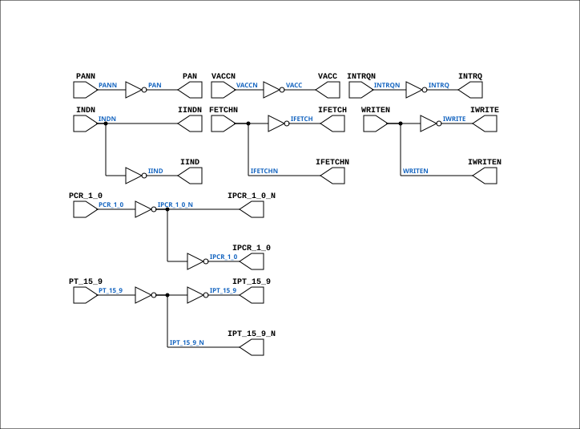

# CGA_TRAP_TBUF

Source: `Verilog/DELILAH-CPU/CGA_TRAP/circuit/CGA_TRAP_TBUF.v`

<!-- Generated by Verilog/tests/module_doc.py from the //! comments in the source. Do not edit by hand - edit the RTL comments and regenerate. -->

<!-- HIERARCHY-NAV:BEGIN - written by Verilog/tests/gen_hierarchy.py, do not edit -->

**Where it sits** (Simulation): [ND120_TOP](../../../../doc/ND120_TOP.md) > [ND120_CORE](../../../../doc/ND120_CORE.md) > [ND3202D](../../../../CPU-BOARD-3202/circuit/doc/ND3202D.md) > [CPU_15](../../../../CPU-BOARD-3202/circuit/doc/CPU_15.md) > [CPU_PROC_32](../../../../CPU-BOARD-3202/circuit/doc/CPU_PROC_32.md) > [CPU_PROC_CGA_33](../../../../CPU-BOARD-3202/circuit/doc/CPU_PROC_CGA_33.md) > [CGA](../../../CGA/circuit/doc/CGA.md) > [CGA_TRAP](CGA_TRAP.md) > **CGA_TRAP_TBUF**
- instance path: `CORE.CPU_BOARD.CPU.PROC.CGA.DELILAH.TRAP.TBUF`

**Used in:** [CGA_TRAP](CGA_TRAP.md) (all tops)

**Contains:** no other modules.

[Module hierarchy](../../../../HIERARCHY.md) - [All modules](../../../../MODULES.md)

<!-- HIERARCHY-NAV:END -->


<!-- SCHEMATIC:BEGIN - written by Verilog/tests/gen_schematics.py, do not edit -->

## Schematic

Drawn from the Verilog: the yosys netlist of the Simulation (Verilator) build, instance `CORE.CPU_BOARD.CPU.PROC.CGA.DELILAH.TRAP.TBUF`. Sub-modules are boxes (click the picture to open it full size; there every sub-module box links to its page, and every wire shows its Verilog name).

[](CGA_TRAP_TBUF.svg)

<!-- SCHEMATIC:END -->

## Description

ND120 CGA (CPU Gate Array / DELILAH)
/CGA/TRAP/TBUF
TRAP BUFFERS
Page 101
SHEET 1 of 1
Last reviewed: 19-JAN-2025
Ronny Hansen

## Ports

| Direction | Width | Name | Description |
|---|---|---|---|
| input | `1` | `FETCHN` | FETCH_n (Fetch instruction, negate) |
| input | `1` | `INDN` | IDN_n |
| input | `1` | `INTRQN` | INTRQ_n |
| input | `1` | `PANN` | PAN_n |
| input | `[1:0]` | `PCR_1_0` | PCR[1:0] |
| input | `[6:0]` | `PT_15_9` | PT[15:9] |
| input | `1` | `VACCN` | VACC_n - low when the access IS MMU-translated |
| input | `1` | `WRITEN` | WRITE_n |
| output | `1` | `IFETCH` |  |
| output | `1` | `IFETCHN` |  |
| output | `1` | `IIND` |  |
| output | `1` | `IINDN` |  |
| output | `1` | `INTRQ` |  |
| output | `[1:0]` | `IPCR_1_0` |  |
| output | `[1:0]` | `IPCR_1_0_N` *(active low)* |  |
| output | `[6:0]` | `IPT_15_9` |  |
| output | `[6:0]` | `IPT_15_9_N` *(active low)* |  |
| output | `1` | `IWRITE` |  |
| output | `1` | `IWRITEN` |  |
| output | `1` | `PAN` |  |
| output | `1` | `VACC` | ~VACCN, fanned out to TVGEN and BRKDET |

## Verilog source

[`Verilog/DELILAH-CPU/CGA_TRAP/circuit/CGA_TRAP_TBUF.v`](https://github.com/RetroCoreLabs/nd-120/blob/main/Verilog/DELILAH-CPU/CGA_TRAP/circuit/CGA_TRAP_TBUF.v) on GitHub.

<details markdown="1">
<summary>Show the Verilog of CGA_TRAP_TBUF (122 lines)</summary>

```verilog
/**************************************************************************
** ND120 CGA (CPU Gate Array / DELILAH)                                  **
** /CGA/TRAP/TBUF                                                        **
** TRAP BUFFERS                                                          **
**                                                                       **
** Page 101                                                              **
** SHEET 1 of 1                                                          **
**                                                                       **
** Last reviewed: 19-JAN-2025                                            **
** Ronny Hansen                                                          **
***************************************************************************/


module CGA_TRAP_TBUF (
    input       FETCHN,   //! FETCH_n (Fetch instruction, negate)
    input       INDN,     //! IDN_n
    input       INTRQN,   //! INTRQ_n
    input       PANN,     //! PAN_n
    input [1:0] PCR_1_0,  //! PCR[1:0]
    input [6:0] PT_15_9,  //! PT[15:9]
    // VACCN in / VACC out: this buffer just inverts VACCN and fans it out to
    // CGA_TRAP_TVGEN and CGA_TRAP_BRKDET. VACC = "this cycle is an MMU-
    // translated memory reference", generated in CGA_DCD.v sheet 10/10.
    input       VACCN,    //! VACC_n - low when the access IS MMU-translated
    input       WRITEN,   //! WRITE_n

    output       IFETCH,
    output       IFETCHN,
    output       IIND,
    output       IINDN,
    output       INTRQ,
    output [1:0] IPCR_1_0,
    output [1:0] IPCR_1_0_N,
    output [6:0] IPT_15_9,
    output [6:0] IPT_15_9_N,
    output       IWRITE,
    output       IWRITEN,
    output       PAN,
    output       VACC     //! ~VACCN, fanned out to TVGEN and BRKDET
);

  /*******************************************************************************
   ** The wires are defined here                                                 **
   *******************************************************************************/
  wire [1:0] s_ipcr_1_0_out;
  wire [6:0] s_ipt_15_9_out;
  wire [6:0] s_ipt_15_9_n_out;
  wire [1:0] s_ipcr_1_0_n_out;
  wire [1:0] s_pcr_1_0;
  wire [6:0] s_pt_15_9;
  wire       s_fetch_n;
  wire       s_ifetch_n_out;
  wire       s_ifetch_out;
  wire       s_iind_n_out;
  wire       s_iind_out;
  wire       s_ind_n;
  wire       s_intrq_n;
  wire       s_intrq_out;
  wire       s_iwrite_n_out;
  wire       s_iwrite_out;
  wire       s_pan_n;
  wire       s_pan_out;
  wire       s_vacc_n;
  wire       s_vacc;
  wire       s_write_n;

  /*******************************************************************************
   ** The module functionality is described here                                 **
   *******************************************************************************/

  /*******************************************************************************
   ** Here all input connections are defined                                     **
   *******************************************************************************/
  assign s_pcr_1_0[1:0]        = PCR_1_0[1:0];
  assign s_pt_15_9[6:0]        = PT_15_9[6:0];
  assign s_pan_n               = PANN;
  assign s_vacc_n              = VACCN;
  assign s_ind_n               = INDN;
  assign s_intrq_n             = INTRQN;
  assign s_fetch_n             = FETCHN;
  assign s_write_n             = WRITEN;

  /*******************************************************************************
   ** Here all output connections are defined                                    **
   *******************************************************************************/
  assign IFETCH                = s_ifetch_out;
  assign IFETCHN               = s_ifetch_n_out;
  assign IIND                  = s_iind_out;
  assign IINDN                 = s_iind_n_out;
  assign INTRQ                 = s_intrq_out;
  assign IPCR_1_0[1:0]         = s_ipcr_1_0_out[1:0];
  assign IPCR_1_0_N[1:0]       = s_ipcr_1_0_n_out[1:0];
  assign IPT_15_9[6:0]         = s_ipt_15_9_out[6:0];
  assign IPT_15_9_N[6:0]       = s_ipt_15_9_n_out[6:0];
  assign IWRITE                = s_iwrite_out;
  assign IWRITEN               = s_iwrite_n_out;
  assign PAN                   = s_pan_out;
  assign VACC                  = s_vacc;

  /*******************************************************************************
   ** Here all in-lined components are defined                                   **
   *******************************************************************************/

  // NOT Gate
  assign s_ifetch_n_out        = ~s_ifetch_out;
  assign s_ifetch_out          = ~s_fetch_n;
  assign s_iind_n_out          = ~s_iind_out;
  assign s_iind_out            = ~s_ind_n;
  assign s_intrq_out           = ~s_intrq_n;

  assign s_ipcr_1_0_n_out[1:0] = ~s_pcr_1_0[1:0];
  assign s_ipcr_1_0_out[1:0]   = ~s_ipcr_1_0_n_out[1:0];

  assign s_ipt_15_9_n_out[6:0] = ~s_pt_15_9[6:0];
  assign s_ipt_15_9_out[6:0]   = ~s_ipt_15_9_n_out[6:0];

  assign s_iwrite_n_out        = ~s_iwrite_out;
  assign s_iwrite_out          = ~s_write_n;
  assign s_pan_out             = ~s_pan_n;
  assign s_vacc                = ~s_vacc_n;

endmodule
```

</details>
