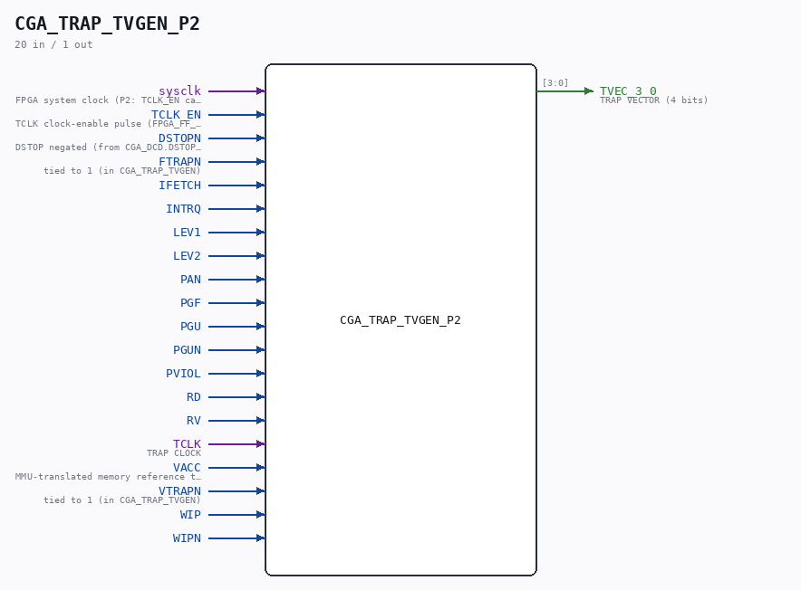

# CGA_TRAP_TVGEN_P2

Source: `Verilog/DELILAH-CPU/CGA_TRAP/circuit/CGA_TRAP_TVGEN_P2.v`

<!-- Generated by Verilog/tests/module_doc.py from the //! comments in the source. Do not edit by hand - edit the RTL comments and regenerate. -->

<!-- HIERARCHY-NAV:BEGIN - written by Verilog/tests/gen_hierarchy.py, do not edit -->

**Where it sits** (Simulation): [ND120_TOP](../../../../doc/ND120_TOP.md) > [ND120_CORE](../../../../doc/ND120_CORE.md) > [ND3202D](../../../../CPU-BOARD-3202/circuit/doc/ND3202D.md) > [CPU_15](../../../../CPU-BOARD-3202/circuit/doc/CPU_15.md) > [CPU_PROC_32](../../../../CPU-BOARD-3202/circuit/doc/CPU_PROC_32.md) > [CPU_PROC_CGA_33](../../../../CPU-BOARD-3202/circuit/doc/CPU_PROC_CGA_33.md) > [CGA](../../../CGA/circuit/doc/CGA.md) > [CGA_TRAP](CGA_TRAP.md) > [CGA_TRAP_TVGEN](CGA_TRAP_TVGEN.md) > **CGA_TRAP_TVGEN_P2**
- instance path: `CORE.CPU_BOARD.CPU.PROC.CGA.DELILAH.TRAP.TVGEN.TRAP_TVGEN`

**Used in:** [CGA_TRAP_TVGEN](CGA_TRAP_TVGEN.md) (all tops)

**Contains:** [AND_GATE](../../../../Shared/logisim/doc/AND_GATE.md) x4, [D_FLIPFLOP_EN](../../../../Shared/ndlib/doc/D_FLIPFLOP_EN.md) x7, [Multiplexer_4](../../../../Shared/logisim/doc/Multiplexer_4.md) x3, [NAND_GATE](../../../../Shared/logisim/doc/NAND_GATE.md) x2, [NAND_GATE_3_INPUTS](../../../../Shared/logisim/doc/NAND_GATE_3_INPUTS.md) x2, [NAND_GATE_5_INPUTS](../../../../Shared/logisim/doc/NAND_GATE_5_INPUTS.md), [NOR_GATE](../../../../Shared/logisim/doc/NOR_GATE.md) x2

[Module hierarchy](../../../../HIERARCHY.md) - [All modules](../../../../MODULES.md)

<!-- HIERARCHY-NAV:END -->

## Description

ND120 CGA (CPU Gate Array / DELILAH)
/CGA/TRAP/TVGEN/P2
P2
Page 104
SHEET 2 of 2
Last reviewed: 19-JAN-2025
Ronny Hansen

## Ports

| Direction | Width | Name | Description |
|---|---|---|---|
| input | `1` | `sysclk` | FPGA system clock (P2: TCLK_EN capture) |
| input | `1` | `TCLK_EN` | TCLK clock-enable pulse (FPGA_FF_MODE, else 0) |
| input | `1` | `DSTOPN` |  |
| input | `1` | `FTRAPN` |  |
| input | `1` | `IFETCH` |  |
| input | `1` | `INTRQ` |  |
| input | `1` | `LEV1` |  |
| input | `1` | `LEV2` |  |
| input | `1` | `PAN` |  |
| input | `1` | `PGF` |  |
| input | `1` | `PGU` |  |
| input | `1` | `PGUN` |  |
| input | `1` | `PVIOL` |  |
| input | `1` | `RD` |  |
| input | `1` | `RV` |  |
| input | `1` | `TCLK` | TRAP CLOCK |
| input | `1` | `VACC` | MMU-translated memory reference this cycle - qualifies the level-2 vector terms |
| input | `1` | `VTRAPN` |  |
| input | `1` | `WIP` |  |
| input | `1` | `WIPN` |  |
| output | `[3:0]` | `TVEC_3_0` | TRAP VECTOR (4 bits) |
