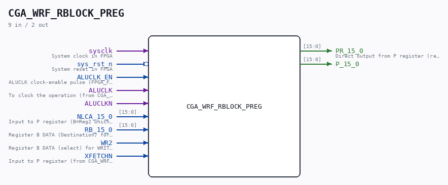

# CGA_WRF_RBLOCK_PREG

Source: `Verilog/DELILAH-CPU/CGA_WRF/circuit/CGA_WRF_RBLOCK_PREG.v`

> Generated by `Verilog/tests/module_doc.py` from the `//!`
> comments in the source. Do not edit by hand - edit the RTL comments and regenerate.

<!-- HIERARCHY-NAV:BEGIN - written by Verilog/tests/gen_hierarchy.py, do not edit -->

**Where it sits** (Simulation): [ND120_TOP](../../../../doc/ND120_TOP.md) > [ND120_CORE](../../../../doc/ND120_CORE.md) > [ND3202D](../../../../CPU-BOARD-3202/circuit/doc/ND3202D.md) > [CPU_15](../../../../CPU-BOARD-3202/circuit/doc/CPU_15.md) > [CPU_PROC_32](../../../../CPU-BOARD-3202/circuit/doc/CPU_PROC_32.md) > [CPU_PROC_CGA_33](../../../../CPU-BOARD-3202/circuit/doc/CPU_PROC_CGA_33.md) > [CGA](../../../CGA/circuit/doc/CGA.md) > [CGA_WRF](CGA_WRF.md) > [CGA_WRF_RBLOCK](CGA_WRF_RBLOCK.md) > **CGA_WRF_RBLOCK_PREG**
- instance path: `CORE.CPU_BOARD.CPU.PROC.CGA.DELILAH.WRF.RBLOCK.P_REG_2`

**Used in:** [CGA_WRF_RBLOCK](CGA_WRF_RBLOCK.md) (all tops)

**Contains:** [L8](../../../../Shared/ndlib/doc/L8.md) x2, [MUX31LP](../../../../Shared/ndlib/doc/MUX31LP.md) x16, [R81_EN](../../../../Shared/ndlib/doc/R81_EN.md) x2

[Module hierarchy](../../../../HIERARCHY.md) - [All modules](../../../../MODULES.md)

<!-- HIERARCHY-NAV:END -->

## Description

ND120 CPU, MM&M
CGA/WRF/RBLOCK/PREG
WRF: Working Register File
(PDF page 62)
Last reviewed: 9-FEB-2025
Ronny Hansen

## Ports

| Direction | Width | Name | Description |
|---|---|---|---|
| input | `1` | `sysclk` | System clock in FPGA |
| input | `1` | `sys_rst_n` *(active low)* | System reset in FPGA |
| input | `1` | `ALUCLK_EN` | ALUCLK clock-enable pulse (FPGA_FF_MODE, else 0) |
| input | `1` | `ALUCLK` |  |
| input | `1` | `ALUCLKN` |  |
| input | `[15:0]` | `NLCA_15_0` |  |
| input | `[15:0]` | `RB_15_0` |  |
| input | `1` | `WR2` |  |
| input | `1` | `XFETCHN` |  |
| output | `[15:0]` | `PR_15_0` |  |
| output | `[15:0]` | `P_15_0` |  |
