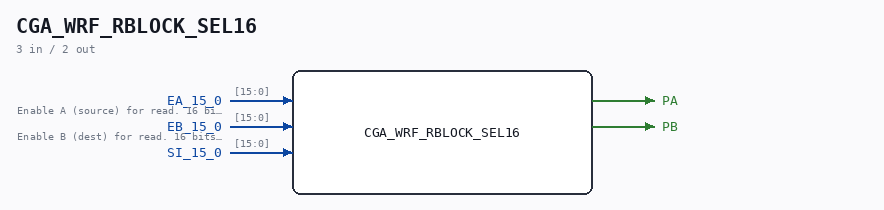
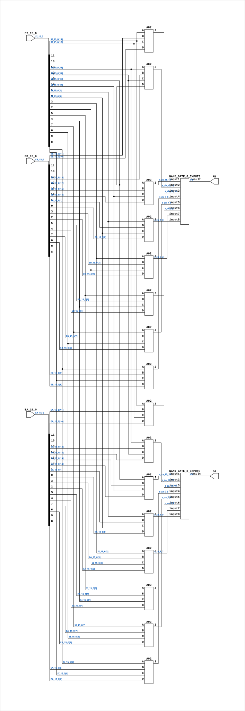

# CGA_WRF_RBLOCK_SEL16

Source: `Verilog/DELILAH-CPU/CGA_WRF/circuit/CGA_WRF_RBLOCK_SEL16.v`

<!-- Generated by Verilog/tests/module_doc.py from the //! comments in the source. Do not edit by hand - edit the RTL comments and regenerate. -->

<!-- HIERARCHY-NAV:BEGIN - written by Verilog/tests/gen_hierarchy.py, do not edit -->

**Where it sits** (Simulation): [ND120_TOP](../../../../doc/ND120_TOP.md) > [ND120_CORE](../../../../doc/ND120_CORE.md) > [ND3202D](../../../../CPU-BOARD-3202/circuit/doc/ND3202D.md) > [CPU_15](../../../../CPU-BOARD-3202/circuit/doc/CPU_15.md) > [CPU_PROC_32](../../../../CPU-BOARD-3202/circuit/doc/CPU_PROC_32.md) > [CPU_PROC_CGA_33](../../../../CPU-BOARD-3202/circuit/doc/CPU_PROC_CGA_33.md) > [CGA](../../../CGA/circuit/doc/CGA.md) > [CGA_WRF](CGA_WRF.md) > [CGA_WRF_RBLOCK](CGA_WRF_RBLOCK.md) > **CGA_WRF_RBLOCK_SEL16**
- instance path: `CORE.CPU_BOARD.CPU.PROC.CGA.DELILAH.WRF.RBLOCK.SEL_0`

**Used in:** [CGA_WRF_RBLOCK](CGA_WRF_RBLOCK.md) (all tops)

**Contains:** [A02](../../../../Shared/ndlib/doc/A02.md) x16, [NAND_GATE_8_INPUTS](../../../../Shared/logisim/doc/NAND_GATE_8_INPUTS.md) x2

[Module hierarchy](../../../../HIERARCHY.md) - [All modules](../../../../MODULES.md)

<!-- HIERARCHY-NAV:END -->



<!-- SCHEMATIC:BEGIN - written by Verilog/tests/gen_schematics.py, do not edit -->

## Schematic

Drawn from the Verilog: the yosys netlist of the Simulation (Verilator) build, instance `CORE.CPU_BOARD.CPU.PROC.CGA.DELILAH.WRF.RBLOCK.SEL_0`. Sub-modules are boxes (click the picture to open it full size; there every sub-module box links to its page, and every wire shows its Verilog name).

[](CGA_WRF_RBLOCK_SEL16.svg)

<!-- SCHEMATIC:END -->

## Description

ND120 CPU, MM&M
CGA/WRF/RBLOCK/SEL16
WRF: Working Register File
(PDF page 61)
Last reviewed: 09-NOV-2024
Ronny Hansen

## Ports

| Direction | Width | Name | Description |
|---|---|---|---|
| input | `[15:0]` | `EA_15_0` | Enable A (source) for read. 16 bits to select register. (from CGA_WRF_RBLOCK.EA_15_0) |
| input | `[15:0]` | `EB_15_0` | Enable B (dest) for read. 16 bits to select register. (from CGA_WRF_RBLOCK.EB_15_0) |
| input | `[15:0]` | `SI_15_0` |  |
| output | `1` | `PA` |  |
| output | `1` | `PB` |  |

## Verilog source

[`Verilog/DELILAH-CPU/CGA_WRF/circuit/CGA_WRF_RBLOCK_SEL16.v`](https://github.com/RetroCoreLabs/nd-120/blob/main/Verilog/DELILAH-CPU/CGA_WRF/circuit/CGA_WRF_RBLOCK_SEL16.v) on GitHub.

<details markdown="1">
<summary>Show the Verilog of CGA_WRF_RBLOCK_SEL16 (230 lines)</summary>

```verilog
/**************************************************************************
** ND120 CPU, MM&M                                                       **
** CGA/WRF/RBLOCK/SEL16                                                  **
** WRF: Working Register File                                            **
** (PDF page 61)                                                         **
**                                                                       **
** Last reviewed: 09-NOV-2024                                            **
** Ronny Hansen                                                          **
***************************************************************************/


module CGA_WRF_RBLOCK_SEL16 (
    input [15:0] EA_15_0,  //! Enable A (source) for read. 16 bits to select register. (from CGA_WRF_RBLOCK.EA_15_0)
    input [15:0] EB_15_0,  //! Enable B (dest) for read. 16 bits to select register. (from CGA_WRF_RBLOCK.EB_15_0)
    input [15:0] SI_15_0,

    output PA,
    output PB
);

  /*******************************************************************************
   ** The wires are defined here                                                 **
   *******************************************************************************/
  wire        s_out_pa;
  wire        s_out_pb;
  wire        s_za_1_0;
  wire        s_za_11_10;
  wire        s_za_13_12;
  wire        s_za_15_14;
  wire        s_za_3_2;
  wire        s_za_5_4;
  wire        s_za_7_6;
  wire        s_za_9_8;
  wire        s_zb_1_0;
  wire        s_zb_11_10;
  wire        s_zb_13_12;
  wire        s_zb_15_14;
  wire        s_zb_3_2;
  wire        s_zb_5_4;
  wire        s_zb_7_6;
  wire        s_zb_9_8;
  wire [15:0] s_ea_15_0;
  wire [15:0] s_eb_15_0;
  wire [15:0] s_si_15_0;

  /*******************************************************************************
   ** The module functionality is described here                                 **
   *******************************************************************************/

  /*******************************************************************************
   ** Here all input connections are defined                                     **
   *******************************************************************************/
  assign s_eb_15_0[15:0] = EB_15_0;
  assign s_ea_15_0[15:0] = EA_15_0;
  assign s_si_15_0[15:0] = SI_15_0;

  /*******************************************************************************
   ** Here all output connections are defined                                    **
   *******************************************************************************/
  assign PA = s_out_pa;
  assign PB = s_out_pb;

  /*******************************************************************************
   ** Here all sub-circuits are defined                                          **
   *******************************************************************************/

  /* A SIGNALS */

  A02 A15_14 (
      .A(s_si_15_0[15]),
      .B(s_ea_15_0[15]),
      .C(s_si_15_0[14]),
      .D(s_ea_15_0[14]),
      .Z(s_za_15_14)
  );

  A02 A13_12 (
      .A(s_si_15_0[13]),
      .B(s_ea_15_0[13]),
      .C(s_si_15_0[12]),
      .D(s_ea_15_0[12]),
      .Z(s_za_13_12)
  );

  A02 A11_10 (
      .A(s_si_15_0[11]),
      .B(s_ea_15_0[11]),
      .C(s_si_15_0[10]),
      .D(s_ea_15_0[10]),
      .Z(s_za_11_10)
  );

  A02 A9_8 (
      .A(s_si_15_0[9]),
      .B(s_ea_15_0[9]),
      .C(s_si_15_0[8]),
      .D(s_ea_15_0[8]),
      .Z(s_za_9_8)
  );

  A02 A7_6 (
      .A(s_si_15_0[7]),
      .B(s_ea_15_0[7]),
      .C(s_si_15_0[6]),
      .D(s_ea_15_0[6]),
      .Z(s_za_7_6)
  );

  A02 A5_4 (
      .A(s_si_15_0[5]),
      .B(s_ea_15_0[5]),
      .C(s_si_15_0[4]),
      .D(s_ea_15_0[4]),
      .Z(s_za_5_4)
  );

  A02 A3_2 (
      .A(s_si_15_0[3]),
      .B(s_ea_15_0[3]),
      .C(s_si_15_0[2]),
      .D(s_ea_15_0[2]),
      .Z(s_za_3_2)
  );

  A02 A1_0 (
      .A(s_si_15_0[1]),
      .B(s_ea_15_0[1]),
      .C(s_si_15_0[0]),
      .D(s_ea_15_0[0]),
      .Z(s_za_1_0)
  );


  NAND_GATE_8_INPUTS #(
      .BubblesMask(8'h00)
  ) GATES_1 (
      .input1(s_za_15_14),
      .input2(s_za_13_12),
      .input3(s_za_11_10),
      .input4(s_za_9_8),
      .input5(s_za_7_6),
      .input6(s_za_5_4),
      .input7(s_za_3_2),
      .input8(s_za_1_0),
      .result(s_out_pa)
  );

  /* B SIGNALS */

  A02 B15_14 (
      .A(s_si_15_0[15]),
      .B(s_eb_15_0[15]),
      .C(s_si_15_0[14]),
      .D(s_eb_15_0[14]),
      .Z(s_zb_15_14)
  );

  A02 B13_12 (
      .A(s_si_15_0[13]),
      .B(s_eb_15_0[13]),
      .C(s_si_15_0[12]),
      .D(s_eb_15_0[12]),
      .Z(s_zb_13_12)
  );

  A02 B11_10 (
      .A(s_si_15_0[11]),
      .B(s_eb_15_0[11]),
      .C(s_si_15_0[10]),
      .D(s_eb_15_0[10]),
      .Z(s_zb_11_10)
  );

  A02 B9_8 (
      .A(s_si_15_0[9]),
      .B(s_eb_15_0[9]),
      .C(s_si_15_0[8]),
      .D(s_eb_15_0[8]),
      .Z(s_zb_9_8)
  );

  A02 B7_6 (
      .A(s_si_15_0[7]),
      .B(s_eb_15_0[7]),
      .C(s_si_15_0[6]),
      .D(s_eb_15_0[6]),
      .Z(s_zb_7_6)
  );

  A02 B5_4 (
      .A(s_si_15_0[5]),
      .B(s_eb_15_0[5]),
      .C(s_si_15_0[4]),
      .D(s_eb_15_0[4]),
      .Z(s_zb_5_4)
  );

  A02 B3_2 (
      .A(s_si_15_0[3]),
      .B(s_eb_15_0[3]),
      .C(s_si_15_0[2]),
      .D(s_eb_15_0[2]),
      .Z(s_zb_3_2)
  );

  A02 B1_0 (
      .A(s_si_15_0[1]),
      .B(s_eb_15_0[1]),
      .C(s_si_15_0[0]),
      .D(s_eb_15_0[0]),
      .Z(s_zb_1_0)
  );


  NAND_GATE_8_INPUTS #(
      .BubblesMask(8'h00)
  ) GATES_2 (
      .input1(s_zb_15_14),
      .input2(s_zb_13_12),
      .input3(s_zb_11_10),
      .input4(s_zb_9_8),
      .input5(s_zb_7_6),
      .input6(s_zb_5_4),
      .input7(s_zb_3_2),
      .input8(s_zb_1_0),
      .result(s_out_pb)
  );


endmodule
```

</details>
