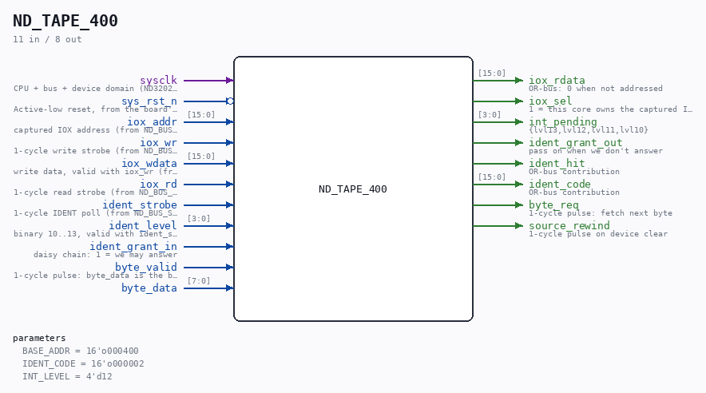
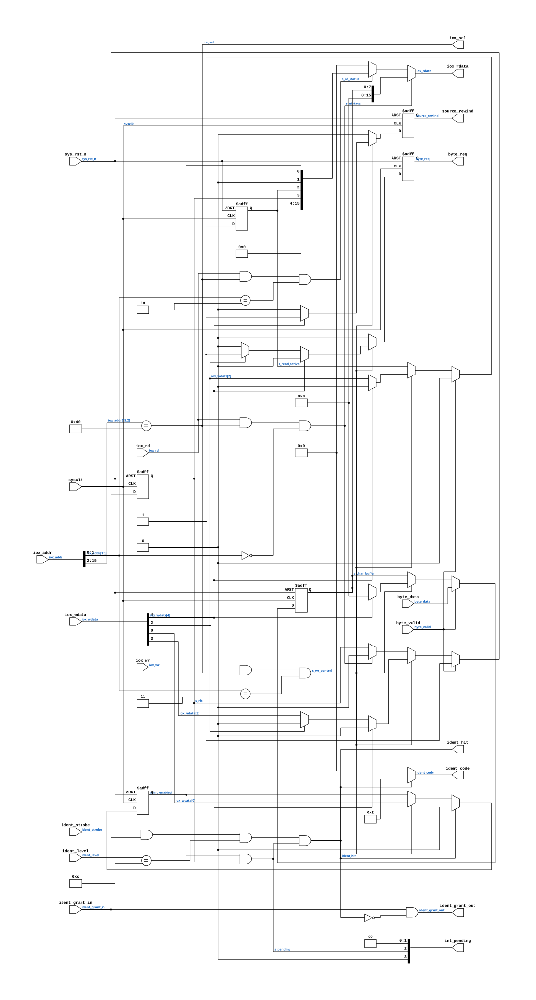

# ND_TAPE_400

Source: `Verilog/ND-BUS-DEVICES/TAPE-400/circuit/ND_TAPE_400.v`

<!-- Generated by Verilog/tests/module_doc.py from the //! comments in the source. Do not edit by hand - edit the RTL comments and regenerate. -->

<!-- HIERARCHY-NAV:BEGIN - written by Verilog/tests/gen_hierarchy.py, do not edit -->

**Where it sits** (Simulation): [ND120_TOP](../../../../doc/ND120_TOP.md) > [ND120_CORE](../../../../doc/ND120_CORE.md) > **ND_TAPE_400**
- instance path: `CORE.gen_tape.TAPE_400`

**Used in:** [ND120_CORE](../../../../doc/ND120_CORE.md) (Simulation, Tang, Nexys, MiSTer, MEGA65 R6, MEGA65 R3, QMTECH)

**Contains:** no other modules.

[Module hierarchy](../../../../HIERARCHY.md) - [All modules](../../../../MODULES.md)

<!-- HIERARCHY-NAV:END -->



<!-- SCHEMATIC:BEGIN - written by Verilog/tests/gen_schematics.py, do not edit -->

## Schematic

Drawn from the Verilog: the yosys netlist of the Simulation (Verilator) build, instance `CORE.gen_tape.TAPE_400`. Sub-modules are boxes (click the picture to open it full size; there every sub-module box links to its page, and every wire shows its Verilog name).

[](ND_TAPE_400.svg)

<!-- SCHEMATIC:END -->

## Description

ND-100 PAPERTAPE READER, DEVICE 400 (octal)
Register core matching the C reference model in
simDevices/NDDevices.cpp (class PaperTape), which runSim boots
with today:
IOX 400  read data      returns the character buffer, clears RFT
IOX 401  write data     (papertape WRITER only - ignored)
IOX 402  read status    bit0 = interrupt enabled
bit2 = read active
bit3 = ready for transfer (RFT)
IOX 403  write control  bit0 = interrupt enable
bit2 = activate (fetch next byte)
bit3 = ready for transfer preset
bit4 = device clear
Ident code 02 (octal), interrupt level 12.
Interrupt pending = interruptEnabled AND readyForTransfer.
IDENT on level 12 with pending interrupt returns the ident code and
clears BOTH the pending flag and the interrupt-enable bit.
The byte source is a port: the sim testbench serves a file image,
the hardware serves an SD-FAT stream. The C model fetches a byte
instantly on activate; here RFT rises when byte_valid arrives, which
the polling loader tolerates by design (it polls status bit 3).
==== WHY THIS CARD REPORTS NO STORAGE ERROR ==========================
The other three ND storage controllers in this tree map an SD-FAT
failure reason (Verilog/SD-FAT/circuit/nd_storage_status.vh) onto a
status bit or error code their own manual defines:
ND_WINCHESTER  status +4 bits b6/b7/b8/b9  (ND-11.015.01 sec 3.5)
ND_SMD         status bits b5/b6/b7/b8/b10 (ND-11.020.01 sec 2.5)
ND_FLOPPY_DMA  Status Word 1 b9-14 error code, oct 16/20 and 5
(ND-11.021.01 sec 3.4/3.9)
THIS card has nowhere to put one. Its whole interface is the four
registers above: the status word (402) carries interrupt-enabled,
read-active and ready-for-transfer, and nothing else - there is no
error bit and no error code anywhere in the device. A real ND-100
paper tape reader physically cannot say "the medium is faulty"; it
simply never becomes ready. Adding a bit here would be inventing a
register the card does not have, which the rule in
nd_storage_status.vh forbids.
So the behaviour the guest sees is unchanged and correct: on any
storage failure the source stops answering byte_req, RFT stays low,
and the loader waits exactly as it would at the end of the tape.
The REASON is published one level down instead, on the sticky
diagnostic pair nd_storage_tape_adapter.fault / .fault_code, brought
out of nd_storage_devices as TDISK_FAULT / TDISK_ERR_CODE. No ND
logic reads those - they exist for a testbench, a probe or a board
LED. Without them "the SD card fell out" and "you reached the end of
the tape" are the same observation from every point in the design.
Last reviewed: 11-JUL-2026
Ronny Hansen

## Parameters

| Parameter | Default |
|---|---|
| `BASE_ADDR` | `16'o000400` |
| `IDENT_CODE` | `16'o000002` |
| `INT_LEVEL` | `4'd12` |

## Ports

| Direction | Width | Name | Description |
|---|---|---|---|
| input | `1` | `sysclk` | CPU + bus + device domain (ND3202D sysclk/CLOCK_1/CLOCK_2) (from ND120_CORE.clk_cpu) |
| input | `1` | `sys_rst_n` *(active low)* | Active-low reset, from the board's power-on reset (from ND120_CORE.sys_rst_n) |
| input | `[15:0]` | `iox_addr` | captured IOX address (from ND_BUS_SLAVE.iox_addr) |
| input | `1` | `iox_wr` | 1-cycle write strobe (from ND_BUS_SLAVE.iox_wr) |
| input | `[15:0]` | `iox_wdata` | write data, valid with iox_wr (from ND_BUS_SLAVE.iox_wdata) |
| input | `1` | `iox_rd` | 1-cycle read strobe (from ND_BUS_SLAVE.iox_rd) |
| output | `[15:0]` | `iox_rdata` | OR-bus: 0 when not addressed |
| output | `1` | `iox_sel` | 1 = this core owns the captured IOX address |
| output | `[3:0]` | `int_pending` | {lvl13,lvl12,lvl11,lvl10} |
| input | `1` | `ident_strobe` | 1-cycle IDENT poll (from ND_BUS_SLAVE.ident_strobe) |
| input | `[3:0]` | `ident_level` | binary 10..13, valid with ident_strobe (from ND_BUS_SLAVE.ident_level) |
| input | `1` | `ident_grant_in` | daisy chain: 1 = we may answer |
| output | `1` | `ident_grant_out` | pass on when we don't answer |
| output | `1` | `ident_hit` | OR-bus contribution |
| output | `[15:0]` | `ident_code` | OR-bus contribution |
| output | `1` | `byte_req` | 1-cycle pulse: fetch next byte |
| input | `1` | `byte_valid` | 1-cycle pulse: byte_data is the byte |
| input | `[7:0]` | `byte_data` |  |
| output | `1` | `source_rewind` | 1-cycle pulse on device clear |

## Verilog source

[`Verilog/ND-BUS-DEVICES/TAPE-400/circuit/ND_TAPE_400.v`](https://github.com/RetroCoreLabs/nd-120/blob/main/Verilog/ND-BUS-DEVICES/TAPE-400/circuit/ND_TAPE_400.v) on GitHub.

<details markdown="1">
<summary>Show the Verilog of ND_TAPE_400 (174 lines)</summary>

```verilog
/**************************************************************************
** ND-100 PAPERTAPE READER, DEVICE 400 (octal)                           **
**                                                                       **
** Register core matching the C reference model in                       **
** simDevices/NDDevices.cpp (class PaperTape), which runSim boots        **
** with today:                                                           **
**                                                                       **
**   IOX 400  read data      returns the character buffer, clears RFT    **
**   IOX 401  write data     (papertape WRITER only - ignored)           **
**   IOX 402  read status    bit0 = interrupt enabled                    **
**                           bit2 = read active                          **
**                           bit3 = ready for transfer (RFT)             **
**   IOX 403  write control  bit0 = interrupt enable                     **
**                           bit2 = activate (fetch next byte)           **
**                           bit3 = ready for transfer preset            **
**                           bit4 = device clear                         **
**                                                                       **
** Ident code 02 (octal), interrupt level 12.                            **
** Interrupt pending = interruptEnabled AND readyForTransfer.            **
** IDENT on level 12 with pending interrupt returns the ident code and   **
** clears BOTH the pending flag and the interrupt-enable bit.            **
**                                                                       **
** The byte source is a port: the sim testbench serves a file image,     **
** the hardware serves an SD-FAT stream. The C model fetches a byte      **
** instantly on activate; here RFT rises when byte_valid arrives, which  **
** the polling loader tolerates by design (it polls status bit 3).       **
**                                                                       **
** ==== WHY THIS CARD REPORTS NO STORAGE ERROR ==========================**
** The other three ND storage controllers in this tree map an SD-FAT     **
** failure reason (Verilog/SD-FAT/circuit/nd_storage_status.vh) onto a   **
** status bit or error code their own manual defines:                    **
**   ND_WINCHESTER  status +4 bits b6/b7/b8/b9  (ND-11.015.01 sec 3.5)   **
**   ND_SMD         status bits b5/b6/b7/b8/b10 (ND-11.020.01 sec 2.5)   **
**   ND_FLOPPY_DMA  Status Word 1 b9-14 error code, oct 16/20 and 5      **
**                                (ND-11.021.01 sec 3.4/3.9)             **
** THIS card has nowhere to put one. Its whole interface is the four     **
** registers above: the status word (402) carries interrupt-enabled,     **
** read-active and ready-for-transfer, and nothing else - there is no    **
** error bit and no error code anywhere in the device. A real ND-100     **
** paper tape reader physically cannot say "the medium is faulty"; it    **
** simply never becomes ready. Adding a bit here would be inventing a    **
** register the card does not have, which the rule in                    **
** nd_storage_status.vh forbids.                                         **
**                                                                       **
** So the behaviour the guest sees is unchanged and correct: on any      **
** storage failure the source stops answering byte_req, RFT stays low,   **
** and the loader waits exactly as it would at the end of the tape.      **
** The REASON is published one level down instead, on the sticky         **
** diagnostic pair nd_storage_tape_adapter.fault / .fault_code, brought  **
** out of nd_storage_devices as TDISK_FAULT / TDISK_ERR_CODE. No ND    **
** logic reads those - they exist for a testbench, a probe or a board    **
** LED. Without them "the SD card fell out" and "you reached the end of  **
** the tape" are the same observation from every point in the design.    **
**                                                                       **
** Last reviewed: 11-JUL-2026                                            **
** Ronny Hansen                                                          **
***************************************************************************/

module ND_TAPE_400 #(
    parameter [15:0] BASE_ADDR  = 16'o000400,
    parameter [15:0] IDENT_CODE = 16'o000002,
    parameter [3:0]  INT_LEVEL  = 4'd12
) (
    input wire sysclk,                   //! CPU + bus + device domain (ND3202D sysclk/CLOCK_1/CLOCK_2) (from ND120_CORE.clk_cpu)
    input wire sys_rst_n,                //! Active-low reset, from the board's power-on reset (from ND120_CORE.sys_rst_n)

    // Device bus (from ND_BUS_SLAVE)
    input  wire [15:0] iox_addr,         //! captured IOX address (from ND_BUS_SLAVE.iox_addr)
    input  wire        iox_wr,           //! 1-cycle write strobe (from ND_BUS_SLAVE.iox_wr)
    input  wire [15:0] iox_wdata,        //! write data, valid with iox_wr (from ND_BUS_SLAVE.iox_wdata)
    input  wire        iox_rd,           //! 1-cycle read strobe (from ND_BUS_SLAVE.iox_rd)
    output wire [15:0] iox_rdata,     // OR-bus: 0 when not addressed
    output wire        iox_sel,       // 1 = this core owns the captured IOX address
    output wire [3:0]  int_pending,   // {lvl13,lvl12,lvl11,lvl10}
    input  wire        ident_strobe,     //! 1-cycle IDENT poll (from ND_BUS_SLAVE.ident_strobe)
    input  wire [3:0]  ident_level,      //! binary 10..13, valid with ident_strobe (from ND_BUS_SLAVE.ident_level)
    input  wire        ident_grant_in,   // daisy chain: 1 = we may answer
    output wire        ident_grant_out,  // pass on when we don't answer
    output wire        ident_hit,        // OR-bus contribution
    output wire [15:0] ident_code,       // OR-bus contribution

    // Byte source (file model in sim, SD-FAT streamer on hardware)
    output reg         byte_req,     // 1-cycle pulse: fetch next byte
    input  wire        byte_valid,   // 1-cycle pulse: byte_data is the byte
    input  wire [7:0]  byte_data,
    output reg         source_rewind // 1-cycle pulse on device clear
);

  // Status register bits (same layout as control word, per the C model)
  reg s_int_enabled;    // bit 0
  reg s_read_active;    // bit 2
  reg s_rft;            // bit 3 - ready for transfer
  reg [7:0] s_char_buffer;

  wire [15:0] s_status = {12'd0, s_rft, s_read_active, 1'b0, s_int_enabled};

  // Address decode: 400 (+0) data, 402 (+2) status, 403 (+3) control
  wire s_addressed  = (iox_addr[15:2] == BASE_ADDR[15:2]);
  assign iox_sel    = s_addressed;   // slave gates its BDRY response on this
  wire s_rd_data    = iox_rd && s_addressed && (iox_addr[1:0] == 2'd0);
  wire s_rd_status  = iox_rd && s_addressed && (iox_addr[1:0] == 2'd2);
  wire s_wr_control = iox_wr && s_addressed && (iox_addr[1:0] == 2'd3);

  // OR-bus read data (drive 0 when not addressed - FPGA rule)
  assign iox_rdata = s_rd_data   ? {8'd0, s_char_buffer} :
                     s_rd_status ? s_status : 16'd0;

  // Interrupt pending: enabled AND ready (evaluated continuously,
  // like SetInterruptStatus after every state change in the C model)
  wire s_pending = s_int_enabled && s_rft;
  assign int_pending = {(INT_LEVEL == 4'd13) && s_pending,
                        (INT_LEVEL == 4'd12) && s_pending,
                        (INT_LEVEL == 4'd11) && s_pending,
                        (INT_LEVEL == 4'd10) && s_pending};

  // IDENT daisy chain: answer only with a pending interrupt on OUR level
  wire s_ident_answer = ident_strobe && ident_grant_in &&
                        (ident_level == INT_LEVEL) && s_pending;
  assign ident_hit       = s_ident_answer;
  assign ident_code      = s_ident_answer ? IDENT_CODE : 16'd0;
  assign ident_grant_out = ident_grant_in && !s_ident_answer;

  always @(posedge sysclk or negedge sys_rst_n) begin
    if (!sys_rst_n) begin
      s_int_enabled <= 1'b0;
      s_read_active <= 1'b0;
      s_rft         <= 1'b0;
      s_char_buffer <= 8'd0;
      byte_req      <= 1'b0;
      source_rewind <= 1'b0;
    end else begin
      byte_req      <= 1'b0;
      source_rewind <= 1'b0;

      // IOX 400: reading the data register clears ready-for-transfer
      if (s_rd_data) begin
        s_rft <= 1'b0;
      end

      // IOX 403: control word
      if (s_wr_control) begin
        s_int_enabled <= iox_wdata[0];
        s_read_active <= iox_wdata[2];
        s_rft         <= iox_wdata[3];

        if (iox_wdata[4]) begin
          // Device clear: stop, empty the buffer, rewind the tape
          s_read_active <= 1'b0;
          s_rft         <= 1'b0;
          s_char_buffer <= 8'd0;
          source_rewind <= 1'b1;
        end else if (iox_wdata[2]) begin
          // Activate: fetch the next byte; RFT rises on byte_valid
          s_rft    <= 1'b0;
          byte_req <= 1'b1;
        end
      end

      // Byte arrived from the source
      if (byte_valid) begin
        s_char_buffer <= byte_data;
        s_rft         <= 1'b1;
        s_read_active <= 1'b0;
      end

      // IDENT answered: clear pending (RFT stays - the DATA is still
      // there; the C model clears via the interruptEnabled bit)
      if (s_ident_answer) begin
        s_int_enabled <= 1'b0;
      end
    end
  end

endmodule
```

</details>
