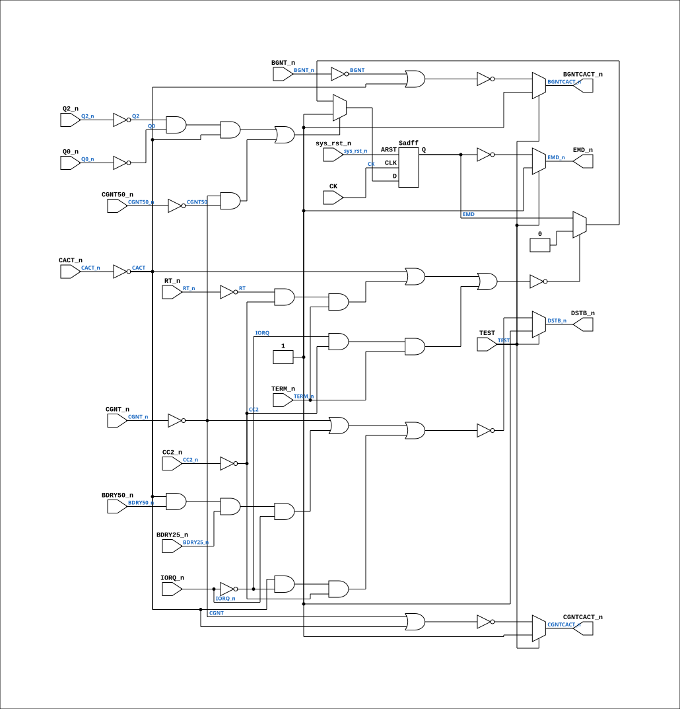

# PAL_44302B

Source: `Verilog/PAL/PAL_44302B.v`

<!-- Generated by Verilog/tests/module_doc.py from the //! comments in the source. Do not edit by hand - edit the RTL comments and regenerate. -->

<!-- HIERARCHY-NAV:BEGIN - written by Verilog/tests/gen_hierarchy.py, do not edit -->

**Where it sits** (Simulation): [ND120_TOP](../../doc/ND120_TOP.md) > [ND120_CORE](../../doc/ND120_CORE.md) > [ND3202D](../../CPU-BOARD-3202/circuit/doc/ND3202D.md) > [BIF_5](../../CPU-BOARD-3202/circuit/doc/BIF_5.md) > [BIF_DPATH_9](../../CPU-BOARD-3202/circuit/doc/BIF_DPATH_9.md) > [BIF_DPATH_LDBCTL_12](../../CPU-BOARD-3202/circuit/doc/BIF_DPATH_LDBCTL_12.md) > **PAL_44302B**
- instance path: `CORE.CPU_BOARD.BIF.DPATH.LDBCTL.PAL_44302_ULBC1`

**Used in:** [BIF_DPATH_LDBCTL_12](../../CPU-BOARD-3202/circuit/doc/BIF_DPATH_LDBCTL_12.md) (all tops)

**Contains:** no other modules.

[Module hierarchy](../../HIERARCHY.md) - [All modules](../../MODULES.md)

<!-- HIERARCHY-NAV:END -->


<!-- SCHEMATIC:BEGIN - written by Verilog/tests/gen_schematics.py, do not edit -->

## Schematic

Drawn from the Verilog: the yosys netlist of the Simulation (Verilator) build, instance `CORE.CPU_BOARD.BIF.DPATH.LDBCTL.PAL_44302_ULBC1`. Sub-modules are boxes (click the picture to open it full size; there every sub-module box links to its page, and every wire shows its Verilog name).

[](PAL_44302B.svg)

<!-- SCHEMATIC:END -->

## Description

ND120 PALASM CODE CONVERTED TO VERILOG
Component PAL 44302B
Last reviewed: 14-DEC-2024
Ronny Hansen

## Ports

| Direction | Width | Name | Description |
|---|---|---|---|
| input | `1` | `CK` | Clock input (added for FPGA synthesis) |
| input | `1` | `sys_rst_n` *(active low)* | System reset (active low, for FPGA synthesis) |
| input | `1` | `Q0_n` *(active low)* | I0 |
| input | `1` | `Q2_n` *(active low)* | I1 |
| input | `1` | `CC2_n` *(active low)* | I2 - Cycle Control bit 2 |
| input | `1` | `BDRY25_n` *(active low)* | I3 - Bus Data Ready (25ns delayed) |
| input | `1` | `BDRY50_n` *(active low)* | I4 - Bus Data Ready (50ns delayed) |
| input | `1` | `CGNT_n` *(active low)* | I5 - CPU Grant |
| input | `1` | `CGNT50_n` *(active low)* | I6 - CPU Grant (50ns delayed) |
| input | `1` | `CACT_n` *(active low)* | I7 - CPU Active |
| input | `1` | `TERM_n` *(active low)* | I8 - Terminate Cycle |
| input | `1` | `BGNT_n` *(active low)* | I9 - Bus Grant |
| output | `1` | `BGNTCACT_n` *(active low)* | Y0_n - Combined BUS Grant/CPU Active signal |
| output | `1` | `CGNTCACT_n` *(active low)* | Y1_n - Combined CPU Grant/Active signal |
| output | `1` | `EMD_n` *(active low)* | B0_n - Enable Data Path between CD and LBD |
| output | `1` | `DSTB_n` *(active low)* | B1_n - Data Strobe |
| input | `1` | `TEST` | B3_n  (PD3) |
| input | `1` | `IORQ_n` *(active low)* | B4_n - IO Request |
| input | `1` | `RT_n` *(active low)* | B5_n - Return |

## Verilog source

[`Verilog/PAL/PAL_44302B.v`](https://github.com/RetroCoreLabs/nd-120/blob/main/Verilog/PAL/PAL_44302B.v) on GitHub.

<details markdown="1">
<summary>Show the Verilog of PAL_44302B (149 lines)</summary>

```verilog
/**********************************************************************************************************
** ND120 PALASM CODE CONVERTED TO VERILOG                                                                **
**                                                                                                       **
** Component PAL 44302B                                                                                  **
**                                                                                                       **
** Last reviewed: 14-DEC-2024                                                                            **
** Ronny Hansen                                                                                          **
***********************************************************************************************************/

// PAL16L8
// JLB/CJTC 14AUG86
// 44302B,11D,LBC1

// NOTE: PAL16L8 is purely combinational in the original hardware.
// Clock input added for FPGA synthesis to eliminate latch inference.

module PAL_44302B (
    input CK,        //! Clock input (added for FPGA synthesis)
    input sys_rst_n, //! System reset (active low, for FPGA synthesis)

    input Q0_n,      //! I0
    input Q2_n,      //! I1
    input CC2_n,     //! I2 - Cycle Control bit 2
    input BDRY25_n,  //! I3 - Bus Data Ready (25ns delayed)
    input BDRY50_n,  //! I4 - Bus Data Ready (50ns delayed)
    input CGNT_n,    //! I5 - CPU Grant
    input CGNT50_n,  //! I6 - CPU Grant (50ns delayed)
    input CACT_n,    //! I7 - CPU Active
    input TERM_n,    //! I8 - Terminate Cycle
    input BGNT_n,    //! I9 - Bus Grant

    output BGNTCACT_n,  //! Y0_n - Combined BUS Grant/CPU Active signal
    output CGNTCACT_n,  //! Y1_n - Combined CPU Grant/Active signal

    output EMD_n,   //! B0_n - Enable Data Path between CD and LBD
    output DSTB_n,  //! B1_n - Data Strobe
    //input B2_n        //! B2_n
    input  TEST,    //! B3_n  (PD3)
    input  IORQ_n,  //! B4_n - IO Request
    input  RT_n     //! B5_n - Return
);


  // Inverted input signals
  wire Q0 = ~Q0_n;
  wire Q2 = ~Q2_n;
  wire CC2 = ~CC2_n;
  wire BDRY25 = ~BDRY25_n;
  wire BDRY50 = ~BDRY50_n;
  wire CGNT = ~CGNT_n;
  wire CGNT50 = ~CGNT50_n;
  wire CACT = ~CACT_n;
  wire TERM = ~TERM_n;
  wire IORQ = ~IORQ_n;
  wire RT = ~RT_n;
  wire BGNT = ~BGNT_n;


  // Output signal logic (self reference)
  reg  EMD;

`ifdef USE_TRANSPARENT_LATCHES
  // Transparent latch (original behavior for simulation)
  /* verilator lint_off LATCH */
  always @(*) begin
    if ((Q2 & Q0 & CACT) |  // CPU CYCLE TO BUS SET
        (CGNT & CGNT50))    // CPU CYCLE TO MEM SET
      EMD = 1'b1;
    else if ((
         (CACT)                  // CPU CYCLE TO BUS HOLD
      | ((RT & CC2 & TERM_n))    // ) HOLD TERMS FOR
      | ((IORQ & CC2 & TERM_n))  // ) CPU READ, FETCH AND MAP CYCLES
        ) == 0)
      EMD = 1'b0;
  end
  /* verilator lint_on LATCH */
`else
  // Edge-triggered flip-flop (FPGA synthesis)
  always @(posedge CK or negedge sys_rst_n) begin
    if (!sys_rst_n) begin
      EMD <= 1'b0;
    end else begin
      if ((Q2 & Q0 & CACT) |  // CPU CYCLE TO BUS SET
          (CGNT & CGNT50))    // CPU CYCLE TO MEM SET
        EMD <= 1'b1;
      else if ((
           (CACT)                  // CPU CYCLE TO BUS HOLD
        | ((RT & CC2 & TERM_n))    // ) HOLD TERMS FOR
        | ((IORQ & CC2 & TERM_n))  // ) CPU READ, FETCH AND MAP CYCLES
          ) == 0)
        EMD <= 1'b0;
    end
  end
`endif

  // Logic for CGNTCACT
  assign CGNTCACT_n = TEST ? 1'b1 : ~(CGNT | CACT); //! CGNTCACT_n - Combined CPU Grant/Active signal

  // Logic for BGNTCACT
  assign BGNTCACT_n = TEST ? 1'b1 : ~(BGNT | CACT); //! BGNTCACT_n - Combined BUS Grant/Active signal 

  // Logic for DSTB
  // PALASM 44302B: DSTB = CGNT + CACT*/BDRY50*/BDRY25*/IORQ + CACT*IORQ*CC2
  // (30-JUL audit: the middle term had BDRY50/BDRY25/IORQ all UN-negated, so
  // the strobe never spanned a non-IOX CPU-from-bus read - the DSTB rise is
  // what samples read data into the CD/LBD 74646s AT BDRY, per the PALASM's
  // own description.)
  assign DSTB_n = TEST ? 1'b1 :
                    ~(
                        (CGNT)                                   |
                        (CACT & BDRY50_n & BDRY25_n & IORQ_n)    |
                        (CACT & IORQ & CC2)                // IOX CYCLE
      );


  assign EMD_n = TEST ? 1'b1 : ~EMD;

endmodule


/*
  DESCRIPTION

; 060387 JLB: EMD WAS HOLDING IN ADDRESS PART OF IOX CYCLES AFTER
; BUFFERED WRITE CYCLES.
; EMD - ENABLE DATA PATH BETWEEN CD AND LBD
; 270387 CJTC: NEW SIGNAL DSTB TO SAMPLE DATA AT LBD/CD BUFFERS ON
; CPU FROM BUS READ, AT BDRY.
; 040487 JLB: DSTB MUST NOT CLOCK DATA BEFORE CACT GOES OFF IN IOXES.
;  (NEGATIVE SETUP OF DATA IN BUS SPECS.)
;
; 180587 CJTC: 3202B
; 070887 JLB: 3202C ONLY! (TEST MODE).

*/

/* IMPLEMENTATION NOTES


Recursive Definitions Caution: The recursive definitions for EMD need careful handling
 to ensure they align with the design requirements and behave correctly in hardware.

Testing and Verification: Extensive testing with appropriate testbenches is crucial to validate the module's behavior under all conditions, 
including different states of the TEST signal.

*/
```

</details>
