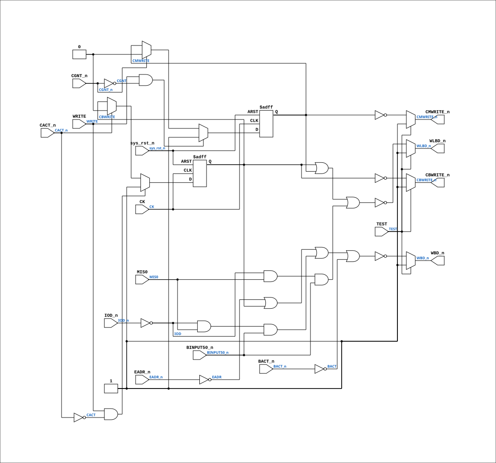

# PAL_44303B

Source: `Verilog/PAL/PAL_44303B.v`

<!-- Generated by Verilog/tests/module_doc.py from the //! comments in the source. Do not edit by hand - edit the RTL comments and regenerate. -->

<!-- HIERARCHY-NAV:BEGIN - written by Verilog/tests/gen_hierarchy.py, do not edit -->

**Where it sits** (Simulation): [ND120_TOP](../../doc/ND120_TOP.md) > [ND120_CORE](../../doc/ND120_CORE.md) > [ND3202D](../../CPU-BOARD-3202/circuit/doc/ND3202D.md) > [BIF_5](../../CPU-BOARD-3202/circuit/doc/BIF_5.md) > [BIF_DPATH_9](../../CPU-BOARD-3202/circuit/doc/BIF_DPATH_9.md) > [BIF_DPATH_LDBCTL_12](../../CPU-BOARD-3202/circuit/doc/BIF_DPATH_LDBCTL_12.md) > **PAL_44303B**
- instance path: `CORE.CPU_BOARD.BIF.DPATH.LDBCTL.PAL_44303_ULBC2`

**Used in:** [BIF_DPATH_LDBCTL_12](../../CPU-BOARD-3202/circuit/doc/BIF_DPATH_LDBCTL_12.md) (all tops)

**Contains:** no other modules.

[Module hierarchy](../../HIERARCHY.md) - [All modules](../../MODULES.md)

<!-- HIERARCHY-NAV:END -->


<!-- SCHEMATIC:BEGIN - written by Verilog/tests/gen_schematics.py, do not edit -->

## Schematic

Drawn from the Verilog: the yosys netlist of the Simulation (Verilator) build, instance `CORE.CPU_BOARD.BIF.DPATH.LDBCTL.PAL_44303_ULBC2`. Sub-modules are boxes (click the picture to open it full size; there every sub-module box links to its page, and every wire shows its Verilog name).

[](PAL_44303B.svg)

<!-- SCHEMATIC:END -->

## Description

ND120 PALASM CODE CONVERTED TO VERILOG
Component PAL 44303B
Last reviewed: 2-FEB-2025
Ronny Hansen

## Ports

| Direction | Width | Name | Description |
|---|---|---|---|
| input | `1` | `CK` | Clock input (added for FPGA synthesis) |
| input | `1` | `sys_rst_n` *(active low)* | System reset (active low, for FPGA synthesis) |
| input | `1` | `CACT_n` *(active low)* | I0 |
| input | `1` | `CGNT_n` *(active low)* | I1 |
| input | `1` | `EADR_n` *(active low)* | I2 - Address from CPU to Bus |
| input | `1` | `BINPUT50_n` *(active low)* | I3 |
| input | `1` | `MIS0` | I4 |
| input | `1` | `IOD_n` *(active low)* | I5 |
| input | `1` | `WRITE` | I6 |
| input | `1` | `TEST` | I7 - PD1 |
| input | `1` | `BACT_n` *(active low)* | I9 |
| output | `1` | `WBD_n` *(active low)* | Y0_n - Write Bus Direction |
| output | `1` | `CBWRITE_n` *(active low)* | Y1_n - CPU Write cycle to Bus |
| output | `1` | `WLBD_n` *(active low)* | B0_n - Write Local Bus Direction |
| output | `1` | `CMWRITE_n` *(active low)* | B1_n - CPU Write to Local Memory |

## Verilog source

[`Verilog/PAL/PAL_44303B.v`](https://github.com/RetroCoreLabs/nd-120/blob/main/Verilog/PAL/PAL_44303B.v) on GitHub.

<details markdown="1">
<summary>Show the Verilog of PAL_44303B (125 lines)</summary>

```verilog
/**********************************************************************************************************
** ND120 PALASM CODE CONVERTED TO VERILOG                                                                **
**                                                                                                       **
** Component PAL 44303B                                                                                  **
**                                                                                                       **
** Last reviewed: 2-FEB-2025                                                                             **
** Ronny Hansen                                                                                          **
***********************************************************************************************************/


// PAL16L8_12
// JLB/CITC 15AUG86
// 44303B,2C,LBC2 - LOCAL DATA BUS CONTROL PAL

// NOTE: PAL16L8 is purely combinational in the original hardware.
// Clock input added for FPGA synthesis to eliminate latch inference.

module PAL_44303B (
    input CK,          //! Clock input (added for FPGA synthesis)
    input sys_rst_n,   //! System reset (active low, for FPGA synthesis)

    input CACT_n,      //! I0
    input CGNT_n,      //! I1
    input EADR_n,      //! I2 - Address from CPU to Bus
    input BINPUT50_n,  //! I3
    input MIS0,        //! I4
    input IOD_n,       //! I5
    input WRITE,       //! I6
    input TEST,        //! I7 - PD1
    //input I8           //! I8
    input BACT_n,      //! I9

    output WBD_n,     //! Y0_n - Write Bus Direction
    output CBWRITE_n, //! Y1_n - CPU Write cycle to Bus

    output WLBD_n,    //! B0_n - Write Local Bus Direction
    output CMWRITE_n  //! B1_n - CPU Write to Local Memory

    /* Not connected
    output    // B2_n
    output    // B3_n
    output    // B4_n
    output    // B5_n
    */
);


  // Inverted input signals
  wire CACT = ~CACT_n;
  wire CGNT = ~CGNT_n;
  wire EADR = ~EADR_n;
  wire IOD = ~IOD_n;
  wire BACT = ~BACT_n;

  reg  CBWRITE;
  reg  CMWRITE;

`ifdef USE_TRANSPARENT_LATCHES
  // Transparent latch (original behavior for simulation)
  /* verilator lint_off LATCH */
  always @(*) begin
    if (WRITE & CACT) CBWRITE = 1'b1;
    else if (CACT == 0) CBWRITE = 1'b0;

    if (WRITE & CGNT) CMWRITE = 1'b1;
    else if (CGNT == 0) CMWRITE = 1'b0;
  end
  /* verilator lint_on LATCH */
`else
  // Edge-triggered flip-flop (FPGA synthesis)
  always @(posedge CK or negedge sys_rst_n) begin
    if (!sys_rst_n) begin
      CBWRITE <= 1'b0;
      CMWRITE <= 1'b0;
    end else begin
      if (WRITE & CACT) CBWRITE <= 1'b1;
      else if (CACT == 0) CBWRITE <= 1'b0;

      if (WRITE & CGNT) CMWRITE <= 1'b1;
      else if (CGNT == 0) CMWRITE <= 1'b0;
    end
  end
`endif


  // LBD TO BD TRANCEIVER
  // --------------------

  // WBD - DIRECTION FROM LBD TO BD
  assign WBD_n = TEST ? 1'b1 : ~((EADR) |  // Address from CPU to Bus
      (CBWRITE) |  // CPU Write cycle to Bus
      (IOD & MIS0 & BINPUT50_n) |  // Output part of IOX
      (BACT)  // DMA Output cycle
      );

  // CBWRITE - CPU TO BUS WRITE.
  assign CBWRITE_n = TEST ? 1'b1 : ~CBWRITE;


  // CD TO LBD TRANCEIVER
  // --------------------

  // WLBD - DIRECTION FROM CD TO LBD
  assign WLBD_n = TEST ? 1'b1 : ~((CBWRITE) |  // CPU Write cycle to Bus
      (CMWRITE) |  // CPU Write cycle to Local Memory
      (IOD & MIS0 & BINPUT50_n)  // Output part of IOX
      );

  // CMWRITE - CPU WRITE TO LOCAL MEMORY.
  assign CMWRITE_n = TEST ? 1'b1 : ~CMWRITE;


endmodule


/*
DESCRIPTION

; 180587 - 3202B
; 070887 JLB: 3202C ONLY ! (TEST MODE).

*/
```

</details>
