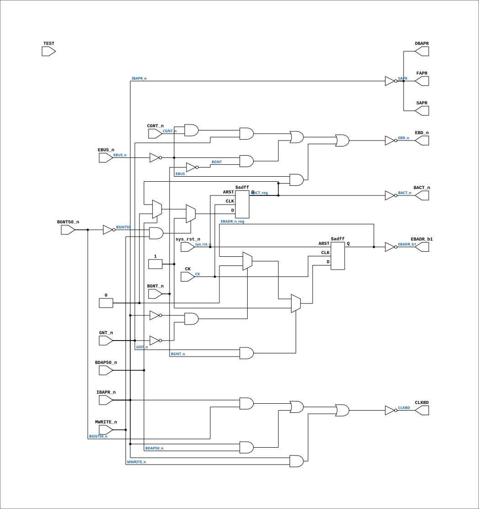

# PAL_44304E

Source: `Verilog/PAL/PAL_44304E.v`

<!-- Generated by Verilog/tests/module_doc.py from the //! comments in the source. Do not edit by hand - edit the RTL comments and regenerate. -->

<!-- HIERARCHY-NAV:BEGIN - written by Verilog/tests/gen_hierarchy.py, do not edit -->

**Where it sits** (Simulation): [ND120_TOP](../../doc/ND120_TOP.md) > [ND120_CORE](../../doc/ND120_CORE.md) > [ND3202D](../../CPU-BOARD-3202/circuit/doc/ND3202D.md) > [BIF_5](../../CPU-BOARD-3202/circuit/doc/BIF_5.md) > [BIF_DPATH_9](../../CPU-BOARD-3202/circuit/doc/BIF_DPATH_9.md) > [BIF_DPATH_LDBCTL_12](../../CPU-BOARD-3202/circuit/doc/BIF_DPATH_LDBCTL_12.md) > **PAL_44304E**
- instance path: `CORE.CPU_BOARD.BIF.DPATH.LDBCTL.PAL_44304_ULBC3`

**Used in:** [BIF_DPATH_LDBCTL_12](../../CPU-BOARD-3202/circuit/doc/BIF_DPATH_LDBCTL_12.md) (all tops)

**Contains:** no other modules.

[Module hierarchy](../../HIERARCHY.md) - [All modules](../../MODULES.md)

<!-- HIERARCHY-NAV:END -->


<!-- SCHEMATIC:BEGIN - written by Verilog/tests/gen_schematics.py, do not edit -->

## Schematic

Drawn from the Verilog: the yosys netlist of the Simulation (Verilator) build, instance `CORE.CPU_BOARD.BIF.DPATH.LDBCTL.PAL_44304_ULBC3`. Sub-modules are boxes (click the picture to open it full size; there every sub-module box links to its page, and every wire shows its Verilog name).

[](PAL_44304E.svg)

<!-- SCHEMATIC:END -->

## Description

ND120 PALASM CODE CONVERTED TO VERILOG
Component PAL 44304E
Last reviewed: 22-MAR-2025
Ronny Hansen

## Ports

| Direction | Width | Name | Description |
|---|---|---|---|
| input | `1` | `CK` | Clock input (added for FPGA synthesis) |
| input | `1` | `sys_rst_n` *(active low)* | System reset (active low, for FPGA synthesis) |
| input | `1` | `CGNT_n` *(active low)* | I0 |
| input | `1` | `BGNT_n` *(active low)* | I1 |
| input | `1` | `BGNT50_n` *(active low)* | I2 |
| input | `1` | `MWRITE_n` *(active low)* | I3 |
| input | `1` | `BDAP50_n` *(active low)* | I4 |
| input | `1` | `EBUS_n` *(active low)* | I5 |
| input | `1` | `IBAPR_n` *(active low)* | I6 (Input Data Bus Address Present) |
| input | `1` | `GNT_n` *(active low)* | I7 |
| input | `1` | `TEST` | I8 - PD3 |
| output | `1` | `DBAPR` | Y0_n (Delayed Data Bus Address Present) |
| output | `1` | `BACT_n` *(active low)* | B0_n BUS Activity |
| output | `1` | `EBADR_b1` | B1_n Enable Address from BUS to Local Memory |
| output | `1` | `FAPR` | B2_n |
| output | `1` | `SAPR` | B3_n |
| output | `1` | `CLKBD` | B4_n Clock BD |
| output | `1` | `EBD_n` *(active low)* | B5_n Enable Bus Data (Enable LBD to BD transceiver) |

## Verilog source

[`Verilog/PAL/PAL_44304E.v`](https://github.com/RetroCoreLabs/nd-120/blob/main/Verilog/PAL/PAL_44304E.v) on GitHub.

<details markdown="1">
<summary>Show the Verilog of PAL_44304E (150 lines)</summary>

```verilog
/**********************************************************************************************************
** ND120 PALASM CODE CONVERTED TO VERILOG                                                                **
**                                                                                                       **
** Component PAL 44304E                                                                                  **
**                                                                                                       **
** Last reviewed: 22-MAR-2025                                                                            **
** Ronny Hansen                                                                                          **
***********************************************************************************************************/


// PAL16L8
// CJTC 02SEP86
// 44304E,1C,LBC3 - LOCAL DATA BUS CONTROL PAL

// NOTE: PAL16L8 is purely combinational in the original hardware.
// Clock input added for FPGA synthesis to eliminate combinatorial loops.

// Note: Verilator doesnt like signal name "EBADR" therefore its named "EBADR_b1". I dont know why.

// Note2: TEST is connectecd to signal PD3 that is always 0 on the PCB 3202D.
// Note3: Code for TEST removed for clarity as its NEVER used

module PAL_44304E (
    input CK,        //! Clock input (added for FPGA synthesis)
    input sys_rst_n, //! System reset (active low, for FPGA synthesis)

    input CGNT_n,    //! I0
    input BGNT_n,    //! I1
    input BGNT50_n,  //! I2
    input MWRITE_n,  //! I3
    input BDAP50_n,  //! I4
    input EBUS_n,    //! I5
    input IBAPR_n,   //! I6 (Input Data Bus Address Present)
    input GNT_n,     //! I7
    input TEST,      //! I8 - PD3
    //input I9       //! I9

    output DBAPR,     //! Y0_n (Delayed Data Bus Address Present)
    //output Y1_n,    //! Y1_n

    output BACT_n,    //! B0_n BUS Activity
    output EBADR_b1,  //! B1_n Enable Address from BUS to Local Memory
    output FAPR,      //! B2_n
    output SAPR,      //! B3_n
    output CLKBD,     //! B4_n Clock BD
    output EBD_n      //! B5_n Enable Bus Data (Enable LBD to BD transceiver)
);


  // Inverted input signals
  wire BGNT = ~BGNT_n;
  wire BGNT50 = ~BGNT50_n;
  wire BDAP50 = ~BDAP50_n;
  wire EBUS = ~EBUS_n;
  wire SAPR_n = ~SAPR;

  // Output signal logic (self reference)

  reg  BACT_reg;
  reg  EBADR_n_reg;

`ifdef USE_TRANSPARENT_LATCHES
  // Transparent latch (original behavior for simulation)
  /* verilator lint_off LATCH */
  always @(*) begin
    BACT_reg = (BGNT50 & MWRITE_n)
           |   (BACT_reg & BDAP50);

    EBADR_n_reg = (GNT_n & BGNT_n)
             | (IBAPR_n & EBADR_n_reg)
             | (GNT_n & EBADR_n_reg);
  end
  /* verilator lint_on LATCH */
`else
  // Edge-triggered flip-flop (FPGA synthesis)
  always @(posedge CK or negedge sys_rst_n) begin
    if (!sys_rst_n) begin
      BACT_reg <= 1'b0;
      EBADR_n_reg <= 1'b1;  // EBADR_b1 = ~EBADR_n_reg, inactive at reset
    end else begin
      if (BGNT50 & MWRITE_n)
        BACT_reg <= 1'b1;
      else if (!BDAP50)
        BACT_reg <= 1'b0;

      if (GNT_n & BGNT_n)
        EBADR_n_reg <= 1'b1;
      else if (!IBAPR_n & !GNT_n)
        EBADR_n_reg <= 1'b0;
    end
  end
`endif


  assign EBADR_b1 = ~EBADR_n_reg;

  assign BACT_n = ~BACT_reg;  // Output pin Y1_n (BACT_n) is not connected to anything. Sheet 12.


  // EBD - ENABLE BUS DATA. ENABLE LBD TO BD TRANSCEIVER
  // SHOULD BE DISABLED DURING CGNT * /BACT, IE DISABLE WHEN CPU
  // IS ACCESSING LOCAL MEMORY, EXCEPT WHEN TRANSCEIVER IS BEING USED
  // AS A REGISTER TO HOLD DATA FROM A PREVIOUS DMA MEMORY READ.

  assign EBD_n = ~(
      (EBUS & CGNT_n & GNT_n) |
      (EBUS & BGNT) |
      (EBUS & BACT_reg)
      );


  // SLOW INVERSION
  // TODO: Introduce a few nanoseconds delay - IBAPR -- SAPR => DBAPR (??)
  assign FAPR = ~(IBAPR_n);
  assign SAPR = FAPR;
  assign DBAPR = SAPR;


  // CLKBD - CLOCK PULSE TO 648's
  assign CLKBD = ~(
      (SAPR_n & BGNT50_n) |  // Clock addresses on delayed BAPR
      (SAPR_n & BDAP50_n) |  // Clock data 50ns after start of
      (SAPR_n & MWRITE_n)  // BGNT * BDAP on memory writes from DMA
      );


endmodule

/*

DESCRIPTION

; 200387 CJTC:      NEED TO SLOW DOWN APR TO AS648 BUS TCVRS. PUT IT
;                   THROUGH THIS PAL INSTEAD OF F04
; 200387 JLB:       EBADR COMES ON AT BAPR TO AVOID SPIKE ON LBD.
; NEW INPUT CGNT
; 230387 JLB:       APR DELAYED 3XPAL DELAY
; 240387 JLB:       EBD MUST NOT CHANGE WHEN DATA IS CLOCKED IN.
;
; 180587 - 3202B
; 310787 JLB:       BUFFERED DMA WRITE: CLOCK DATA IN 648'S ALSO.

; 040887 JLB:       BUFFERED DMA WRITE: NEED TO ENABLE THE REGISTER IN THE
;                   648'S FOR THE PERIOD OF BGNT.
; 060887 D JLB:     EBADR CHANGED TO MAKE BUFFERED DMA WRITE WORK.
; 090887 E JLB:     TEST MODE FOR C-PRINT.
*/
```

</details>
